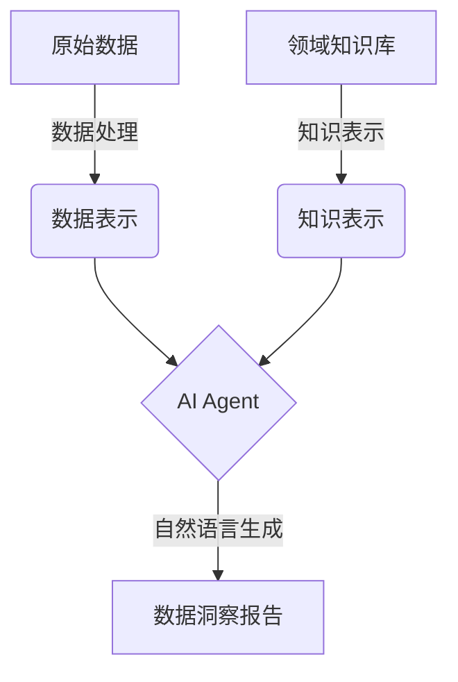

以下是技术博客文章的正文内容：

# 【大模型应用开发 动手做AI Agent】自主创建数据洞察

## 1. 背景介绍

### 1.1 问题的由来

在当今时代,数据已经成为推动企业发展和创新的核心动力。随着数据量的快速增长,企业面临着如何高效利用这些海量数据,从中发现隐藏的价值和见解的挑战。传统的数据分析方法已经无法满足现代企业的需求,因此亟需一种新的解决方案来应对这一挑战。

### 1.2 研究现状 

近年来,人工智能(AI)技术的飞速发展为解决这一问题提供了新的思路。大型语言模型(Large Language Models, LLMs)作为AI技术的一个重要分支,已经展现出了强大的自然语言处理能力。通过训练海量的文本数据,LLMs可以学习到丰富的语义和上下文知识,从而能够理解和生成高质量的自然语言内容。

然而,LLMs在数据分析领域的应用还存在一些局限性。大多数LLMs是通过监督学习训练而来,缺乏对特定领域知识的理解,难以生成高质量的数据洞察和分析报告。此外,LLMs通常只能处理结构化的文本数据,对于表格、图像等非结构化数据的处理能力有限。

### 1.3 研究意义

为了解决上述问题,本文提出了一种基于LLMs的自主创建数据洞察的新方法。通过结合领域知识、数据处理技术和LLMs的自然语言生成能力,我们可以构建一个智能化的AI Agent,能够自主地从原始数据中提取见解,并生成高质量的数据分析报告。这种方法不仅可以提高数据分析的效率和质量,还能够减轻人工分析的工作负担,为企业带来巨大的价值。

### 1.4 本文结构

本文将首先介绍自主创建数据洞察的核心概念和关键技术,包括LLMs、领域知识表示、数据处理等。接下来,我们将详细阐述核心算法的原理和具体实现步骤,并通过数学模型和公式进行理论支撑。然后,我们将展示一个实际项目案例,包括代码实现、运行结果等。最后,我们将探讨该方法在不同领域的应用场景,分享相关的学习资源和工具,并对未来的发展趋势和挑战进行展望。

## 2. 核心概念与联系

自主创建数据洞察的核心思想是将大型语言模型(LLMs)、领域知识表示和数据处理技术有机结合,构建一个智能化的AI Agent。这个AI Agent可以自主地从原始数据中提取见解,并生成高质量的数据分析报告。

上图展示了自主创建数据洞察的整体流程。首先,原始数据经过数据处理模块转换为适合LLMs处理的数据表示形式,如表格、文本等。同时,领域知识库中的知识也被转换为LLMs可以理解的知识表示形式。然后,AI Agent将数据表示和知识表示作为输入,利用LLMs的自然语言生成能力,输出高质量的数据洞察报告。

在这个过程中,数据处理技术、知识表示方法和LLMs的自然语言生成能力是三个关键组成部分,它们相互协作,共同实现了自主创建数据洞察的目标。

## 3. 核心算法原理 & 具体操作步骤

### 3.1 算法原理概述

自主创建数据洞察的核心算法基于一种新型的生成式人工智能架构,该架构将LLMs、领域知识和数据处理技术有机结合。算法的核心思想是通过迭代的方式,不断优化LLMs生成的数据洞察报告,直到达到预期的质量要求。

算法的工作流程如下:

1. 数据预处理: 将原始数据转换为LLMs可以理解的数据表示形式。
2. 知识融合: 将领域知识库中的知识转换为LLMs可以理解的知识表示形式,并与数据表示相结合。
3. 初始报告生成: 利用LLMs的自然语言生成能力,基于数据表示和知识表示生成初始的数据洞察报告。
4. 报告评估: 使用预定义的评估指标(如准确性、相关性、可读性等)对生成的报告进行评估。
5. 反馈机制: 根据评估结果,对LLMs进行反馈和调整,以优化后续的报告生成过程。
6. 迭代优化: 重复步骤3-5,直到生成的报告达到预期的质量要求。

该算法的核心优势在于它可以充分利用LLMs的自然语言生成能力,同时通过融合领域知识和数据处理技术,提高生成报告的质量和准确性。此外,算法中的反馈机制可以不断优化LLMs的生成过程,从而持续提高报告的质量。

### 3.2 算法步骤详解

1. **数据预处理**

   数据预处理是算法的第一步,它将原始数据转换为LLMs可以理解的数据表示形式。常见的数据表示形式包括:

   - 表格数据: 将表格数据转换为文本形式,例如使用Markdown或CSV格式。
   - 图像数据: 将图像数据转换为文本描述,例如使用图像描述生成模型。
   - 文本数据: 对文本数据进行清洗和标准化处理,例如去除停用词、词干提取等。

   数据预处理的目标是将原始数据转换为一种统一的文本表示形式,以便后续的LLMs处理。

2. **知识融合**

   知识融合是将领域知识库中的知识转换为LLMs可以理解的知识表示形式,并与数据表示相结合。常见的知识表示方法包括:

   - 知识图谱: 将领域知识表示为一个知识图谱,其中节点表示实体,边表示实体之间的关系。
   - 本体论: 使用本体论来形式化表示领域概念、属性和关系。
   - 规则库: 将领域知识表示为一系列规则,例如IF-THEN规则或者SPARQL查询。

   知识融合的目标是将领域知识与数据表示相结合,为LLMs提供必要的背景知识,从而提高生成报告的质量和准确性。

3. **初始报告生成**

   利用LLMs的自然语言生成能力,基于数据表示和知识表示生成初始的数据洞察报告。常见的LLMs包括GPT-3、BERT、T5等。

   在生成报告的过程中,LLMs需要综合考虑数据表示和知识表示,并根据特定的任务要求(如报告类型、重点关注领域等)生成相应的自然语言内容。

4. **报告评估**

   使用预定义的评估指标对生成的报告进行评估,常见的评估指标包括:

   - 准确性: 报告中的数据和事实是否准确无误。
   - 相关性: 报告的内容是否与原始数据和任务要求相关。
   - 可读性: 报告的语言是否流畅、易于理解。
   - 洞见深度: 报告是否提供了深入的数据分析和见解。

   评估过程可以采用自动评估或人工评估的方式,也可以结合两种方式。

5. **反馈机制**

   根据评估结果,对LLMs进行反馈和调整,以优化后续的报告生成过程。常见的反馈机制包括:

   - 强化学习: 将评估结果作为奖励信号,通过强化学习算法调整LLMs的参数。
   - 监督微调: 基于评估结果构建训练数据集,对LLMs进行监督微调。
   - 人工反馈: 由人工专家提供反馈和指导,调整LLMs的生成策略。

   反馈机制的目标是不断优化LLMs的生成能力,使其能够生成更高质量的数据洞察报告。

6. **迭代优化**

   重复步骤3-5,直到生成的报告达到预期的质量要求。在每一次迭代中,LLMs会根据反馈机制进行调整,从而不断提高报告的质量。

   迭代优化过程可以设置一个终止条件,例如达到预定的评估分数阈值、迭代次数上限等。当终止条件满足时,算法输出最终的数据洞察报告。

### 3.3 算法优缺点

**优点:**

1. **高质量报告生成**: 通过融合领域知识和数据处理技术,算法可以生成高质量的数据洞察报告,提供深入的分析和见解。

2. **自动化程度高**: 算法可以自主地从原始数据中提取见解,减轻人工分析的工作负担,提高数据分析的效率。

3. **可扩展性强**: 算法可以轻松地扩展到不同的领域和数据类型,只需要更新相应的知识库和数据处理模块。

4. **持续优化**: 算法中的反馈机制可以不断优化LLMs的生成能力,确保报告质量持续提高。

**缺点:**

1. **计算资源需求高**: 训练和运行LLMs需要大量的计算资源,对硬件配置有较高的要求。

2. **知识库构建成本高**: 构建高质量的领域知识库需要大量的人力和时间投入,成本较高。

3. **评估指标选择困难**: 选择合适的评估指标并非一件容易的事情,需要充分考虑报告的多个维度。

4. **数据隐私和安全风险**: 算法需要访问大量的数据和知识库,存在一定的数据隐私和安全风险。

### 3.4 算法应用领域

自主创建数据洞察的算法可以应用于多个领域,包括但不限于:

1. **商业智能(BI)**: 生成基于数据的商业洞察报告,支持企业决策。

2. **金融分析**: 分析金融数据,生成投资报告和风险评估报告。

3. **医疗健康**: 分析患者数据,生成个性化的诊断和治疗建议。

4. **科学研究**: 分析实验数据,生成研究报告和论文草稿。

5. **新闻媒体**: 生成基于数据的新闻报道和分析文章。

6. **教育领域**: 生成个性化的学习报告和课程建议。

7. **政府管理**: 分析政府数据,生成政策分析报告和决策支持。

总的来说,任何需要从数据中提取见解和生成报告的领域,都可以应用自主创建数据洞察的算法。

## 4. 数学模型和公式 & 详细讲解 & 举例说明

### 4.1 数学模型构建

在自主创建数据洞察的算法中,我们需要构建数学模型来量化评估报告的质量,并将其作为反馈机制的依据。常见的评估指标包括准确性、相关性、可读性和洞见深度等。

我们可以将这些指标建模为一个加权求和的形式:

$$
Q = \sum_{i=1}^{n} w_i \cdot q_i
$$

其中:

- $Q$ 表示报告的总体质量评分
- $n$ 表示评估指标的数量
- $w_i$ 表示第 $i$ 个评估指标的权重,满足 $\sum_{i=1}^{n} w_i = 1$
- $q_i$ 表示第 $i$ 个评估指标的分数,通常在 $[0, 1]$ 范围内

不同的评估指标可以采用不同的计算方法,例如:

- **准确性**:  可以通过与人工标注的"金标准"数据进行比对来计算,使用 F1 分数或准确率等指标。
- **相关性**: 可以基于主题模型或语义相似度来衡量报告内容与原始数据的相关程度。
- **可读性**: 可以使用经典的可读性评分公式,如 Flesch Reading Ease 或 Flesch-Kincaid Grade Level。
- **洞见深度**: 可以通过计算报告中提及的见解数量、见解新颖性等来评估。

在实