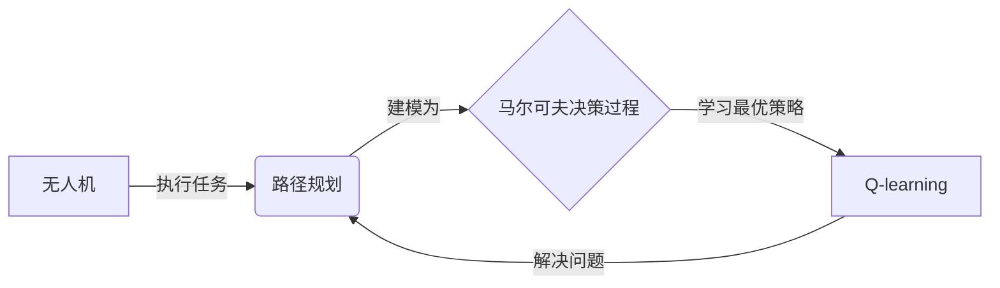
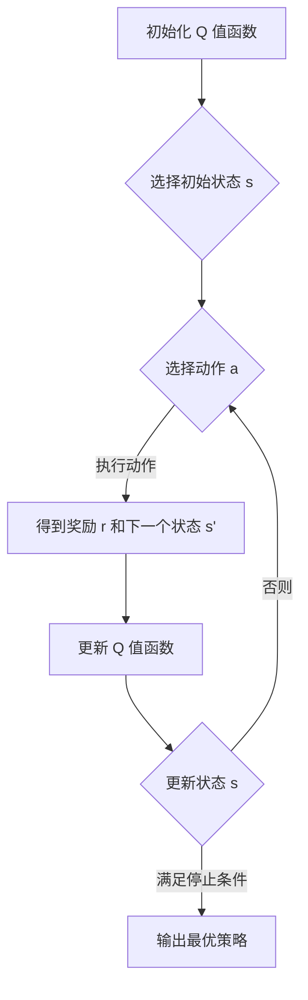

# 一切皆是映射：AI Q-learning在无人机路径规划的应用

关键词：无人机、路径规划、强化学习、Q-learning、Markov决策过程

## 1. 背景介绍
### 1.1  问题的由来
随着无人机技术的快速发展,无人机在军事、民用、科研等领域得到了广泛应用。无人机能够在复杂环境下执行各种任务,如空中侦察、物资运输、灾害救援等。然而,无人机在执行任务的过程中,需要在复杂多变的环境中进行智能的路径规划,以避开障碍物、节省能源、提高效率。传统的路径规划算法,如 A*、Dijkstra 等,虽然能够找到最优路径,但是难以适应动态变化的环境。因此,如何利用人工智能技术,特别是强化学习方法,来解决无人机路径规划问题,成为了一个热点研究方向。

### 1.2  研究现状
目前,国内外学者已经开展了大量关于无人机路径规划的研究。传统的路径规划算法,如 A*、Dijkstra、RRT 等,主要基于图搜索和采样的方法,能够在静态环境下找到最优路径。但是,这些算法难以适应动态变化的环境,且计算复杂度较高。近年来,随着人工智能技术的发展,特别是强化学习方法的兴起,越来越多的学者开始将强化学习应用于无人机路径规划。强化学习通过智能体与环境的交互,不断学习和优化策略,能够在动态环境下找到最优路径。其中,Q-learning 作为一种经典的强化学习算法,以其简单高效的特点受到了广泛关注。

### 1.3  研究意义
将 Q-learning 算法应用于无人机路径规划,具有重要的理论意义和实际应用价值。首先,Q-learning 能够在动态变化的环境中不断学习和优化策略,克服了传统路径规划算法的局限性。其次,Q-learning 具有较高的学习效率和泛化能力,能够快速适应不同的环境和任务需求。再次,将 Q-learning 与无人机技术相结合,能够极大地提高无人机的自主性和智能性,拓展无人机的应用场景。最后,本研究可以为无人机路径规划提供新的思路和方法,推动无人机技术的发展。

### 1.4  本文结构
本文主要研究如何将 Q-learning 算法应用于无人机路径规划问题。第2部分介绍了研究中涉及的核心概念及其联系。第3部分详细阐述了 Q-learning 算法的原理和操作步骤。第4部分建立了无人机路径规划问题的数学模型,并给出了相应的公式推导和案例分析。第5部分通过具体的代码实例,演示了如何用 Python 实现 Q-learning 算法,并进行了详细的代码解读。第6部分讨论了 Q-learning 在无人机路径规划中的实际应用场景和未来展望。第7部分推荐了相关的学习资源、开发工具和文献资料。第8部分对全文进行了总结,并指出了未来的研究方向和挑战。第9部分列出了一些常见问题及其解答。

## 2. 核心概念与联系
在将 Q-learning 应用于无人机路径规划之前,我们需要了解一些核心概念及其联系,主要包括:

- 无人机:是一种无人驾驶飞行器,可以自主执行各种任务。
- 路径规划:是指在给定起点和终点的情况下,寻找一条最优路径的过程。
- 强化学习:是一种通过智能体与环境交互,不断学习和优化策略的机器学习方法。 
- Q-learning:是一种经典的强化学习算法,通过学习 Q 值函数来选择最优动作。
- 马尔可夫决策过程(MDP):是一种用于建模决策问题的数学框架,包括状态、动作、转移概率和奖励函数。

这些概念之间存在着紧密的联系。无人机路径规划问题可以建模为一个马尔可夫决策过程,其中无人机的位置和速度构成了状态,无人机的加速度构成了动作,状态转移概率取决于无人机的动力学模型,奖励函数根据无人机的目标和约束来设计。Q-learning 算法可以通过不断与环境交互,学习最优的决策策略,从而解决无人机路径规划问题。下图展示了这些概念之间的关系:

## 3. 核心算法原理 & 具体操作步骤
### 3.1  算法原理概述
Q-learning 是一种基于值函数的强化学习算法,其核心思想是学习一个 Q 值函数 $Q(s,a)$,表示在状态 $s$ 下采取动作 $a$ 的长期期望回报。Q 值函数可以通过贝尔曼方程来递归定义:

$$Q(s,a) = R(s,a) + \gamma \max_{a'} Q(s',a')$$

其中,$R(s,a)$ 表示在状态 $s$ 下采取动作 $a$ 得到的即时奖励,$\gamma$ 是折扣因子,$s'$ 是采取动作 $a$ 后转移到的下一个状态。

Q-learning 的目标是学习一个最优的 Q 值函数 $Q^*(s,a)$,使得在每个状态下选择 Q 值最大的动作,就能获得最大的长期期望回报。Q-learning 通过不断与环境交互,利用 TD 误差来更新 Q 值函数:

$$Q(s,a) \leftarrow Q(s,a) + \alpha [R(s,a) + \gamma \max_{a'} Q(s',a') - Q(s,a)]$$

其中,$\alpha$ 是学习率。通过不断迭代更新,Q 值函数最终会收敛到最优值 $Q^*(s,a)$。

### 3.2  算法步骤详解
Q-learning 算法的具体步骤如下:

1. 初始化 Q 值函数 $Q(s,a)$,可以随机初始化或者初始化为0。
2. 选择一个初始状态 $s$。
3. 根据 $\epsilon-greedy$ 策略选择一个动作 $a$,即以 $\epsilon$ 的概率随机选择动作,以 $1-\epsilon$ 的概率选择 Q 值最大的动作。
4. 执行动作 $a$,得到即时奖励 $r$ 和下一个状态 $s'$。
5. 根据贝尔曼方程更新 Q 值函数:
$$Q(s,a) \leftarrow Q(s,a) + \alpha [r + \gamma \max_{a'} Q(s',a') - Q(s,a)]$$
6. 将当前状态 $s$ 更新为 $s'$。
7. 重复步骤3-6,直到达到终止状态或者满足一定的停止条件。

下图展示了 Q-learning 算法的流程:

### 3.3  算法优缺点
Q-learning 算法具有以下优点:
- 简单高效,易于实现。
- 能够在未知环境中学习最优策略,不需要预先知道环境模型。
- 具有较强的适应性和泛化能力,能够处理连续状态和动作空间。

但是,Q-learning 算法也存在一些缺点:
- 容易陷入局部最优,需要合理设置探索策略。
- 对于高维状态空间,Q 表的存储开销较大。
- 收敛速度较慢,需要大量的训练数据和迭代次数。

### 3.4  算法应用领域
Q-learning 算法在许多领域得到了成功应用,例如:
- 机器人控制:如自主导航、抓取、组装等。
- 游戏智能体:如 Atari 游戏、围棋等。
- 推荐系统:如电影推荐、广告投放等。
- 自然语言处理:如对话系统、问答系统等。
- 无人驾驶:如自动驾驶、智能交通等。

## 4. 数学模型和公式 & 详细讲解 & 举例说明
### 4.1  数学模型构建
我们可以将无人机路径规划问题建模为一个马尔可夫决策过程(MDP),其中:
- 状态 $s$:无人机的位置坐标 $(x,y,z)$ 和速度 $(v_x,v_y,v_z)$。
- 动作 $a$:无人机的加速度 $(a_x,a_y,a_z)$,满足动力学约束。
- 转移概率 $P(s'|s,a)$:根据无人机的动力学模型确定,如:
$$\begin{aligned}
x' &= x + v_x \Delta t + \frac{1}{2} a_x \Delta t^2 \\
y' &= y + v_y \Delta t + \frac{1}{2} a_y \Delta t^2 \\
z' &= z + v_z \Delta t + \frac{1}{2} a_z \Delta t^2 \\
v_x' &= v_x + a_x \Delta t \\
v_y' &= v_y + a_y \Delta t \\  
v_z' &= v_z + a_z \Delta t
\end{aligned}$$
- 奖励函数 $R(s,a)$:根据无人机的目标和约束设计,如:
$$R(s,a) = \begin{cases}
1, & \text{到达目标点} \\
-1, & \text{碰撞障碍物} \\  
-0.1, & \text{偏离航线} \\
0, & \text{其他情况}
\end{cases}$$

### 4.2  公式推导过程
根据 Q-learning 算法的原理,我们需要学习一个 Q 值函数 $Q(s,a)$,表示在状态 $s$ 下采取动作 $a$ 的长期期望回报。Q 值函数可以通过贝尔曼方程来递归定义:

$$Q(s,a) = R(s,a) + \gamma \sum_{s'} P(s'|s,a) \max_{a'} Q(s',a')$$

其中,$R(s,a)$ 是即时奖励,$\gamma$ 是折扣因子,$P(s'|s,a)$ 是状态转移概率。

我们可以使用时间差分(TD)误差来更新 Q 值函数:

$$\begin{aligned}
\delta &= R(s,a) + \gamma \max_{a'} Q(s',a') - Q(s,a) \\
Q(s,a) &\leftarrow Q(s,a) + \alpha \delta
\end{aligned}$$

其中,$\delta$ 是 TD 误差,$\alpha$ 是学习率。

根据 $\epsilon-greedy$ 策略,我们以 $\epsilon$ 的概率随机选择动作,以 $1-\epsilon$ 的概率选择 Q 值最大的动作:

$$a = \begin{cases}
\arg\max_{a} Q(s,a), & \text{以概率 } 1-\epsilon \\
\text{随机动作}, & \text{以概率 } \epsilon
\end{cases}$$

通过不断迭代更新,Q 值函数最终会收敛到最优值 $Q^*(s,a)$,此时在每个状态下选择 Q 值最大的动作,就能获得最优策略 $\pi^*(s)$:

$$\pi^*(s) = \arg\max_{a} Q^*(s,a)$$

### 4.3  案例分析与讲解
下面我们以一个简单的无人机路径规划问题为例,说明如何应用 Q-learning 算法。

假设无人机在一个 $10 \times 10$ 的网格地图中飞行,起点为 $(0,0)$,终点为 $(9,9)$。地图中有一些障碍物,无人机需要规划一条最短路径,同时避开障碍物。无人机的状态为当前所在的格子坐标 $(x,y)$,动作为上下左右四个方向。奖励函数设计为:到达终点得到奖励1,碰撞障碍物得到奖励-1,其他情况得到奖励0。

我们可以使用 Q-learning 算法来学习最