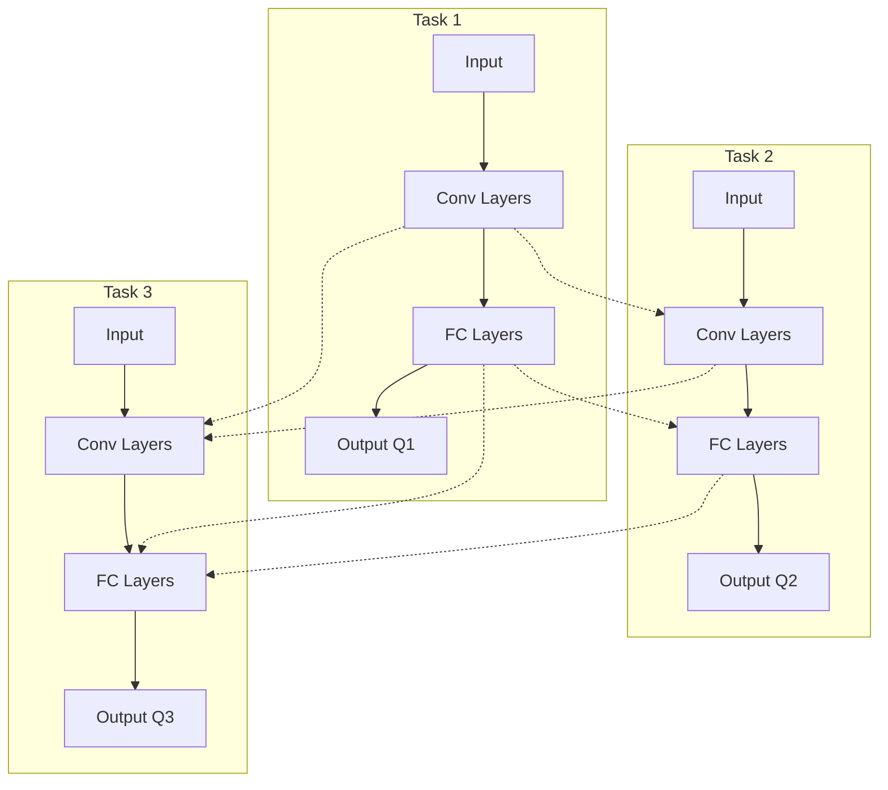

# 一切皆是映射：DQN与多任务学习：共享网络结构的效果分析

关键词：深度强化学习, DQN, 多任务学习, 共享网络, 迁移学习

## 1. 背景介绍
### 1.1 问题的由来
近年来，深度强化学习(Deep Reinforcement Learning, DRL)在各个领域取得了令人瞩目的成就，如AlphaGo在围棋领域战胜世界冠军，OpenAI Five在Dota 2中击败职业选手等。这些成功案例无一不彰显了DRL强大的学习能力。而DRL之所以能取得如此成就，很大程度上归功于深度神经网络强大的表征学习能力，能够从原始的高维状态中学习到高层次的抽象特征表示。

然而，现有的DRL方法大多专注于单一任务的训练，即使是同一个领域的相似任务，训练好的模型也难以直接迁移。这导致DRL算法在实际应用中存在数据效率低、训练时间长、模型通用性差等问题。如何提高DRL的泛化能力，实现跨任务的知识迁移与共享，成为了一个亟待解决的关键问题。

### 1.2 研究现状
多任务学习(Multi-task Learning)是机器学习领域的一个重要分支，其核心思想是通过学习多个相关任务，利用任务之间的相关性，来提高模型的泛化能力。近年来，多任务学习在计算机视觉、自然语言处理等领域取得了广泛成功。一些研究者开始将多任务学习的思想引入到强化学习中，取得了一定的进展。

Teh等人提出了一种基于策略蒸馏(Policy Distillation)的多任务强化学习方法，通过蒸馏不同任务的Q值函数来实现知识的迁移与共享。Parisotto等人则提出了一种基于参数共享的多任务DQN模型(Multi-task DQN, MT-DQN)，通过共享网络的隐藏层参数来实现跨任务知识的迁移。这些工作表明，合理地设计共享网络结构，能够显著提升DQN在多任务学习中的性能。

### 1.3 研究意义
尽管已有工作取得了一定进展，但对于多任务DQN中共享网络结构的设计仍缺乏系统性的研究。不同的共享方式对模型性能的影响尚不明确，针对不同类型任务应该采取何种共享策略也没有定论。因此，本文拟对DQN在多任务学习中共享网络结构的效果进行系统性的实验分析，以期为后续的研究提供参考和指导。

同时，本研究对于拓展DRL的应用范围，提高其实用价值具有重要意义。通过多任务学习，可以大幅提升模型训练的样本效率，缩短训练时间。而通过共享学习到的知识，可以增强模型的泛化能力，使其能够更好地适应新的任务。这对于将DRL应用到如机器人控制、无人驾驶、智能助理等实际场景具有重要价值。

### 1.4 本文结构
本文后续结构安排如下：第二部分介绍了DQN、多任务学习等相关背景知识和核心概念；第三部分详细阐述了多任务DQN的算法原理，并对不同共享网络结构进行了分析；第四部分建立了多任务DQN的数学模型，推导了相关公式，并通过案例对模型进行了分析和讲解；第五部分给出了多任务DQN的代码实现，并对实验结果进行了分析；第六部分讨论了多任务DQN的实际应用场景及未来应用前景；第七部分推荐了一些学习资源和开发工具；第八部分对全文进行了总结，并对未来的研究方向和挑战进行了展望。

## 2. 核心概念与联系
在正式介绍多任务DQN算法之前，本节首先对深度强化学习(DRL)、DQN、多任务学习等核心概念进行介绍，并分析它们之间的内在联系。

**深度强化学习**是近年来一个备受关注的研究领域，它将深度学习方法引入强化学习领域，通过端到端的学习，直接从原始的高维状态中学习最优控制策略。与传统强化学习方法相比，DRL具有更强的特征提取和函数拟合能力，能够处理更加复杂的决策问题。目前，DRL在如游戏、机器人、自然语言处理等诸多领域取得了广泛成功。

**DQN(Deep Q-Network)**是DRL领域的一个里程碑式工作，由DeepMind公司在2015年提出。它将深度卷积神经网络与Q学习相结合，实现了一种端到端的值函数学习方法。DQN引入了两个关键技术：经验回放(Experience Replay)和目标网络(Target Network)，成功解决了深度神经网络在强化学习中的不稳定性问题。DQN在Atari游戏中取得了超越人类的成绩，展现了深度强化学习的巨大潜力。

**多任务学习**是机器学习的一个重要分支，其目标是同时学习多个相关任务，通过利用任务之间的相关性，来提高模型的泛化性能。与单任务学习相比，多任务学习的优势在于：
1. 提高了数据利用率，不同任务可以共享训练数据；
2. 降低了过拟合风险，共享的特征表示能够一定程度地规避特定任务的噪声；
3. 提升了学习效率，不同任务的训练可以并行进行；
4. 增强了模型的泛化能力，使其能够更好地适应新任务。

多任务学习与迁移学习也有着密切的联系。迁移学习的目标是将从一个或多个源任务中学习到的知识迁移到目标任务中，以提高目标任务的学习效率和性能。多任务学习可以看作是一种同时进行多个源任务学习，并将知识迁移到目标任务的过程。因此，多任务学习常被用作迁移学习的一种有效手段。

将多任务学习与深度强化学习相结合，能够显著提升强化学习模型的性能。通过共享网络结构，可以在多个任务间传递和泛化知识，加速学习进程。此外，合理地设计共享机制，有助于学习到更加鲁棒和通用的特征表示，从而增强模型的泛化能力。

综上，多任务学习和深度强化学习的结合，能够有效缓解 DRL 面临的数据效率低、泛化能力差等问题，对于拓展 DRL 的应用范畴，提升其实用价值具有重要意义。而 DQN 作为 DRL 领域的经典算法，将其推广到多任务学习场景，对于丰富多任务 DRL 的研究内容，具有重要的理论和实践价值。

## 3. 核心算法原理 & 具体操作步骤
本节将详细阐述多任务DQN算法(MT-DQN)的核心原理，并给出具体的操作步骤。首先介绍MT-DQN的整体框架，然后分析不同的共享网络结构，最后总结算法的优缺点和应用领域。

### 3.1 算法原理概述
MT-DQN算法的核心思想是，通过共享网络结构，实现在多个任务间传递和泛化知识，从而提升模型的学习效率和泛化能力。具体而言，MT-DQN在原始DQN的基础上，引入了共享网络机制，同时学习多个任务的Q函数。不同任务间共享部分网络参数，独享输出层，从而兼顾了任务的相关性和特异性。

MT-DQN的网络结构如下图所示：

如图所示，MT-DQN的网络结构由共享的卷积层(Conv Layers)、共享的全连接层(FC Layers)以及独立的输出层(Output Q)组成。其中，不同任务的卷积层和全连接层共享参数，输出层独享参数。共享的卷积层负责提取任务无关的通用特征表示，共享的全连接层用于学习任务间的共性规律，独立的输出层用于捕捉任务的特异性。

MT-DQN的训练过程与标准DQN类似，主要包括采样(Sampling)、计算损失(Loss Computation)和参数更新(Parameter Update)三个步骤，区别在于采样和损失计算需要考虑多个任务。具体而言，训练过程如下：

1. 对于每个任务，从对应的经验回放池中采样一个批次的转移数据$(s,a,r,s')$；
2. 对每个任务的样本，分别计算Q网络的预测值$Q(s,a;\theta)$和目标值$y=r+\gamma \max_{a'}Q(s',a';\theta^-)$；
3. 将所有任务的损失函数相加，得到总的损失函数$L(\theta)=\sum_i L_i(\theta)$，其中$L_i(\theta)$为第$i$个任务的均方误差损失；
4. 计算总损失函数$L(\theta)$关于参数$\theta$的梯度，并使用梯度下降法更新网络参数。

通过以上训练过程，MT-DQN能够在多个任务上同时进行学习，并利用共享网络机制，实现跨任务知识的传递与泛化。

### 3.2 算法步骤详解
基于上述原理，MT-DQN的具体训练步骤如下：

输入：任务集合$\mathcal{T}=\{T_1,\dots,T_n\}$，共享网络参数$\theta$，独立网络参数$\{\theta_1,\dots,\theta_n\}$，经验回放池$\mathcal{D}=\{\mathcal{D}_1,\dots,\mathcal{D}_n\}$，学习率$\alpha$，折扣因子$\gamma$，目标网络更新频率$\tau$，探索率$\epsilon$，批大小$B$，训练步数$M$。

输出：最优策略$\{\pi_1^*,\dots,\pi_n^*\}$。

1. 随机初始化共享网络参数$\theta$和独立网络参数$\{\theta_1,\dots,\theta_n\}$，并复制到目标网络$\theta^-$和$\{\theta_1^-,\dots,\theta_n^-\}$。
2. 对每个任务$T_i$，初始化对应的经验回放池$\mathcal{D}_i$。
3. for $t=1,\dots,M$ do
4. \quad 对每个任务$T_i$，根据$\epsilon-greedy$策略选择动作$a_t^i$，并执行动作，观察奖励$r_t^i$和下一状态$s_{t+1}^i$。
5. \quad 将转移样本$(s_t^i,a_t^i,r_t^i,s_{t+1}^i)$存入对应的经验回放池$\mathcal{D}_i$。
6. \quad if $t\mod \tau==0$ then
7. \qquad 从每个任务的经验回放池$\mathcal{D}_i$中采样一个批次的转移样本$\{(s_j^i,a_j^i,r_j^i,s_{j+1}^i)\}_{j=1}^B$。
8. \qquad 对每个任务$i$，计算目标值$y_j^i=r_j^i+\gamma \max_{a'}Q_i(s_{j+1}^i,a';\theta^-,\theta_i^-)$。
9. \qquad 计算总的损失函数$L(\theta,\theta_1,\dots,\theta_n)=\sum_i\sum_j(y_j^i-Q_i(s_j^i,a_j^i;\theta,\theta_i))^2$。
10. \qquad 计算$L$关于$\theta$和$\{\theta_1,\dots,\theta_n\}$的梯度，并使用梯度下降法更新参数：
$$
\