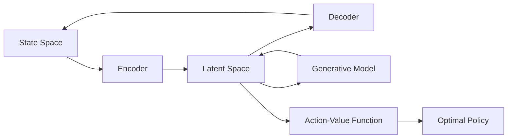

# 一切皆是映射：DQN中潜在代表性学习的研究进展

关键词：深度强化学习, DQN, 潜在表示, 状态空间映射, 泛化能力

## 1. 背景介绍

### 1.1 问题的由来

强化学习(Reinforcement Learning, RL)是一种重要的机器学习范式,它研究如何让智能体(Agent)通过与环境的交互来学习最优策略,以获得最大的累积奖励。近年来,深度强化学习(Deep Reinforcement Learning, DRL)将深度学习与强化学习相结合,利用深度神经网络强大的表示学习能力来处理高维观测数据,极大地推动了强化学习的发展。其中,深度Q网络(Deep Q-Network, DQN)作为DRL的代表性算法之一,在Atari游戏、机器人控制等领域取得了令人瞩目的成就。

然而,DQN仍然存在一些不足之处,如对环境变化的适应能力较弱,泛化能力有限等。这主要是因为DQN直接学习从原始状态到动作价值的映射,缺乏对状态空间的高层次抽象和概括。为了克服这些局限性,研究者开始探索如何在DQN中学习状态的潜在表示(Latent Representation),希望捕捉状态内在的本质特征,增强模型的泛化和迁移能力。

### 1.2 研究现状

近年来,国内外学者围绕DQN的潜在表示学习开展了一系列研究。Higgins等人提出了β-VAE模型,通过变分自编码器学习解耦的隐变量表示,增强了模型的解释性和可控性。Nair等人提出了Embed to Control (E2C)框架,将状态嵌入到一个紧凑的潜在空间,并在此基础上学习最优策略。Ghosh等人提出了基于生成对抗网络的潜在表示学习方法,生成逼真的状态样本来加速策略学习。国内也有学者提出了基于因果推断的潜在表示学习框架,通过因果建模提取状态的语义特征。

总的来说,现有工作主要集中在利用无监督学习方法(如自编码器、对抗网络等)从状态数据中提取紧凑的潜在表示,并将其与强化学习相结合,取得了一定的效果。但如何设计更有效的潜在表示学习算法,进一步提升DQN的性能,仍有待深入研究。

### 1.3 研究意义

DQN的潜在表示学习研究具有重要意义:

1. 提高模型泛化能力:通过学习状态的高层次语义特征,模型可以更好地适应环境变化,在新场景下表现出色。 

2. 增强策略迁移能力:紧凑的状态表示可作为知识的载体在不同任务间迁移,促进跨领域学习。

3. 降低样本复杂度:从原始状态到最优策略的学习需要大量探索,而从潜在状态出发可显著降低学习难度和样本开销。

4. 赋予模型解释性:可解释的潜在表示有助于人类理解模型的决策逻辑,便于调试和优化。

5. 推动认知科学发展:揭示AI系统感知、推理的内在机制,为探索人脑认知奥秘提供新视角。

### 1.4 本文结构

本文将重点介绍DQN中潜在表示学习的研究进展。第2部分阐述相关概念;第3部分详细讲解潜在表示学习的核心算法原理;第4部分建立数学模型并推导关键公式;第5部分通过代码实例演示算法的实现细节;第6部分讨论潜在表示学习在实际场景中的应用;第7部分推荐相关工具和资源;第8部分总结全文,展望未来发展方向。

## 2. 核心概念与联系

在深入探讨DQN中潜在表示学习算法之前,有必要厘清几个核心概念:

- 状态空间(State Space):智能体与环境交互过程中所处的状态集合,通常是高维、连续的观测数据(如图像、传感器信号等)。

- 潜在空间(Latent Space):状态经过映射后得到的低维、紧凑表示空间。潜在空间刻画了状态内在的本质特征,具有语义丰富性和抽象性。

- 编码器(Encoder):将原始状态映射到潜在空间的函数,通常由神经网络实现。编码过程提取状态的高层语义信息,滤除冗余细节。

- 解码器(Decoder):将潜在表示还原为原始状态的函数,与编码器互逆。解码过程保证潜在表示的完备性,避免信息损失。

- 生成模型(Generative Model):刻画状态分布的概率模型,常用变分自编码器(VAE)或生成对抗网络(GAN)构建。生成模型用于从潜在空间采样合成新状态。

- 动作价值函数(Action-Value Function):估计在某状态下采取特定动作的长期累积奖励,即Q值。DQN的目标是学习最优Q函数。

下图展示了这些概念在DQN潜在表示学习框架中的关系:

可以看出,原始状态首先通过编码器映射到潜在空间,得到紧凑的特征表示。潜在表示一方面被解码器还原,另一方面被生成模型建模以支持采样。同时,潜在表示也被馈送到动作价值函数中,用于估计最优Q值和策略。整个框架形成了一个端到端的状态表示和策略优化流程。

## 3. 核心算法原理 & 具体操作步骤

### 3.1 算法原理概述

DQN中潜在表示学习的核心思想是将原始状态空间映射到一个信息更加紧凑、语义更加丰富的低维潜在空间,并基于潜在表示来学习最优策略。通常采用无监督学习方法如自编码器从状态数据中提取潜在特征,再使用强化学习算法优化基于潜在状态的决策。

具体来说,给定一组状态样本$\{s_1,\cdots,s_N\}$,潜在表示学习的目标是找到一个编码函数$f_\phi:S \rightarrow Z$和解码函数$g_\theta:Z \rightarrow S$,其中$\phi$和$\theta$为待学习参数,满足重构误差最小:

$$\min_{\phi,\theta} \frac{1}{N} \sum_{i=1}^N \|s_i - g_\theta(f_\phi(s_i))\|^2$$

直观地,编码器$f_\phi$将状态$s$映射为潜在表示$z=f_\phi(s)$,解码器$g_\theta$则将$z$还原为原始状态。重构误差衡量了还原状态与真实状态的差异,反映了潜在表示的质量。

在得到状态的潜在表示后,我们可以基于潜在状态$z$来学习动作价值函数$Q(z,a)$,即估计在潜在状态$z$下采取动作$a$的长期回报。Q函数的学习通常采用时序差分(TD)算法,如Q-learning或SARSA。以Q-learning为例,其更新公式为:

$$Q(z_t,a_t) \leftarrow Q(z_t,a_t) + \alpha [r_{t+1} + \gamma \max_a Q(z_{t+1},a) - Q(z_t,a_t)]$$

其中$\alpha$为学习率,$\gamma$为折扣因子。该公式基于TD误差来更新当前状态-动作对的Q值,逐步逼近最优Q函数。

### 3.2 算法步骤详解

基于上述原理,DQN中潜在表示学习的具体算法步骤如下:

1. 采样状态转移数据$\{(s_t,a_t,r_{t+1},s_{t+1})\}$,存入经验回放池(Experience Replay)$D$。

2. 从$D$中随机抽取小批量(mini-batch)转移样本$\{(s_i,a_i,r_{i+1},s_{i+1})\}_{i=1}^M$。

3. 使用编码器$f_\phi$将状态$s_i$和$s_{i+1}$映射为潜在表示$z_i$和$z_{i+1}$。

4. 计算重构状态$\hat{s}_i=g_\theta(z_i)$和$\hat{s}_{i+1}=g_\theta(z_{i+1})$,并优化重构误差:

$$\mathcal{L}_{recon}=\frac{1}{M}\sum_{i=1}^M(\|s_i-\hat{s}_i\|^2+\|s_{i+1}-\hat{s}_{i+1}\|^2)$$

5. 在潜在空间中计算TD目标:

$$y_i=\begin{cases}
r_{i+1}, & \text{if } s_{i+1} \text{ is terminal} \\
r_{i+1}+\gamma \max_a Q_{\bar{\psi}}(z_{i+1},a), & \text{otherwise}
\end{cases}$$

其中$Q_{\bar{\psi}}$为目标网络,用于计算下一状态的最大Q值。 

6. 优化Q网络$Q_\psi$,最小化TD误差:

$$\mathcal{L}_{TD}=\frac{1}{M}\sum_{i=1}^M(y_i-Q_\psi(z_i,a_i))^2$$

7. 每隔$C$步更新目标网络参数$\bar{\psi} \leftarrow \psi$。

8. 重复步骤1-7,直至Q网络收敛。

9. 在测试阶段,对于新状态$s$,使用编码器$f_\phi$得到潜在表示$z=f_\phi(s)$,再用Q网络$Q_\psi$选择最优动作$a^*=\arg\max_a Q_\psi(z,a)$。

### 3.3 算法优缺点

DQN中引入潜在表示学习具有以下优点:

- 通过端到端训练,编码器可以自适应地提取状态的关键特征,减少人工特征工程。
- 潜在表示通常是低维且平滑的,降低了强化学习的难度,加速策略优化。  
- 潜在表示挖掘了状态内在结构,增强了模型的泛化能力和鲁棒性。
- 紧凑的状态表示易于在任务间迁移,促进知识复用和跨领域学习。

但该方法也存在一些局限:

- 引入编码器和解码器增加了模型复杂度,给训练和调参带来挑战。
- 潜在表示的质量很大程度上依赖于重构任务的设计,需要权衡重构误差和强化学习目标。
- 通过无监督方式学习的潜在表示可解释性不强,难以准确把握其语义。
- 端到端训练的不稳定性可能导致编码器和策略的联合优化困难。

### 3.4 算法应用领域

DQN潜在表示学习在以下领域展现出广阔的应用前景:

- 游戏AI:在Atari、星际争霸等复杂游戏中,潜在表示帮助AI快速掌握环境规律,实现超人表现。
- 机器人控制:通过对机器人传感数据的高层抽象,潜在表示增强了其适应不同环境的能力。
- 自动驾驶:潜在表示从原始视觉输入中提炼道路和障碍物信息,指导车辆做出安全决策。
- 推荐系统:用户和物品的紧凑表示简化了兴趣匹配,提高推荐的准确性和多样性。
- 智能医疗:从医学影像、生理信号中学习疾病的潜在表征,辅助诊断和预后预测。

## 4. 数学模型和公式 & 详细讲解 & 举例说明

### 4.1 数学模型构建

为了刻画DQN中潜在表示学习的机理,我们从概率图模型的角度构建其数学形式。

首先,定义状态空间$\mathcal{S}$、动作空间$\mathcal{A}$、潜在空间$\mathcal{Z}$,它们均为欧氏空间。环境的状态转移概率为$p(s_{t+1}|s_t,a_t)$,奖励函数为$r(s_t,a_t)$。

我们假设存在