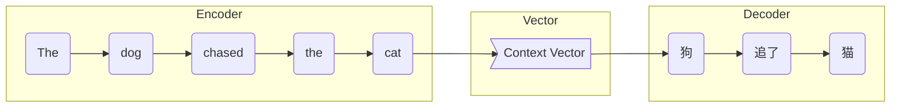

以下是题为"一切皆是映射：序列模型和注意力机制"的技术博客正文：

# 一切皆是映射：序列模型和注意力机制

## 1. 背景介绍

### 1.1 问题的由来

在自然语言处理、语音识别、机器翻译等序列数据处理任务中,我们常常会遇到输入和输出都是可变长度序列的情况。传统的机器学习模型如何有效处理这种可变长度序列数据一直是一个巨大挑战。

### 1.2 研究现状 

早期的序列模型主要采用卷积神经网络(CNN)和循环神经网络(RNN)等模型,但这些模型在处理长序列时存在梯度消失/爆炸、无法完全捕获长距离依赖等问题。随着注意力机制(Attention Mechanism)的提出,序列模型的性能得到极大提升,注意力机制已广泛应用于各种序列数据处理任务中。

### 1.3 研究意义

注意力机制赋予了序列模型"注意力"的能力,使其能自适应地为输入序列中不同位置的元素赋予不同的权重,从而更好地捕获长期依赖关系。研究注意力机制及其在序列模型中的应用,有助于提高序列数据处理的准确性和效率,推动自然语言处理等领域的发展。

### 1.4 本文结构

本文首先介绍序列模型和注意力机制的核心概念,阐述二者的内在联系。接下来详细讲解注意力机制的原理、数学模型及其在序列模型中的具体实现。然后通过实例分析注意力机制在实际应用中的作用,并对未来发展趋势和挑战进行展望。

## 2. 核心概念与联系

序列模型(Sequence Model)是一类旨在处理序列数据的机器学习模型。序列数据指的是按某种顺序排列的一系列离散元素,如自然语言文本、语音信号、基因序列等。序列模型需要同时处理输入和输出序列,并捕获两者之间的映射关系。

注意力机制(Attention Mechanism)是一种用于计算两个向量序列之间的相关性权重的技术。其核心思想是,在处理序列数据时,不同位置的元素对最终结果的贡献是不同的,模型应当自适应地分配不同的"注意力"权重。

序列模型和注意力机制有着内在的联系。传统的序列模型如RNN在编码长序列时,会逐个元素地更新隐藏状态,导致距离较远的元素之间的依赖关系难以捕获。注意力机制赋予了序列模型"注意力"的能力,使其能自主关注对当前任务更加重要的序列元素,从而更好地建模长期依赖关系。

总的来说,注意力机制为序列模型提供了一种灵活的方式,使其能够根据不同的上下文自适应地分配注意力权重,从而更高效地处理序列数据。

## 3. 核心算法原理与具体操作步骤

### 3.1 算法原理概述

注意力机制的核心思想是,对于给定的查询(query)向量q和一系列键(key)向量k_i组成的键向量序列K,以及相应的值(value)向量序列V,注意力机制首先计算查询向量与每个键向量的相似性得分,然后根据这些相似性得分为每个值向量分配权重,最后将加权求和的值向量组成注意力向量作为输出。

这一过程可以用以下公式表示:

$$\begin{aligned}
\text{Attention}(Q, K, V) &= \text{softmax}(\frac{QK^T}{\sqrt{d_k}})V\\
                     &= \sum_{i=1}^n \alpha_i v_i \\
                     &= \sum_{i=1}^n \frac{e^{s_i}}{\sum_{j=1}^n e^{s_j}} v_i
\end{aligned}$$

其中:
- $Q = [q_1, q_2, \dots, q_m]$ 是查询向量序列
- $K = [k_1, k_2, \dots, k_n]$ 是键向量序列 
- $V = [v_1, v_2, \dots, v_n]$ 是值向量序列
- $s_i = q \cdot k_i$ 表示查询向量与第i个键向量的相似性得分
- $\alpha_i = \text{softmax}(s_i) = \frac{e^{s_i}}{\sum_{j=1}^n e^{s_j}}$ 为第i个值向量的权重

可见,注意力机制本质上是对值向量序列V进行加权求和,权重由查询向量Q和键向量序列K共同决定。

### 3.2 算法步骤详解

1) **计算相似性得分矩阵(Score Matrix)**

首先计算查询向量Q与所有键向量K的点积,得到相似性得分矩阵S:

$$S = QK^T$$

其中$S_{ij} = q_i \cdot k_j$表示第i个查询向量与第j个键向量的相似性得分。

2) **缩放和归一化(Scaling & Normalization)** 

为了防止较大的点积导致softmax函数饱和,一般会对得分矩阵S进行缩放:

$$\widetilde{S} = \frac{S}{\sqrt{d_k}}$$

其中$d_k$为键向量的维度。

接着,对每一行的得分向量$\widetilde{s}_i$进行softmax归一化,得到权重向量$\alpha_i$:

$$\alpha_i = \text{softmax}(\widetilde{s}_i) = \frac{e^{\widetilde{s}_{i1}}}{\sum_j e^{\widetilde{s}_{ij}}} \begin{bmatrix}
    e^{\widetilde{s}_{i1}} \\
    e^{\widetilde{s}_{i2}} \\
    \vdots \\
    e^{\widetilde{s}_{in}}
\end{bmatrix}$$

3) **加权求和(Weighted Summing)**

最后,将值向量序列V中的每个向量$v_j$乘以其对应的权重$\alpha_{ij}$,再求和,即得到注意力向量输出:

$$\text{Attention}(Q, K, V) = \sum_{j=1}^n \alpha_{ij} v_j$$

### 3.3 算法优缺点

**优点:**

- 能够自适应地分配注意力权重,有效捕获长期依赖关系
- 计算复杂度较低,可并行化计算,适合GPU加速
- 适用于变长序列输入,不受序列长度限制
- 可解释性较好,权重向量直观反映了注意力分布

**缺点:**

- 注意力计算开销较大,尤其是对于高维度的查询/键向量
- 缺乏位置信息,对序列元素的位置无感知能力
- 容易受到噪声干扰,对异常值较为敏感
- 注意力机制本身无法学习位置不变性

### 3.4 算法应用领域

注意力机制最初应用于机器翻译任务,后广泛用于自然语言处理、计算机视觉、语音识别、推荐系统等领域。以下列举一些典型应用:

- **机器翻译**:Transformer模型中的自注意力层
- **文本生成**:GPT、BERT等大型语言模型
- **图像分类**:注意力增强CNN网络
- **视频描述**:视频序列到文本序列的映射
- **关系抽取**:从文本中抽取实体关系三元组
- **阅读理解**:根据文本内容回答相关问题

## 4. 数学模型和公式详细讲解与举例说明

### 4.1 数学模型构建

我们以机器翻译任务为例,构建基于注意力机制的序列到序列(Seq2Seq)模型。该模型包含编码器(Encoder)和解码器(Decoder)两个部分。

**编码器**将源语言句子$X=(x_1, x_2, \dots, x_n)$映射为序列表示$C=(c_1, c_2, \dots, c_n)$:

$$c_i = \text{Encoder}(x_i, c_{i-1})$$

**解码器**根据目标语言前缘$Y'=(y_1, y_2, \dots, y_{t-1})$和编码器输出$C$,预测下一个单词$y_t$的概率分布:

$$P(y_t|Y', X) = \text{Decoder}(y_{t-1}, s_{t-1}, C)$$

其中$s_t$为解码器的隐藏状态向量。

在解码器中,我们引入注意力机制来更好地利用编码器输出$C$:

$$s_t, \alpha_t = \text{AttentionDecoder}(y_{t-1}, s_{t-1}, C)$$

解码器的注意力权重向量$\alpha_t$由查询向量$s_{t-1}$和编码器输出$C$共同决定:

$$\alpha_t = \text{Attention}(s_{t-1}, C, C)$$

概率分布$P(y_t|Y', X)$由注意力加权的上下文向量$\sum_i \alpha_{ti}c_i$和解码器隐藏状态$s_t$共同决定。

### 4.2 公式推导过程

我们以自注意力(Self-Attention)机制为例,推导其数学表达式。自注意力是将查询向量Q、键向量K和值向量V都设为同一个输入序列X的线性映射。

假设输入序列$X=(x_1, x_2, \dots, x_n)$,我们有:

$$\begin{aligned}
Q &= XW^Q\\
K &= XW^K\\
V &= XW^V
\end{aligned}$$

其中$W^Q, W^K, W^V$分别为查询、键、值的线性变换矩阵。

将Q、K、V代入注意力公式,可得:

$$\begin{aligned}
\text{Attention}(Q, K, V) &= \text{softmax}(\frac{QK^T}{\sqrt{d_k}})V\\
                          &= \text{softmax}(\frac{XW^QW^{K^T}X^T}{\sqrt{d_k}})XW^V\\
                          &= \sum_{i=1}^n \alpha_i v_i\\
                          &= \sum_{i=1}^n \frac{e^{s_i}}{\sum_{j=1}^n e^{s_j}} x_iW^V
\end{aligned}$$

其中$s_i = \frac{x_iW^QW^{K^T}x_i^T}{\sqrt{d_k}}$为第i个输入向量与自身的相似性得分。

可见,自注意力机制实际上是对输入序列X中的每个向量$x_i$进行加权求和,权重由输入序列本身决定。这种机制赋予了模型捕获输入序列内部依赖关系的能力。

### 4.3 案例分析与讲解

以机器翻译任务为例,我们分析注意力机制是如何帮助模型捕获源语言和目标语言之间的对应关系。

假设源语言句子为"The dog chased the cat",目标语言翻译为"狗追了猫"。在传统的Seq2Seq模型中,编码器压缩整个源句为一个定长向量,解码器根据该向量生成目标句子,很难精确捕获两种语言之间的对应关系。



而在注意力机制下,解码器在生成每个目标词时,都可以"注意"到与其最相关的源语言词。比如生成"狗"时,模型会更多地"注意"到"dog";生成"追了"时,会更多地"注意"到"chased"。

```mermaid
graph LR
    subgraph Encoder
    enc1(The)
    enc2(dog)
    enc3(chased)
    enc4(the)
    enc5(cat)
    end
    
    subgraph Decoder
    dec1(狗)
    dec2(追了)
    dec3(猫)
    end
    
    enc1 ..> dec1
    enc2 ==> dec1
    enc3 ..> dec2
    enc4 ..> dec2
    enc5 ==> dec3
```

通过这种"选择性注意"机制,模型能更好地捕获源语言和目标语言之间的对应关系,从而提高翻译质量。

### 4.4 常见问题解答

**Q: 为什么要对相似性得分矩阵进行缩放?**

A: 这是为了防止较大的点积值导致