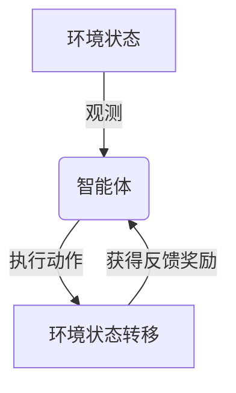

好的,我会严格遵循约束条件,以专业的技术语言写一篇高质量的技术博客。

# 一切皆是映射：强化学习在工业自动化中的应用：挑战与机遇

## 1. 背景介绍

### 1.1 问题的由来

在当今工业生产领域,自动化程度的提高是提升效率、降低成本的关键因素。传统的工业自动化系统通常采用有限状态自动机或基于规则的控制策略,这些方法需要人工设计和编码大量的规则和状态转移,不仅成本高昂,而且难以处理复杂的动态环境。随着人工智能技术的发展,强化学习(Reinforcement Learning)作为一种全新的范式,为工业自动化系统带来了新的机遇。

### 1.2 研究现状  

近年来,强化学习在工业自动化领域的应用研究日益活跃。一些学者将强化学习应用于机器人控制、工艺流程优化、智能调度等领域,取得了令人鼓舞的进展。然而,将强化学习真正应用于工业实践仍面临诸多挑战,例如复杂的工业环境、高维状态空间、样本效率低下、可解释性差等问题。

### 1.3 研究意义

强化学习在工业自动化中的应用具有重要的理论和实际意义。从理论层面看,工业环境为强化学习算法提供了复杂的测试场景,可以推动算法本身的创新和发展。从实际层面看,强化学习可以显著提高自动化系统的智能化水平,实现更高效、更灵活、更节能的生产控制,为制造业的转型升级注入新的动力。

### 1.4 本文结构

本文将系统地介绍强化学习在工业自动化中的应用。首先阐述核心概念和基本原理,然后详细解析关键算法,并建立相应的数学模型。接下来通过实际案例分析算法的实现细节和代码实践。最后探讨实际应用场景,分享相关工具和资源,总结未来发展趋势和面临的挑战。

## 2. 核心概念与联系

强化学习(Reinforcement Learning)是机器学习的一个重要分支,它研究如何基于环境反馈来学习最优策略,以maximizd获得的累积奖励。在工业自动化场景中,可以将生产过程建模为一个马尔可夫决策过程(Markov Decision Process, MDP)。



如上图所示,智能体根据当前环境状态选择一个动作执行,环境将转移到新的状态并给出相应的奖励反馈,智能体的目标是学习一个策略,使得在长期内获得的累积奖励最大化。这种"试错"的学习过程非常适合于工业自动化系统的在线优化和自适应控制。

值得注意的是,强化学习与监督学习和无监督学习有着本质的区别。监督学习是从给定的输入-输出示例对中学习映射关系;无监督学习则是从无标注数据中发现潜在的模式和结构。而强化学习则是通过与环境的互动,不断试错并从经验中学习,以达到长期的最优目标。这种学习方式更加符合工业过程控制的本质需求。

## 3. 核心算法原理与具体操作步骤

### 3.1 算法原理概述

强化学习算法的核心思想是估计状态-动作对的长期价值,并不断更新策略以获得更大的累积奖励。该过程可以用贝尔曼方程(Bellman Equation)来刻画:

$$
Q(s_t, a_t) = \mathbb{E}_{r_{t+1}, s_{t+1}}\left[r_{t+1} + \gamma \max_{a'}Q(s_{t+1}, a')\right]
$$

其中,$Q(s_t, a_t)$表示在状态$s_t$执行动作$a_t$后的长期价值, $r_{t+1}$是立即奖励, $\gamma$是折现因子, $\max_{a'}Q(s_{t+1}, a')$是下一状态$s_{t+1}$下所有可能动作的最大价值。算法的目标是找到一个最优策略$\pi^*$,使$Q^{\pi^*}(s, a)$对所有状态-动作对都最大化。

### 3.2 算法步骤详解

以Q-Learning为例,算法的具体步骤如下:

```mermaid
graph TD
A[初始化Q表] --> B{对每个Episode}
B --> C[观测初始状态s]
C --> D[选择动作a根据epsilon-greedy策略]
D --> E[执行动作a,获得奖励r和新状态s']
E --> F[更新Q(s,a)值]
F --> G{是否达到终止条件}
G -->|是| H[返回最优策略]
G -->|否| C
```

1. **初始化Q表**:对所有可能的状态-动作对,初始化其Q值,通常使用一个较小的常数或随机值。
2. **对每个Episode**:
    a. 观测当前环境状态$s$
    b. 根据$\epsilon$-greedy策略选择动作$a$,即以$\epsilon$的概率随机选择动作,以$1-\epsilon$的概率选择当前Q值最大的动作
    c. 执行动作$a$,获得立即奖励$r$和新的环境状态$s'$
    d. 根据贝尔曼方程更新$Q(s, a)$的估计值:
    $$
    Q(s, a) \leftarrow Q(s, a) + \alpha\left(r + \gamma\max_{a'}Q(s', a') - Q(s, a)\right)
    $$
    其中$\alpha$是学习率。
    e. 重复b-d步骤,直到达到终止条件(如最大Episode数)
3. 返回最终的Q表,其中最优策略$\pi^*(s) = \arg\max_aQ(s, a)$

### 3.3 算法优缺点

Q-Learning算法的优点在于其简单性和无模型(model-free)的特点,无需了解环境的精确转移概率,可以通过在线交互直接从经验中学习。但它也存在一些缺陷:

- **维数灾难**:在高维状态和动作空间下,查表的方式将变得低效甚至不可行
- **样本效率低下**:需要大量的在线交互来探索所有状态-动作对
- **收敛性问题**:只有满足某些条件(如有限马尔可夫决策过程)时才能保证收敛到最优策略

为了应对这些挑战,研究人员提出了许多改进算法,如基于函数逼近的深度Q网络(Deep Q-Network, DQN)、策略梯度算法(Policy Gradient)等,显著提高了算法的性能和通用性。

### 3.4 算法应用领域

强化学习算法在工业自动化领域有广泛的应用前景:

- **机器人控制**:通过与环境交互,学习最优的机器人运动和操作策略
- **工艺流程优化**:自动调节工艺参数,优化产品质量和生产效率
- **智能调度**:根据实时状态,动态调度资源以最小化等待时间和成本
- **预测维护**:从设备运行数据中学习故障模式,实现预测性维护
- **能源管理**:控制工厂的供电、供热等,实现节能减排
- **物流优化**:优化仓储、运输路线等,提高物流效率

总的来说,凡是涉及序列决策的领域,都可以尝试应用强化学习技术。

## 4. 数学模型和公式详细讲解举例说明

### 4.1 数学模型构建

将工业自动化问题形式化为强化学习问题的第一步,是构建马尔可夫决策过程(MDP)模型。一个MDP可以用元组$\langle\mathcal{S}, \mathcal{A}, \mathcal{P}, \mathcal{R}, \gamma\rangle$来表示:

- $\mathcal{S}$是状态空间的集合
- $\mathcal{A}$是动作空间的集合  
- $\mathcal{P}$是状态转移概率,即$\mathcal{P}_{ss'}^a = \Pr(s_{t+1}=s'|s_t=s, a_t=a)$
- $\mathcal{R}$是奖励函数,即$\mathcal{R}_s^a = \mathbb{E}[r_{t+1}|s_t=s, a_t=a]$
- $\gamma \in [0, 1]$是折现因子,控制将来奖励的重视程度

对于特定的工业问题,需要明确定义状态空间、动作空间、转移概率和奖励函数。例如,在机器人控制问题中:

- 状态$s$可以是机器人的位置、姿态等
- 动作$a$可以是机器人的运动指令
- 转移概率$\mathcal{P}$由机器人运动学模型给出
- 奖励$\mathcal{R}$可以是距离目标位置的负距离,到达目标时给予大的正奖励

构建好MDP模型后,强化学习算法的目标就是找到一个最优策略$\pi^*$,使得在该策略下的期望累积奖励最大:

$$
\pi^* = \arg\max_\pi \mathbb{E}_\pi\left[\sum_{t=0}^\infty \gamma^tr_{t+1}\right]
$$

### 4.2 公式推导过程

为了推导出Q-Learning算法的更新规则,我们先从贝尔曼最优方程(Bellman Optimality Equation)出发:

$$
Q^*(s, a) = \mathbb{E}_{s' \sim \mathcal{P}(\cdot|s, a)}\left[r + \gamma \max_{a'}Q^*(s', a')\right]
$$

其中,$Q^*(s, a)$是状态$s$执行动作$a$后的最优行为值函数。我们的目标是找到一种迭代方法来逼近$Q^*$。

考虑使用时序差分(Temporal Difference)的思路,在时间$t$更新$Q(s_t, a_t)$的估计值:

$$
\begin{aligned}
Q(s_t, a_t) &\leftarrow Q(s_t, a_t) + \alpha\left(r_{t+1} + \gamma\max_{a'}Q(s_{t+1}, a') - Q(s_t, a_t)\right)\\
            &= (1-\alpha)Q(s_t, a_t) + \alpha\left(r_{t+1} + \gamma\max_{a'}Q(s_{t+1}, a')\right)
\end{aligned}
$$

其中$\alpha$是学习率,控制新经验与旧估计值的权重。可以证明,只要满足适当的条件,上述迭代式最终会收敛到$Q^*$。

### 4.3 案例分析与讲解

为了更好地理解强化学习在工业自动化中的应用,我们来分析一个具体的案例。

**背景**:某工厂生产一种化学品,需要严格控制反应釜中的温度和压力,以确保产品质量。我们的目标是开发一个智能控制系统,自动调节反应釜的加热器和排气阀,使反应在最佳工况下进行。

**状态空间**:设状态$s$为一个二维向量$(T, P)$,分别表示当前温度和压力。

**动作空间**:设动作$a$也是一个二维向量$(a_T, a_P)$,分别表示加热器和排气阀的开度调节量。

**转移概率**:由于反应釜的复杂性,很难精确建模其动力学过程。但我们可以从历史数据中估计状态转移的概率分布$\mathcal{P}(s'|s, a)$。

**奖励函数**:定义奖励$r$为温度和压力偏离最佳值的负平方和,即$r = -[(T-T_\text{opt})^2 + (P-P_\text{opt})^2]$。当温压接近最佳值时,奖励值较高;当偏离较大时,奖励值较低。

在上述设置下,我们可以应用Q-Learning等强化学习算法,通过在线试错,逐步学习到一个最优控制策略$\pi^*(s) = (a_T^*, a_P^*)$,使反应釜长期运行在最佳工况下。

### 4.4 常见问题解答

**连续状态和动作空间怎么处理?**

传统的Q-Learning只适用于有限的离散状态和动作空间。对于连续空间,我们可以采用函数逼近的方法,如深度Q网络(DQN),使用神经网络来拟合Q函数。