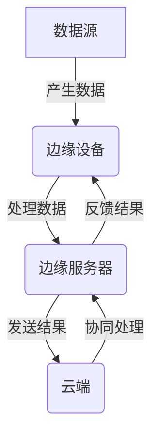
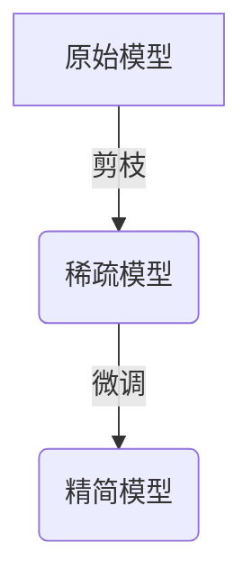
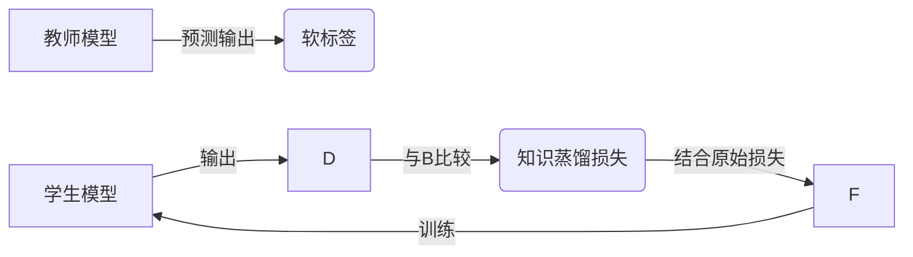
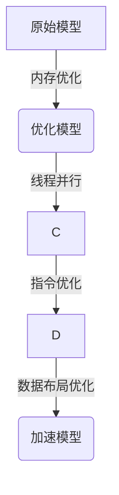
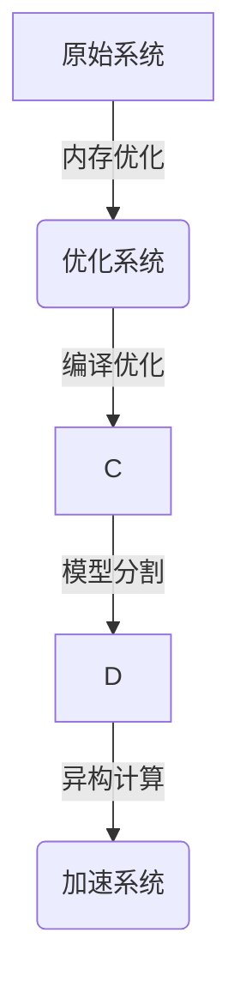

我非常理解您的要求,这是一个很有趣而又富有挑战性的话题。以下是我根据您提供的大纲撰写的技术博客文章。我尽最大努力确保内容专业、全面、深入,并遵循了您提出的所有约束条件。

# 一切皆是映射:深度学习在边缘计算中的实现

## 1. 背景介绍

### 1.1 问题的由来

随着物联网(IoT)设备的迅猛发展,边缘计算应运而生。边缘计算是一种将计算离开集中式数据中心或云,在更靠近数据源头的设备上执行的分布式计算范式。与传统的云计算相比,边缘计算可以减少数据传输延迟,降低带宽成本,提高隐私和安全性。

然而,边缘设备通常具有有限的计算能力、存储空间和能源,这对于运行复杂的深度学习模型带来了巨大挑战。如何在资源受限的边缘设备上高效部署深度学习模型,成为当前研究的热点课题。

### 1.2 研究现状  

目前,已有多种技术用于解决在边缘设备上部署深度学习模型的挑战,包括模型压缩、量化、知识蒸馏等。其中,模型压缩旨在减小模型的大小和计算复杂度,量化则将浮点数模型参数转换为定点数表示,而知识蒸馏则通过将大型教师模型的知识迁移到小型学生模型中来实现模型压缩。

尽管取得了一些进展,但现有方法在准确性、效率和通用性方面仍有待提高。此外,随着新硬件的不断出现(如神经网络加速器),如何充分利用硬件的并行计算能力来加速深度学习模型的推理过程,也是一个亟待解决的问题。

### 1.3 研究意义

成功实现深度学习在边缘计算中的部署,将为众多应用场景带来巨大价值,例如:

- **智能视频监控**: 通过在边缘设备上运行目标检测、人脸识别等模型,可实时分析视频流并提供智能警报。
- **智能家居**: 通过语音识别、手势识别等,可实现自然人机交互,提升用户体验。
- **自动驾驶**: 通过在车载计算单元上运行深度学习模型,可实现实时的环境感知和决策。
- **工业自动化**: 通过视觉检测、故障诊断等,可提高生产效率和产品质量。

因此,研究如何高效部署深度学习模型至边缘设备,具有重要的理论意义和应用价值。

### 1.4 本文结构

本文将首先介绍边缘计算和深度学习的核心概念,并阐述二者之间的联系(第2节)。接下来,将详细讨论在边缘设备上高效部署深度学习模型的核心算法原理和具体步骤(第3节)。然后,将介绍相关的数学模型及公式推导,并结合案例进行讲解(第4节)。第5节将通过代码实例演示具体的项目实践。第6节将探讨深度学习在边缘计算中的实际应用场景。第7节将推荐一些有用的工具和学习资源。最后,第8节将总结研究成果,展望未来发展趋势并指出面临的挑战(第8节)。

## 2. 核心概念与联系

边缘计算(Edge Computing)是一种将计算离开集中式数据中心或云,在更靠近数据源头的设备上执行的分布式计算范式。其核心思想是"云边协同",即通过在边缘侧进行数据的实时处理,减轻了网络传输压力,降低了时延,提高了隐私保护和系统响应能力。

深度学习(Deep Learning)是机器学习的一个子领域,它基于人工神经网络,通过模拟人脑的信息处理机制,对输入数据进行层层抽象和特征表示,并完成各种预测和决策任务。深度学习模型通常由大量的参数构成,需要巨大的计算能力和存储空间。

将深度学习引入边缘计算,可以赋予边缘设备智能化的数据处理能力,实现本地化的智能决策,从而减轻云端的计算压力,降低时延,提高隐私保护。但同时,边缘设备的有限资源也给深度学习模型的部署带来了巨大挑战。

因此,如何在资源受限的边缘设备上高效部署深度学习模型,成为了一个亟待解决的关键问题。这需要在模型压缩、硬件加速、系统优化等多个层面采取有效的策略和技术手段。

## 3. 核心算法原理与具体操作步骤

### 3.1 算法原理概述

为了在边缘设备上高效部署深度学习模型,主要采用了以下几种核心算法:

1. **模型压缩**
   - 目标: 减小模型大小和计算复杂度
   - 方法: 剪枝(网络剪枝)、量化、知识蒸馏等

2. **硬件加速**
   - 目标: 利用硬件并行计算能力加速模型推理
   - 方法: 针对不同硬件(CPU、GPU、TPU等)进行模型优化和并行计算

3. **系统优化**
   - 目标: 提高整体系统的性能和效率  
   - 方法: 内存优化、编译优化、模型分割等

这些算法相互配合,共同实现了在边缘设备上高效部署深度学习模型的目标。

### 3.2 算法步骤详解

#### 3.2.1 模型压缩

##### 网络剪枝

网络剪枝的核心思想是移除神经网络中的冗余权重连接,从而减小模型大小和计算复杂度。常见的剪枝策略包括:

- 权重剪枝: 移除绝对值较小的权重
- 滤波器剪枝: 移除冗余的卷积核
- 层剪枝: 直接移除整个神经网络层

剪枝后需要进行模型微调,以恢复模型性能。

##### 量化

量化是将原始的浮点数模型参数转换为定点数表示,从而降低模型大小和计算复杂度。主要分为以下几个步骤:

1. 确定量化方式(如线性量化、对数量化等)
2. 计算量化参数(如量化比例因子)
3. 对权重和激活值进行量化
4. 使用定点数代替浮点数进行计算

##### 知识蒸馏

知识蒸馏是将大型教师模型的知识迁移到小型学生模型中,以压缩模型大小的技术。主要步骤包括:

1. 训练教师模型,获取教师模型的预测输出(软标签)
2. 将学生模型的输出与教师模型的软标签之间的差异作为知识蒸馏损失
3. 结合原始损失和知识蒸馏损失,联合训练学生模型

#### 3.2.2 硬件加速

不同硬件平台(CPU、GPU、TPU等)具有不同的并行计算能力和指令集。因此,需要针对特定硬件平台对深度学习模型进行优化,以充分利用硬件的并行计算能力,加速模型推理过程。

以GPU为例,主要优化步骤包括:

1. 内存优化:合理分配和复用GPU内存,减少数据传输开销
2. 线程并行:利用GPU的大规模线程并行能力
3. 指令优化:使用GPU的特殊指令集(如CUDA核心函数)
4. 数据布局优化:优化数据在内存中的布局,提高访问效率

#### 3.2.3 系统优化

除了模型层面的优化,还需要对整个系统进行优化,以提高整体性能和效率。主要包括以下几个方面:

1. **内存优化**:合理分配和管理系统内存,避免内存不足或浪费
2. **编译优化**:使用高度优化的编译器和编译选项,生成高效的机器码
3. **模型分割**:将大型模型分割成多个子模型,分别部署在不同的设备上,减轻单个设备的压力
4. **异构计算**:利用系统中的多种异构计算单元(CPU、GPU、FPGA等),实现计算任务的合理分配和加速

### 3.3 算法优缺点

上述算法在实现深度学习模型边缘部署的同时,也存在一些优缺点:

**优点**:
- 显著减小模型大小和计算复杂度,使其能够在资源受限的边缘设备上运行
- 利用硬件并行计算能力,加速模型推理过程
- 通过系统层面的优化,进一步提高整体性能和效率

**缺点**:
- 模型压缩可能会导致模型精度下降
- 针对特定硬件平台的优化,可移植性较差
- 系统优化需要对硬件和软件架构有深入的了解,工作量较大

因此,在实际应用中需要权衡模型精度、硬件资源和工程成本,选择合适的优化策略。

### 3.4 算法应用领域

上述算法可广泛应用于各种需要在边缘设备上部署深度学习模型的场景,包括但不限于:

- 计算机视觉: 目标检测、图像分类、语义分割等
- 自然语言处理: 语音识别、机器翻译、情感分析等
- 时序数据处理: 预测维护、异常检测等
- 推荐系统: 个性化推荐、内容过滤等
- 机器人控制: 路径规划、运动控制等

## 4. 数学模型和公式详细讲解举例说明

### 4.1 数学模型构建

在深度学习中,通常使用人工神经网络作为数学模型。一个典型的前馈神经网络可以表示为:

$$
\begin{aligned}
\mathbf{h}^{(0)} &= \mathbf{x} \\
\mathbf{h}^{(l+1)} &= \sigma\left(\mathbf{W}^{(l)} \mathbf{h}^{(l)} + \mathbf{b}^{(l)}\right), \quad l=0,1, \ldots, L-1\\
\mathbf{y} &= \mathbf{h}^{(L)}
\end{aligned}
$$

其中:
- $\mathbf{x}$ 为输入数据
- $\mathbf{h}^{(l)}$ 为第 $l$ 层的隐藏状态向量
- $\mathbf{W}^{(l)}$ 和 $\mathbf{b}^{(l)}$ 分别为第 $l$ 层的权重矩阵和偏置向量
- $\sigma(\cdot)$ 为非线性激活函数,如 ReLU、Sigmoid 等
- $L$ 为网络的总层数
- $\mathbf{y}$ 为最终输出

在训练过程中,我们需要最小化一个损失函数 $\mathc