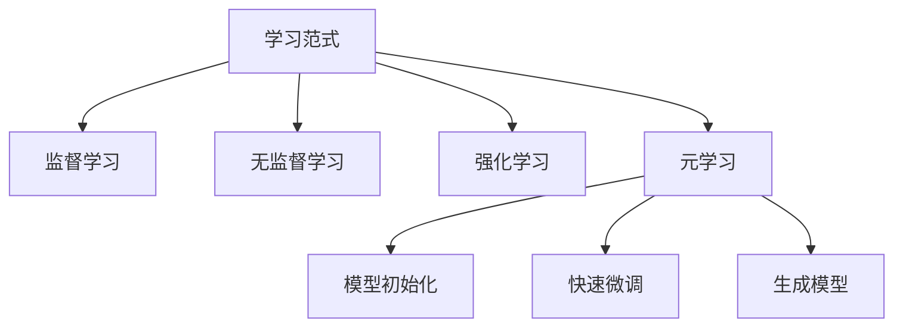

以下是根据您提供的要求和约束条件撰写的技术博客文章正文内容：

# 一切皆是映射：用元学习预测未来金融市场

## 1. 背景介绍

### 1.1 问题的由来

金融市场的动态性和复杂性一直是研究人员和从业者所面临的巨大挑战。传统的预测模型往往难以捕捉市场中蕴含的非线性关系和隐藏模式,导致预测精度有限。随着人工智能技术的不断发展,元学习(Meta-Learning)作为一种新兴的学习范式,为解决这一难题提供了全新的思路。

### 1.2 研究现状  

目前,金融领域的人工智能应用主要集中在基于深度学习的预测模型上。然而,这些模型通常需要大量的训练数据和计算资源,且难以泛化到新的任务和环境中。另一方面,元学习旨在学习如何快速适应新任务,通过从少量数据中提取出任务之间的共性知识,实现有效的知识迁移。这使得元学习在小样本学习、快速适应等场景下表现出色。

### 1.3 研究意义

将元学习应用于金融预测领域,可以帮助我们更好地理解市场的内在规律,提高预测的准确性和鲁棒性。具体来说,元学习可以:

1. 快速适应市场的动态变化,减少重新训练的时间和计算成本。
2. 从历史数据中提取出通用的知识表示,泛化到新的预测任务中。
3. 通过少量数据就能学习到有效的预测模型,降低了数据获取的成本。
4. 提高预测模型的解释性,有助于金融决策的制定和风险管控。

### 1.4 本文结构

本文将首先介绍元学习的核心概念和与其他学习范式的联系,然后详细阐述元学习在金融预测中的核心算法原理和数学模型。接下来,我们将通过实际项目实践,展示如何使用元学习进行金融预测,并分析其在不同应用场景中的表现。最后,我们将总结元学习在金融领域的发展趋势和面临的挑战,并推荐相关的工具和资源。

## 2. 核心概念与联系

元学习(Meta-Learning)是一种学习如何学习的范式,旨在从多个相关任务中提取出通用的知识表示,并将其应用于新的任务中,实现快速适应和高效学习。它与其他学习范式的关系如下:



- **监督学习**:从标记数据中学习映射函数,常用于分类和回归任务。
- **无监督学习**:从未标记数据中发现潜在的模式和结构。
- **强化学习**:通过与环境交互,学习如何采取最优行动策略。
- **元学习**:学习如何快速适应新任务,可以通过以下三种方式实现:
  - **模型初始化**:学习一个好的模型初始化,使其能够快速适应新任务。
  - **快速微调**:在新任务上进行少量训练,即可获得良好的性能。
  - **生成模型**:直接生成用于解决新任务的模型参数或优化更新步骤。

元学习与传统的学习范式相比,具有以下优势:

1. **快速适应能力**:能够从少量数据或少量梯度更新步骤中快速学习,适应新的任务。
2. **泛化能力增强**:通过从多个相关任务中提取出通用知识,提高了模型在新任务上的泛化能力。
3. **高效利用数据**:即使在数据稀缺的情况下,也能够学习到有效的模型。
4. **可解释性更强**:元学习模型往往能够捕捉到任务之间的相似性和差异性,有助于提高模型的可解释性。

## 3. 核心算法原理 & 具体操作步骤

### 3.1 算法原理概述

在金融预测任务中,我们可以将每个时间窗口视为一个独立的任务,目标是学习一个能够快速适应这些任务的元模型。具体来说,我们将历史数据划分为元训练集(Meta-Train)和元测试集(Meta-Test)两部分。

在元训练阶段,我们从元训练集中采样出一批支持集(Support Set)和查询集(Query Set),其中支持集用于模型的快速适应,查询集用于计算损失并更新元模型的参数。这个过程会重复多次,直到元模型收敛。

在元测试阶段,我们使用经过训练的元模型,在新的时间窗口(即元测试集中的任务)上进行快速适应和预测。由于元模型已经学习到了如何快速适应新任务,因此只需要少量数据就能获得良好的预测性能。

整个过程可以用以下伪代码表示:

```python
# 初始化元模型参数
init_meta_params = ...

for iter in num_iters:
    # 从元训练集中采样一批支持集和查询集
    support_set, query_set = sample_tasks(meta_train_data)
    
    # 在支持集上进行快速适应,获得任务特定的模型参数
    task_params = fast_adapt(init_meta_params, support_set)
    
    # 在查询集上计算损失
    loss = compute_loss(task_params, query_set)
    
    # 更新元模型参数
    init_meta_params = update_meta_params(init_meta_params, loss)

# 在元测试集上进行预测
for task in meta_test_tasks:
    support_set = sample_support_set(task)
    task_params = fast_adapt(init_meta_params, support_set)
    predictions = predict(task_params, task_query)
```

### 3.2 算法步骤详解

1. **初始化元模型参数**

   我们首先需要初始化元模型的参数,这些参数将在后续的训练过程中不断更新。初始化可以使用随机值或预训练模型的参数。

2. **采样支持集和查询集**

   从元训练集中采样出一批支持集和查询集,其中支持集用于模型的快速适应,查询集用于计算损失并更新元模型参数。

3. **快速适应**

   使用支持集对元模型进行快速适应,获得任务特定的模型参数。快速适应的方式有多种,包括梯度下降、MAML等算法,我们将在后面详细介绍。

4. **计算损失**

   使用任务特定的模型参数在查询集上进行预测,并计算预测结果与真实值之间的损失。

5. **更新元模型参数**

   使用计算得到的损失,通过梯度下降等优化算法更新元模型参数。这个过程会重复多次,直到元模型收敛。

6. **预测**

   在元测试阶段,我们使用经过训练的元模型,在新的时间窗口(即元测试集中的任务)上进行快速适应和预测。

需要注意的是,快速适应的具体算法和更新元模型参数的优化算法是元学习中的关键部分,我们将在后面详细介绍。

### 3.3 算法优缺点

**优点**:

1. **快速适应能力强**:元学习算法能够从少量数据或少量梯度更新步骤中快速学习,适应新的任务,在金融预测中尤为重要。
2. **泛化能力增强**:通过从多个相关任务中提取出通用知识,提高了模型在新任务上的泛化能力,有助于捕捉金融市场的内在规律。
3. **高效利用数据**:即使在数据稀缺的情况下,也能够学习到有效的预测模型,降低了数据获取的成本。
4. **可解释性更强**:元学习模型往往能够捕捉到任务之间的相似性和差异性,有助于提高模型的可解释性,从而支持金融决策的制定和风险管控。

**缺点**:

1. **计算开销较大**:元学习算法需要在多个任务上进行训练,计算开销较大,需要强大的硬件支持。
2. **超参数调优复杂**:元学习算法涉及多个超参数,如学习率、内循环步数等,调优过程复杂。
3. **任务相关性影响大**:元学习的性能在很大程度上依赖于任务之间的相关性,如果任务之间的相关性较低,性能可能会受到影响。
4. **理论基础薄弱**:元学习作为一种新兴的学习范式,其理论基础仍然相对薄弱,需要进一步的研究和探索。

### 3.4 算法应用领域

除了金融预测领域,元学习还可以应用于以下领域:

1. **小样本学习**:在医疗影像分析、药物发现等领域,往往只有少量标记数据,元学习可以有效解决这一问题。
2. **自然语言处理**:通过从多个语言任务中提取通用知识,提高了在新语言上的性能。
3. **计算机视觉**:可以快速适应新的视觉任务,如目标检测、语义分割等。
4. **强化学习**:提高了策略在新环境下的适应能力,加快了训练过程。
5. **机器人控制**:帮助机器人快速适应新的控制任务和环境。

## 4. 数学模型和公式 & 详细讲解 & 举例说明

在金融预测任务中,我们可以将元学习建模为一个两层优化问题。外层优化是在元训练集上学习一个好的初始化参数,内层优化则是在每个任务的支持集上进行快速适应。

### 4.1 数学模型构建

假设我们有一个预测模型 $f_\theta$,其中 $\theta$ 为模型参数。对于每个任务 $\mathcal{T}_i$,我们将其划分为支持集 $\mathcal{D}_i^{tr}$ 和查询集 $\mathcal{D}_i^{val}$。我们的目标是找到一个好的初始化参数 $\theta_0$,使得在每个任务的支持集上进行少量梯度更新后,模型在对应的查询集上的性能最优。

这可以形式化为以下两层优化问题:

$$
\begin{aligned}
\min_{\theta_0} \sum_{i=1}^{N} \mathcal{L}_i(\theta_i^*) \\
\text{s.t.} \quad \theta_i^* = \theta_0 - \alpha \nabla_\theta \mathcal{L}_i^{tr}(\theta_0)
\end{aligned}
$$

其中:

- $N$ 是元训练集中任务的总数
- $\mathcal{L}_i^{tr}(\theta)$ 是任务 $i$ 在支持集上的损失函数
- $\mathcal{L}_i(\theta_i^*)$ 是任务 $i$ 在查询集上的损失函数
- $\alpha$ 是内层优化的学习率

上式的意义是,我们希望找到一个初始化参数 $\theta_0$,使得在每个任务的支持集上进行一步梯度更新后,模型在对应的查询集上的总体损失最小。

### 4.2 公式推导过程

为了解决上述两层优化问题,我们可以使用基于模型的元学习算法(Model-Agnostic Meta-Learning, MAML)。MAML算法的核心思想是,通过在元训练集上最小化查询集的损失,来获得一个好的初始化参数。

具体来说,我们定义元目标函数如下:

$$
\min_{\theta_0} \sum_{i=1}^{N} \mathcal{L}_i(\theta_i^*) = \sum_{i=1}^{N} \mathcal{L}_i(\theta_0 - \alpha \nabla_\theta \mathcal{L}_i^{tr}(\theta_0))
$$

对 $\theta_0$ 进行梯度下降优化,梯度计算如下:

$$
\begin{aligned}
\nabla_{\theta_0} \mathcal{L}_i(\theta_i^*) &= \nabla_{\theta_0} \mathcal{L}_i(\theta_0 - \alpha \nabla_\theta \mathcal{L}_i^{tr}(\theta_0)) \\
&= \nabla_{\theta_i^*} \mathcal{L}_i(\theta_i^*) \left( I - \alpha \nabla_{\theta_0}^2 \mathcal{L}_i^{tr}(\theta_0) \right)
\end{aligne