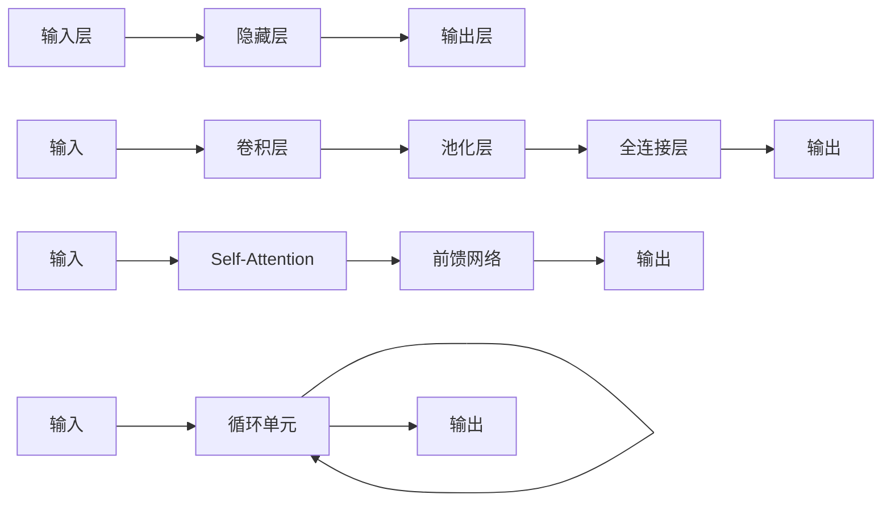

# 一切皆是映射：神经网络的常见架构比较

关键词：神经网络、深度学习、卷积神经网络、循环神经网络、Transformer、注意力机制

## 1. 背景介绍

### 1.1 问题的由来

近年来,人工智能领域取得了突飞猛进的发展,尤其是深度学习技术的兴起,使得人工智能在计算机视觉、自然语言处理、语音识别等诸多领域取得了令人瞩目的成就。而支撑深度学习技术发展的核心,正是各种神经网络架构的不断创新与突破。从早期的前馈神经网络,到如今广泛应用的卷积神经网络(CNN)、循环神经网络(RNN)以及Transformer等先进模型,神经网络架构的演进历程见证了人工智能的飞速进步。

### 1.2 研究现状

目前,神经网络已经成为深度学习领域的研究热点和主流技术路线。各大科技公司和学术机构纷纷投入大量资源,致力于探索更加高效、强大的神经网络架构。一方面,传统的CNN、RNN等模型在图像、语音、文本等领域不断取得新的突破；另一方面,以Transformer为代表的注意力机制模型异军突起,在自然语言处理等序列建模任务上展现出惊人的性能,引领了新一轮的研究热潮。

### 1.3 研究意义 

深入研究和比较不同神经网络架构的特点、优劣和适用场景,对于推动人工智能技术的进一步发展具有重要意义。通过系统梳理各类神经网络模型的原理和演进脉络,有助于研究者全面把握该领域的发展动态,洞察未来的研究方向。同时,对主流神经网络架构进行横向比较,分析其内在联系和差异,可以帮助工程实践者根据具体应用场景,选择最优的模型架构,从而提升人工智能系统的性能表现。

### 1.4 本文结构

本文将从以下几个方面对神经网络的常见架构进行系统比较和分析：

- 第2部分介绍神经网络的核心概念,并阐述不同架构之间的内在联系；
- 第3部分重点剖析几类主流神经网络架构的工作原理和算法步骤；
- 第4部分从数学角度对各类模型的关键公式和性质进行推导讲解； 
- 第5部分通过代码实例演示如何使用主流的深度学习框架实现不同神经网络架构；
- 第6部分总结各类架构在实际应用场景中的优势和局限；
- 第7部分推荐相关的学习资源、开发工具和研究文献；
- 第8部分对神经网络的未来发展趋势和面临的挑战进行展望。

## 2. 核心概念与联系

人工神经网络(Artificial Neural Network, ANN)是一种模仿生物神经系统结构和功能的数学模型,由大量的人工神经元相互连接而成。其基本思想是通过调整神经元之间的连接权重,使网络能够学习到输入与输出之间的复杂映射关系。

从本质上看,神经网络可以视为一个高度非线性的函数映射:

$$f: X \rightarrow Y$$

其中,$X$表示输入空间,$Y$表示输出空间。网络通过学习大量的输入输出样本对,逐步优化模型参数,以拟合目标映射$f$。

尽管不同神经网络架构在结构和连接方式上存在差异,但它们都遵循了相同的基本原理:

- 信息在神经元之间以激活值的形式传递,神经元通过加权求和及非线性变换产生输出；
- 通过反向传播算法计算损失函数对参数的梯度,并使用优化算法更新参数以最小化损失；
- 通过堆叠多层神经元构建深度网络,逐层提取输入数据的高层特征表示。

下图展示了几种常见神经网络架构的结构示意:

可以看出,前馈网络、CNN、RNN、Transformer虽然在网络拓扑和连接方式上各有特点,但都由输入层、隐藏层(特征提取层)、输出层等基本组件构成,体现出了共通的分层结构。

## 3. 核心算法原理 & 具体操作步骤

### 3.1 算法原理概述

本节将对几类主流神经网络架构的核心算法原理进行概述。

#### 前馈神经网络(Feedforward Neural Network)

前馈神经网络是最基础的神经网络架构,也称为多层感知机(Multi-Layer Perceptron, MLP)。其特点是神经元之间分层连接,信息自前向后单向传播,没有循环连接。

前馈网络通过逐层堆叠非线性变换,实现了输入空间到输出空间的复杂映射:

$$f(x) = f^{(L)}(...f^{(2)}(f^{(1)}(x))...)$$

其中,$f^{(l)}$表示第$l$层的映射函数,通常由仿射变换和非线性激活函数组成:

$$f^{(l)}(x) = \sigma(W^{(l)}x + b^{(l)})$$

$W^{(l)}$和$b^{(l)}$分别为第$l$层的权重矩阵和偏置向量,$\sigma$为激活函数。

#### 卷积神经网络(Convolutional Neural Network, CNN)

卷积神经网络引入了卷积和池化等新的运算类型,特别适用于处理网格化数据如图像。CNN的核心思想是通过卷积操作提取局部特征,再经过池化操作实现特征下采样和平移不变性。

典型的CNN由若干卷积层和池化层交替堆叠而成,再接若干全连接层:

$$f(x) = f^{(FC)}(...f^{(P)}(f^{(C)}(x))...)$$

其中,卷积层$f^{(C)}$对输入特征图做卷积操作:

$$f^{(C)}(x) = \sigma(W^{(C)} * x + b^{(C)})$$

$W^{(C)}$为卷积核参数,$*$表示卷积操作。池化层$f^{(P)}$对输入特征图做下采样:

$$f^{(P)}(x) = pool(x)$$

常见的池化操作包括最大池化和平均池化。

#### 循环神经网络(Recurrent Neural Network, RNN)

循环神经网络引入了循环连接,使得网络能够处理序列数据并捕捉时序依赖。RNN在每个时间步接收一个输入,并结合之前的隐藏状态计算当前隐藏状态和输出:

$$h_t = f(h_{t-1}, x_t) = \sigma(W_h h_{t-1} + W_x x_t + b)$$
$$y_t = g(h_t) = \sigma(W_y h_t + c)$$

其中,$h_t$为$t$时刻的隐藏状态,$x_t$为$t$时刻的输入,$y_t$为$t$时刻的输出。$W_h, W_x, W_y$分别为循环连接、输入连接、输出连接的权重矩阵。

为了缓解梯度消失问题,人们提出了长短期记忆网络(LSTM)和门控循环单元(GRU)等改进架构。

#### Transformer

Transformer是一种基于自注意力机制(Self-Attention)的神经网络架构,摒弃了传统的卷积和循环连接,转而使用注意力机制来捕捉序列内部的长距离依赖。

Transformer的核心是自注意力层和前馈网络层的交替堆叠:

$$f(x) = f^{(FF)}(f^{(SA)}(x))$$

其中,自注意力层$f^{(SA)}$通过注意力机制聚合序列的上下文信息:

$$f^{(SA)}(x) = softmax(\frac{QK^T}{\sqrt{d_k}})V$$

$Q,K,V$分别为查询矩阵、键矩阵和值矩阵,由输入$x$线性变换得到。前馈网络层$f^{(FF)}$包含两层全连接网络和非线性激活:

$$f^{(FF)}(x) = W_2\sigma(W_1x + b_1) + b_2$$

### 3.2 算法步骤详解

以下以CNN为例,详细说明其训练和推理过程的具体步骤。

#### 训练阶段

输入:训练样本集$D = \{(x_i, y_i)\}_{i=1}^N$,学习率$\eta$

1. 随机初始化CNN的所有参数$\theta$
2. repeat:
3.  从$D$中采样一个小批量$B = \{(x_i, y_i)\}_{i=1}^m$
4.  对每个样本$x_i$,前向传播计算预测输出$\hat{y}_i$:
    - 对输入$x_i$做卷积、激活、池化等操作,得到特征图
    - 将特征图展平并输入全连接层,得到输出$\hat{y}_i$
5.  计算小批量的损失函数$J(\theta) = \frac{1}{m}\sum_{i=1}^mL(\hat{y}_i, y_i)$
6.  通过反向传播计算损失函数对各参数的梯度$\nabla_{\theta}J(\theta)$
7.  用梯度下降更新参数:$\theta \leftarrow \theta - \eta\nabla_{\theta}J(\theta)$
8. until 达到停止条件

输出:训练好的CNN模型参数$\theta^*$

#### 推理阶段

输入:测试样本$x$,训练好的参数$\theta^*$

1. 使用$\theta^*$初始化CNN模型
2. 对输入$x$前向传播:
   - 对$x$做卷积、激活、池化等操作,得到特征图 
   - 将特征图展平并输入全连接层,得到预测输出$\hat{y}$

输出:预测结果$\hat{y}$

### 3.3 算法优缺点

下表总结了几类神经网络架构的优缺点比较:

| 架构 | 优点 | 缺点 |
|:---:|:---:|:---:|
| 前馈网络 | 结构简单,易于实现和训练 | 不能捕捉数据的时空依赖 |
| CNN | 善于提取局部特征,平移不变性 | 需要大量标注数据,参数量大 |  
| RNN | 能够处理序列数据,捕捉长距离依赖 | 训练不稳定,梯度消失问题 |
| Transformer | 计算并行度高,长距离建模能力强 | 模型参数量巨大,过拟合风险 |

### 3.4 算法应用领域

| 架构 | 主要应用领域 |
|:---:|:----------:|
| 前馈网络 | 分类、回归等监督学习任务 |
| CNN | 图像分类、目标检测、语义分割等 |
| RNN | 语音识别、机器翻译、文本生成等 |  
| Transformer | 自然语言处理、语音合成、时间序列预测等 |

## 4. 数学模型和公式 & 详细讲解 & 举例说明

本节以CNN为例,详细推导其数学模型,并举例说明关键公式的作用机制。

### 4.1 数学模型构建

考虑一个$L$层的CNN,每层由卷积、激活、池化三个操作组成。定义第$l$层的输入为$a^{(l-1)}$,输出为$a^{(l)}$,卷积核参数为$W^{(l)}$,偏置为$b^{(l)}$,激活函数为$\sigma$,池化函数为$pool$。

则CNN的数学模型可表示为:

$$a^{(0)} = x$$
$$z^{(l)} = W^{(l)} * a^{(l-1)} + b^{(l)}, \quad l=1,2,...,L$$
$$a^{(l)} = pool(\sigma(z^{(l)})), \quad l=1,2,...,L$$
$$\hat{y} = a^{(L)}$$

其中,$x$为CNN的输入,$\hat{y}$为输出。$*$表示卷积操作。

### 4.2 公式推导过程

以下推导CNN模型训练时的参数更新公