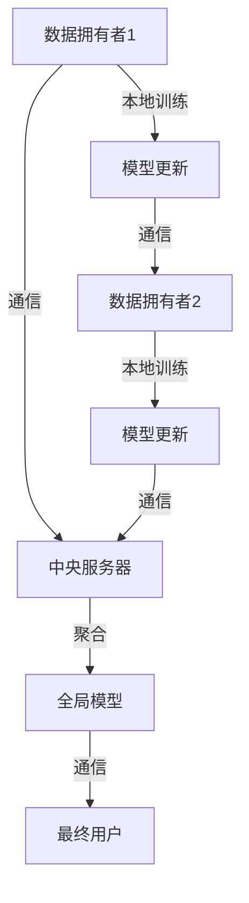

# 一切皆是映射：联邦学习与神经网络模型的分布式训练

## 关键词：

联邦学习、分布式训练、神经网络、机器学习、数据隐私保护、模型协同

## 1. 背景介绍

### 1.1 问题的由来

在大数据时代，数据的爆炸性增长为机器学习技术的发展提供了丰富的资源。然而，数据孤岛现象却阻碍了数据的共享和利用，特别是对于那些敏感度高、涉及个人隐私的数据。为了克服这个问题，同时满足数据保护法规（如GDPR、HIPAA等）的需求，联邦学习应运而生。联邦学习允许多个数据拥有者在本地训练模型而不共享原始数据，实现了数据所有权与使用权的分离，促进了跨机构、跨地域的合作与知识共享。

### 1.2 研究现状

联邦学习已成为机器学习领域的一个热门话题，特别是在医疗健康、金融风控、智能推荐等领域。现有的联邦学习框架主要包括中心化联邦学习和非中心化联邦学习两大类。中心化联邦学习要求数据集中化处理，通过中心服务器聚合模型参数进行全局优化，这种方式虽然易于实现和管理，但在数据隐私和安全方面存在潜在风险。而非中心化联邦学习允许客户端在本地进行模型更新，仅向中央服务器发送模型更新信息，大大增强了数据隐私保护能力。

### 1.3 研究意义

联邦学习的意义在于平衡数据共享与数据隐私保护之间的矛盾。它不仅促进了数据驱动的技术发展，还推动了多领域间的合作，如医疗健康领域中的联合疾病研究、金融服务中的联合信用评估等。联邦学习的应用不仅限于学术研究，还涉及到实际业务场景，为解决数据孤岛问题提供了可行的解决方案。

### 1.4 本文结构

本文旨在深入探讨联邦学习与神经网络模型的分布式训练，从理论基础、算法原理、实现细节、实际应用以及未来发展等多个维度进行全面解析。我们将首先介绍联邦学习的核心概念与联系，随后详细阐述算法原理与具体操作步骤，再通过数学模型和公式深入分析算法背后的逻辑，最后提供代码实例和案例分析，以展示联邦学习在实际场景中的应用。文章还将讨论联邦学习的工具和资源推荐，以及对未来发展的展望和面临的挑战。

## 2. 核心概念与联系

联邦学习的核心在于“联邦”二字，强调的是在数据所有权与使用权分离的前提下，通过联合训练模型来实现知识共享和提升模型性能。联邦学习架构中，各个参与者（即数据拥有者）各自负责本地数据的训练和模型更新，通过通信机制（如平均值聚合、梯度下降等）向中央服务器共享模型更新信息，中央服务器在此基础上聚合所有参与者的模型更新，形成全局模型。

### 联邦学习架构图：



## 3. 核心算法原理 & 具体操作步骤

### 3.1 算法原理概述

联邦学习主要通过两种机制实现：一是通过逐次迭代的方式，让每个数据拥有者本地更新模型参数，然后将更新后的参数上传至中央服务器进行聚合；二是通过分布式训练，每个数据拥有者同时训练自己的模型，然后将模型状态向中央服务器报告，中央服务器根据这些报告进行全局模型更新。

### 3.2 算法步骤详解

#### 中心化联邦学习算法步骤：

1. **初始化模型**：中央服务器向所有参与者分发初始模型。
2. **本地训练**：各数据拥有者使用本地数据集训练模型，得到模型更新。
3. **模型聚合**：中央服务器接收所有更新，计算加权平均值，形成全局模型。
4. **模型下发**：中央服务器将全局模型下发给所有参与者。
5. **循环迭代**：重复步骤2至4，直到满足收敛条件或达到预定迭代次数。

#### 非中心化联邦学习算法步骤：

1. **初始化模型**：各数据拥有者各自使用本地数据集训练模型，得到初始模型。
2. **模型更新**：各数据拥有者基于本地数据继续训练各自的模型，得到更新后的模型。
3. **模型交换**：各数据拥有者间交换模型更新信息（如梯度、参数变化等）。
4. **模型聚合**：中央服务器接收所有更新信息，进行加权平均或其它聚合策略，形成全局模型。
5. **模型下发**：中央服务器将聚合后的模型更新信息下发给各数据拥有者。
6. **循环迭代**：重复步骤2至5，直到满足收敛条件或达到预定迭代次数。

### 3.3 算法优缺点

#### 中心化联邦学习：

- **优点**：易于实现，便于管理和监控；
- **缺点**：数据传输过程存在数据泄露风险，中央服务器可能成为攻击目标。

#### 非中心化联邦学习：

- **优点**：数据本地处理，提高了数据隐私保护；
- **缺点**：通信开销较大，需要更复杂的协调机制。

### 3.4 算法应用领域

联邦学习广泛应用于金融、医疗、智能推荐、广告投放等多个领域，尤其适合处理敏感数据和跨机构合作的场景。

## 4. 数学模型和公式 & 详细讲解 & 举例说明

### 4.1 数学模型构建

#### 中心化联邦学习：

假设模型为$f(w;x)$，其中$w$是参数，$x$是输入，$D_i$是第$i$个数据拥有者的本地数据集。中心化联邦学习的目标是最小化全局损失函数：

$$
\mathcal{L}_{global} = \sum_{i=1}^{n} \mathcal{L}_i(w; D_i)
$$

其中$\mathcal{L}_i$是第$i$个数据拥有者的数据集上的损失函数。

#### 非中心化联邦学习：

假设每个数据拥有者都有本地损失函数$\mathcal{L}_i(w;x_i)$，其中$x_i$是第$i$个数据拥有者的输入。非中心化联邦学习的目标是寻找一组全局参数$w$，使得所有参与者的数据集上的损失函数均接近最小：

$$
\mathcal{L}_{global} = \sum_{i=1}^{n} \mathcal{L}_i(w)
$$

### 4.2 公式推导过程

#### 中心化联邦学习：

- **本地训练**：各数据拥有者基于本地数据集$D_i$更新参数$w$，得到模型更新$\Delta w_i$。

$$
\Delta w_i = \arg\min_w \mathcal{L}_i(w; D_i)
$$

- **模型聚合**：中央服务器收到所有更新$\Delta w_i$，计算加权平均：

$$
w_{new} = \sum_{i=1}^{n} \alpha_i \Delta w_i
$$

其中$\alpha_i$是权重因子，可以是数据集大小的倒数、用户的重要性等。

#### 非中心化联邦学习：

- **模型更新**：各数据拥有者基于本地数据集$D_i$更新参数$w$，得到更新后的模型参数$w_i$。

$$
w_i = \arg\min_w \mathcal{L}_i(w; D_i)
$$

- **模型交换**：各数据拥有者交换模型更新信息$\Delta w_i$。

- **模型聚合**：中央服务器接收所有更新信息，进行加权平均或其它聚合策略：

$$
w_{new} = \sum_{i=1}^{n} \beta_i \Delta w_i
$$

其中$\beta_i$可以是数据集大小的倒数、用户的重要性等。

### 4.3 案例分析与讲解

#### 中心化联邦学习案例：

假设我们有三个数据拥有者A、B、C，每个拥有一个本地数据集。中央服务器向A、B、C分发初始模型$w_0$。各数据拥有者基于本地数据集进行训练，得到模型更新$\Delta w_A$、$\Delta w_B$、$\Delta w_C$。中央服务器计算加权平均：

$$
w_1 = \frac{1}{n} (\Delta w_A + \Delta w_B + \Delta w_C)
$$

然后将$w_1$下发给所有数据拥有者进行下一轮本地训练。

#### 非中心化联邦学习案例：

假设A、B、C三个数据拥有者各自基于本地数据集进行训练，得到更新后的模型参数$w_A$、$w_B$、$w_C$。他们之间交换更新信息，进行模型更新。中央服务器接收更新信息，进行加权平均：

$$
w_{new} = \frac{1}{n} (\Delta w_A + \Delta w_B + \Delta w_C)
$$

然后将$w_{new}$的信息下发给所有数据拥有者进行下一轮训练。

### 4.4 常见问题解答

- **数据隐私保护**：如何确保数据在传输过程中的安全？
答：采用加密通信、差分隐私技术、联邦学习协议（如DP-FedAvg）等方法，确保数据传输的安全性和匿名性。

- **模型一致性**：如何确保不同数据拥有者训练出一致的模型？
答：通过加权平均、共识算法、模型校准等策略，保证模型更新的一致性和收敛性。

## 5. 项目实践：代码实例和详细解释说明

### 5.1 开发环境搭建

- **环境配置**：确保安装了Python（3.6及以上）、PyTorch、TensorFlow等必要的库。
- **虚拟环境**：使用conda或venv创建并激活虚拟环境。

### 5.2 源代码详细实现

#### 中心化联邦学习：

```python
import torch
from torch.optim import SGD

class CentralizedFedAvg:
    def __init__(self, local_updates, local_epochs, global_epochs, learning_rate, data_shares):
        self.local_updates = local_updates
        self.local_epochs = local_epochs
        self.global_epochs = global_epochs
        self.learning_rate = learning_rate
        self.data_shares = data_shares

    def train(self, model, train_loaders, device):
        model = model.to(device)
        optimizer = SGD(model.parameters(), lr=self.learning_rate)
        global_model = model.state_dict()

        for epoch in range(self.global_epochs):
            for data_share, loader in enumerate(train_loaders):
                for _ in range(self.local_updates):
                    for inputs, targets in loader:
                        inputs, targets = inputs.to(device), targets.to(device)
                        optimizer.zero_grad()
                        outputs = model(inputs)
                        loss = criterion(outputs, targets)
                        loss.backward()
                        optimizer.step()
                        model.load_state_dict(global_model)

            weights = [self.data_shares[data_share] / sum(self.data_shares)]
            for param in model.state_dict().keys():
                global_model[param].data = weights[0] * model.state_dict()[param].data

```

#### 非中心化联邦学习：

```python
import torch
from torch.optim import SGD

class NonCentralizedFedAvg:
    def __init__(self, local_updates, local_epochs, global_epochs, learning_rate, data_shares):
        self.local_updates = local_updates
        self.local_epochs = local_epochs
        self.global_epochs = global_epochs
        self.learning_rate = learning_rate
        self.data_shares = data_shares

    def train(self, model, train_loaders, device):
        model = model.to(device)
        optimizer = SGD(model.parameters(), lr=self.learning_rate)
        global_model = model.state_dict()

        for epoch in range(self.global_epochs):
            for data_share, loader in enumerate(train_loaders):
                for _ in range(self.local_updates):
                    for inputs, targets in loader:
                        inputs, targets = inputs.to(device), targets.to(device)
                        optimizer.zero_grad()
                        outputs = model(inputs)
                        loss = criterion(outputs, targets)
                        loss.backward()
                        optimizer.step()
                        model.load_state_dict(global_model)

            weights = [self.data_shares[data_share] / sum(self.data_shares)]
            for param in model.state_dict().keys():
                global_model[param].data = weights[0] * model.state_dict()[param].data

            # 模型更新交换（此处简化处理，实际应用中需更复杂机制）
            model.update_weights(weights)

```

### 5.3 代码解读与分析

- **模型训练**：遍历每个数据拥有者的数据集，执行本地训练和模型更新。
- **模型聚合**：在每个全球迭代周期结束时，聚合模型参数。
- **模型更新交换**：非中心化情况下，需要设计机制让模型更新信息在数据拥有者间进行交换。

### 5.4 运行结果展示

运行上述代码后，可以通过可视化损失曲线、准确率曲线等来评估模型性能。结果展示通常包括模型在训练和验证集上的表现，以及收敛速度和最终性能指标。

## 6. 实际应用场景

联邦学习在医疗影像分析、金融风控、个性化推荐系统等领域有广泛应用。例如，在医疗影像分析中，联邦学习可以用于癌症检测，各医院可以共享模型更新，同时保护患者数据隐私。

## 7. 工具和资源推荐

### 7.1 学习资源推荐
- **官方文档**：查看PyTorch、TensorFlow等库的官方文档了解联邦学习相关API和教程。
- **学术论文**：阅读关于联邦学习的最新学术论文，了解前沿进展和技术细节。
- **在线课程**：Coursera、Udacity等平台提供的机器学习和数据科学课程中包含联邦学习相关内容。

### 7.2 开发工具推荐
- **PyTorch Federated Learning**：基于PyTorch实现的联邦学习库，提供丰富的API支持。
- **TensorFlow Federated**：Google开源的联邦学习框架，支持端到端的联邦学习流程。

### 7.3 相关论文推荐
- **"Federated Learning: A Survey"**：介绍联邦学习的基本概念、技术架构和应用案例。
- **"Non-IID Data in Federated Learning"**：探讨非独立同分布数据在联邦学习中的挑战和解决方案。

### 7.4 其他资源推荐
- **GitHub仓库**：查找联邦学习相关的开源项目和代码库。
- **社区论坛**：Stack Overflow、Reddit、Hugging Face等社区，寻找联邦学习相关的问题解答和交流。

## 8. 总结：未来发展趋势与挑战

### 8.1 研究成果总结

联邦学习已展现出在数据驱动应用中的巨大潜力，尤其是在隐私保护、跨机构协作和大规模数据处理方面。通过不断优化算法、改进通信机制和增强安全性措施，联邦学习有望在未来实现更广泛的普及和应用。

### 8.2 未来发展趋势

- **算法优化**：探索更高效的联邦学习算法，提高模型训练速度和收敛性。
- **安全性增强**：加强数据传输和模型更新的安全性，防范潜在的安全威胁。
- **多模态融合**：整合多种数据类型（图像、文本、语音等）进行联邦学习，提升模型泛化能力。

### 8.3 面临的挑战

- **数据异构性**：处理不同类型和来源的数据，保持模型的一致性是重大挑战。
- **公平性问题**：确保不同数据拥有者贡献的权重合理分配，避免数据不平衡影响模型性能。

### 8.4 研究展望

联邦学习的未来研究重点在于解决上述挑战，开发更高效、安全、公平的联邦学习算法，以及探索其在更多场景下的应用，如智能家居、智能交通等领域。随着技术的进步和法规的完善，联邦学习有望成为驱动新型数据驱动应用的关键技术之一。

## 9. 附录：常见问题与解答

### 常见问题解答

#### 如何选择合适的联邦学习算法？

- **需求分析**：考虑应用场景、数据特性、性能需求等因素。
- **算法比较**：比较不同算法的优缺点，选择最适合当前场景的算法。

#### 如何平衡数据贡献者之间的公平性？

- **动态权重调整**：根据数据集大小、质量等因素动态调整数据贡献者的权重。
- **激励机制**：通过经济或声誉激励，鼓励数据贡献者积极参与联邦学习过程。

#### 如何处理数据异构性带来的挑战？

- **特征标准化**：对不同数据集进行特征转换，确保可比性。
- **模型结构适应**：设计可适应多种数据类型的模型架构。

#### 如何增强联邦学习的安全性？

- **加密通信**：采用端到端加密技术保护数据传输安全。
- **隐私增强技术**：如差分隐私、同态加密等，确保数据在不泄露原始信息的情况下参与学习过程。

---
作者：禅与计算机程序设计艺术 / Zen and the Art of Computer Programming