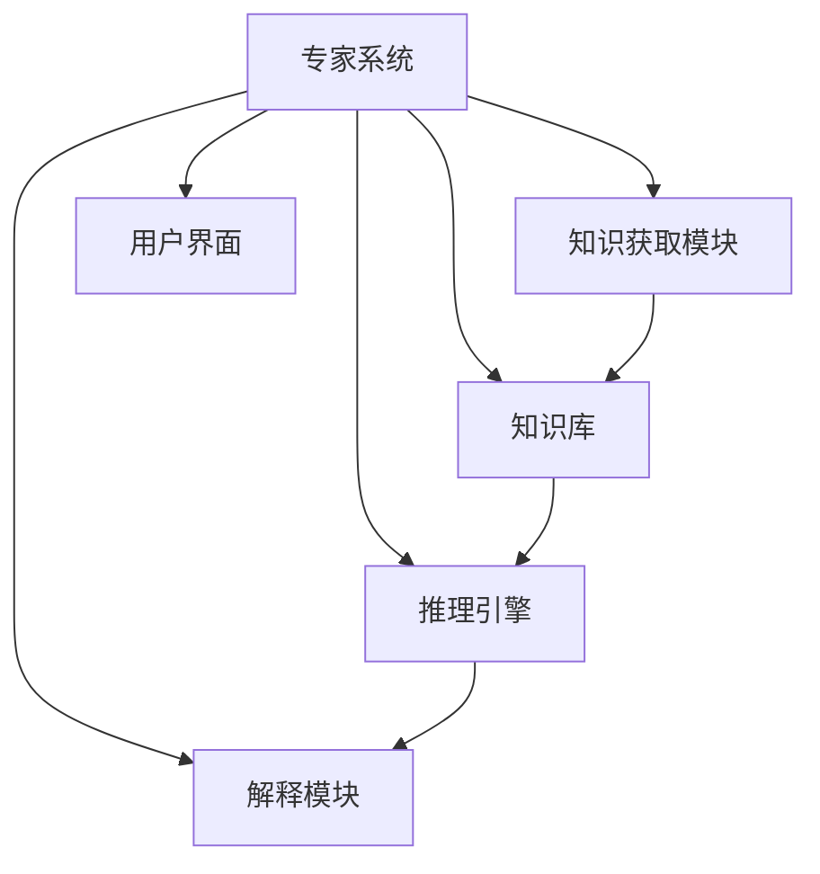
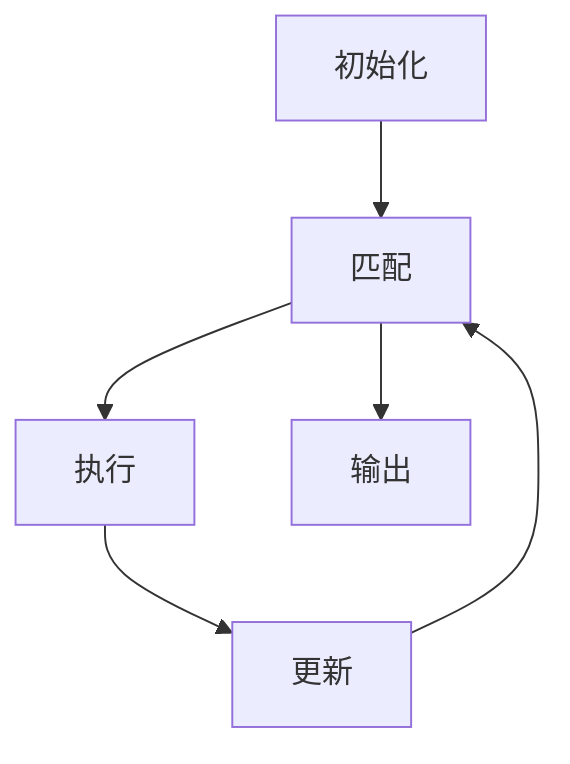
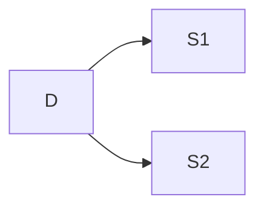

# 专家系统 (Expert System)

## 1. 背景介绍

### 1.1 问题的由来

在现代社会中,各行各业都面临着日益复杂的问题和挑战。传统的人工智能系统虽然在特定领域表现出色,但往往缺乏灵活性和适应性,难以应对多变的现实情况。因此,专家系统(Expert System)作为一种知识密集型系统应运而生,旨在模拟人类专家的推理过程,为用户提供高质量的决策支持和问题解决方案。

专家系统的出现可以追溯到20世纪60年代,当时人工智能研究人员试图开发能够像人类专家一样思考和推理的系统。最初的专家系统主要应用于医疗诊断、金融分析、工程设计等领域,随着技术的不断发展,它们的应用范围逐渐扩大到各个行业。

### 1.2 研究现状

近年来,专家系统的研究和应用得到了长足的发展。一方面,知识表示和推理机制不断完善,使得专家系统能够更好地捕捉和处理复杂的知识。另一方面,机器学习、深度学习等技术的融合,赋予了专家系统更强大的学习和自适应能力。

当前,专家系统在医疗诊断、金融投资、工程设计、法律判决、教育辅导等领域发挥着重要作用。例如,在医疗领域,专家系统可以根据患者的症状和病史,提供疾病诊断和治疗建议;在金融领域,专家系统可以分析市场数据,为投资者提供投资策略和风险评估。

### 1.3 研究意义

专家系统的研究和应用具有重要的理论和实践意义:

1. **知识传承**:专家系统能够捕捉和保存人类专家的知识和经验,避免知识流失,实现知识的有效传承。
2. **决策支持**:专家系统可以为决策者提供准确、一致的建议,提高决策质量和效率。
3. **成本节约**:专家系统可以替代人工咨询,降低人力成本,提高工作效率。
4. **风险降低**:在一些高风险领域,专家系统可以减少人为失误,提高安全性。
5. **知识共享**:专家系统可以实现知识的广泛共享和传播,促进不同领域的协作和创新。

### 1.4 本文结构

本文将全面介绍专家系统的核心概念、算法原理、数学模型、实际应用等内容。首先阐述专家系统的基本概念和组成部分,然后深入探讨其核心算法和数学模型,并通过实例和案例进行详细说明。接下来,介绍专家系统在不同领域的实际应用场景,以及相关的工具和资源。最后,总结专家系统的发展趋势和面临的挑战,并对未来的研究方向进行展望。

## 2. 核心概念与联系

专家系统是一种基于知识的智能系统,它试图模拟人类专家的推理过程,为用户提供高质量的决策支持和问题解决方案。专家系统通常由以下几个核心组成部分构成:

1. **知识库(Knowledge Base)**:存储专家领域知识的核心数据库,包括事实(Facts)和规则(Rules)。
2. **推理引擎(Inference Engine)**:根据知识库中的规则进行推理,得出结论或建议。
3. **知识获取模块(Knowledge Acquisition Module)**:从人类专家或其他来源获取知识,并将其转化为可被系统理解的形式。
4. **解释模块(Explanation Module)**:向用户解释系统的推理过程和结论,增加透明度和可解释性。
5. **用户界面(User Interface)**:提供友好的人机交互界面,方便用户输入查询和获取结果。

这些组成部分相互协作,共同实现专家系统的功能。知识库是系统的核心,存储了领域知识;推理引擎根据知识库进行推理,得出结论;知识获取模块负责知识的获取和更新;解释模块向用户解释推理过程;用户界面则提供了人机交互的桥梁。

专家系统的核心在于知识库和推理机制。知识库存储了领域知识,通常采用生产规则(Production Rules)或语义网络(Semantic Networks)等形式进行表示。推理引擎则根据知识库中的规则,使用前向推理(Forward Chaining)或反向推理(Backward Chaining)等算法进行推理,得出结论或建议。

## 3. 核心算法原理 & 具体操作步骤

### 3.1 算法原理概述

专家系统的核心算法主要包括推理算法和知识表示算法。推理算法用于根据知识库中的规则进行推理,得出结论或建议;知识表示算法则用于将专家知识转化为可被系统理解和处理的形式,存储在知识库中。

常见的推理算法包括:

1. **前向推理(Forward Chaining)**:从已知事实出发,根据规则推导出新的事实,直到达到目标或无法继续推理为止。
2. **反向推理(Backward Chaining)**:从目标出发,寻找支持该目标的规则和事实,逐步向后推导,直到找到已知事实或无法继续推理为止。
3. **模式匹配(Pattern Matching)**:将当前情况与知识库中的规则进行匹配,找到适用的规则进行推理。
4. **基于案例的推理(Case-Based Reasoning)**:根据当前情况与过去的案例进行比较,找到最相似的案例,并基于该案例进行推理和决策。

常见的知识表示算法包括:

1. **生产规则(Production Rules)**:采用 "IF...THEN..." 的形式表示知识,易于理解和处理。
2. **语义网络(Semantic Networks)**:使用节点和边表示概念及其关系,具有较强的表达能力。
3. **框架(Frames)**:用于表示对象及其属性和继承关系,适用于面向对象的知识表示。
4. **逻辑程序(Logic Programs)**:基于一阶逻辑或其他逻辑系统,用于表示和推理复杂知识。

### 3.2 算法步骤详解

以前向推理算法为例,其具体步骤如下:

1. **初始化**:将已知事实加载到工作内存(Working Memory)中。
2. **匹配**:将工作内存中的事实与知识库中的规则进行匹配,找到可应用的规则。
3. **执行**:对匹配成功的规则执行其动作部分,产生新的事实或结论。
4. **更新**:将新产生的事实或结论添加到工作内存中。
5. **重复**:重复步骤2-4,直到达到目标或无法继续推理为止。
6. **输出**:将最终得到的结论或建议输出给用户。

在实际应用中,前向推理算法通常采用匹配-执行-更新的循环方式进行推理,直到达到目标或无法继续推理为止。该算法适用于从已知事实出发,推导出新的结论或建议的情况。

### 3.3 算法优缺点

前向推理算法的优点包括:

1. **直观性强**:算法思路清晰,易于理解和实现。
2. **高效性**:在已知事实较多的情况下,推理效率较高。
3. **适用范围广**:适用于各种类型的推理问题,如监控、控制、规划等。

缺点包括:

1. **盲目性**:在目标不明确的情况下,可能会产生大量无关的中间结论,降低效率。
2. **组合爆炸**:当规则和事实数量较大时,可能会出现组合爆炸的问题,导致计算量急剧增加。
3. **不确定性处理能力差**:传统的前向推理算法难以很好地处理不确定性和模糊性知识。

### 3.4 算法应用领域

前向推理算法及其变体广泛应用于以下领域:

1. **监控和控制系统**:实时监控系统状态,根据规则进行控制决策。
2. **故障诊断系统**:根据已知症状推导出可能的故障原因。
3. **规划和调度系统**:根据已知条件和约束进行资源规划和任务调度。
4. **数据挖掘和模式发现**:从大量数据中发现隐藏的规律和模式。
5. **智能家居和物联网**:根据环境信息和用户偏好进行自动化控制和决策。

## 4. 数学模型和公式 & 详细讲解 & 举例说明

### 4.1 数学模型构建

在专家系统中,数学模型通常用于表示和处理不确定性知识。常见的数学模型包括贝叶斯网络(Bayesian Networks)、模糊逻辑(Fuzzy Logic)和粗糙集合理论(Rough Set Theory)等。

以贝叶斯网络为例,它是一种基于概率论的图形模型,用于表示随机变量之间的因果关系和条件独立性。贝叶斯网络由两部分组成:

1. **有向无环图(Directed Acyclic Graph, DAG)** $G = (V, E)$,其中 $V$ 表示随机变量的节点集合, $E$ 表示变量之间的有向边集合,边表示因果关系。
2. **条件概率分布(Conditional Probability Distributions, CPDs)** $P(X_i|Parents(X_i))$,表示每个节点 $X_i$ 在给定其父节点 $Parents(X_i)$ 取值的条件下的条件概率分布。

贝叶斯网络允许通过概率推理计算任意查询变量的边缘概率分布或条件概率分布,从而支持诊断、预测、决策等任务。

### 4.2 公式推导过程

贝叶斯网络的核心是通过链式法则计算联合概率分布:

$$
P(X_1, X_2, \dots, X_n) = \prod_{i=1}^n P(X_i|Parents(X_i))
$$

其中, $X_1, X_2, \dots, X_n$ 表示网络中的所有随机变量。

在进行概率推理时,我们需要计算查询变量 $Q$ 的条件概率分布 $P(Q|E)$,其中 $E$ 表示已知的证据变量。根据贝叶斯定理,我们有:

$$
P(Q|E) = \frac{P(Q, E)}{P(E)} = \alpha P(Q, E)
$$

其中, $\alpha = \frac{1}{P(E)}$ 是一个归一化常数。

利用变量独立性和链式法则,我们可以将联合概率 $P(Q, E)$ 分解为:

$$
P(Q, E) = \sum_{\vec{Y}} P(Q, E, \vec{Y}) = \sum_{\vec{Y}} P(Q|\vec{Y}, E)P(\vec{Y}|E)P(E)
$$

其中, $\vec{Y}$ 表示网络中除了 $Q$ 和 $E$ 之外的其他隐藏变量。

通过上述公式,我们可以计算出查询变量 $Q$ 的条件概率分布 $P(Q|E)$,从而支持各种推理任务。

### 4.3 案例分析与讲解

考虑一个简单的医疗诊断问题,我们需要根据患者的症状推断可能的疾病。假设有三个随机变量:

- $D$: 疾病,取值为 $d_1$ (患病)或 $d_2$ (健康)
- $S_1$: 症状1,取值为 $s_1$ (存在)或 $\neg s_1$ (不存在)
- $S_2$: 症状2,取值为 $s_2$ (存在)或 $\neg s_2$ (不存在)

我们可以构建如下的贝叶斯网络:

假设已知条件概率分布如下:

$$
\begin{aligned}
P(D=d_1) &= 0.2 \\
P(S_1=s_1|D=d_1) &= 0.7 \\
P(S_1=s_1|D=d_2) &= 0.1 \\
P(S_2=