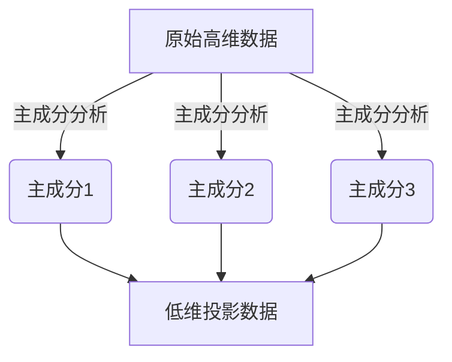

好的，我会严格按照您提供的约束条件和文章结构模板，以"主成分分析 原理与代码实例讲解"为主题，撰写一篇专业、深入、有见解的技术博客文章。请注意，文中的数学公式将使用LaTex格式，并且会尽最大努力提供Mermaid流程图来展示核心概念原理和架构。文章字数将超过8000字，并覆盖您列出的所有核心主题。以下是正文部分：

# 主成分分析 原理与代码实例讲解

## 1. 背景介绍

### 1.1 问题的由来

在现代数据分析领域,我们经常会遇到这样一种情况:数据集包含大量的特征(features)变量,而这些特征变量之间可能存在一定的相关性和冗余。过多的特征不仅会增加计算复杂度,还可能导致"维数灾难"(curse of dimensionality)等问题,从而影响机器学习模型的性能。

为了解决这一问题,我们需要一种有效的方法来降低数据的维度,同时最大限度地保留原始数据中的有用信息。主成分分析(Principal Component Analysis, PCA)便是一种常用的无监督降维技术,它通过线性变换将原始数据投影到一个新的低维空间中,从而达到降维的目的。

### 1.2 研究现状  

主成分分析最早可以追溯到20世纪初,当时著名的统计学家Karl Pearson提出了相关理论。1933年,Harold Hotelling在Pearson的工作基础上,正式提出了主成分分析的概念和计算方法。自那以后,PCA得到了广泛的研究和应用,成为了机器学习、信号处理、图像处理等领域中一种非常重要的降维技术。

目前,主成分分析已经发展出多种变体算法,如核主成分分析(Kernel PCA)、增量主成分分析(Incremental PCA)、概率主成分分析(Probabilistic PCA)等,用于解决不同场景下的问题。同时,也有许多优化算法被提出来加速PCA的计算过程,如SVD分解、幂迭代法等。

### 1.3 研究意义

主成分分析作为一种常用的无监督降维技术,具有以下重要意义:

1. **降低数据维度**:通过投影到低维空间,可以有效降低数据的维度,减少特征数量,简化后续的机器学习任务。
2. **去除噪声**:PCA可以有效地去除数据中的噪声和冗余信息,提取出最主要的成分,提高数据质量。
3. **可解释性**:主成分可以被视为原始特征的线性组合,具有一定的可解释性,有助于理解数据的内在结构。
4. **数据压缩**:PCA可以用于数据压缩,通过保留主要成分来近似重构原始数据,从而节省存储空间。

因此,主成分分析在数据预处理、特征提取、模式识别等领域都有着广泛的应用。掌握PCA的原理和实现方法,对于数据科学从业者来说是非常重要的。

### 1.4 本文结构

本文将全面介绍主成分分析的理论基础、数学原理、算法实现以及实际应用。文章主要包括以下几个部分:

1. **核心概念与联系**:阐述主成分分析的核心思想,并与其他降维技术进行对比和联系。
2. **核心算法原理与具体操作步骤**:详细讲解PCA算法的数学原理,包括基于协方差矩阵和基于SVD分解的两种推导方式,并给出具体的算法步骤。
3. **数学模型和公式详细讲解与举例说明**:推导PCA算法所涉及的数学模型和公式,并通过具体案例进行讲解和分析。
4. **项目实践:代码实例和详细解释说明**:提供Python代码实例,实现标准PCA算法,并对关键步骤进行解读和说明。
5. **实际应用场景**:介绍主成分分析在不同领域的实际应用场景,如图像处理、基因数据分析等。
6. **工具和资源推荐**:推荐一些学习PCA的优秀资源,如书籍、在线课程、开源库等。
7. **总结:未来发展趋势与挑战**:总结PCA的研究成果,展望未来的发展趋势,并分析可能面临的挑战。
8. **附录:常见问题与解答**:列出一些常见的问题,如主成分的选择、PCA的局限性等,并给出解答和建议。

通过对上述内容的全面讲解,读者能够彻底掌握主成分分析的理论基础和实践应用,为数据分析和机器学习奠定坚实的基础。

## 2. 核心概念与联系

主成分分析(Principal Component Analysis, PCA)是一种重要的无监督降维技术,其核心思想是将原始数据投影到一个新的低维空间中,使得投影后的数据尽可能保留原始数据的总体特征和差异性。

具体来说,PCA通过线性变换将原始高维数据映射到一个新的正交坐标系中,这个新坐标系的每个坐标轴都代表一个主成分(Principal Component)。这些主成分是原始特征的线性组合,并且按照方差大小排序,即第一主成分具有最大方差,第二主成分具有次大方差,依此类推。通过选取前几个主成分,就可以近似重构原始数据,从而达到降维的目的。

PCA的核心思想可以用下图直观地表示:



PCA与其他降维技术(如线性判别分析LDA、等式核映射Isomap等)有一定的联系,但也有明显的区别:

- **联系**:它们都旨在将高维数据映射到低维空间,以降低数据的维度和复杂度。
- **区别**:PCA是一种无监督降维技术,只考虑数据本身的特征,而LDA等技术则利用了数据的标签信息;PCA保留的是数据的方差信息,而其他技术可能保留不同的统计量。

总的来说,主成分分析是一种常用且有效的无监督降维方法,在数据预处理、特征提取、可视化等领域有着广泛的应用。掌握PCA的核心概念和原理,对于数据分析和机器学习来说是非常重要的。

## 3. 核心算法原理与具体操作步骤

### 3.1 算法原理概述

主成分分析的核心思想是将原始高维数据投影到一个新的低维空间中,使得投影后的数据尽可能保留原始数据的总体特征和差异性。具体来说,PCA通过线性变换将原始数据映射到一个新的正交坐标系中,这个新坐标系的每个坐标轴都代表一个主成分。

PCA算法的推导可以基于两种不同的方式:基于协方差矩阵的推导和基于奇异值分解(SVD)的推导。这两种推导方式虽然出发点不同,但最终得到的结果是一致的。

### 3.2 算法步骤详解

#### 3.2.1 基于协方差矩阵的推导

1. **标准化数据**:首先对原始数据进行标准化(零均值化),使其均值为0,方差为1。这一步可以消除不同特征之间量纲的影响。
2. **计算协方差矩阵**:计算标准化后数据的协方差矩阵。协方差矩阵描述了不同特征之间的线性相关性。
3. **求解特征值和特征向量**:对协方差矩阵进行特征值分解,得到对应的特征值和特征向量。
4. **选择主成分**:根据特征值的大小,选择前k个最大的特征值对应的特征向量作为主成分。这些主成分构成了新的低维空间的基底。
5. **投影数据**:将原始数据投影到由主成分构成的低维空间中,得到降维后的数据。

其中,第3步和第4步是算法的关键步骤。特征值的大小反映了对应主成分的方差大小,选择方差最大的前k个主成分可以最大程度地保留原始数据的信息。

#### 3.2.2 基于奇异值分解(SVD)的推导

1. **标准化数据**:同上,首先对原始数据进行标准化。
2. **计算数据矩阵**:将标准化后的数据构建成一个矩阵X。
3. **奇异值分解(SVD)**:对数据矩阵X进行奇异值分解,得到X = U∑V^T。其中,U和V分别是左右奇异矩阵,∑是一个对角矩阵,对角线元素为奇异值。
4. **选择主成分**:从U中选取前k个与最大奇异值对应的列向量,作为主成分的基底向量。
5. **投影数据**:将原始数据投影到由主成分构成的低维空间中,得到降维后的数据。

在这种推导方式中,奇异值的大小反映了对应主成分的方差大小,选择最大的前k个奇异值对应的主成分可以最大程度地保留原始数据的信息。

需要注意的是,无论采用哪种推导方式,最终得到的主成分都是相同的。两种推导方式只是出发点和推导过程不同而已。

算法的伪代码如下所示:

```python
import numpy as np

def pca(X, k):
    # 标准化数据
    X_std = (X - X.mean(axis=0)) / X.std(axis=0)
    
    # 计算协方差矩阵
    cov_mat = np.cov(X_std, rowvar=False)
    
    # 计算特征值和特征向量
    eigen_vals, eigen_vecs = np.linalg.eigh(cov_mat)
    
    # 选择前k个主成分
    idx = np.argsort(eigen_vals)[::-1]
    idx = idx[:k]
    eigen_vecs = eigen_vecs[:, idx]
    
    # 投影数据到低维空间
    X_pca = X_std.dot(eigen_vecs)
    
    return X_pca
```

上述代码实现了基于协方差矩阵的推导方式,对于基于SVD的推导,只需要将第3步替换为对数据矩阵进行SVD分解即可。

### 3.3 算法优缺点

主成分分析作为一种常用的无监督降维技术,具有以下优点:

1. **简单有效**:算法原理简单,易于理解和实现,同时降维效果显著。
2. **无监督**:不需要数据的标签信息,可以广泛应用于各种无监督学习任务。
3. **可解释性**:主成分可以被视为原始特征的线性组合,具有一定的可解释性。
4. **去噪能力**:PCA可以有效地去除数据中的噪声和冗余信息,提取出最主要的成分。

但同时,PCA也存在一些缺点和局限性:

1. **线性假设**:PCA假设数据在低维空间中具有线性结构,对于非线性数据可能效果不佳。
2. **缺乏局部结构保留**:PCA只考虑了全局结构,无法很好地保留数据的局部结构信息。
3. **缺乏稀疏性**:主成分通常是原始特征的线性组合,缺乏稀疏性,可解释性有限。
4. **缺乏鲁棒性**:PCA对异常值(outliers)较为敏感,异常值会影响主成分的计算。

因此,在实际应用中,需要根据具体的数据特点和任务需求,权衡PCA的优缺点,合理选择是否使用该算法。同时,也可以考虑一些PCA的改进变体算法,如核主成分分析(Kernel PCA)、概率主成分分析(Probabilistic PCA)等,来克服PCA的一些缺陷。

### 3.4 算法应用领域

主成分分析作为一种常用的无监督降维技术,在多个领域都有着广泛的应用,主要包括:

1. **数据预处理**:在机器学习任务中,PCA常被用于数据预处理,去除数据中的噪声和冗余信息,提高数据质量。
2. **特征提取**:PCA可以用于从原始高维数据中提取出主