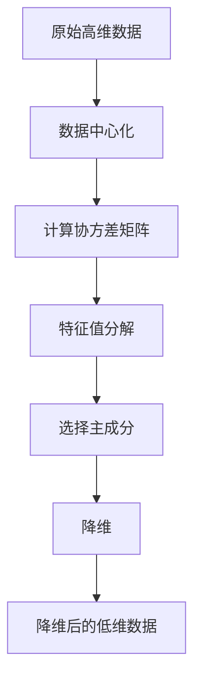

# 主成分分析(Principal Component Analysis) - 原理与代码实例讲解

关键词：主成分分析, PCA, 数据降维, 特征提取, 机器学习

## 1. 背景介绍
### 1.1  问题的由来
在当今大数据时代,我们经常会遇到维度灾难(Curse of Dimensionality)的问题。随着数据维度的增加,数据变得越来越稀疏,这给机器学习模型的训练带来了巨大挑战。同时高维数据还会增加计算复杂度和存储开销。如何在不损失太多信息的情况下,有效降低数据维度,成为了一个亟待解决的问题。
### 1.2  研究现状
目前,针对高维数据降维问题,学术界和工业界已经提出了多种经典算法,如主成分分析(PCA)、线性判别分析(LDA)、独立成分分析(ICA)等。其中PCA凭借其简单高效的特点,在众多领域得到了广泛应用,如人脸识别、图像压缩、金融数据分析等。近年来,一些改进的PCA算法也不断涌现,如核PCA、增量PCA、稀疏PCA等,进一步扩展了PCA的应用范围。
### 1.3  研究意义 
深入研究PCA的原理和应用,对于我们理解和运用这一经典降维算法具有重要意义。一方面,掌握PCA的数学本质,有助于我们把握其内在机理,为算法改进提供理论基础。另一方面,借助PCA处理实际数据集,将加深我们对降维过程的感性认识,积累数据分析的实战经验。总之,全面系统地学习PCA,对于我们成为一名合格的机器学习工程师和数据科学家至关重要。
### 1.4  本文结构
本文将全面讲解PCA的原理与应用。第2节介绍PCA的核心概念。第3节重点阐述PCA算法原理和具体步骤。第4节给出PCA的数学模型和公式推导。第5节通过Python代码实例演示PCA的具体实现。第6节讨论PCA的实际应用场景。第7节推荐PCA相关的学习资源。第8节对全文进行总结,并展望PCA的未来发展方向。

## 2. 核心概念与联系
PCA的核心思想是将高维数据投影到一个低维子空间,在保留数据最大差异性的同时实现降维。其涉及的核心概念包括:
- 协方差矩阵(Covariance Matrix):刻画变量之间的相关性,是PCA的数学基础。
- 特征值(Eigenvalue)和特征向量(Eigenvector):协方差矩阵的特征值和特征向量包含了数据的主要结构信息。
- 主成分(Principal Component):由特征向量构成,指示了数据最大方差的方向。前k个主成分构成降维后的新空间。
- 方差解释率(Explained Variance Ratio):衡量每个主成分对原始数据的贡献率,常作为确定主成分数的依据。

这些概念环环相扣,共同构建起PCA的理论框架。协方差矩阵揭示了数据的内在结构,其特征值和特征向量进一步挖掘了这种结构。通过选取最重要的几个特征向量作为主成分,PCA实现了降维目的。方差解释率则刻画了降维过程的信息保存程度。

## 3. 核心算法原理 & 具体操作步骤
### 3.1  算法原理概述
PCA通过线性变换将原始高维空间中的数据点投影到一个低维子空间,使得投影后的样本点尽可能分散。在数学上,它是一个优化问题,目标是最大化投影后样本的方差。根据拉格朗日乘子法,该问题可以转化为求协方差矩阵的特征值和特征向量。前k个最大特征值对应的特征向量即为主成分,它们构成了降维后的新空间基。
### 3.2  算法步骤详解
PCA的具体步骤如下:
1. 数据中心化:将原始数据的每一维都减去该维的均值,使得中心化后的数据均值为0。
2. 计算协方差矩阵:将中心化后的数据组成新矩阵,计算其协方差矩阵。 
3. 特征值分解:对协方差矩阵进行特征值分解,得到特征值和对应的特征向量。
4. 选择主成分:按照特征值从大到小排序,选择前k个特征向量作为主成分,构成降维矩阵。
5. 降维:将原始数据乘以降维矩阵,得到降维后的新数据。

以下是PCA算法的Mermaid流程图:

### 3.3  算法优缺点
PCA的主要优点有:
- 无监督:不需要标签数据,适用范围广。
- 简单高效:数学原理简明,计算复杂度较低。
- 可解释性强:降维后的每个新特征都有明确的物理意义。
- 降噪能力:通过舍弃次要成分,PCA可有效去除噪声和冗余信息。

但PCA也存在一定局限性:
- 线性算法:PCA只能发现数据的线性结构,对于非线性数据效果欠佳。
- 特征独立性:PCA假设特征之间是相互独立的,这在实际数据中往往难以满足。
- 对数据规模敏感:样本数过少时,PCA效果不佳。
- 缺乏普适性:PCA得到的是针对特定数据集的最优投影方向,缺乏普适性。
### 3.4  算法应用领域
凭借其优良特性,PCA在多个领域得到广泛应用,如:
- 计算机视觉:人脸识别、目标检测、图像压缩等。
- 自然语言处理:文本特征提取、主题模型等。  
- 生物信息学:基因数据分析、药物发现等。
- 金融工程:股票行情预测、客户画像等。

## 4. 数学模型和公式 & 详细讲解 & 举例说明
### 4.1  数学模型构建
设 $X = (x_1, x_2, \cdots, x_n)$ 表示 $n$ 个 $d$ 维数据点构成的 $d \times n$ 矩阵,其中 $x_i$ 为 $d$ 维列向量。PCA的目标是找到一个 $d \times k$ 的投影矩阵 $W$,将原数据 $X$ 映射到 $k$ 维空间 $Z$,使得投影后样本的方差最大化:

$$
\max_{W} \frac{1}{n} \sum_{i=1}^n \lVert W^T x_i \rVert^2, \quad s.t. \quad W^T W=I
$$

其中 $I$ 为单位矩阵,约束条件确保 $W$ 的列向量标准正交。
### 4.2  公式推导过程
利用拉格朗日乘子法,上述优化问题可以转化为:

$$
\max_{W} \frac{1}{n} \sum_{i=1}^n W^T x_i x_i^T W, \quad s.t. \quad W^T W=I
$$

记 $S = \frac{1}{n} \sum_{i=1}^n x_i x_i^T$ 为数据的协方差矩阵,优化目标可简化为:

$$
\max_{W} W^T S W, \quad s.t. \quad W^T W=I
$$

根据矩阵微积分,上式等价于求解协方差矩阵 $S$ 的特征值问题:

$$
S w_i = \lambda_i w_i, \quad i = 1, 2, \cdots, d
$$

其中 $\lambda_i$ 和 $w_i$ 分别为 $S$ 的特征值和特征向量。将特征值从大到小排序,前 $k$ 个最大的特征值对应的特征向量即构成投影矩阵 $W$ 的列向量,完成PCA过程。
### 4.3  案例分析与讲解
下面以一个简单的二维数据集为例,直观展示PCA的降维过程。如图1所示,原始数据呈现明显的线性结构,分布在一个狭长的椭圆形区域内。


对数据进行中心化和协方差矩阵计算后,得到协方差矩阵的两个特征向量,如图2中红色箭头所示。其中较长的箭头指示第一主成分(PC1)的方向,较短的箭头指示第二主成分(PC2)的方向。图3展示了数据点在两个主成分上的投影结果。

 | 

最后,选取第一主成分(PC1)构成降维后的新空间基,将原数据投影到该一维空间中,得到降维后的新数据,如图4所示。可以看出,尽管维度减少了,但原始数据的结构特征仍然得到了很好的保留。


### 4.4  常见问题解答
问题1:如何选择最优的主成分数?

主成分数 $k$ 的选择需要在降维效果和信息损失之间平衡。一般可通过以下几种方法确定:
- 根据先验知识:如已知数据的内在结构,可直接指定 $k$ 值。
- 保留阈值:如保留解释90%方差的主成分。
- 肘部法则:作主成分方差贡献率曲线,取拐点处的主成分数。
- 交叉验证:用不同 $k$ 训练模型,选泛化性能最优的 $k$。

问题2:PCA对数据尺度敏感吗?

PCA的结果会受到不同特征量纲的影响。为避免该问题,可在PCA前对数据进行标准化,使各特征均值为0、方差为1,消除量纲影响。

## 5. 项目实践：代码实例和详细解释说明
### 5.1  开发环境搭建
首先导入必要的Python库:
```python
import numpy as np
import matplotlib.pyplot as plt
from sklearn.decomposition import PCA
```
其中,numpy用于数值计算,matplotlib用于绘图,sklearn是机器学习库。
### 5.2  源代码详细实现
下面给出PCA的Python实现代码:
```python
def pca(X, k):
    # 数据中心化
    X = X - np.mean(X, axis=0)
    
    # 计算协方差矩阵
    cov_mat = np.cov(X, rowvar=False)
    
    # 特征值分解
    eigen_vals, eigen_vecs = np.linalg.eigh(cov_mat)
    
    # 选择主成分
    idx = np.argsort(eigen_vals)[::-1]
    eigen_vecs = eigen_vecs[:,idx]
    principal_components = eigen_vecs[:,:k]
    
    # 降维
    X_pca = np.dot(X, principal_components)
    
    return X_pca
```
### 5.3  代码解读与分析
上述代码实现了PCA的完整流程:
1. 先对原始数据`X`进行中心化,即每个特征都减去各自的均值。
2. 调用`np.cov()`函数计算中心化后数据的协方差矩阵。注意要设置`rowvar=False`,表示每行代表一个变量。
3. 调用`np.linalg.eigh()`函数对协方差矩阵进行特征值分解。该函数返回特征值和特征向量,且特征值默认升序排列。
4. 对特征值降序排序,取前`k`个最大的特征值对应的特征向量,构成主成分矩阵。
5. 将原始数据`X`与主成分矩阵相乘,得到降维后的新数据`X_pca`。

以上是PCA算法的NumPy实现,代码简洁易懂。实际应用中,我们也可以直接调用Scikit-Learn提供的`PCA`类,其封装了`fit()`和`transform()`等常用方法,进一步简化了