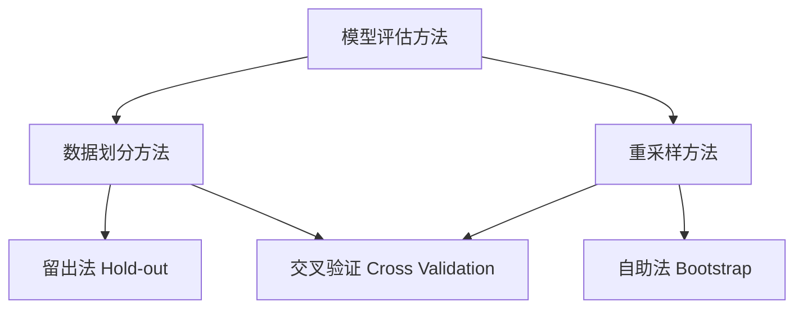
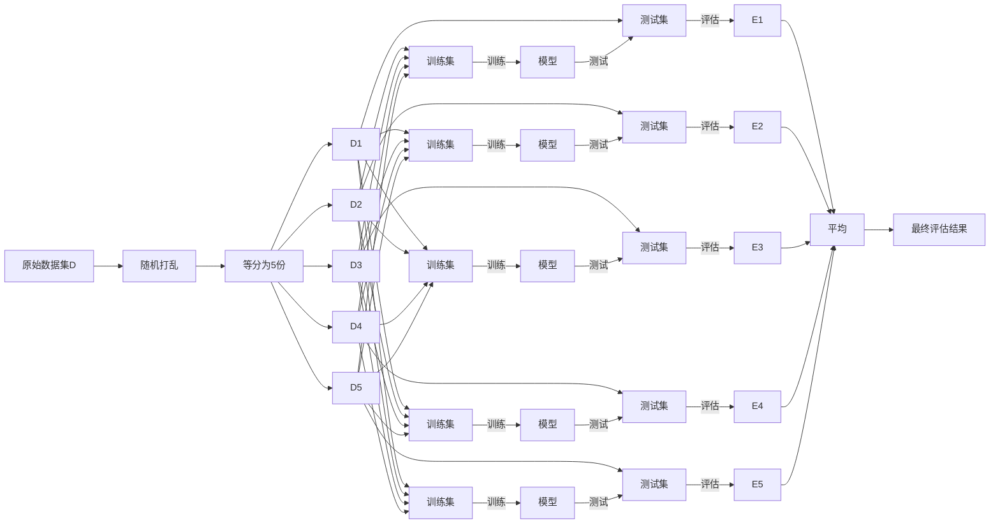

# 交叉验证 (Cross-Validation)

## 1. 背景介绍
### 1.1  问题的由来
在机器学习和数据挖掘领域,模型评估与选择是一个至关重要的问题。我们需要从众多候选模型中选择出性能最优的模型,以期获得最佳的预测效果。然而,如何客观、准确地评估模型性能,一直以来都是一个巨大的挑战。
### 1.2  研究现状
目前,学术界和工业界普遍采用留出法 (Hold-out)、自助法 (Bootstrap)、交叉验证 (Cross Validation) 等方法来评估模型性能。其中,交叉验证以其全面性、稳健性的特点,在众多模型评估方法中脱颖而出,成为业界的标准做法。
### 1.3  研究意义 
交叉验证通过多次划分训练集和测试集,多次训练评估模型,最后对多次评估结果取平均,从而获得相对稳健、可靠的性能指标。这种方法很好地规避了由于数据划分不当而导致的评估结果偏差问题,是一种行之有效的模型评估方法。深入研究交叉验证的原理和实现,对于提升机器学习系统的性能具有重要意义。
### 1.4  本文结构
本文将从以下几个方面对交叉验证展开深入探讨:
- 第2部分介绍交叉验证的核心概念及其与其他评估方法的联系
- 第3部分重点阐述交叉验证的算法原理和具体操作步骤
- 第4部分建立交叉验证的数学模型,推导相关公式,并举例说明
- 第5部分给出交叉验证的代码实现,并进行详细的解释说明
- 第6部分讨论交叉验证在实际场景中的应用
- 第7部分推荐交叉验证相关的学习资源和开发工具
- 第8部分总结全文,展望交叉验证的未来发展趋势和面临的挑战
- 第9部分列举交叉验证的常见问题,并给出解答

## 2. 核心概念与联系
交叉验证的核心思想是通过多次随机划分数据集,重复进行模型训练和测试,最后对多次测试结果取平均,从而获得相对稳健、可靠的性能评估指标。与传统的留出法和自助法相比,交叉验证的优势在于:
- 能够充分利用有限的数据,提高数据利用率
- 评估结果相对稳健,能够减少因数据划分不当而导致的偏差
- 适用于小样本数据集,具有更广泛的适用性

常见的交叉验证方法包括:
- k折交叉验证 (k-fold cross validation): 将数据集等分为k份,每次选择其中1份作为测试集,其余k-1份作为训练集,重复k次,最后对k次结果取平均。
- 留一交叉验证 (leave-one-out cross validation): 每次只留一个样本作为测试集,其余所有样本作为训练集,重复n次(n为样本数)。
- 分层k折交叉验证 (stratified k-fold cross validation): 在划分数据集时,保持每份子集中各类别样本的比例与原始数据集一致。适用于类别不平衡数据。

交叉验证与自助法、留出法的关系如下图所示:

## 3. 核心算法原理 & 具体操作步骤
### 3.1 算法原理概述
交叉验证的基本原理是通过多次划分数据集,重复进行模型训练和测试,最终对多次测试结果取平均,得到相对稳健的性能评估指标。以最常用的k折交叉验证为例,其基本过程如下:
1. 将原始数据集D随机划分为k个大小相似的互斥子集,记为D1,D2,...,Dk
2. 每次选择其中的1个子集Di作为测试集,其余k-1个子集的并集作为训练集
3. 基于训练集训练模型,在测试集上评估模型性能,得到一个性能指标Ei
4. 重复步骤2和3,k次循环,得到k个性能指标E1,E2,...,Ek
5. 对k个性能指标取平均,得到最终的评估结果

### 3.2 算法步骤详解
下面以5折交叉验证为例,详细说明每个步骤的具体操作:
1. 数据集划分:
   - 将原始数据集D随机打乱,然后等分为5份,尽可能保证每份的大小相近
   - 得到5个子集:D1,D2,D3,D4,D5
2. 模型训练与测试:
   - 第1轮:选择D1作为测试集,D2~D5的并集作为训练集,训练模型并在D1上测试,得到E1
   - 第2轮:选择D2作为测试集,D1,D3~D5的并集作为训练集,训练模型并在D2上测试,得到E2 
   - 第3轮:选择D3作为测试集,D1~D2,D4~D5的并集作为训练集,训练模型并在D3上测试,得到E3
   - 第4轮:选择D4作为测试集,D1~D3,D5的并集作为训练集,训练模型并在D4上测试,得到E4
   - 第5轮:选择D5作为测试集,D1~D4的并集作为训练集,训练模型并在D5上测试,得到E5
3. 结果平均:
   - 对5次测试得到的性能指标E1~E5求平均,得到最终的评估结果

整个过程如下图所示:

### 3.3 算法优缺点
交叉验证的主要优点包括:
- 能够有效利用有限的数据,提高数据利用率
- 通过多次划分与重复试验,可以得到比较稳健的性能评估结果
- 适用于小样本数据集,评估结果可靠性高

但交叉验证也存在一些局限性:
- 计算开销大,特别是数据量较大或模型训练时间较长时
- 对数据划分的随机性较为敏感,不同的随机种子可能导致不同的评估结果
- 在数据集很大时,多次重复训练的时间开销可能难以接受

### 3.4 算法应用领域
交叉验证在机器学习和数据挖掘领域有着广泛的应用,特别是在以下场景中:
- 模型选择与评估:通过交叉验证比较不同模型的性能,选择最优模型
- 超参数调优:通过交叉验证选择模型的最优超参数组合
- 特征选择:通过交叉验证评估不同特征子集的性能,选择最优特征
- 稳健性验证:通过交叉验证评估模型在不同数据划分下的性能稳定性
- 算法比较:通过交叉验证比较不同算法在特定任务上的性能差异

总之,交叉验证为模型评估与选择提供了一种稳健、可靠的思路,是现代机器学习中不可或缺的重要工具。

## 4. 数学模型和公式 & 详细讲解 & 举例说明
### 4.1 数学模型构建
为了形式化地描述交叉验证,我们引入如下数学符号:
- $D$:原始数据集
- $k$:交叉验证的折数
- $D_i(i=1,2,...,k)$:数据集D划分得到的k个子集
- $h_i(i=1,2,...,k)$:第i轮训练得到的模型
- $E_i(i=1,2,...,k)$:第i轮测试得到的性能指标
- $\bar{E}$:k次交叉验证得到的平均性能指标

假设样本空间为$\mathcal{X} \times \mathcal{Y}$,其中$\mathcal{X}$为特征空间,$\mathcal{Y}$为标记空间。原始数据集$D$包含$n$个独立同分布的样本:

$$D=\{(x_1,y_1),(x_2,y_2),...,(x_n,y_n)\},\quad (x_i,y_i) \in \mathcal{X} \times \mathcal{Y}$$

交叉验证的目标是基于数据集$D$,通过多次划分、训练和测试,得到模型泛化性能的无偏估计。

### 4.2 公式推导过程
假设我们采用均方误差(Mean Squared Error,MSE)作为性能度量指标,则第$i$轮测试得到的性能指标$E_i$可表示为:

$$E_i=\frac{1}{|D_i|}\sum_{(x,y) \in D_i}(h_i(x)-y)^2$$

其中,$|D_i|$表示测试集$D_i$的样本数量。

经过$k$轮交叉验证,我们得到$k$个性能指标$\{E_1,E_2,...,E_k\}$。最终的评估结果$\bar{E}$为这$k$个指标的平均值:

$$\bar{E}=\frac{1}{k}\sum_{i=1}^kE_i$$

可以证明,$\bar{E}$是模型泛化误差的无偏估计。令$h^*$表示基于整个数据集$D$训练得到的模型,其泛化误差为:

$$R(h^*)=\mathbb{E}_{(x,y) \sim \mathcal{D}}[(h^*(x)-y)^2]$$

其中,$\mathcal{D}$表示样本的真实分布。利用偏差-方差分解,可以将$\bar{E}$分解为:

$$\mathbb{E}[\bar{E}]=R(h^*)+\mathrm{Var}(\bar{E})$$

由于$\mathrm{Var}(\bar{E})$随着$k$的增大而减小,因此当$k$较大时,$\bar{E}$可以很好地逼近$R(h^*)$。这就是交叉验证能够提供较为稳健、可靠的性能评估的原因。

### 4.3 案例分析与讲解
下面以一个具体的例子来说明交叉验证的计算过程。假设我们有一个二元分类任务,数据集$D$包含10个样本:

$$D=\{(1,0),(2,0),(3,0),(4,0),(5,1),(6,1),(7,1),(8,1),(9,1),(10,1)\}$$

其中,每个样本的第一个元素表示特征$x$,第二个元素表示标记$y \in \{0,1\}$。

现在,我们使用5折交叉验证来评估一个线性分类器$h(x)=\mathrm{sign}(wx+b)$的性能。具体步骤如下:

1. 将