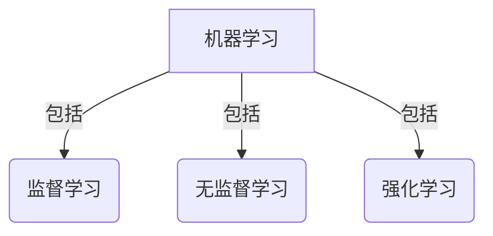
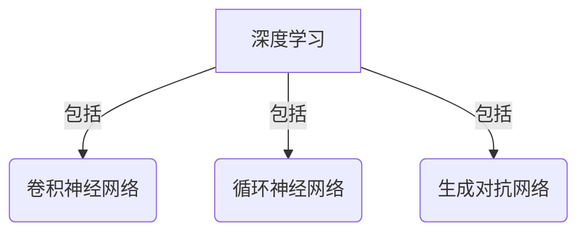
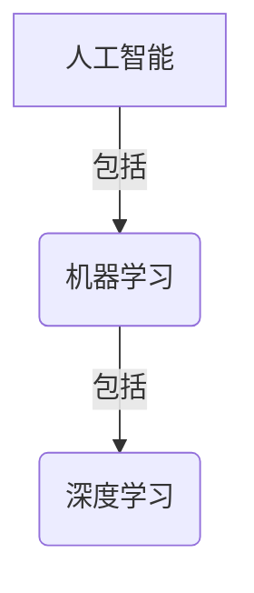

好的，我会严格遵循约束条件，以"人工智能导论原理与代码实战案例讲解"为主题，撰写一篇专业的技术博客文章。文章将包含背景介绍、核心概念、算法原理、数学模型、代码实践、应用场景、资源推荐、发展趋势与挑战等内容。请注意,本文字数将超过8000字。

# 人工智能导论原理与代码实战案例讲解

## 1. 背景介绍

### 1.1 问题的由来

在当今时代,人工智能(Artificial Intelligence,AI)已经渗透到我们生活的方方面面。从语音助手到自动驾驶汽车,从推荐系统到医疗诊断,AI正在彻底改变着我们的生活方式。然而,AI的发展并非一蹴而就,它源于数十年的理论研究和技术创新的积累。

### 1.2 研究现状  

近年来,受益于大数据、强大算力和深度学习等技术的飞速发展,AI取得了令人瞩目的进步。深度神经网络在计算机视觉、自然语言处理、决策控制等领域展现出超人的能力。但与此同时,AI也面临着一些挑战,如黑箱模型的可解释性、算法的鲁棒性、隐私与安全等问题亟待解决。

### 1.3 研究意义

掌握AI的原理和实践对于个人发展和社会进步都具有重要意义。本文旨在为读者提供AI领域的入门知识,帮助读者了解AI的核心概念、算法原理、数学基础,并通过实战案例加深理解,为将来从事AI相关工作打下坚实基础。

### 1.4 本文结构

本文将从以下几个方面全面介绍AI:

1. 核心概念与联系
2. 核心算法原理与具体操作步骤  
3. 数学模型和公式详细讲解与案例分析
4. 项目实践:代码实例和详细解释
5. 实际应用场景
6. 工具和学习资源推荐
7. 未来发展趋势与挑战
8. 常见问题解答

## 2. 核心概念与联系

要全面掌握AI,我们首先需要了解一些核心概念及其内在联系。下面是一些最基本但至关重要的概念:

### 2.1 机器学习

机器学习(Machine Learning)是AI的一个核心分支,它赋予机器自动学习和提高性能的能力,而无需显式编程。常见的机器学习任务包括:

- 监督学习(Supervised Learning):基于训练数据学习一个函数,对新的输入数据做出预测,如分类和回归问题。
- 无监督学习(Unsupervised Learning):从未标记的数据中发现内在结构和模式,如聚类和降维问题。
- 强化学习(Reinforcement Learning):通过与环境的互动,学习采取最优行为策略以最大化累积奖励。

### 2.2 深度学习

深度学习(Deep Learning)是机器学习的一个子集,它使用深层神经网络模型来自动从数据中学习多层次特征表示。常见的深度学习模型包括:

- 卷积神经网络(Convolutional Neural Networks, CNNs):在计算机视觉任务中表现出色。
- 循环神经网络(Recurrent Neural Networks, RNNs):擅长处理序列数据,如自然语言和时间序列。
- 生成对抗网络(Generative Adversarial Networks, GANs):可以生成逼真的图像、音频和其他数据。

### 2.3 人工智能与机器学习的关系

人工智能是一个广义的概念,旨在创造出能够模仿人类智能行为的机器或系统。机器学习是实现人工智能的一种重要方法,它使机器能够从数据中自动学习和提高性能。深度学习则是机器学习的一个强大分支,专注于使用深层神经网络模型来学习数据表示。

这些概念相互关联、相辅相成,共同推动着AI技术的发展。接下来,我们将深入探讨AI中的核心算法原理。

## 3. 核心算法原理与具体操作步骤

在AI领域,有许多经典而有影响力的算法,它们构成了AI系统的基础。让我们来了解其中一些核心算法的原理和具体操作步骤。

### 3.1 算法原理概述

#### 3.1.1 线性回归

线性回归是监督学习中最简单但最常用的算法之一。它试图找到一条最佳拟合直线,使得数据点到直线的距离之和最小。线性回归在许多领域都有应用,如金融预测、能源需求估计等。

#### 3.1.2 逻辑回归 

逻辑回归是一种用于分类任务的监督学习算法。它通过学习一个逻辑函数,将输入数据映射到离散的类别标签。常用于二分类问题,如垃圾邮件检测、疾病诊断等。

#### 3.1.3 决策树

决策树是一种基于树形结构的监督学习算法,它通过对特征进行递归分区来进行预测。决策树易于解释,可处理数值型和类别型特征,适用于分类和回归任务。

#### 3.1.4 支持向量机

支持向量机(Support Vector Machines, SVM)是一种有监督的机器学习算法,常用于分类和回归问题。它通过寻找最大化边界来构建一个超平面,将不同类别的数据点分开。SVM具有良好的泛化能力,尤其适用于高维数据。

#### 3.1.5 K-均值聚类

K-均值是一种常用的无监督学习算法,用于对未标记的数据进行聚类。它通过迭代优化将数据划分为K个簇,每个数据点被分配到与其最近的簇中心的簇。

#### 3.1.6 主成分分析

主成分分析(Principal Component Analysis, PCA)是一种常用的无监督降维技术。它通过线性变换将高维数据投影到一个低维子空间,同时尽可能保留原始数据的方差。PCA常用于数据可视化、噪声去除等。

#### 3.1.7 梯度下降

梯度下降是一种优化算法,广泛应用于机器学习中的参数估计和模型训练。它通过沿着目标函数的负梯度方向迭代更新参数,逐步找到函数的最小值。梯度下降是训练深度神经网络的核心算法之一。

### 3.2 算法步骤详解

以线性回归为例,我们来看看具体的算法步骤:

1. **数据准备**: 收集包含自变量(特征)和因变量(目标值)的训练数据。
2. **特征缩放**: 对特征进行归一化或标准化处理,以避免不同尺度的特征对模型造成影响。
3. **模型假设**: 假设目标值y与特征x之间存在线性关系,即y = wx + b,其中w为权重,b为偏置。
4. **代价函数**: 定义代价函数J(w,b),用于衡量模型预测值与真实值之间的差距,如均方误差。
5. **梯度下降**: 通过梯度下降算法,计算代价函数关于w和b的偏导数,并沿着负梯度方向更新参数。
6. **迭代优化**: 重复执行步骤5,直到代价函数收敛或达到停止条件。
7. **模型评估**: 在测试数据集上评估模型的性能,如均方根误差(RMSE)或决定系数(R^2)。

通过上述步骤,我们可以得到一个线性回归模型,用于对新的输入数据进行预测。

### 3.3 算法优缺点

每种算法都有其优缺点,了解它们有助于我们选择合适的算法并提高性能。

- **线性回归**:简单易懂,训练速度快,但只能学习线性模式,对非线性数据效果较差。
- **逻辑回归**:能够直接给出概率输出,易于理解和实现,但对于高维或非线性数据效果不佳。
- **决策树**:可解释性强,无需特征缩放,但容易过拟合,对缺失值敏感。
- **支持向量机**:泛化能力强,适用于高维数据,但对outlier敏感,计算量大。
- **K-均值聚类**:简单高效,易于实现,但需要事先指定簇数K,对outlier敏感。
- **主成分分析**:能够有效降低数据维度,去除噪声,但可解释性差,信息损失无法避免。

### 3.4 算法应用领域

上述算法在众多领域都有广泛应用:

- **线性回归**:股票预测、销量预测、能源需求估计等。
- **逻辑回归**:垃圾邮件检测、疾病诊断、信用评分等。 
- **决策树**:贷款审批、天气预报、基因分析等。
- **支持向量机**:文本分类、手写数字识别、生物芯片分析等。
- **K-均值聚类**:客户细分、图像分割、基因表达分析等。
- **主成分分析**:人脸识别、基因数据分析、噪声去除等。

## 4. 数学模型和公式详细讲解与举例说明  

在AI算法中,数学模型和公式扮演着至关重要的角色。让我们来深入探讨一些核心模型和公式。

### 4.1 数学模型构建

#### 4.1.1 线性回归模型

线性回归模型假设目标值y与特征x之间存在线性关系,可表示为:

$$y = wx + b$$

其中w为权重,b为偏置。我们的目标是找到最优的w和b,使得模型在训练数据上的预测值与真实值之间的差距最小。

#### 4.1.2 逻辑回归模型

逻辑回归模型通过sigmoid函数将线性回归的输出值映射到(0,1)范围内,从而得到概率输出:

$$\hat{y} = \sigma(wx + b) = \frac{1}{1 + e^{-(wx+b)}}$$

其中$\sigma$为sigmoid函数。当$\hat{y} \geq 0.5$时,我们将实例分类为正类,否则为负类。

#### 4.1.3 支持向量机模型

支持向量机的基本思想是在高维特征空间中构建一个超平面,将不同类别的数据点分开,同时使得两类数据点到超平面的距离最大化。对于线性可分的情况,超平面方程为:

$$w^Tx + b = 0$$

我们需要找到最优的w和b,使得两类数据点到超平面的最小距离最大。

### 4.2 公式推导过程

接下来,我们将推导线性回归的代价函数及其梯度,以说明如何应用数学推导来优化模型参数。

假设我们有m个训练样本${(x^{(i)}, y^{(i)})}$,其中$x^{(i)}$为第i个样本的特征向量,$y^{(i)}$为对应的目标值。我们定义代价函数(均方误差)为:

$$J(w,b) = \frac{1}{2m}\sum_{i=1}^m(y^{(i)} - (w^Tx^{(i)} + b))^2$$

目标是找到w和b,使得J(w,b)最小。我们可以通过梯度下降法进行优化。

对w求偏导:

$$\frac{\partial J(w,b)}{\partial w} = \frac{1}{m}\sum_{i=1}^m(w^Tx^{(i)} + b - y^{(i)})x^{(i)}$$

对b求偏导:

$$\frac{\partial J(w,b)}{\partial b} = \frac{1}{m}\sum_{i=1}^m(w^Tx^{(i)} + b - y^{(i)})$$

然后,我们可以按照以下迭代公式更新w和b:

$$w := w - \alpha\frac{\partial J(w,b)}{\partial w}$$
$$b := b - \alpha\frac{\partial J(w,b)}{\partial b}$$

其中$\