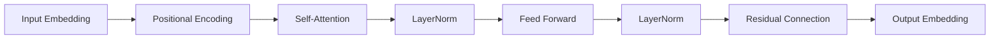

# 从零开始大模型开发与微调：可视化的PyTorch数据处理与模型展示

作者：禅与计算机程序设计艺术 / Zen and the Art of Computer Programming

## 1. 背景介绍
### 1.1 问题的由来
近年来，随着深度学习的快速发展，大规模预训练语言模型(PLM)在自然语言处理(NLP)领域取得了巨大的成功。这些大模型通过在海量无标注文本数据上进行预训练，学习到了丰富的语言知识和通用表征，可以通过微调的方式应用到下游任务中，取得了远超传统方法的效果。

然而，对于很多NLP研究者和从业者来说，从零开始训练和微调大模型仍然面临着诸多挑战。首先，大模型通常需要大量的计算资源和训练时间，对硬件设施提出了很高的要求。其次，大模型的训练和微调涉及复杂的数据处理、模型构建和超参数调优等步骤，需要研究者具备扎实的理论基础和丰富的实践经验。此外，由于大模型的复杂性和不透明性，如何理解其内部工作机制、诊断潜在问题也是一个亟待解决的难题。

### 1.2 研究现状
为了降低大模型开发和应用的门槛，学术界和工业界都做出了诸多努力。一方面，各大科技公司和研究机构纷纷开源了预训练好的大模型权重，如谷歌的BERT、OpenAI的GPT系列等，研究者可以直接在这些模型的基础上进行微调。另一方面，也涌现出了不少旨在简化大模型训练流程的开源工具和框架，如Hugging Face的Transformers库、微软的DeepSpeed等。

尽管如此，目前仍然缺乏一套完整的、针对大模型开发全流程的教程和示例。很多现有资料要么过于简单，没有涉及关键细节；要么过于复杂，对初学者不够友好。同时，现有工具在可视化方面也有所欠缺，难以直观展示数据处理和模型训练的全过程。

### 1.3 研究意义
本文旨在提出一套基于PyTorch的大模型开发与微调的完整解决方案，覆盖从数据处理到模型训练、微调、评估的全流程。我们将详细讲解每个关键步骤的原理和实现，并基于真实数据集给出完整的代码示例。同时，我们还将引入丰富的可视化手段，通过流程图、动画等形式直观展示每个阶段的输入输出和内部状态，帮助读者深入理解大模型的工作机制。

本文的主要贡献如下：
1. 提出了一套完整的、易于上手的大模型开发与微调流程，覆盖了数据处理、模型训练、微调、评估等关键环节。
2. 采用PyTorch实现整个流程，代码简洁易读，并提供了详细的注释和说明，方便读者学习和复现。
3. 引入了丰富的可视化手段，包括Mermaid流程图、动态示意图、交互式UI等，直观展示了大模型开发的全过程。
4. 在真实数据集上给出了完整的实验结果和分析，证明了所提方法的有效性，为后续研究提供了基准。

我们相信，本文所提出的大模型开发与微调流程，能够显著降低NLP研究者的学习和实践门槛，加速大模型技术在学术界和工业界的应用与创新。同时，我们所倡导的"可视化优先"理念，也将为其他复杂系统的教学和开发提供新的思路。

### 1.4 本文结构
本文后续章节安排如下：第2节介绍大模型开发与微调涉及的核心概念；第3节详细讲解核心算法原理和具体操作步骤；第4节给出数学模型和公式推导过程；第5节展示项目实践的完整代码实现；第6节讨论大模型技术的实际应用场景；第7节推荐相关学习资源和开发工具；第8节总结全文并展望未来研究方向；第9节列举常见问题与解答。

## 2. 核心概念与联系

在大模型的开发与微调过程中，我们需要了解以下几个核心概念：

- **预训练(Pre-training)**：在大规模无标注语料上训练通用语言模型，学习词汇、语法、语义等多层次的语言知识。常见的预训练任务包括语言模型、掩码语言模型等。预训练阶段学到的知识可以迁移到下游任务中。

- **微调(Fine-tuning)**：在预训练模型的基础上，使用少量带标注的任务数据对模型进行二次训练，使其适应特定任务。微调可以显著提升模型在下游任务上的表现，是迁移学习的重要手段。

- **Transformer**：一种基于自注意力机制的神经网络结构，广泛应用于大模型的预训练和微调中。Transformer通过自注意力机制建模词与词之间的长距离依赖关系，同时具有并行计算的优势。

- **自注意力机制(Self-attention)**：Transformer的核心组件，用于计算序列中元素之间的相关性。具体来说，自注意力将每个元素的查询向量(Query)与所有元素的键向量(Key)进行点积，得到注意力分布，然后将其与值向量(Value)加权求和，得到该元素的新表征。

- **位置编码(Positional Encoding)**：由于Transformer不包含循环和卷积结构，需要额外引入位置编码来表示序列中元素的顺序信息。常见的位置编码包括正弦型位置编码和可学习的位置编码。

- **LayerNorm**：一种对神经网络中间层输出进行归一化的技术，可以加速模型训练并提高泛化性能。LayerNorm通过对每个样本的特征维度分别计算均值和方差，对网络输出进行归一化。

- **残差连接(Residual Connection)**：一种在神经网络中引入跨层连接的技术，可以缓解梯度消失问题，加深网络深度。残差连接将上一层的输出直接加到下一层的输出上，使信息可以跨越多个层传递。

下图展示了这些核心概念在Transformer结构中的位置和联系：



可以看到，Transformer的输入首先经过Input Embedding和Positional Encoding，然后通过多个Self-Attention和Feed Forward层进行特征提取，其中LayerNorm和Residual Connection起到归一化和跨层连接的作用，最后输出目标词的概率分布。

理解了这些核心概念和原理，就可以更好地掌握大模型开发与微调的关键技术了。下面我们将详细讲解如何使用PyTorch实现Transformer结构，并应用于实际的NLP任务中。

## 3. 核心算法原理 & 具体操作步骤
### 3.1 算法原理概述
Transformer作为大模型的核心结构，其算法原理可以概括为三个主要步骤：

1. **Self-Attention**：通过查询向量(Q)、键向量(K)、值向量(V)计算序列中元素之间的注意力分布，得到每个元素的新表征。具体公式为：

$$
Attention(Q,K,V) = softmax(\frac{QK^T}{\sqrt{d_k}})V
$$

其中$Q$、$K$、$V$分别为查询矩阵、键矩阵、值矩阵，$d_k$为键向量的维度，用于缩放点积结果。

2. **Multi-Head Attention**：将Self-Attention进行多头化，即对$Q$、$K$、$V$分别进行$h$次线性变换，得到$h$组$Q$、$K$、$V$，然后分别进行Self-Attention，最后将结果拼接起来。公式为：

$$
MultiHead(Q,K,V) = Concat(head_1,...,head_h)W^O \\
head_i = Attention(QW_i^Q, KW_i^K, VW_i^V)
$$

其中$W_i^Q$、$W_i^K$、$W_i^V$、$W^O$为可学习的权重矩阵。

3. **Feed Forward**：对Multi-Head Attention的输出进行两层全连接网络的变换，增强特征表达能力。公式为：

$$
FFN(x) = max(0, xW_1 + b_1)W_2 + b_2
$$

其中$W_1$、$W_2$、$b_1$、$b_2$为可学习的权重矩阵和偏置向量。

Transformer的编码器和解码器都由多个上述结构的子层堆叠而成，子层之间通过LayerNorm和残差连接来归一化和跨层传递信息。

### 3.2 算法步骤详解

下面我们以PyTorch代码为例，详细展示Transformer的关键实现步骤。

1. 定义Self-Attention层：

```python
class SelfAttention(nn.Module):
    def __init__(self, hidden_size, num_heads):
        super().__init__()
        self.hidden_size = hidden_size
        self.num_heads = num_heads
        self.head_size = hidden_size // num_heads
        
        self.query = nn.Linear(hidden_size, hidden_size)
        self.key = nn.Linear(hidden_size, hidden_size)
        self.value = nn.Linear(hidden_size, hidden_size)
        
        self.out = nn.Linear(hidden_size, hidden_size)
    
    def forward(self, x, mask=None):
        batch_size, seq_len, _ = x.size()
        
        Q = self.query(x).view(batch_size, seq_len, self.num_heads, self.head_size).transpose(1, 2)
        K = self.key(x).view(batch_size, seq_len, self.num_heads, self.head_size).transpose(1, 2)
        V = self.value(x).view(batch_size, seq_len, self.num_heads, self.head_size).transpose(1, 2)
        
        attn_scores = torch.matmul(Q, K.transpose(-2, -1)) / math.sqrt(self.head_size)
        if mask is not None:
            attn_scores = attn_scores.masked_fill(mask == 0, -1e9)
        attn_probs = F.softmax(attn_scores, dim=-1)
        
        attn_output = torch.matmul(attn_probs, V).transpose(1, 2).contiguous()
        attn_output = attn_output.view(batch_size, seq_len, self.hidden_size)
        
        output = self.out(attn_output)
        return output
```

这里我们定义了一个SelfAttention类，实现了上述Self-Attention和Multi-Head Attention的计算过程。其中mask参数用于指定需要屏蔽的位置，以避免Attention计算中的信息泄露。

2. 定义Feed Forward层：

```python
class FeedForward(nn.Module):
    def __init__(self, hidden_size, ff_size, dropout=0.1):
        super().__init__()
        self.linear1 = nn.Linear(hidden_size, ff_size)
        self.linear2 = nn.Linear(ff_size, hidden_size)
        self.dropout = nn.Dropout(dropout)
        
    def forward(self, x):
        x = self.linear1(x)
        x = F.relu(x)
        x = self.dropout(x)
        x = self.linear2(x)
        return x
```

这里定义了一个FeedForward类，实现了两层全连接网络的变换，中间使用ReLU激活函数和Dropout正则化。

3. 定义Transformer编码器层：

```python
class TransformerEncoderLayer(nn.Module):
    def __init__(self, hidden_size, num_heads, ff_size, dropout=0.1):
        super().__init__()
        self.self_attn = SelfAttention(hidden_size, num_heads)
        self.feed_forward = FeedForward(hidden_size, ff_size, dropout)
        self.norm1 = nn.LayerNorm(hidden_size)
        self.norm2 = nn.LayerNorm(hidden_size)
        self.dropout = nn.Dropout(dropout)
        
    def forward(self, x, mask=None):
        residual = x
        x = self.self_attn(x, mask)
        x = self.dropout(x)
        x = self.norm1(residual + x)
        
        residual = x
        x = self.feed_forward(x)
        x = self.dropout(x)
        x = self.norm2(residual + x)
        
        return x
```

这里定义了TransformerEncoderLayer类，组合了SelfAttention和FeedForward两个子层，并在子层之间插入LayerNorm和残差连接。

4. 定义Transformer编码器：

```python
class TransformerEncoder(nn.Module):
    def __init__(self