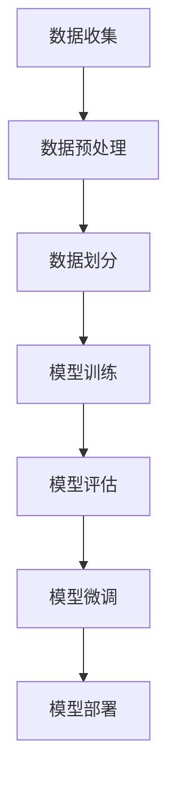

# 从零开始大模型开发与微调：数据的准备

## 1. 背景介绍

### 1.1 问题的由来

随着人工智能技术的不断发展,大型语言模型(Large Language Model, LLM)在自然语言处理领域取得了令人瞩目的成就。作为一种基于深度学习的技术,LLM能够从海量文本数据中学习语言模式和知识,并用于各种自然语言处理任务,如机器翻译、问答系统、文本生成等。

然而,训练一个高质量的LLM需要耗费大量的计算资源和时间。此外,通用的LLM在特定领域或任务上的表现可能不尽如人意,需要针对性的调整和优化。因此,如何高效地开发和微调大型语言模型,成为了当前研究的热点课题。

### 1.2 研究现状

目前,主流的LLM开发方法主要有两种:

1. **从头训练(Pretraining from Scratch)**: 从随机初始化的模型参数开始,利用大规模的文本语料库进行预训练,得到一个通用的LLM基础模型。这种方法需要耗费大量的计算资源,只有拥有强大的硬件设施和海量数据的大型科技公司才能承担得起。

2. **模型微调(Fine-tuning)**: 基于现有的通用LLM基础模型,利用特定领域或任务的数据进行进一步的微调,使模型更加专注于目标任务。这种方法相对高效,但微调的效果很大程度上取决于微调数据的质量和数量。

无论采用哪种方法,高质量的数据都是大模型开发成功的关键因素。本文将重点探讨如何为大模型开发和微调准备高质量的数据。

### 1.3 研究意义

数据的质量直接影响了大模型的性能表现。通过优化数据准备流程,可以极大地提高模型的训练效率和泛化能力。本文的研究对于以下几个方面具有重要意义:

1. **降低模型开发成本**: 高质量的数据可以减少模型训练所需的迭代次数,从而节省计算资源和时间成本。

2. **提高模型性能**: 清洁、多样化的数据有助于模型学习更加丰富的语言模式和知识,提高模型在各种任务上的表现。

3. **促进模型可解释性**: 通过数据标注和分析,可以更好地理解模型的学习过程,提高模型的可解释性和可信度。

4. **推动领域应用**: 针对特定领域准备高质量的数据,可以促进大模型在该领域的应用和发展。

### 1.4 本文结构

本文将按照以下结构展开讨论:

1. 背景介绍
2. 核心概念与联系
3. 核心算法原理与具体操作步骤
4. 数学模型和公式详细讲解与举例说明
5. 项目实践:代码实例和详细解释说明
6. 实际应用场景
7. 工具和资源推荐
8. 总结:未来发展趋势与挑战
9. 附录:常见问题与解答

## 2. 核心概念与联系

在探讨大模型数据准备的核心概念之前,我们先来了解一下大模型开发的基本流程:

如上图所示,大模型开发主要包括以下几个环节:

1. **数据收集**: 从各种来源获取原始数据,如网页、书籍、论文等。
2. **数据预处理**: 对原始数据进行清洗、标注、增强等处理,以提高数据质量。
3. **数据划分**: 将处理后的数据划分为训练集、验证集和测试集。
4. **模型训练**: 使用训练集对模型进行预训练或微调。
5. **模型评估**: 在验证集和测试集上评估模型的性能表现。
6. **模型微调**: 根据评估结果,对模型进行进一步的微调优化。
7. **模型部署**: 将优化后的模型部署到实际应用中。

其中,数据准备阶段包括数据收集、数据预处理和数据划分三个步骤,是整个流程的基础。接下来,我们将重点讨论这三个步骤的核心概念和方法。

### 2.1 数据收集

数据收集是大模型开发的第一步,也是最为关键的一步。高质量的原始数据是训练出优秀模型的前提条件。常见的数据收集方式包括:

1. **网络爬虫**: 使用爬虫技术从互联网上自动采集数据,如网页、社交媒体、在线论坛等。
2. **数据购买**: 从专业的数据供应商处购买数据集,如新闻语料库、书籍语料库等。
3. **人工采集**: 通过人工方式收集数据,如录音、手写文本等。
4. **公开数据集**: 利用一些公开的数据集,如Wikipedia数据、开放书籍语料库等。

在收集数据时,需要注意以下几个方面:

1. **数据来源的多样性**: 确保数据来自于不同的领域和场景,以增加数据的多样性和覆盖面。
2. **数据质量控制**: 设置一定的质量标准,过滤掉低质量的数据,如垃圾信息、重复数据等。
3. **版权和隐私保护**: 遵守相关的版权法律法规,保护个人隐私信息。
4. **数据量要求**: 根据模型的大小和任务的复杂度,收集足够多的数据。

### 2.2 数据预处理

收集到的原始数据通常存在各种噪声和缺陷,需要进行预处理才能用于模型训练。常见的数据预处理方法包括:

1. **数据清洗**: 去除数据中的垃圾信息、重复内容、格式错误等。
2. **数据标注**: 为数据添加标签或注释,如命名实体识别、情感分析等。
3. **数据增强**: 通过一些技术手段扩充数据集,如数据扩增、反向翻译等。
4. **数据规范化**: 将数据转换为统一的格式,如文本编码、大小写规范化等。
5. **数据过滤**: 根据特定的标准过滤掉部分数据,如长度过滤、主题过滤等。

数据预处理的目标是提高数据的质量和一致性,为模型训练做好准备。在预处理过程中,需要注意以下几个方面:

1. **保持数据的多样性**: 预处理时应尽量保留数据的多样性,避免过度规范化导致数据同质化。
2. **标注的一致性**: 如果涉及人工标注,需要制定统一的标注规范,确保标注结果的一致性。
3. **数据隐私保护**: 在预处理过程中,应对敏感信息进行脱敏处理,保护个人隐私。
4. **预处理效率**: 对于大规模数据集,需要采用高效的预处理算法和工具,提高处理效率。

### 2.3 数据划分

经过预处理后的数据需要划分为训练集、验证集和测试集,用于模型的训练、评估和测试。常见的数据划分方法包括:

1. **随机划分**: 随机将数据划分为训练集、验证集和测试集,通常按照特定的比例划分。
2. **分层抽样**: 根据数据的某些特征(如主题、来源等)进行分层,然后在每一层内随机抽样划分数据。
3. **时间序列划分**: 对于时间序列数据,可以按照时间顺序将数据划分为训练集、验证集和测试集。
4. **留出法**: 将一部分数据直接留作测试集,其余数据再划分为训练集和验证集。

在数据划分时,需要注意以下几个方面:

1. **数据分布的一致性**: 确保训练集、验证集和测试集的数据分布相似,避免数据偏移。
2. **数据量的平衡**: 根据模型的大小和任务的复杂度,合理分配各个数据集的数据量。
3. **数据隐私保护**: 对于包含敏感信息的数据,应在划分时进行脱敏处理。
4. **重复数据处理**: 对于可能存在重复数据的情况,需要进行重复数据去重处理。

通过合理的数据划分,可以确保模型在训练和评估阶段使用的数据是独立且具有代表性的,从而获得更加可靠的模型性能评估结果。

## 3. 核心算法原理与具体操作步骤

在数据准备过程中,会涉及到一些核心算法,如数据清洗、数据增强、数据划分等。下面我们将详细介绍这些算法的原理和具体操作步骤。

### 3.1 算法原理概述

#### 3.1.1 数据清洗算法

数据清洗是数据预处理的重要环节,旨在去除数据中的噪声和错误,提高数据的质量。常见的数据清洗算法包括:

1. **基于规则的清洗**: 根据预定义的规则过滤掉不符合要求的数据,如长度过滤、格式过滤等。
2. **基于统计的清洗**: 利用统计学方法检测和移除异常值,如基于概率分布的异常值检测。
3. **基于机器学习的清洗**: 使用机器学习模型自动识别和修复数据中的错误,如序列到序列模型。

#### 3.1.2 数据增强算法

数据增强是一种通过对原始数据进行变换来扩充数据集的技术,可以有效缓解数据量不足的问题。常见的数据增强算法包括:

1. **基于规则的增强**: 根据预定义的规则对数据进行变换,如随机插入、随机删除、随机掩码等。
2. **基于统计的增强**: 利用统计学方法对数据进行变换,如高斯噪声、词袋增强等。
3. **基于模型的增强**: 使用机器学习模型生成新的数据,如基于GAN的数据增强、基于VAE的数据增强等。

#### 3.1.3 数据划分算法

数据划分是将数据集划分为训练集、验证集和测试集的过程,是模型训练和评估的基础。常见的数据划分算法包括:

1. **随机划分**: 随机将数据划分为训练集、验证集和测试集,通常按照特定的比例划分。
2. **分层抽样划分**: 根据数据的某些特征进行分层,然后在每一层内随机抽样划分数据。
3. **时间序列划分**: 对于时间序列数据,按照时间顺序将数据划分为训练集、验证集和测试集。
4. **留出法划分**: 将一部分数据直接留作测试集,其余数据再划分为训练集和验证集。

### 3.2 算法步骤详解

#### 3.2.1 数据清洗算法步骤

以基于规则的数据清洗算法为例,其步骤如下:

1. **定义清洗规则**: 根据数据的特点和需求,定义一系列清洗规则,如长度阈值、格式要求等。
2. **数据扫描**: 逐条扫描原始数据,对每条数据进行规则匹配。
3. **规则执行**: 对于不符合规则的数据,执行相应的操作,如删除、修复或标记。
4. **结果输出**: 将清洗后的数据输出为新的数据集。

#### 3.2.2 数据增强算法步骤

以基于规则的数据增强算法为例,其步骤如下:

1. **定义增强规则**: 根据数据的特点和需求,定义一系列增强规则,如插入、删除、掩码等。
2. **规则执行**: 对原始数据集中的每条数据,按照增强规则进行变换,生成新的数据条目。
3. **结果合并**: 将变换后的新数据条目与原始数据集合并,形成扩充后的数据集。
4. **去重处理**: 对扩充后的数据集进行去重处理,删除重复的数据条目。

#### 3.2.3 数据划分算法步骤

以随机划分算法为例,其步骤如下:

1. **设置划分比例**: 根据模型和任务的需求,设置训练