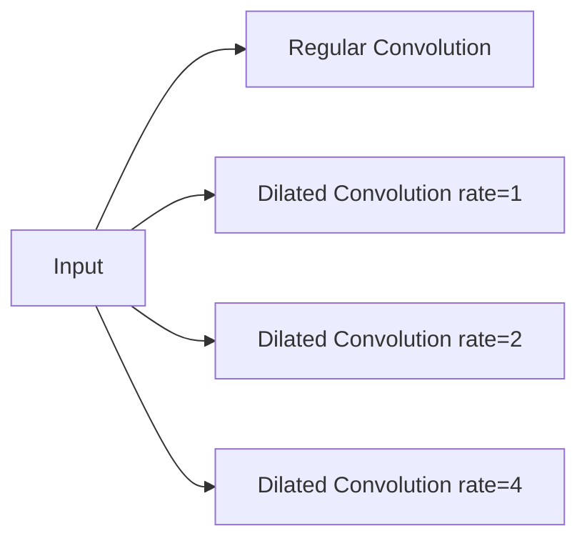

# 从零开始大模型开发与微调：膨胀卷积详解

作者：禅与计算机程序设计艺术 / Zen and the Art of Computer Programming 

## 1. 背景介绍
### 1.1 问题的由来
近年来，随着深度学习的快速发展，大规模预训练语言模型（PLM）在自然语言处理（NLP）领域取得了巨大的成功。这些大模型通过在海量文本数据上进行预训练，可以学习到丰富的语言知识和语义表示，并在下游任务上取得了显著的性能提升。然而，训练这些大模型需要消耗大量的计算资源和时间成本，对于普通研究者和开发者来说存在一定的门槛。如何从零开始高效地开发和微调大模型，成为了一个亟待解决的问题。

### 1.2 研究现状
目前，业界主流的大模型训练方法主要包括 BERT[1]、GPT[2]、T5[3] 等基于 Transformer 架构的模型。这些模型通过引入注意力机制和大规模预训练，在多个 NLP 任务上取得了 state-of-the-art 的结果。但同时，这些模型的参数量非常庞大，动辄上亿甚至千亿级别，给模型训练和部署带来了巨大的挑战。

为了提高大模型训练的效率，研究者们提出了一系列优化方法，如梯度累积[4]、混合精度训练[5]、模型压缩[6]等技术。其中，一个备受关注的方向是通过改进模型架构来减小参数量和计算复杂度，如 Transformer-XL[7]、Reformer[8]、Longformer[9] 等轻量化的 Transformer 变体。这些方法在保持模型性能的同时，大大降低了模型的资源消耗。

### 1.3 研究意义
探索高效的大模型开发与微调方法，对于推动 NLP 技术的普及和应用具有重要意义。一方面，它可以降低模型训练的门槛，让更多的研究者和开发者参与到大模型的开发中来；另一方面，通过架构创新和算法优化，有望进一步提升模型的性能和效率，加速 NLP 技术在各领域的落地应用。

本文将重点介绍一种称为"膨胀卷积"（Dilated Convolution）的技术，并探讨如何将其应用于大模型的开发与微调中。膨胀卷积通过引入空洞率，可以在不增加参数量的情况下扩大卷积核的感受野，从而提高模型捕捉长距离依赖的能力。我们将详细阐述膨胀卷积的原理和实现，并通过实验证明其在大模型训练中的有效性。

### 1.4 本文结构
本文的结构安排如下：第2节介绍了膨胀卷积的核心概念及其与传统卷积的联系；第3节重点阐述膨胀卷积的算法原理和具体操作步骤；第4节给出了膨胀卷积的数学模型和公式推导过程，并结合案例进行详细讲解；第5节展示了如何使用膨胀卷积实现大模型的开发与微调，给出了详细的代码实例和解释说明；第6节讨论了膨胀卷积在实际应用场景中的价值；第7节推荐了一些学习膨胀卷积和大模型开发的工具和资源；第8节总结了全文的内容，并对膨胀卷积和大模型技术的未来发展趋势与挑战进行了展望；第9节的附录部分列出了一些常见问题及其解答。

## 2. 核心概念与联系

膨胀卷积（Dilated Convolution），也称为空洞卷积（Atrous Convolution），是一种能够在不增加参数量和计算量的情况下扩大卷积核感受野的技术。与传统的卷积操作不同，膨胀卷积在卷积核内引入了空洞（dilation），即在相邻两个卷积核参数之间插入了若干个0，从而使得卷积核可以覆盖更广的区域。

下图展示了一维情况下，不同空洞率（dilation rate）的膨胀卷积与普通卷积的差异：

可以看到，当空洞率为1时，膨胀卷积退化为普通卷积；随着空洞率的增大，卷积核的感受野也随之扩大，但卷积核参数的数量和间隔保持不变。这使得膨胀卷积可以在不引入额外参数和计算量的情况下，捕捉更长距离的特征依赖关系。

在大模型的开发与微调中，我们可以将膨胀卷积引入到模型的编码器和解码器部分，替换原有的普通卷积或注意力操作。通过合理地设置空洞率，可以在不显著增加模型复杂度的情况下，提高模型处理长文本的能力，加速收敛速度和泛化性能。

## 3. 核心算法原理 & 具体操作步骤
### 3.1 算法原理概述
膨胀卷积的核心思想是在卷积核内引入空洞（dilation），通过跳跃地应用卷积核参数，在不增加参数量的情况下扩大感受野。假设卷积核的大小为 $k$，空洞率为 $d$，则对于一维输入序列 $\mathbf{x} \in \mathbb{R}^n$ 上的位置 $i$，膨胀卷积的输出为：

$$y[i]=\sum_{j=1}^k x[i+d\cdot(j-1)] \cdot w[j]$$

其中，$\mathbf{w} \in \mathbb{R}^k$ 为卷积核参数。可以看到，当 $d=1$ 时，膨胀卷积退化为普通卷积；随着 $d$ 的增大，卷积核的感受野呈指数级扩展，但参数量和计算复杂度保持不变。

对于二维输入 $\mathbf{X} \in \mathbb{R}^{h \times w}$，膨胀卷积的输出为：

$$Y[i,j]=\sum_{m=1}^k \sum_{n=1}^k X[i+d\cdot(m-1),j+d\cdot(n-1)] \cdot W[m,n]$$

其中，$\mathbf{W} \in \mathbb{R}^{k \times k}$ 为卷积核参数。同样地，通过调节空洞率 $d$，可以灵活控制卷积核的感受野大小。

### 3.2 算法步骤详解
下面以一维膨胀卷积为例，详细介绍其具体的操作步骤：

输入：序列 $\mathbf{x} \in \mathbb{R}^n$，卷积核大小 $k$，空洞率 $d$
输出：卷积结果 $\mathbf{y} \in \mathbb{R}^{n-d\cdot(k-1)}$

1. 初始化卷积核参数 $\mathbf{w} \in \mathbb{R}^k$，可以随机初始化或使用预训练的权重。
2. 对于输出序列的每个位置 $i$，执行以下操作：
   1. 根据空洞率 $d$，确定卷积核在输入序列上的起始位置 $s=i$，终止位置 $e=i+d\cdot(k-1)$。
   2. 提取输入序列的相应片段 $\mathbf{x}[s:e+1:d]$，其中 $::d$ 表示以间隔 $d$ 进行切片。
   3. 将卷积核参数 $\mathbf{w}$ 与输入片段进行逐元素相乘，然后求和，得到输出序列的第 $i$ 个元素 $y[i]$。
3. 返回输出序列 $\mathbf{y}$。

通过调整空洞率 $d$，可以灵活控制卷积核的感受野大小。当 $d=1$ 时，膨胀卷积退化为普通卷积；随着 $d$ 的增大，卷积核可以覆盖更广的区域，捕捉更长距离的依赖关系。

### 3.3 算法优缺点
膨胀卷积相比普通卷积具有以下优点：
1. 在不增加参数量和计算复杂度的情况下，可以显著扩大卷积核的感受野，捕捉更长距离的特征依赖关系。
2. 通过调节空洞率，可以灵活控制感受野的大小，适应不同任务和数据的需求。
3. 可以与其他卷积变体（如可分离卷积）结合使用，进一步提高模型的效率和性能。

同时，膨胀卷积也存在一些局限性：
1. 空洞率过大时，可能会引入网格效应（gridding effect），导致卷积核只关注输入的某些特定位置，忽略了其他重要信息。
2. 在某些任务中，膨胀卷积可能不如注意力机制或全局池化等操作有效，需要根据具体问题进行选择和权衡。

### 3.4 算法应用领域
膨胀卷积在计算机视觉和自然语言处理等领域有广泛的应用，特别是在需要捕捉长距离依赖关系的任务中，如：
1. 语义分割：通过膨胀卷积可以扩大感受野，更好地捕捉物体的全局信息和上下文关系，提高分割的准确性[10]。
2. 目标检测：使用膨胀卷积可以在不增加计算量的情况下，提高检测网络对不同尺度目标的适应性[11]。
3. 语言模型：将膨胀卷积引入 Transformer 等语言模型中，可以提高模型捕捉长距离依赖的能力，加速收敛速度和泛化性能[12]。
4. 语音合成：在 WaveNet 等语音合成模型中，膨胀卷积被用于扩大感受野，生成更自然流畅的语音[13]。

## 4. 数学模型和公式 & 详细讲解 & 举例说明
### 4.1 数学模型构建
为了更清晰地理解膨胀卷积的数学原理，我们首先给出其形式化定义。对于一维输入序列 $\mathbf{x} \in \mathbb{R}^n$，卷积核大小为 $k$，空洞率为 $d$，膨胀卷积的数学模型可以表示为：

$$y[i]=\sum_{j=1}^k x[i+d\cdot(j-1)] \cdot w[j], \quad i=1,2,\dots,n-d\cdot(k-1)$$

其中，$y[i]$ 表示输出序列的第 $i$ 个元素，$w[j]$ 表示卷积核的第 $j$ 个参数。当空洞率 $d=1$ 时，膨胀卷积退化为普通卷积：

$$y[i]=\sum_{j=1}^k x[i+j-1] \cdot w[j], \quad i=1,2,\dots,n-k+1$$

对于二维输入 $\mathbf{X} \in \mathbb{R}^{h \times w}$，卷积核大小为 $k \times k$，空洞率为 $d$，膨胀卷积的数学模型为：

$$Y[i,j]=\sum_{m=1}^k \sum_{n=1}^k X[i+d\cdot(m-1),j+d\cdot(n-1)] \cdot W[m,n]$$

其中，$Y[i,j]$ 表示输出特征图的第 $(i,j)$ 个元素，$W[m,n]$ 表示卷积核的第 $(m,n)$ 个参数。同样地，当 $d=1$ 时，膨胀卷积退化为普通卷积。

### 4.2 公式推导过程
下面我们以一维膨胀卷积为例，详细推导其前向传播和反向传播的公式。

假设输入序列为 $\mathbf{x} \in \mathbb{R}^n$，卷积核参数为 $\mathbf{w} \in \mathbb{R}^k$，空洞率为 $d$，输出序列为 $\mathbf{y} \in \mathbb{R}^{n-d\cdot(k-1)}$。

前向传播：
$$y[i]=\sum_{j=1}^k x[i+d\cdot(j-1)] \cdot w[j], \quad i=1,2,\dots,n-d\cdot(k-1)$$

反向传