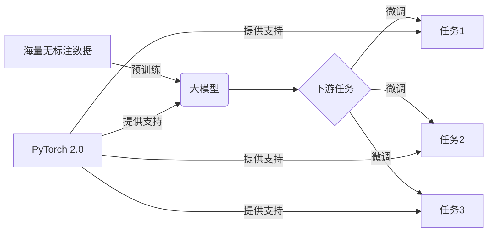

# 从零开始大模型开发与微调：选择PyTorch 2.0实战框架

关键词：大模型、PyTorch 2.0、微调、预训练、深度学习

## 1. 背景介绍 
### 1.1 问题的由来
近年来，随着深度学习技术的飞速发展，大模型在各个领域得到了广泛的应用。从自然语言处理到计算机视觉，从语音识别到推荐系统，大模型正在改变着我们的生活。然而，对于许多开发者和研究人员来说，从零开始开发和微调大模型仍然是一个巨大的挑战。选择合适的深度学习框架至关重要。

### 1.2 研究现状
目前，业界主流的深度学习框架包括TensorFlow、PyTorch、Keras等。其中，PyTorch凭借其动态计算图、易用性和灵活性，受到了越来越多开发者的青睐。尤其是最新发布的PyTorch 2.0，更是集成了诸多新特性和性能优化，使其成为大模型开发的不二之选。

### 1.3 研究意义
掌握如何使用PyTorch 2.0进行大模型开发与微调，对于个人能力提升和行业技术进步都具有重要意义。一方面，它可以帮助开发者快速上手大模型开发，提高开发效率；另一方面，对大模型微调方法的探索，有助于推动人工智能技术的发展，解决实际应用中的问题。

### 1.4 本文结构
本文将围绕PyTorch 2.0框架，系统地介绍大模型开发与微调的整个流程。内容涵盖了核心概念解析、算法原理剖析、数学模型推导、代码实战等多个方面。通过理论与实践相结合的方式，帮助读者全面掌握大模型开发的关键技术。

## 2. 核心概念与联系
在开始详细探讨之前，我们有必要对几个核心概念进行必要的说明：

- 大模型：泛指参数量巨大（一般在亿级以上）的深度神经网络模型，如GPT-3、BERT、DALL-E等。它们在海量数据上进行预训练，具备强大的特征提取和泛化能力。

- 预训练：指在大规模无标注数据上，以自监督学习的方式训练模型，使其学习到通用的特征表示。这是大模型的基础。

- 微调：在预训练的基础上，针对下游任务，用少量标注数据对模型进行二次训练，使其适应特定任务。微调可以显著提升模型性能，是应用大模型的关键。

- PyTorch 2.0：由Facebook开源的深度学习框架，其2.0版本对编译器、分布式训练、性能优化等方面进行了增强，为大模型训练提供了更好的支持。

下图展示了这些概念之间的关系：



## 3. 核心算法原理 & 具体操作步骤
### 3.1 算法原理概述
大模型的预训练和微调，本质上是在最小化某个损失函数。预训练阶段通常采用自监督学习，构建预测目标，如掩码语言模型（MLM）、自回归语言模型（ALM）等；微调阶段则根据下游任务的类型，设计对应的损失函数，如交叉熵损失、平方损失等。PyTorch提供了多种优化算法，如SGD、Adam等，用于高效求解损失函数的最小值。

### 3.2 算法步骤详解
以MLM预训练为例，其核心步骤如下：

1. 随机掩码输入序列中的部分Token，用特殊符号[MASK]替换
2. 将掩码后的序列输入模型，得到每个位置的输出向量
3. 将输出向量与词表做内积，通过Softmax归一化得到每个Token的概率分布
4. 将概率分布与真实标签做交叉熵，得到MLM损失
5. 反向传播MLM损失，更新模型参数

微调阶段的步骤与预训练类似，区别在于损失函数的构建方式，以及数据集的规模和领域。

### 3.3 算法优缺点
预训练-微调范式的优点在于：

- 通过在大规模数据上预训练，模型可以学习到更加通用、鲁棒的特征表示，具备更强的泛化能力
- 微调阶段只需少量标注数据，可以显著降低人工标注成本
- 微调出的模型性能通常优于从头训练

但它也存在一些局限性：

- 预训练需要巨大的计算资源和时间开销，对中小型团队而言难以承担
- 部分任务与预训练数据的领域差异较大，微调的提升效果有限
- 微调阶段容易出现过拟合，需要谨慎设计训练策略

### 3.4 算法应用领域
基于大模型的预训练-微调范式，已在多个领域取得了瞩目成就，如：

- 自然语言处理：机器翻译、文本分类、命名实体识别、问答系统等
- 计算机视觉：图像分类、目标检测、语义分割、图像生成等  
- 语音识别：声学模型、语言模型的预训练与微调
- 推荐系统：序列推荐、跨域推荐等

未来，随着模型设计和训练技术的进一步发展，大模型有望在更多领域发挥重要作用。

## 4. 数学模型和公式 & 详细讲解 & 举例说明
### 4.1 数学模型构建
对于使用Transformer结构的大模型，其数学形式可以抽象为：

$$\begin{aligned}
\mathbf{H}^0 &= \mathbf{E}\mathbf{X} + \mathbf{P} \\
\mathbf{H}^l &= \text{Transformer}(\mathbf{H}^{l-1}), l=1,2,\dots,L \\
\mathbf{O} &= \text{LM_Head}(\mathbf{H}^L)
\end{aligned}$$

其中，$\mathbf{X} \in \mathbb{R}^{n \times d}$为输入序列，$n$为序列长度，$d$为特征维度；$\mathbf{E} \in \mathbb{R}^{|\mathcal{V}| \times d}$为Token的嵌入矩阵，$|\mathcal{V}|$为词表大小；$\mathbf{P} \in \mathbb{R}^{n \times d}$为位置编码；$\mathbf{H}^l$为第$l$层Transformer的输出；$\mathbf{O} \in \mathbb{R}^{n \times |\mathcal{V}|}$为最终的输出概率分布。

Transformer的内部结构可以进一步表示为：

$$\begin{aligned}
\mathbf{A}^l &= \text{SelfAttention}(\mathbf{H}^{l-1}) \\
\mathbf{I}^l &= \text{LayerNorm}(\mathbf{H}^{l-1} + \mathbf{A}^l) \\ 
\mathbf{F}^l &= \text{FeedForward}(\mathbf{I}^l) \\
\mathbf{H}^l &= \text{LayerNorm}(\mathbf{I}^l + \mathbf{F}^l)
\end{aligned}$$

其中，$\text{SelfAttention}$、$\text{FeedForward}$、$\text{LayerNorm}$分别对应自注意力机制、前馈网络和层归一化操作。

### 4.2 公式推导过程
以MLM为例，其损失函数可以定义为：

$$\mathcal{L}_{\text{MLM}} = -\frac{1}{|\mathcal{M}|} \sum_{i \in \mathcal{M}} \log P(x_i | \mathbf{X}_{\backslash i})$$

其中，$\mathcal{M}$为被掩码位置的集合，$\mathbf{X}_{\backslash i}$表示掩码$x_i$后的输入序列。$P(x_i | \mathbf{X}_{\backslash i})$可以通过模型输出$\mathbf{O}$的第$i$行与One-Hot编码的$x_i$做交叉熵得到：

$$P(x_i | \mathbf{X}_{\backslash i}) = \frac{\exp(o_{i,x_i})}{\sum_{j=1}^{|\mathcal{V}|} \exp(o_{i,j})}$$

模型训练过程就是通过不断最小化MLM损失，来优化模型参数。

### 4.3 案例分析与讲解
下面我们以一个简单的例子，来说明MLM的计算过程。假设输入序列为"I love [MASK] music"，其中"classical"被掩码。经过Transformer后，模型在[MASK]位置输出的概率分布为：

| Token | classic | classical | pop | rock |
| ----- | ------- | --------- | --- | ---- |
| Prob  | 0.1     | 0.6       | 0.2 | 0.1  |

则MLM损失为：

$$\mathcal{L}_{\text{MLM}} = -\log P(\text{classical} | \text{I love [MASK] music}) = -\log 0.6 \approx 0.51$$  

可见，模型对正确Token"classical"给出了较高的概率，MLM损失较小，说明模型已经学会了根据上下文预测被掩码词。

### 4.4 常见问题解答
Q: MLM损失为什么要对batch内取平均？
A: 取平均可以消除不同长度序列对损失的影响，使损失更加稳定。同时也可以方便地与batch size解耦，便于超参数调优。

Q: 预训练时需要多大的数据集？
A: 一般来说，数据集越大，模型性能越好。当前SOTA的大模型如GPT-3，其预训练数据量达到了上千GB。但对于特定领域，百GB量级的数据也可以训练出不错的模型。

Q: 微调时需要注意哪些问题？ 
A: 微调时要注意以下几点：
1）学习率要设置得较小，一般比预训练时小1-2个数量级；
2）批量大小也要适当减小，避免过拟合；
3）可以使用梯度裁剪、权重衰减等正则化手段；
4）根据任务难易程度，控制微调的轮数。

## 5. 项目实践：代码实例和详细解释说明
接下来，我们使用PyTorch 2.0，来实现一个基于Transformer的MLM预训练。

### 5.1 开发环境搭建
首先确保已经正确安装PyTorch 2.0：

```bash
pip install torch torchvision torchaudio --index-url https://download.pytorch.org/whl/cu118
```

然后安装必要的NLP工具包：

```bash
pip install transformers datasets tokenizers
```

### 5.2 源代码详细实现
定义Transformer模型：

```python
import torch
import torch.nn as nn
from transformers import BertConfig, BertForMaskedLM

class MyBertModel(nn.Module):
    def __init__(self, config):
        super().__init__()
        self.bert = BertForMaskedLM(config)
        
    def forward(self, input_ids, attention_mask, token_type_ids, labels):
        outputs = self.bert(input_ids, attention_mask, token_type_ids, labels=labels)
        loss = outputs.loss
        logits = outputs.logits
        return loss, logits
```

加载预训练数据集：

```python
from datasets import load_dataset

dataset = load_dataset('wikitext', 'wikitext-2-raw-v1', split='train')
dataset = dataset.map(lambda x: tokenizer(x['text']), batched=True)
dataset.set_format(type='torch', columns=['input_ids', 'attention_mask', 'token_type_ids'])
dataloader = torch.utils.data.DataLoader(dataset, batch_size=4, shuffle=True)
```

定义训练循环：

```python
from torch.optim import AdamW

model = MyBertModel(BertConfig())
model.to(device)
optimizer = AdamW(model.parameters(), lr=1e-4)

num_epochs = 10
for epoch in range(num_epochs):
    for batch in dataloader:
        input_ids = batch['input_ids'].to(device)
        attention_mask = batch['attention_mask'].to(device) 
        token_type_ids = batch['token_type_ids'].to(device)
        labels = input_ids.clone()
        
        # 随机掩码
        rand = torch.rand(input_ids.shape)
        mask_arr = (rand < 0.15) * (input_ids != 101) * (input_ids != 102) * (input_ids != 0)
        