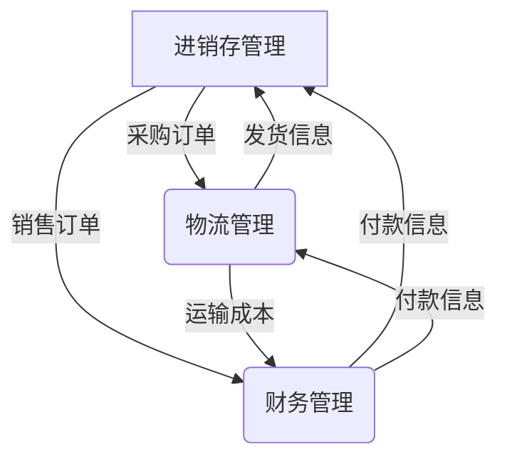

# 供应链进销存、物流、财务系统设计

## 1. 背景介绍

### 1.1 问题的由来

在当今瞬息万变的商业环境中，供应链管理对于企业的成功至关重要。有效的供应链管理可以确保原材料和产品的及时供应、降低库存成本、提高客户满意度并增强企业的竞争力。然而,随着业务规模的扩大和供应链复杂性的增加,手动管理供应链变得越来越具有挑战性。因此,需要一个综合的供应链管理系统来集成进销存、物流和财务等关键模块,实现供应链的自动化和优化。

### 1.2 研究现状

目前,已有许多供应链管理系统在企业中广泛应用,如SAP、Oracle等。这些系统通常包括采购、库存管理、订单处理、运输和财务等模块。然而,由于每个企业的业务流程和需求不尽相同,现有的通用解决方案可能无法完全满足特定企业的需求。因此,开发一个定制化的、集成进销存、物流和财务模块的供应链管理系统,对于提高企业运营效率和降低成本具有重要意义。

### 1.3 研究意义

设计并实现一个集成进销存、物流和财务模块的供应链管理系统,可以带来以下好处:

1. **提高运营效率**: 通过自动化和优化供应链流程,减少人工错误,加快响应速度,提高整体运营效率。

2. **降低成本**: 优化库存管理,减少滞销和缺货情况,降低存货成本;优化物流路线,降低运输成本;集成财务模块,提高资金使用效率。

3. **增强竞争力**: 通过提供优质的产品和服务,提高客户满意度,增强企业在市场上的竞争力。

4. **决策支持**: 系统可以提供实时数据分析和报告,为管理层的决策提供支持。

5. **可扩展性**: 模块化设计使系统具有良好的可扩展性,可根据业务需求进行定制和扩展。

### 1.4 本文结构

本文将详细介绍集成进销存、物流和财务模块的供应链管理系统的设计和实现。文章主要包括以下几个部分:

1. **核心概念与联系**: 介绍供应链管理系统的核心概念,以及各模块之间的关系和交互。

2. **核心算法原理与具体操作步骤**: 阐述系统中使用的关键算法原理,如库存优化算法、物流路径规划算法等,并给出具体的操作步骤。

3. **数学模型和公式详细讲解与举例说明**: 介绍系统中使用的数学模型和公式,如库存模型、运输模型等,并通过案例进行详细讲解。

4. **项目实践:代码实例和详细解释说明**: 提供系统的代码实现示例,并对关键模块的代码进行解释和分析。

5. **实际应用场景**: 介绍系统在实际企业中的应用场景,并分析其带来的好处和影响。

6. **工具和资源推荐**: 推荐与供应链管理系统相关的学习资源、开发工具和论文等。

7. **总结:未来发展趋势与挑战**: 总结系统的研究成果,展望未来发展趋势,并分析可能面临的挑战。

8. **附录:常见问题与解答**: 列出一些常见问题及其解答,以帮助读者更好地理解和使用该系统。

## 2. 核心概念与联系

在设计供应链管理系统之前,我们需要了解其中涉及的一些核心概念,以及这些概念之间的关系和交互。

### 2.1 进销存管理

进销存管理是供应链管理系统的核心模块之一,负责管理原材料和产品的采购、库存和销售等流程。它包括以下几个主要概念:

1. **采购管理**: 根据生产计划和库存情况,向供应商下达采购订单,确保原材料的及时供应。

2. **库存管理**: 跟踪原材料和产品的库存水平,实现库存的有效管理和优化。

3. **销售管理**: 处理客户订单,安排发货,并跟踪订单状态。

4. **供应商管理**: 维护供应商信息,评估供应商表现,选择合适的供应商。

5. **客户管理**: 维护客户信息,了解客户需求,提供优质的客户服务。

### 2.2 物流管理

物流管理负责原材料和产品在供应链中的运输和配送。它包括以下几个主要概念:

1. **运输规划**: 根据订单信息和库存情况,规划运输路线和方式,确保货物的及时送达。

2. **车辆调度**: 合理分配和调度运输车辆,提高运输效率。

3. **仓储管理**: 管理仓库的布局、货位分配和出入库流程。

4. **配送管理**: 安排最后一公里的配送,确保货物准确送达客户手中。

### 2.3 财务管理

财务管理模块负责管理与供应链相关的财务流程,包括:

1. **成本核算**: 计算原材料采购成本、生产成本、运输成本等,为成本控制提供依据。

2. **收入管理**: 跟踪销售订单的收款情况,确保及时收取款项。

3. **支出管理**: 跟踪采购付款、运输付款等支出情况,控制支出。

4. **财务报告**: 生成各种财务报表,如损益表、现金流量表等,为决策提供支持。

### 2.4 模块之间的关系

上述三个模块之间存在着紧密的关系和交互,如下图所示:

1. 进销存管理模块根据生产计划和库存情况向物流管理模块下达采购订单,物流管理模块则安排运输,将原材料送达。

2. 物流管理模块将发货信息反馈给进销存管理模块,以更新库存信息。

3. 进销存管理模块将销售订单信息传递给财务管理模块,用于收入核算。

4. 物流管理模块将运输成本信息传递给财务管理模块,用于成本核算。

5. 财务管理模块将付款信息反馈给进销存管理模块和物流管理模块,以确保及时付款。

通过模块之间的紧密集成和协作,供应链管理系统可以实现高效、协调的运营。

## 3. 核心算法原理与具体操作步骤

在供应链管理系统中,有几个核心算法用于优化供应链流程,提高运营效率。本节将介绍这些算法的原理和具体操作步骤。

### 3.1 算法原理概述

#### 3.1.1 库存优化算法

库存优化算法旨在确定最优库存水平,以平衡库存成本和缺货风险。常用的算法包括经济订货量(EOQ)模型、安全库存模型等。

#### 3.1.2 物流路径规划算法

物流路径规划算法用于确定最优的运输路线,以降低运输成本和时间。常用的算法包括旅行商问题(TSP)算法、车辆路径问题(VRP)算法等。

#### 3.1.3 需求预测算法

需求预测算法用于预测未来的产品需求,以便进行生产计划和库存管理。常用的算法包括移动平均法、指数平滑法、回归分析等。

### 3.2 算法步骤详解

#### 3.2.1 库存优化算法步骤

以经济订货量(EOQ)模型为例,优化库存水平的步骤如下:

1. 收集相关数据,包括年度需求量、订货成本、库存持有成本等。

2. 计算经济订货量:

$$EOQ = \sqrt{\frac{2 \times 年度需求量 \times 订货成本}{库存持有成本}}$$

3. 计算最优订货间隔:

$$最优订货间隔 = \frac{年度需求量}{EOQ}$$

4. 确定重订点(ROP):

$$ROP = 安全库存 + (最大领料率 \times 最大补货延迟时间)$$

5. 根据EOQ、最优订货间隔和ROP制定库存管理策略。

6. 持续监控库存水平,在达到重订点时下达采购订单。

#### 3.2.2 物流路径规划算法步骤

以旅行商问题(TSP)算法为例,规划最优运输路线的步骤如下:

1. 收集所有需要运输的地点的坐标信息。

2. 计算任意两个地点之间的距离矩阵。

3. 使用遗传算法、蚁Colony优化算法等启发式算法求解TSP问题,得到最短路径。

4. 根据最短路径安排运输车辆的行程。

5. 考虑实际道路情况、交通状况等因素,对路线进行微调。

6. 将规划好的路线分配给相应的运输车辆执行。

#### 3.2.3 需求预测算法步骤

以移动平均法为例,预测未来需求的步骤如下:

1. 收集历史销售数据,确定预测周期(如月度或季度)。

2. 选择移动平均周期n(如3个月或4个季度)。

3. 计算最近n个周期的平均销量作为下一个周期的预测值:

$$预测值 = \frac{本周期销量 + 上一周期销量 + \cdots + (n-1)周期前销量}{n}$$

4. 在下一个周期结束后,用实际销量替换最早的一个周期的销量,重复第3步计算新的预测值。

5. 持续迭代,不断更新预测值。

### 3.3 算法优缺点

#### 3.3.1 库存优化算法

**优点**:

- 可以有效降低库存成本和缺货风险。
- 算法简单,易于实现和理解。

**缺点**:

- 假设需求率和相关成本保持不变,无法处理动态变化的情况。
- 没有考虑到其他因素,如季节性波动、促销活动等。

#### 3.3.2 物流路径规划算法

**优点**:

- 可以找到最优或近似最优的运输路线,降低运输成本和时间。
- 算法可以考虑多种约束条件,如时间窗口、车辆载重量等。

**缺点**:

- 计算复杂度较高,对于大规模问题可能需要较长的计算时间。
- 需要准确的地理位置信息和路网数据作为输入。
- 算法结果可能与实际情况有一定偏差,需要人工调整。

#### 3.3.3 需求预测算法

**优点**:

- 算法简单,易于实现和理解。
- 可以根据历史数据预测未来需求,为生产计划和库存管理提供依据。

**缺点**:

- 预测精度受历史数据质量和数据量的影响。
- 无法很好地捕捉需求的突变和趋势变化。
- 需要合理选择预测周期和平均周期,否则可能导致预测偏差。

### 3.4 算法应用领域

上述算法在供应链管理系统中有广泛的应用:

- **库存优化算法**应用于进销存管理模块,用于确定最优库存水平,降低库存成本。
- **物流路径规划算法**应用于物流管理模块,用于规划最优运输路线,降低运输成本和时间。
- **需求预测算法**应用于进销存管理模块和生产计划模块,用于预测未来需求,为生产计划和库存管理提供依据。

除了供应链管理系统,这些算法还可以应用于其他领域,如制造业、零售业、电子商务等。

## 4. 数学模型和公式详细讲解与举例说明

在供应链管理系统中,我们需要构建一些数学模型来描述和优化供应链流程。本节将介绍几个常用的数学模型及其公式,并通过案例进行详细讲解。

### 4.1 数学模型构建

#### 4.1.1 库存模型

库存模型用于描述库存水平的变化,并确定最优库存策略。常用的库存模型包括经济