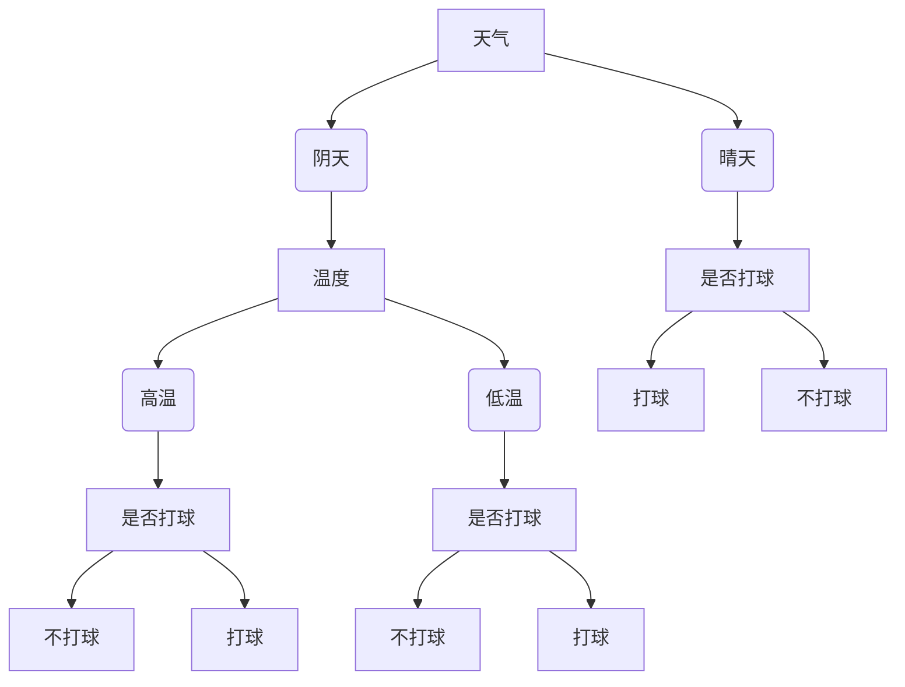

# 决策树 (Decision Tree)

## 1. 背景介绍

### 1.1 问题的由来

在现实世界中,我们经常需要根据一些特征或条件来做出决策。例如,一家银行在审批贷款申请时,需要根据申请人的收入、信用记录、抵押品等信息来决定是否批准贷款。一家医院在诊断疾病时,需要根据病人的症状、体征、化验结果等数据来确定病因。这些决策过程涉及大量的数据和复杂的规则,人工处理容易出现失误和低效率的问题。

为了解决这一问题,决策树(Decision Tree)作为一种有监督的机器学习算法应运而生。它模拟人类的决策过程,根据训练数据自动构建决策树模型,从而可以对新的数据进行高效、准确的决策和预测。

### 1.2 研究现状

决策树算法最早可以追溯到20世纪60年代,当时主要应用于模式识别、专家系统等领域。随着机器学习和数据挖掘技术的发展,决策树算法在近几十年得到了广泛的研究和应用。目前,决策树已经成为数据挖掘中最常用、最有影响力的算法之一,被广泛应用于分类、回归、关联规则挖掘等任务中。

主流的决策树算法包括ID3、C4.5、CART等,它们在算法细节上有所不同,但都遵循类似的"自顶向下、递归分治"的思路。此外,还有一些改进算法,如随机森林(Random Forest)、梯度提升决策树(Gradient Boosting Decision Tree)等,旨在提高决策树的泛化能力和鲁棒性。

### 1.3 研究意义

决策树具有以下优点:

1. **可解释性强**:决策树模型以树状结构表示,每个节点对应一个特征,每条路径对应一个决策规则,易于人类理解。
2. **无需特征预处理**:决策树可以直接处理数值型和类别型特征,无需进行标准化等预处理。
3. **处理缺失值能力强**:决策树在构建过程中可以很好地处理缺失值。
4. **计算速度快**:决策树的预测速度非常快,适合实时决策场景。

因此,决策树广泛应用于金融风险评估、医疗诊断、客户细分、图像识别等领域。同时,决策树也是构建更加复杂的集成学习算法(如随机森林、梯度提升树等)的基础。

### 1.4 本文结构

本文将全面介绍决策树算法的理论基础、核心原理、实现细节和实际应用。具体内容安排如下:

- 第2章介绍决策树的核心概念和基本原理。
- 第3章详细阐述经典决策树算法(如ID3、C4.5、CART)的原理和具体操作步骤。
- 第4章探讨决策树算法的数学模型和公式推导过程,并通过实例进行说明。
- 第5章提供决策树算法的代码实现和详细解读。
- 第6章介绍决策树在不同领域的实际应用场景。
- 第7章推荐相关的学习资源、开发工具和论文资源。
- 第8章总结决策树算法的发展趋势和面临的挑战。
- 第9章列出常见问题并给出解答。

## 2. 核心概念与联系

决策树算法涉及以下几个核心概念:

1. **决策节点(Decision Node)**: 树的非叶子节点,表示对一个特征进行判断或测试。
2. **分支(Branch)**: 从决策节点引出的箭头,对应该特征的不同取值。
3. **叶节点(Leaf Node)**: 树的叶子节点,表示一个决策结果或类别。
4. **信息增益(Information Gain)**: 选择最优决策特征的标准,通过计算不同特征的信息增益来确定分裂特征。
5. **熵(Entropy)**: 表示数据集的无序程度或纯度,是计算信息增益的基础。
6. **剪枝(Pruning)**: 为了防止过拟合,决策树通常需要进行剪枝操作,去除一些不重要的分支和节点。

这些概念之间存在密切联系,构成了决策树算法的理论基础。下面我们通过一个简单的例子来直观地理解它们:

这是一个根据天气情况决定是否打球的决策树示例。其中:

- 决策节点为"天气"和"温度"。
- 分支为"阴天"、"晴天"、"高温"、"低温"。
- 叶节点为"打球"和"不打球"。
- 在构建过程中,算法需要计算"天气"和"温度"特征的信息增益,选择增益最大的特征作为决策节点。
- 对于"打球"和"不打球"的叶节点,其熵为0,表示纯度最高。

通过这个例子,我们可以直观地理解决策树算法的基本工作原理。接下来,我们将深入探讨决策树的核心算法。

## 3. 核心算法原理 & 具体操作步骤

### 3.1 算法原理概述

决策树算法的核心思想是"自顶向下、递归分治"。具体来说,算法从根节点开始,对数据集中的所有样本进行判断,根据最优特征将样本分配到不同的子节点,然后对子节点中的样本继续递归地进行分裂,直到满足停止条件(如所有样本属于同一类别、没有剩余特征可分裂、或者分裂后的增益小于阈值等)。

算法的关键步骤如下:

1. **选择最优特征**: 在每个节点上,计算所有特征的信息增益,选择增益最大的特征作为该节点的分裂特征。
2. **生成子节点**: 根据分裂特征的不同取值,将数据集分配到不同的子节点。
3. **递归分裂**: 对每个子节点中的数据集,重复执行步骤1和2,直到满足停止条件。
4. **生成叶节点**: 当满足停止条件时,将当前节点标记为叶节点,并为其指定一个类别或输出值。

在构建决策树的同时,算法还需要考虑如何防止过拟合,通常采用预剪枝(pre-pruning)或后剪枝(post-pruning)的方法来控制树的复杂度。

下面我们将详细介绍经典的ID3、C4.5和CART算法的具体操作步骤。

### 3.2 算法步骤详解

#### 3.2.1 ID3算法

ID3(Iterative Dichotomiser 3)算法是最早提出的决策树算法之一,由Ross Quinlan于1986年发表。它的主要步骤如下:

1. **计算数据集的熵**:熵表示数据集的无序程度,计算公式为:

$$
H(X) = -\sum_{i=1}^{n}p(x_i)\log_2 p(x_i)
$$

其中,n是类别数,p(x_i)是第i类样本的概率。

2. **计算每个特征的信息增益**:信息增益表示使用该特征进行分裂后,数据集的无序程度减少的程度。计算公式为:

$$
\text{Gain}(X, a) = H(X) - H(X|a)
$$

其中,H(X|a)是在特征a的条件下,X的条件熵。

3. **选择信息增益最大的特征作为分裂特征**。
4. **根据分裂特征的取值,生成子节点**。
5. **对每个子节点,重复执行步骤1到4,递归构建决策树**。
6. **当所有样本属于同一类别或没有剩余特征可分裂时,生成叶节点**。

ID3算法的优点是简单、高效,但也存在一些缺陷,如无法处理连续特征、容易过拟合、存在数据偏斜等问题。

#### 3.2.2 C4.5算法

C4.5算法是ID3算法的改进版本,由Ross Quinlan于1993年提出。它主要解决了ID3算法无法处理连续特征和缺失值的问题,并引入了剪枝策略来防止过拟合。主要步骤如下:

1. **对于连续特征,根据信息增益最大化原则,选择最优分割点**。
2. **对于缺失值,C4.5采用了特殊的处理方式**:
   - 在计算信息增益时,将缺失值分配到各个分支,权重为该分支在样本中的占比。
   - 在实际分裂时,将缺失值样本分配到增益最大的子节点。
3. **引入了基于信息增益率的特征选择**,以避免偏向选择取值较多的特征。信息增益率的计算公式为:

$$
\text{Gain\_ratio}(X, a) = \frac{\text{Gain}(X, a)}{H_a(X)}
$$

其中,H_a(X)是特征a对X的值的熵。

4. **采用后剪枝策略**:首先构建一棵完整的决策树,然后根据估计的错误率,逐步剪去一些分支和节点,从而降低过拟合风险。

C4.5算法在处理连续特征、缺失值和防止过拟合方面有了明显改进,但仍然存在一些缺陷,如对于数据偏斜的情况,信息增益率准则可能会失效。

#### 3.2.3 CART算法

CART(Classification and Regression Tree)算法是由Breiman等人于1984年提出的,它不仅可以用于分类任务,还可以用于回归任务。CART算法的主要步骤如下:

1. **对于分类问题,CART采用基尼指数(Gini Index)作为特征选择准则**,而不是信息增益或信息增益率。基尼指数的计算公式为:

$$
\text{Gini}(X) = 1 - \sum_{i=1}^{n}p(x_i)^2
$$

基尼指数越小,数据集的纯度越高。

2. **对于回归问题,CART采用平方误差最小化准则**,即选择能最小化子节点的平方误差之和的特征作为分裂特征。

3. **CART采用二叉树结构**,每次分裂只产生两个子节点。
4. **CART同时支持预剪枝和后剪枝策略**,以控制树的复杂度。
5. **CART还引入了代理决策树(Surrogate Split)的概念**,用于处理缺失值。

CART算法在处理分类和回归问题上都有不错的表现,但由于采用二叉树结构,可能会导致树的深度过深,增加模型的复杂度。

### 3.3 算法优缺点

决策树算法具有以下优点:

1. **可解释性强**:决策树的树状结构和规则形式易于人类理解。
2. **无需特征预处理**:决策树可以直接处理数值型和类别型特征,无需进行标准化等预处理。
3. **处理缺失值能力强**:决策树在构建过程中可以很好地处理缺失值。
4. **计算速度快**:决策树的训练和预测速度都非常快,适合大规模数据和实时决策场景。

但决策树算法也存在一些缺点:

1. **容易过拟合**:决策树在训练数据上表现很好,但在测试数据上可能会出现过拟合问题。
2. **对数据的微小变化敏感**:决策树的结构可能会由于数据的微小变化而发生较大改变。
3. **对数据的缺陷敏感**:决策树对于噪声数据和异常值比较敏感。
4. **可能存在偏差**:在某些情况下,决策树可能会过于偏向于某些特征,导致偏差。

为了克服这些缺点,我们可以采取以下策略:

- 剪枝:通过预剪枝或后剪枝来控制决策树的复杂度,防止过拟合。
- 构建随机森林或梯度提升树:通过集成多棵决策树,可以提高模型的泛化能力和