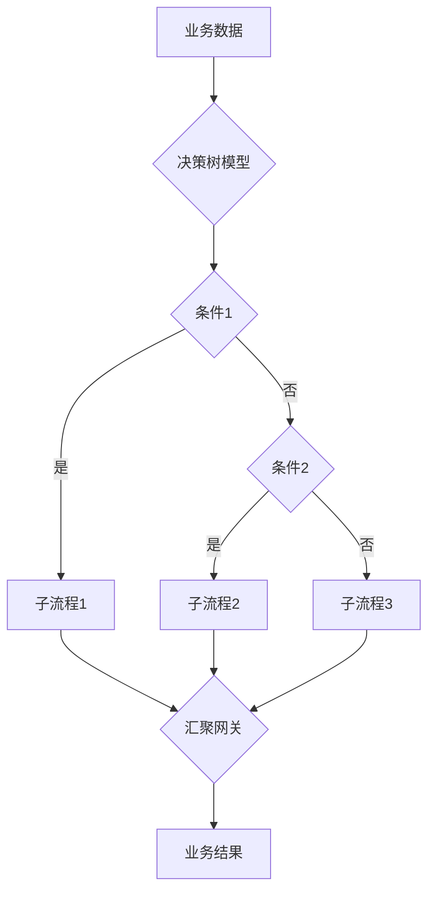
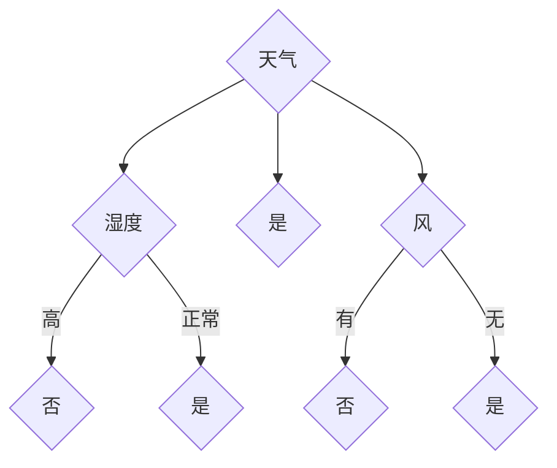

# 决策树和工作流：AI代理如何进行决策分析

关键词：决策树、工作流、AI代理、决策分析、机器学习、数据挖掘

## 1. 背景介绍
### 1.1  问题的由来
在人工智能快速发展的当下,如何让AI代理具备类似人类的决策分析能力,进而更好地协助甚至替代人类完成各种任务,已成为业界关注的焦点。决策树和工作流作为两种经典的决策分析方法,在AI系统中得到了广泛应用。深入探讨AI代理如何基于决策树和工作流进行决策分析,对于推动人工智能在各领域的应用具有重要意义。

### 1.2  研究现状
目前,国内外学者对于决策树和工作流在AI决策分析中的应用开展了大量研究。一方面,决策树凭借其直观、易于理解的优势,成为构建AI代理决策模型的重要工具[1]。另一方面,工作流技术为AI系统的任务协同、流程管控提供了有力支撑[2]。同时,将决策树与工作流相结合,可进一步增强AI代理的决策分析能力[3]。尽管取得了诸多进展,但现有研究在算法优化、场景适配等方面仍有待加强。

### 1.3  研究意义
深入研究决策树和工作流在AI代理决策分析中的应用,一方面有助于揭示AI系统的内在工作机制,另一方面可为相关应用系统的设计开发提供理论指导和技术参考。同时,通过优化决策算法、拓展应用场景,将有力推动AI在金融、医疗、教育等领域的深度应用,为经济社会发展注入新动能。

### 1.4  本文结构
本文将围绕"决策树和工作流在AI代理决策分析中的应用"这一主题展开深入探讨。第2部分介绍决策树、工作流等核心概念;第3部分重点阐述决策树算法原理及具体步骤;第4部分从数学角度对相关模型与公式进行详细讲解;第5部分给出项目实践案例;第6部分分析典型应用场景;第7部分推荐相关工具和资源;第8部分总结全文并展望未来;第9部分列举常见问题解答。

## 2. 核心概念与联系
在探讨决策树和工作流在AI代理决策分析中的应用之前,有必要先对几个核心概念进行界定和辨析。

决策树(Decision Tree)是一种树形结构,其中每个内部节点表示一个属性测试,每个分支代表一个测试输出,每个叶节点存储一个类别[4]。通过从根到叶遍历决策树,可得出数据实例所属分类。决策树易于理解和解释,能够同时处理数值型和类别型数据,广泛应用于分类、预测等任务。

工作流(Workflow)是对业务流程的计算机建模与自动化执行,通过定义一系列任务及其执行顺序、条件等,协调多个参与者按照预定规则完成业务过程[5]。工作流技术可显著提升业务效率,保证流程合规性,在企业管理、办公自动化等领域得到广泛应用。

在AI系统中,决策树常被用于构建决策模型,通过对样本数据的学习形成决策规则,指导AI代理进行决策分析。而工作流则为AI代理的任务协同提供了技术手段,使其能够按照预定流程,与人类或其他AI代理开展协作,共同完成复杂业务。二者相结合,可形成更加智能、高效的AI代理,全面提升其决策分析能力。

上图展示了决策树和工作流在AI代理决策分析中的典型应用模式。业务数据首先输入决策树模型,生成初步决策结果,进而触发相应的工作流。在工作流执行过程中,可能会嵌套其他决策树用于子决策,多个分支流程最终汇聚,输出业务结果。该模式有效融合了决策树的分析能力和工作流的协同能力,可广泛应用于各类复杂业务场景。

## 3. 核心算法原理 & 具体操作步骤
### 3.1  算法原理概述
决策树的核心算法主要包括ID3、C4.5、CART等。其基本原理是采用自顶向下、分而治之的策略,通过选择最优划分属性,递归构建决策树[6]。不同算法在属性选择、划分策略等方面存在差异,但总体思路一致。下面以经典的ID3算法为例,对其原理进行概述。

ID3算法使用信息增益作为属性选择度量。假设样本集合为D,类别属性为C,共有K个类别,第k类样本所占比例为pk,则D的信息熵为:

$$
H(D) = -\sum_{k=1}^K p_k \log_2{p_k}
$$

若属性a有V个可能取值,将D按a的取值划分为V个子集D1,D2,...,DV,则属性a对样本集D的信息增益为:

$$
g(D,a) = H(D) - \sum_{v=1}^V \frac{|D^v|}{|D|} H(D^v)
$$

ID3算法选择信息增益最大的属性作为最优划分属性。设训练数据集为D,属性集合为A,算法流程如下:

1) 若D中所有样本属于同一类别,则将该类别作为节点的标记,返回单节点树;
2) 若A为空,则将D中样本数最多的类别作为节点的标记,返回单节点树;
3) 否则,计算A中每个属性的信息增益,选择信息增益最大的属性a*;
4) 对a*的每一个可能值av,令Dv表示D中在a*上取值为av的样本子集:
   - 若Dv为空,则将D中样本数最多的类别作为标记,构建子节点;
   - 否则,以Dv为训练集,A-{a*}为属性集,递归调用步骤1-4,构建子树。

### 3.2  算法步骤详解
下面通过一个简单例子,对ID3算法的具体步骤进行详细说明。假设有如下训练数据集:

| 天气   | 温度   | 湿度   | 风     | 是否打球 |
| ------ | ------ | ------ | ------ | -------- |
| 晴     | 高     | 高     | 无     | 否       |
| 晴     | 高     | 高     | 有     | 否       |
| 阴     | 高     | 高     | 无     | 是       |
| 雨     | 中     | 高     | 无     | 是       | 
| 雨     | 低     | 正常   | 无     | 是       |
| 雨     | 低     | 正常   | 有     | 否       |
| 阴     | 低     | 正常   | 有     | 是       |
| 晴     | 中     | 高     | 无     | 否       |
| 晴     | 低     | 正常   | 无     | 是       |
| 雨     | 中     | 正常   | 无     | 是       |
| 晴     | 中     | 正常   | 有     | 是       |
| 阴     | 中     | 高     | 有     | 是       |
| 阴     | 高     | 正常   | 无     | 是       |
| 雨     | 中     | 高     | 有     | 否       |

算法步骤如下:

1) 计算训练集D的信息熵。D中共有9个"是"样本,5个"否"样本,因此:

$$
H(D) = -\frac{9}{14}\log_2{\frac{9}{14}} - \frac{5}{14}\log_2{\frac{5}{14}} = 0.940
$$

2) 分别计算每个属性的信息增益:
   - 天气属性,将D划分为晴、阴、雨三个子集,分别包含5、4、5个样本,子集信息熵分别为0.971、0、0.971,因此:

   $$
   g(D,天气) = 0.940 - (\frac{5}{14}×0.971 + \frac{4}{14}×0 + \frac{5}{14}×0.971) = 0.247 
   $$
   
   - 温度属性,将D划分为高、中、低三个子集,分别包含4、6、4个样本,子集信息熵分别为0、0.918、1,因此:

   $$
   g(D,温度) = 0.940 - (\frac{4}{14}×0 + \frac{6}{14}×0.918 + \frac{4}{14}×1) = 0.029
   $$

   - 湿度属性,将D划分为高、正常两个子集,分别包含7、7个样本,子集信息熵分别为0.985、0.592,因此:

   $$
   g(D,湿度) = 0.940 - (\frac{7}{14}×0.985 + \frac{7}{14}×0.592) = 0.151  
   $$

   - 风属性,将D划分为有、无两个子集,分别包含6、8个样本,子集信息熵分别为0.650、0.811,因此:

   $$
   g(D,风) = 0.940 - (\frac{6}{14}×0.650 + \frac{8}{14}×0.811) = 0.048
   $$

3) 天气属性的信息增益最大,因此选择天气作为根节点,将数据集D划分为晴、阴、雨三个子集。

4) 对晴、雨两个子集分别递归调用ID3算法,构建子树。阴子集已经纯净,直接作为叶节点。

5) 最终得到如下决策树:

### 3.3  算法优缺点
ID3算法的主要优点包括:
- 算法简单,易于实现;
- 生成的决策树易于理解和解释;
- 能够同时处理数值型和类别型属性。

但ID3算法也存在一些缺陷:
- 偏好取值较多的属性,容易产生过拟合;
- 只能处理离散型属性,连续型属性需要预处理;
- 对缺失值和噪声数据敏感。

针对这些问题,后续的C4.5、CART等算法进行了改进和优化。如C4.5引入了信息增益率来校正属性偏好,并支持连续型属性;CART采用基尼指数作为划分准则,对缺失值有更好的处理。

### 3.4  算法应用领域
决策树算法在多个领域得到广泛应用,典型的应用场景包括:
- 金融风控:通过客户属性预测其违约、欺诈风险;
- 医疗诊断:基于症状、体征对疾病进行分类诊断;
- 营销推荐:根据用户特征预测其购买意向,实现精准营销;
- 设备故障诊断:依据设备运行参数判断其故障类型,指导维修。

此外,决策树还可用于流失预警、信用评估等场景,是AI代理进行决策分析的重要工具。

## 4. 数学模型和公式 & 详细讲解 & 举例说明
### 4.1  数学模型构建
为进一步阐明决策树的数学原理,下面给出其数学模型。假设样本空间为$\mathcal{X} \subseteq \mathbf{R}^n$,类别空间为$\mathcal{Y}=\{1,2,...,K\}$,决策树可表示为一个函数$f:\mathcal{X} \rightarrow \mathcal{Y}$。若决策树在第$i$个内部节点上的划分属性为$a_i$,划分点为$v_i$,则其对应的划分空间为:

$$
R_i=\{\boldsymbol{x} \in \mathcal{X} | x_{a_i} \leq v_i \}, \quad \bar{R}_i=\{\boldsymbol{x} \in \mathcal{X} | x_{a_i} > v_i\}
$$

其中,$\boldsymbol{x}=(x_1,x_2,...,x_n)$为一个n维样本。假设决策树共有$M$个