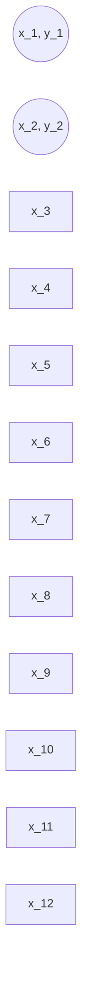

# 半监督学习(Semi-Supervised Learning) - 原理与代码实例讲解

关键词：半监督学习、机器学习、无监督学习、有监督学习、生成式模型、判别式模型、自训练、协同训练、图半监督学习、生成对抗网络

## 1. 背景介绍
### 1.1 问题的由来
在机器学习领域,传统的学习方法主要分为有监督学习(Supervised Learning)和无监督学习(Unsupervised Learning)两大类。有监督学习需要大量的标注数据来训练模型,而无监督学习则不需要标注数据,但学习效果往往不如有监督学习。然而在实际应用中,大量的标注数据往往是昂贵且难以获取的,而未标注数据相对容易获得。如何利用少量的标注数据和大量的未标注数据来提升模型性能,是机器学习领域一个重要的研究问题,由此催生了半监督学习(Semi-Supervised Learning)。

### 1.2 研究现状 
半监督学习作为有监督学习和无监督学习之间的桥梁,近年来受到学术界和工业界的广泛关注。许多半监督学习算法被相继提出,如自训练(Self-Training)、协同训练(Co-Training)、图半监督学习(Graph-based SSL)、生成式半监督学习等。这些算法在文本分类、图像识别、语音识别等任务上取得了优异的性能,展现出半监督学习的巨大潜力。

### 1.3 研究意义
半监督学习研究对于缓解标注数据稀缺、降低标注成本、提升模型泛化性能具有重要意义。通过研究半监督学习,可以更好地利用未标注数据中蕴含的信息,减少对大规模标注数据的依赖,使得机器学习算法能够更好地应用于实际场景。同时,半监督学习也为探索机器学习的本质提供了新的视角。

### 1.4 本文结构
本文将全面介绍半监督学习的理论基础与代码实践。第2部分介绍半监督学习的核心概念与各种范式之间的联系。第3部分重点介绍几种经典的半监督学习算法原理。第4部分给出半监督学习的数学建模与公式推导。第5部分通过代码实例演示半监督学习算法的具体实现。第6部分讨论半监督学习的实际应用场景。第7部分推荐半监督学习的相关学习资源。第8部分总结全文并展望未来。第9部分列举常见问题解答。

## 2. 核心概念与联系
半监督学习是指利用少量的标注数据和大量的未标注数据进行学习的机器学习范式。与有监督学习只利用标注数据、无监督学习只利用未标注数据不同,半监督学习同时利用两类数据,因此通常能取得优于二者的性能。

根据对未标注数据的利用方式,半监督学习可分为生成式方法和判别式方法两大类:
- 生成式方法(Generative Methods):通过对联合概率分布p(x,y)建模来预测标签y。代表算法有生成式混合模型、半监督聚类等。
- 判别式方法(Discriminative Methods):直接对条件概率分布p(y|x)建模来预测标签y。代表算法有自训练、协同训练、图半监督学习等。

从信息利用的角度看,半监督学习主要基于以下两个重要假设:
- 聚类假设(Clustering Assumption):数据空间中的点如果在一个聚类内,则它们很可能拥有相同的标签。
- 流形假设(Manifold Assumption):高维数据通常位于一个低维流形上,在流形上临近的点拥有相似的标签。

基于不同的假设,半监督学习衍生出不同的算法,如自训练利用聚类假设,图半监督学习利用流形假设。

## 3. 核心算法原理 & 具体操作步骤

### 3.1 算法原理概述
本节选取自训练、协同训练、图半监督学习、生成对抗网络等有代表性的半监督学习算法进行原理介绍。

#### 3.1.1 自训练(Self-Training) 
自训练是最简单直观的半监督学习算法。其基本思想是:用有标注数据训练一个初始分类器,用该分类器对未标注数据进行预测,将置信度高的预测结果加入训练集,再重新训练分类器。如此迭代直至分类器性能不再提升。

#### 3.1.2 协同训练(Co-Training)
协同训练通过训练多个分类器互相学习提升性能。其假设数据有两个独立且互补的视图(如网页的文本和超链接),每个视图可以单独学习一个分类器。用一个分类器对未标注数据置信度高的样本进行标注,将其加入另一个分类器的训练集。两个分类器互相配合,不断优化。

#### 3.1.3 图半监督学习(Graph-based SSL)
图半监督学习利用数据的流形结构进行标签传播。将数据表示为一个图,节点是样本,边代表相似度。对图上的未标注节点,根据相邻有标注节点的标签和边的权重进行标签传播,从而将标签信息扩散到整张图。

#### 3.1.4 生成对抗网络(GAN)
生成对抗网络通过生成器和判别器的博弈学习数据分布。将未标注样本视为生成器的负样本,与真实样本一起训练判别器。生成器尽可能生成接近真实样本的数据欺骗判别器,判别器尽可能分辨真假数据。二者互相博弈,最终都能学到数据的本质特征。

### 3.2 算法步骤详解
以下以自训练算法为例,详细介绍算法步骤:

输入:
- 标注数据集L={(x1,y1),...,(xl,yl)} 
- 未标注数据集U={x1,...,xu}

输出:
- 分类器f

算法:
1. 用L训练初始分类器f
2. 重复直到f不再变化:
    1) 用f对U中的每个样本预测标签
    2) 选择置信度最高的前k个样本,将其与预测标签一起加入L  
    3) 用新的L重新训练f
3. 返回f

### 3.3 算法优缺点
自训练的优点是原理简单,易于实现,在实践中性能也不错。但其缺点是可能将错误标注加入训练集导致性能恶化。协同训练能一定程度缓解该问题,但需要数据有两个独立视图的强假设。图半监督学习能充分利用数据的流形结构,但计算复杂度较高。生成式方法能学习数据的生成机制,但往往需要较复杂的概率模型。

### 3.4 算法应用领域
半监督学习在多个领域得到广泛应用,如:
- 文本分类:利用少量标注文本和大量未标注文本训练分类器
- 图像识别:利用少量标注图像和大量未标注图像训练识别模型  
- 语音识别:利用少量标注语音和大量未标注语音训练识别模型
- 生物信息:利用少量标注基因和大量未标注基因训练预测模型

半监督学习在这些领域能显著降低人工标注成本,提升模型性能。

## 4. 数学模型和公式 & 详细讲解 & 举例说明
### 4.1 数学模型构建
设有标注样本集$D_L=\{(\boldsymbol{x}_1,y_1),(\boldsymbol{x}_2,y_2),...,(\boldsymbol{x}_l,y_l)\}$,未标注样本集$D_U=\{\boldsymbol{x}_{l+1},\boldsymbol{x}_{l+2},...,\boldsymbol{x}_{l+u}\}$,其中$\boldsymbol{x}_i \in \mathcal{X}$为示例,$y_i \in \mathcal{Y}$为标签,$l$和$u$分别为有标注和未标注样本数目。

半监督学习的目标是利用$D_L$和$D_U$训练一个分类器$f:\mathcal{X} \rightarrow \mathcal{Y}$,使其能准确预测未知示例的标签。通常采用经验风险最小化准则:

$$\min_{f \in \mathcal{F}} \frac{1}{l}\sum_{i=1}^l L(y_i,f(\boldsymbol{x}_i)) + \lambda\Omega(f) \tag{1}$$

其中$L$为损失函数,$\Omega$为正则化项,$\lambda$为正则化系数,$\mathcal{F}$为假设空间。

不同的半监督学习方法对应不同的目标函数设计。以自训练为例,可将式(1)改写为:

$$\min_{f \in \mathcal{F}} \frac{1}{l}\sum_{i=1}^l L(y_i,f(\boldsymbol{x}_i)) + \frac{\alpha}{u}\sum_{j=l+1}^{l+u} L(\hat{y}_j,f(\boldsymbol{x}_j)) + \lambda\Omega(f) \tag{2}$$  

其中$\hat{y}_j$为未标注样本$\boldsymbol{x}_j$的伪标签,$\alpha$控制有标注损失和伪标签损失的权衡。

### 4.2 公式推导过程
以下推导自训练算法的收敛性。假设每次迭代加入$b$个伪标签样本,共迭代$T$轮,则经过$T$轮后的标注集为:

$$D_L^{(T)} = D_L \cup (\bigcup_{t=1}^T \hat{D}_U^{(t)}) \tag{3}$$

其中$\hat{D}_U^{(t)}$为第$t$轮选出的$b$个伪标签样本集。

假设不同轮次的伪标签集互不相交,即$\hat{D}_U^{(i)} \cap \hat{D}_U^{(j)} = \emptyset, \forall i \neq j$,且每轮加入的伪标签都是正确的,即$\hat{y}_j=y_j,\forall (\boldsymbol{x}_j,\hat{y}_j) \in \hat{D}_U^{(t)}$。

定义第$t$轮的假设为$f_t$,则$f_t$在$D_L^{(t)}$上的经验风险为:

$$\hat{R}_{D_L^{(t)}}(f_t) = \frac{1}{l+bt}\sum_{(\boldsymbol{x}_i,y_i) \in D_L^{(t)}} L(y_i,f_t(\boldsymbol{x}_i)) \tag{4}$$

在理想情况下,每轮加入的伪标签等价于从真实分布中采样,因此$f_t$的泛化风险为:

$$R(f_t) = \mathbb{E}_{(\boldsymbol{x},y) \sim p} [L(y,f_t(\boldsymbol{x}))] \tag{5}$$

根据probably approximately correct (PAC)理论,若$\mathcal{F}$为有限假设空间,且$f_t$在每轮独立地从$\mathcal{F}$中选取,则以至少$1-\delta$的概率有:

$$R(f_t) \leq \hat{R}_{D_L^{(t)}}(f_t) + \sqrt{\frac{\ln|\mathcal{F}| + \ln(1/\delta)}{2(l+bt)}} \tag{6}$$

可见,随着迭代轮数$t$的增大,泛化误差界单调递减,即算法是收敛的。

### 4.3 案例分析与讲解
下面以一个简单的二分类任务为例,直观展示自训练的过程。

假设有2个标注样本,10个未标注样本,如下图所示:



初始化分类器$f_0$后,用$f_0$对未标注数据预测,得到:

```mermaid
graph LR
L1(("x_1, y_1"))
L2(("x_2, y_2"))
U1["x_3, ŷ_3=1"] 
U2["x_4, ŷ_4=0"]
U3["x_5, ŷ_5=0"]
U4["x_6, ŷ_6=1"]
U5["x_7, ŷ_7=1"]
U6["x_8, ŷ_8=0"] 
U7["x_9, ŷ_9=0"]
U8["