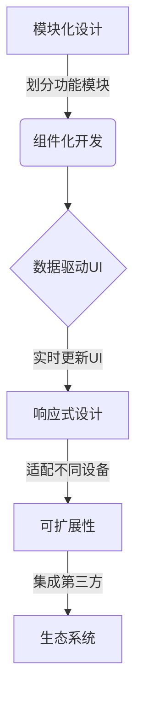

# 基于Java的智能家居设计：自定义智能家居仪表盘的UI设计技巧

## 1. 背景介绍

### 1.1 问题的由来

随着科技的不断进步,人们对生活品质的要求也在不断提高。智能家居系统应运而生,旨在为用户提供更加舒适、便利和节能的居住环境。然而,现有的智能家居系统界面往往缺乏个性化和灵活性,无法完全满足不同用户的需求。因此,如何设计一个可自定义的智能家居仪表盘UI,成为了一个亟待解决的问题。

### 1.2 研究现状 

目前,市面上已有一些智能家居系统提供了基本的UI自定义功能,但大多数仍然局限于预设的布局和组件。用户无法根据自身需求进行深度定制,缺乏真正的个性化体验。此外,这些系统往往缺乏良好的扩展性,无法轻松集成第三方设备和服务。

### 1.3 研究意义

设计一个可自定义的智能家居仪表盘UI,不仅能够提高用户体验,还可以促进智能家居行业的创新发展。通过开放的UI定制接口,用户可以根据自身偏好和需求,灵活组合各种组件和功能模块,打造出属于自己的个性化智能家居系统。同时,这种开放式设计也有利于吸引更多的第三方开发者加入,共同丰富智能家居生态系统。

### 1.4 本文结构

本文将首先介绍自定义智能家居仪表盘UI设计的核心概念和原理,包括模块化设计、组件化开发和数据驱动UI等。接下来,将详细阐述UI定制的核心算法和数学模型,并通过代码示例和实际应用场景,帮助读者深入理解相关技术。最后,本文将总结未来发展趋势和面临的挑战,并提供相关学习资源和工具推荐。

## 2. 核心概念与联系

自定义智能家居仪表盘UI设计涉及多个核心概念,包括模块化设计、组件化开发、数据驱动UI和响应式设计等。这些概念相互关联,共同构建了一个灵活、可扩展的UI定制框架。



1. **模块化设计**:将整个系统划分为多个功能模块,每个模块负责特定的任务,模块之间通过明确定义的接口进行通信和协作。这种设计方式提高了代码的可维护性和可重用性。

2. **组件化开发**:将UI界面拆分为多个可复用的组件,每个组件封装了特定的UI逻辑和交互行为。通过组合和配置这些组件,可以快速构建出不同的UI界面。

3. **数据驱动UI**:UI界面的渲染和更新由底层数据驱动,当数据发生变化时,UI会自动进行相应的更新。这种设计模式简化了UI开发的复杂性,提高了开发效率。

4. **响应式设计**:UI界面能够自动适配不同尺寸和分辨率的设备,为用户提供一致的浏览体验。这对于智能家居系统中的多种终端设备(如手机、平板、电视等)至关重要。

5. **可扩展性**:通过开放的API和插件机制,可以轻松集成第三方设备、服务和功能模块,不断丰富智能家居生态系统。

这些核心概念相互关联、相辅相成,共同构建了一个灵活、可扩展的UI定制框架,为智能家居系统带来了无限的可能性。

## 3. 核心算法原理 & 具体操作步骤

### 3.1 算法原理概述

自定义智能家居仪表盘UI设计的核心算法是基于组件树的渲染和更新算法。该算法将UI界面抽象为一棵组件树,每个节点代表一个UI组件。当底层数据发生变化时,算法会计算出受影响的组件,并只更新这些组件的渲染结果,从而实现高效的UI更新。

该算法的主要步骤如下:

1. **构建初始组件树**:根据UI配置信息,构建出初始的组件树结构。

2. **数据绑定**:将底层数据与组件树中的相应节点进行绑定,建立数据与UI的映射关系。

3. **变更检测**:监听底层数据的变化,一旦发现数据变更,就标记受影响的组件节点。

4. **差异计算**:比较新旧组件树,计算出需要更新的最小组件集合。

5. **批量更新**:对需要更新的组件集合进行批量渲染,更新UI界面。

该算法的优点在于只更新受影响的组件,避免了整个UI的重新渲染,从而提高了性能和响应速度。同时,由于组件树的结构化特性,该算法也具有良好的可扩展性和可维护性。

### 3.2 算法步骤详解

#### 3.2.1 构建初始组件树

初始组件树的构建过程是根据UI配置信息进行的。UI配置信息通常采用JSON或XML等结构化格式,描述了UI界面的布局、组件类型、属性等信息。

算法会解析这些配置信息,并按照指定的层级结构创建相应的组件节点,构建出完整的组件树。每个组件节点都包含了该组件的类型、属性、子组件等信息。

例如,一个简单的UI配置信息如下:

```json
{
  "type": "container",
  "children": [
    {
      "type": "text",
      "text": "Hello, World!"
    },
    {
      "type": "button",
      "text": "Click me"
    }
  ]
}
```

根据这个配置信息,算法会创建一个容器组件作为根节点,并为其添加两个子节点:一个文本组件和一个按钮组件。

#### 3.2.2 数据绑定

数据绑定是将底层数据与组件树中的相应节点建立映射关系的过程。通过数据绑定,当底层数据发生变化时,相应的组件节点就会受到影响,从而触发UI更新。

数据绑定通常采用路径表达式的方式进行。例如,对于如下数据结构:

```json
{
  "user": {
    "name": "John Doe",
    "age": 30
  }
}
```

我们可以使用路径表达式`user.name`将用户名绑定到一个文本组件上,当用户名发生变化时,该文本组件就会自动更新。

#### 3.2.3 变更检测

变更检测是监听底层数据变化的过程。一旦发现数据变更,就需要标记受影响的组件节点,为后续的差异计算和批量更新做准备。

变更检测可以采用多种策略,例如:

- **脏检查(Dirty Checking)**:定期扫描整个数据模型,比较新旧数据,发现变化后标记受影响的组件节点。
- **观察者模式(Observer Pattern)**:数据模型实现观察者模式,当数据发生变化时,主动通知订阅了该数据的组件节点。
- **代理对象(Proxy Object)**:使用代理对象包装数据模型,当数据被访问或修改时,代理对象会intercepted并标记受影响的组件节点。

不同的变更检测策略有不同的优缺点,需要根据具体场景进行权衡选择。

#### 3.2.4 差异计算

差异计算是比较新旧组件树,计算出需要更新的最小组件集合的过程。这是算法的核心步骤之一,直接影响到UI更新的性能和效率。

差异计算算法通常采用树的深度优先遍历策略,逐层比较新旧组件树中的节点。如果发现节点类型不同,则直接替换该节点及其子树;如果节点类型相同但属性不同,则只更新该节点的属性;如果节点类型和属性都相同,则继续比较其子节点。

通过这种策略,算法可以精确计算出需要更新的最小组件集合,避免了不必要的渲染开销。

#### 3.2.5 批量更新

批量更新是对需要更新的组件集合进行批量渲染,更新UI界面的过程。

在批量更新之前,算法会首先构建一个渲染队列,将需要更新的组件按照树的层级顺序排列。然后,算法会逐个渲染这些组件,并将渲染结果应用到实际的UI界面上。

为了提高性能,批量更新过程通常会采用一些优化策略,例如:

- **批量DOM操作**:将多个DOM操作合并为一个批量操作,减少重排和重绘的开销。
- **虚拟化渲染**:对于大型列表或网格等组件,只渲染当前可见的部分,避免渲染整个组件树。
- **异步渲染**:将渲染任务分批异步执行,避免阻塞主线程,保证UI的流畅性。

通过这些优化策略,批量更新过程可以达到更高的性能和更好的用户体验。

### 3.3 算法优缺点

#### 优点:

1. **高效更新**:只更新受影响的组件,避免了整个UI的重新渲染,提高了性能和响应速度。
2. **可扩展性强**:基于组件树的结构化设计,具有良好的可扩展性和可维护性。
3. **开发效率高**:通过组件化开发和数据驱动UI,简化了UI开发的复杂性,提高了开发效率。
4. **跨平台支持**:算法本身与具体的渲染引擎无关,可以在不同平台(Web、移动端、桌面端等)上实现。

#### 缺点:

1. **初始渲染开销较大**:构建初始组件树和进行数据绑定的过程会带来一定的开销,对于大型UI界面,这个开销可能会变得较大。
2. **内存占用较高**:需要在内存中维护组件树和数据模型的副本,对于大型应用程序,内存占用可能会成为一个问题。
3. **学习成本较高**:基于组件树的渲染和更新算法涉及一些新的概念和编程模型,对于传统的UI开发人员来说,可能需要一定的学习成本。

### 3.4 算法应用领域

基于组件树的渲染和更新算法不仅适用于智能家居系统的UI定制,还可以应用于其他需要高度交互和动态更新的UI场景,例如:

1. **单页应用(SPA)**:现代Web应用程序越来越倾向于采用单页应用架构,该算法可以为单页应用提供高效的UI渲染和更新能力。
2. **移动应用**:在移动应用中,该算法可以帮助实现流畅的用户界面交互,提升用户体验。
3. **可视化编辑器**:对于各种可视化编辑器(如网页设计器、图形编辑器等),该算法可以实现实时预览和即时渲染的功能。
4. **数据可视化**:在数据可视化领域,该算法可以用于实现动态更新的图表、仪表盘等UI组件。
5. **游戏开发**:在游戏开发中,该算法可以应用于实现游戏UI的渲染和更新,提高游戏的流畅性和响应速度。

总的来说,基于组件树的渲染和更新算法为构建高度交互和动态更新的UI系统提供了一种高效、可扩展的解决方案。

## 4. 数学模型和公式 & 详细讲解 & 举例说明

在自定义智能家居仪表盘UI设计中,数学模型和公式扮演着重要的角色,为算法提供了理论基础和计算支持。本节将详细介绍相关的数学模型和公式,并通过案例分析和常见问题解答,帮助读者更好地理解和应用这些概念。

### 4.1 数学模型构建

#### 4.1.1 组件树模型

组件树是自定义智能家居仪表盘UI设计的核心数据结构,它将UI界面抽象为一棵树,每个节点代表一个UI组件。组件树的数学模型可以用有向无环图(Directed Acyclic Graph, DAG)来表示。

在