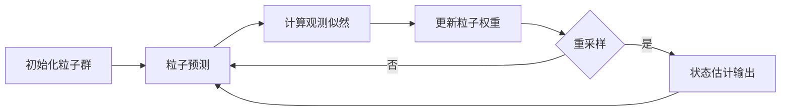

# 基于OpenCV的粒子滤波跟踪系统详细设计与具体代码实现

关键词：OpenCV, 粒子滤波, 目标跟踪, 计算机视觉, C++

## 1. 背景介绍
### 1.1  问题的由来
在计算机视觉领域中,目标跟踪一直是一个重要而富有挑战性的课题。它在视频监控、人机交互、自动驾驶等诸多领域有着广泛的应用前景。传统的目标跟踪算法如均值漂移、卡尔曼滤波等存在鲁棒性不足、难以应对复杂场景等缺点。粒子滤波以其强大的非线性建模能力和鲁棒性,成为目标跟踪领域的研究热点。

### 1.2  研究现状
近年来,国内外学者围绕粒子滤波跟踪展开了大量研究。Isard等人最早将粒子滤波引入视觉跟踪领域。此后,众多学者对粒子滤波框架进行了改进和优化。如引入自适应机制动态调整粒子数量,利用多模型融合策略增强跟踪鲁棒性等。总的来看,现有研究主要集中在跟踪框架优化、观测模型改进等方面,而对于工程实现和代码开发的讨论相对较少。

### 1.3  研究意义
粒子滤波跟踪作为一种先进的目标跟踪技术,对于提升视频监控、人机交互等系统的性能具有重要意义。然而,粒子滤波算法涉及概率统计、随机采样等理论,对于工程实现具有一定难度。因此,深入剖析粒子滤波跟踪的技术原理,给出详细的系统设计方案和代码实现,对于算法在实际系统中的应用具有重要的指导意义。

### 1.4  本文结构
本文首先介绍粒子滤波跟踪的核心概念和基本原理,并阐述其与传统算法的联系。然后,详细讲解粒子滤波的数学模型,并结合实例对算法步骤进行说明。在此基础上,给出一个基于OpenCV和C++的粒子滤波跟踪系统的详细设计与实现。最后,讨论算法的应用场景,并对未来的研究方向进行展望。

## 2. 核心概念与联系
粒子滤波(Particle Filter)是一种序贯Monte Carlo方法,通过一组加权粒子来近似后验概率分布,并根据观测信息和系统模型对粒子权重进行更新,以实现状态估计。它是一种强大的非线性、非高斯系统的状态估计方法。

与传统的卡尔曼滤波(Kalman Filter)相比,粒子滤波具有以下优势:

1. 适用于非线性、非高斯系统,建模能力更强。
2. 通过大量粒子的并行演化,可以有效逼近复杂的概率分布。
3. 不需要系统噪声的先验知识,具有更好的自适应性。

同时,粒子滤波与重要性采样(Importance Sampling)、序贯Monte Carlo等理论密切相关。重要性采样为粒子滤波提供了理论基础,使得通过加权粒子来近似概率分布成为可能。序贯Monte Carlo方法则为粒子滤波的迭代实现提供了框架。

在目标跟踪领域,均值漂移(Mean Shift)和卡尔曼滤波是两类经典算法。均值漂移通过不断迭代目标区域的中心,实现目标位置的跟踪。但其难以应对目标变形、遮挡等复杂情况。卡尔曼滤波虽然能够刻画目标运动的动态特性,但其线性高斯假设在实际中往往难以满足。粒子滤波通过非参数的粒子分布表示,可以克服上述局限,提供更鲁棒的跟踪效果。

下图展示了粒子滤波跟踪的基本流程:

## 3. 核心算法原理 & 具体操作步骤
### 3.1  算法原理概述
粒子滤波跟踪的核心思想是:用一组带权重的粒子来表示目标状态的后验概率分布,通过粒子的演化和权重更新来逼近真实的后验分布,并根据粒子分布估计目标状态。算法主要包括预测、更新、重采样三个步骤。

### 3.2  算法步骤详解

1. 初始化。根据目标初始位置,随机生成N个粒子,每个粒子代表一个可能的目标状态。
2. 预测。根据上一时刻的粒子分布和运动模型,预测当前时刻粒子的状态。
3. 更新。根据当前观测,计算每个粒子的观测似然,并将其作为粒子的权重。
4. 重采样。根据粒子权重,对粒子进行重采样,以消除权重退化问题。
5. 估计。根据重采样后的粒子分布,计算目标状态的最大后验估计值。
6. 回到步骤2,进行下一帧的跟踪。

### 3.3  算法优缺点

优点:
1. 适用于非线性、非高斯系统,对目标运动和观测模型没有严格限制。
2. 通过大量粒子逼近真实后验分布,跟踪精度高,鲁棒性强。
3. 易于并行化实现,计算效率高。

缺点:
1. 粒子数量大时计算开销大,实时性有待提高。 
2. 对粒子退化敏感,需要引入重采样机制。
3. 难以处理高维状态空间,容易陷入维数灾难。

### 3.4  算法应用领域  
粒子滤波跟踪在智能视频监控、人机交互、自动驾驶等领域有着广泛应用,如:

1. 智能视频监控:实现行人、车辆的自动跟踪,辅助异常行为检测。
2. 人机交互:通过对手势、面部的跟踪,实现基于视觉的人机自然交互。
3. 自动驾驶:通过对车辆、行人的跟踪,辅助环境感知和决策控制。

## 4. 数学模型和公式 & 详细讲解 & 举例说明
### 4.1  数学模型构建
粒子滤波的数学模型可描述如下:

1. 状态方程:
$$
\mathbf{x}_t=f(\mathbf{x}_{t-1},\mathbf{v}_t)
$$
其中,$\mathbf{x}_t$为t时刻的状态变量,$f(\cdot)$为状态转移函数,$\mathbf{v}_t$为过程噪声。

2. 观测方程:  
$$
\mathbf{z}_t=h(\mathbf{x}_t,\mathbf{n}_t)
$$
其中,$\mathbf{z}_t$为t时刻的观测变量,$h(\cdot)$为观测函数,$\mathbf{n}_t$为观测噪声。

粒子滤波的目标是根据观测序列$\mathbf{z}_{1:t}$,估计状态变量$\mathbf{x}_t$的后验分布$p(\mathbf{x}_t|\mathbf{z}_{1:t})$。

### 4.2  公式推导过程
粒子滤波通过一组加权粒子$\{(\mathbf{x}_t^{(i)},w_t^{(i)})\}_{i=1}^N$来近似后验分布:

$$
p(\mathbf{x}_t|\mathbf{z}_{1:t}) \approx \sum_{i=1}^N w_t^{(i)} \delta(\mathbf{x}_t-\mathbf{x}_t^{(i)})
$$

其中,$\mathbf{x}_t^{(i)}$为第i个粒子的状态,$w_t^{(i)}$为其权重,$\delta(\cdot)$为狄拉克函数。

粒子滤波的核心是通过重要性采样来更新粒子权重:

$$
w_t^{(i)} \propto w_{t-1}^{(i)} \frac{p(\mathbf{z}_t|\mathbf{x}_t^{(i)})p(\mathbf{x}_t^{(i)}|\mathbf{x}_{t-1}^{(i)})}{q(\mathbf{x}_t^{(i)}|\mathbf{x}_{t-1}^{(i)},\mathbf{z}_t)}
$$

其中,$p(\mathbf{z}_t|\mathbf{x}_t^{(i)})$为观测似然,$p(\mathbf{x}_t^{(i)}|\mathbf{x}_{t-1}^{(i)})$为状态转移概率密度,$q(\mathbf{x}_t^{(i)}|\mathbf{x}_{t-1}^{(i)},\mathbf{z}_t)$为重要性密度。

### 4.3  案例分析与讲解
下面以一个简单的一维目标跟踪问题为例,说明粒子滤波的计算过程。

假设目标的状态为其位置$x_t$,观测为位置的噪声测量值$z_t$。状态方程和观测方程为:

$$
\begin{aligned}
x_t &= x_{t-1} + v_t \\
z_t &= x_t + n_t
\end{aligned}
$$

其中,$v_t \sim \mathcal{N}(0,\sigma_v^2)$,$n_t \sim \mathcal{N}(0,\sigma_n^2)$。

粒子滤波的计算过程如下:

1. 初始化。在$t=0$时刻,随机生成N个粒子$\{x_0^{(i)}\}_{i=1}^N$,权重均为$1/N$。

2. 预测。根据状态方程,对每个粒子进行预测:
$$
x_t^{(i)} = x_{t-1}^{(i)} + v_t^{(i)}, \quad v_t^{(i)} \sim \mathcal{N}(0,\sigma_v^2)
$$

3. 更新。根据观测方程,计算每个粒子的观测似然,并更新权重:
$$
w_t^{(i)} \propto w_{t-1}^{(i)} \cdot p(z_t|x_t^{(i)}) = w_{t-1}^{(i)} \cdot \mathcal{N}(z_t;x_t^{(i)},\sigma_n^2)
$$
然后对权重进行归一化:
$$
w_t^{(i)} := w_t^{(i)} / \sum_{j=1}^N w_t^{(j)}
$$

4. 重采样。根据权重对粒子进行重采样,得到新的粒子集合。

5. 估计。根据重采样后的粒子集合,计算状态估计值:
$$
\hat{x}_t = \sum_{i=1}^N w_t^{(i)} x_t^{(i)}
$$

通过不断迭代上述步骤,即可实现对目标状态的递推估计。

### 4.4  常见问题解答

**Q:** 粒子退化问题如何解决?

**A:** 粒子退化是指大部分粒子的权重趋于0,导致有效粒子数减少,估计精度下降。解决方法主要有:
1. 引入重采样步骤,定期淘汰低权重粒子,复制高权重粒子。
2. 选择合适的重要性密度,使其尽可能接近最优重要性密度。
3. 增加粒子数量,提高粒子分布的多样性。

**Q:** 如何选择粒子数量?

**A:** 粒子数量的选择需要权衡计算效率和估计精度。一般来说:
1. 粒子数量越多,粒子分布越能逼近真实后验分布,估计精度越高,但计算开销也越大。
2. 粒子数量的选择与状态维数、后验分布的复杂程度等因素有关。实践中可先选择一个较小的值,然后根据跟踪效果进行调整。
3. 可以采用自适应策略,根据跟踪过程中的有效粒子数动态调整粒子数量。

**Q:** 观测模型如何构建?

**A:** 观测模型用于计算观测似然$p(\mathbf{z}_t|\mathbf{x}_t)$,其构建需要考虑以下因素:
1. 观测信息的类型。常见的观测信息有目标外观、运动特征等。
2. 观测噪声的分布。通常假设观测噪声服从高斯分布