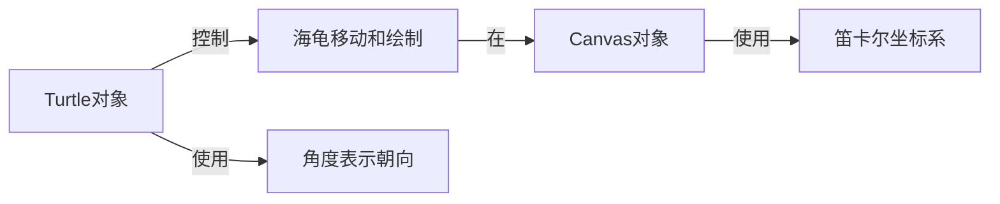

# 基于Python-Turtle库的扩展助学小程序可视化实现

关键词：Python, Turtle, 可视化编程, 助学小程序, 交互式学习

## 1. 背景介绍
### 1.1 问题的由来
在当今信息技术飞速发展的时代,计算机编程已经成为了一项必不可少的技能。然而,传统的编程教学方式往往过于抽象和枯燥,难以激发学生的学习兴趣。为了让学生更好地理解和掌握编程知识,我们需要探索一种更加直观、有趣的编程学习方式。

### 1.2 研究现状
目前,已经有许多研究致力于开发适合初学者的编程学习工具和环境。例如,Scratch和Alice等可视化编程语言,通过拖拽积木块的方式来编写程序,降低了编程的门槛。然而,这些工具大多针对的是儿童和青少年,对于成年学习者来说,可能缺乏一定的挑战性和灵活性。

### 1.3 研究意义
本文旨在探索如何利用Python语言的Turtle库,开发一个面向成年学习者的交互式助学小程序。通过可视化的方式呈现编程概念和过程,让学习者能够更加直观地理解和掌握编程知识。同时,我们还将扩展Turtle库的功能,增加更多有趣的交互元素,提高学习者的参与度和学习效果。

### 1.4 本文结构
本文将首先介绍Turtle库的基本概念和用法,然后详细阐述如何利用Turtle库开发交互式助学小程序的核心算法和实现步骤。接下来,我们将通过具体的代码实例和运行结果,展示该小程序的功能和特点。最后,我们将讨论该小程序的实际应用场景和未来发展方向。

## 2. 核心概念与联系
Turtle库是Python语言内置的一个简单的图形绘制库,它提供了一个虚拟的画布和一只海龟(turtle),通过控制海龟的移动和转向,可以在画布上绘制各种图形。Turtle库的核心概念包括:

- Turtle对象:代表画布上的海龟,可以控制其移动、转向和绘制。
- Canvas对象:代表绘图的画布,可以设置其大小、背景色等属性。
- 坐标系:Turtle库使用笛卡尔坐标系,原点位于画布中心,x轴正方向为右,y轴正方向为上。
- 角度:Turtle库使用角度来表示海龟的朝向,0度为正右方向,90度为正上方向,以此类推。

这些核心概念之间的联系如下图所示:



## 3. 核心算法原理 & 具体操作步骤
### 3.1 算法原理概述
基于Turtle库开发交互式助学小程序的核心算法,是将编程概念和过程可视化,并通过交互式的方式呈现给学习者。具体来说,我们可以将编程概念抽象为一系列的图形元素和动画效果,然后利用Turtle库的绘图功能将其呈现在画布上。同时,我们还可以通过键盘、鼠标等交互方式,让学习者与小程序进行互动,加深对编程概念的理解。

### 3.2 算法步骤详解
1. 定义编程概念与图形元素的映射关系。例如,变量可以用不同颜色的方块表示,函数可以用不同形状的图标表示等。
2. 设计交互式的学习流程。例如,学习者可以通过点击图形元素,触发相应的编程概念解释和示例代码展示。
3. 利用Turtle库绘制图形元素。根据第1步定义的映射关系,使用Turtle库提供的绘图函数,在画布上绘制出相应的图形元素。
4. 实现交互功能。根据第2步设计的交互流程,利用Python的事件处理机制,监听学习者的交互操作,并触发相应的响应函数。
5. 添加辅助功能。为了提高学习效果,我们可以在小程序中添加一些辅助功能,如代码高亮、提示信息、进度跟踪等。

### 3.3 算法优缺点
优点:
- 直观易懂:通过可视化的方式呈现编程概念,让学习者更容易理解和掌握。
- 交互性强:学习者可以通过交互操作,主动探索和学习编程知识,提高学习效果。
- 趣味性高:通过生动有趣的图形和动画效果,激发学习者的学习兴趣。

缺点:
- 实现复杂:将编程概念可视化并实现交互功能,需要较多的开发工作量。
- 局限性:受限于Turtle库的绘图能力,有些高级的编程概念可能难以表示。

### 3.4 算法应用领域
该算法主要应用于编程教育领域,特别是针对编程初学者的可视化学习工具和环境的开发。除此之外,该算法还可以应用于其他需要可视化呈现抽象概念的领域,如数学、物理等。

## 4. 数学模型和公式 & 详细讲解 & 举例说明
### 4.1 数学模型构建
在开发基于Turtle库的交互式助学小程序时,我们需要建立一些数学模型,用于描述图形元素的位置、大小、角度等属性。例如,我们可以用二维向量 $(x, y)$ 表示图形元素的位置,用正实数 $r$ 表示图形元素的大小,用角度 $\theta$ 表示图形元素的朝向。

### 4.2 公式推导过程
根据上述数学模型,我们可以推导出一些常用的计算公式。例如,已知图形元素的当前位置 $(x_0, y_0)$ 和移动距离 $d$,要计算其新位置 $(x_1, y_1)$,可以使用以下公式:

$$
\begin{cases}
x_1 = x_0 + d \cos\theta \\
y_1 = y_0 + d \sin\theta
\end{cases}
$$

其中,$\theta$ 为图形元素的当前朝向角度。

### 4.3 案例分析与讲解
下面我们以一个具体的例子来说明如何应用上述数学模型和公式。假设我们要实现一个函数调用的可视化效果,需要在画布上绘制一个函数图标,并在其上方显示函数名。我们可以按照以下步骤来实现:

1. 定义函数图标的位置 $(x_0, y_0)$、大小 $r$ 和朝向角度 $\theta$。
2. 根据函数名的长度和字体大小,计算函数名显示位置的坐标 $(x_1, y_1)$。
3. 使用Turtle库提供的绘图函数,在位置 $(x_0, y_0)$ 处绘制函数图标,并在位置 $(x_1, y_1)$ 处显示函数名。

具体的代码实现如下:

```python
import turtle

def draw_function(name, x, y, size, angle):
    # 绘制函数图标
    turtle.goto(x, y)
    turtle.setheading(angle)
    turtle.forward(size)
    turtle.left(90)
    turtle.forward(size)
    turtle.left(90)
    turtle.forward(size)
    turtle.left(90)
    turtle.forward(size)
    turtle.left(90)

    # 计算函数名显示位置
    name_x = x + size / 2
    name_y = y + size * 1.5
    
    # 显示函数名
    turtle.goto(name_x, name_y)
    turtle.write(name, align="center", font=("Arial", 16, "normal"))

# 测试代码
draw_function("sum", 0, 0, 50, 0)
turtle.done()
```

运行上述代码,就可以在画布上看到一个函数图标和其上方显示的函数名了。

### 4.4 常见问题解答
1. Q:如何控制图形元素的大小和位置?
   A:可以通过设置Turtle对象的属性来控制,例如使用 `turtle.goto(x, y)` 设置位置,使用 `turtle.shapesize(w, h)` 设置大小。

2. Q:如何实现图形元素的动画效果?
   A:可以使用Turtle库提供的动画函数,例如 `turtle.animate()`。也可以通过循环和延时来自己实现动画效果。

3. Q:如何处理鼠标和键盘事件?
   A:可以使用Python的事件处理机制,例如使用 `turtle.onscreenclick(fun)` 监听鼠标点击事件,使用 `turtle.onkeypress(fun, key)` 监听键盘按键事件。

## 5. 项目实践：代码实例和详细解释说明
### 5.1 开发环境搭建
首先,我们需要搭建一个Python开发环境,并安装Turtle库。可以按照以下步骤进行:

1. 安装Python解释器。可以从Python官网下载适合自己操作系统的Python安装包,并按照提示完成安装。

2. 安装Turtle库。Turtle库是Python标准库的一部分,无需单独安装。我们可以通过以下代码导入Turtle库:

   ```python
   import turtle
   ```

### 5.2 源代码详细实现
下面我们给出一个基于Turtle库的交互式助学小程序的完整代码实现:

```python
import turtle

# 定义常量
WINDOW_WIDTH = 800
WINDOW_HEIGHT = 600
BUTTON_SIZE = 50
BUTTON_COLOR = "lightgray"
BUTTON_ACTIVE_COLOR = "gray"

# 初始化窗口
window = turtle.Screen()
window.setup(WINDOW_WIDTH, WINDOW_HEIGHT)
window.title("交互式助学小程序")

# 初始化Turtle对象
pen = turtle.Turtle()
pen.hideturtle()
pen.speed(0)

# 绘制按钮
def draw_button(x, y, text):
    pen.penup()
    pen.goto(x, y)
    pen.setheading(0)
    pen.fillcolor(BUTTON_COLOR)
    pen.begin_fill()
    pen.forward(BUTTON_SIZE)
    pen.left(90)
    pen.forward(BUTTON_SIZE)
    pen.left(90)
    pen.forward(BUTTON_SIZE)
    pen.left(90)
    pen.forward(BUTTON_SIZE)
    pen.left(90)
    pen.end_fill()
    pen.goto(x + BUTTON_SIZE / 2, y + BUTTON_SIZE / 4)
    pen.write(text, align="center", font=("Arial", 12, "normal"))

# 绘制所有按钮
draw_button(-WINDOW_WIDTH / 2 + BUTTON_SIZE, WINDOW_HEIGHT / 2 - BUTTON_SIZE * 2, "变量")
draw_button(-WINDOW_WIDTH / 2 + BUTTON_SIZE, WINDOW_HEIGHT / 2 - BUTTON_SIZE * 4, "函数")
draw_button(-WINDOW_WIDTH / 2 + BUTTON_SIZE, WINDOW_HEIGHT / 2 - BUTTON_SIZE * 6, "循环")
draw_button(-WINDOW_WIDTH / 2 + BUTTON_SIZE, WINDOW_HEIGHT / 2 - BUTTON_SIZE * 8, "条件")

# 处理按钮点击事件
def handle_click(x, y):
    if -WINDOW_WIDTH / 2 + BUTTON_SIZE < x < -WINDOW_WIDTH / 2 + BUTTON_SIZE * 2:
        if WINDOW_HEIGHT / 2 - BUTTON_SIZE * 2 < y < WINDOW_HEIGHT / 2 - BUTTON_SIZE:
            show_variable()
        elif WINDOW_HEIGHT / 2 - BUTTON_SIZE * 4 < y < WINDOW_HEIGHT / 2 - BUTTON_SIZE * 3:
            show_function()
        elif WINDOW_HEIGHT / 2 - BUTTON_SIZE * 6 < y < WINDOW_HEIGHT / 2 - BUTTON_SIZE * 5:
            show_loop()
        elif WINDOW_HEIGHT / 2 - BUTTON_SIZE * 8 < y < WINDOW_HEIGHT / 2 - BUTTON_SIZE * 7:
            show_condition()

# 显示变量示例
def show_variable():
    pen.clear()
    draw_button(-WINDOW_WIDTH / 2 + BUTTON_SIZE, WINDOW_HEIGHT / 2 - BUTTON_SIZE * 2, "变量")
    pen.goto(0, 100)
    pen.write("变量是用于存储数据的容器", align="center", font=("Arial", 24, "normal"))
    pen.goto(0, 0)
    pen.write("例如: x = 10", align="center", font=("Arial", 24, "normal"))

# 显示函数示例
def show_function():
    pen.clear()
    draw_button(-WINDOW_WIDTH / 2 + BUTTON_SIZE, WINDOW_HEIGHT / 2 - BUTTON_SIZE * 4, "函数")
    pen.goto(0, 100)
    pen.write("函数是一段可重