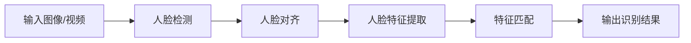

# 基于TensorFlow的人脸识别

## 1. 背景介绍

### 1.1 问题的由来

在当今社会,人脸识别技术已经广泛应用于各个领域,如安全监控、刷脸支付、社交媒体标记等。随着计算机视觉和深度学习技术的不断发展,人脸识别的准确性和效率也在不断提高。然而,构建一个高性能的人脸识别系统仍然面临着诸多挑战,例如:

- 人脸姿态、表情、年龄、光照等因素的变化
- 人脸遮挡、模糊、噪声等影响
- 大规模人脸数据的采集和标注
- 算法模型的优化和加速

因此,研究和开发高效、鲁棒的人脸识别算法和系统具有重要的理论和应用价值。

### 1.2 研究现状

目前,基于深度学习的人脸识别技术已经取得了长足的进步。主流的方法包括:

1. **基于卷积神经网络(CNN)的人脸特征提取**,如VGGFace、FaceNet等
2. **人脸检测和对齐**,如MTCNN、RetinaFace等
3. **度量学习和特征融合**,如中心损失、球面投影等
4. **注意力机制和可解释性模型**,如SENet、BilinearCNN等

这些方法在公开的人脸识别基准测试中取得了优异的性能。同时,端到端的人脸识别模型也逐渐兴起,如FaceBoxes、SFD等。

### 1.3 研究意义

本文将重点介绍基于TensorFlow框架的人脸识别技术,包括:

1. **人脸检测和对齐算法**,解决人脸姿态、尺度等变化问题
2. **基于CNN的人脸特征提取网络**,学习鲁棒的人脸特征表示
3. **度量学习和特征融合策略**,提高人脸识别的准确性和泛化能力
4. **TensorFlow实现和优化技巧**,提高模型的运行效率

研究和实现这些技术,可以帮助构建高性能的人脸识别系统,并为相关领域的应用提供技术支持。

### 1.4 本文结构  

本文的结构安排如下:

- 第2部分介绍人脸识别的核心概念和技术路线
- 第3部分详细阐述人脸检测、对齐和特征提取的算法原理和具体步骤  
- 第4部分推导人脸识别中常用的数学模型和公式,并举例说明
- 第5部分提供TensorFlow实现的代码示例,并解释关键模块
- 第6部分讨论人脸识别在安全、支付、社交等领域的应用场景
- 第7部分推荐相关的学习资源、开发工具和论文
- 第8部分总结研究成果,并展望未来的发展趋势和挑战
- 第9部分列出常见问题和解答,方便读者理解和查阅

## 2. 核心概念与联系

人脸识别技术的核心概念包括:

1. **人脸检测(Face Detection)**: 从图像或视频中定位人脸区域
2. **人脸对齐(Face Alignment)**: 将检测到的人脸归一化到标准姿态和尺度
3. **人脸特征提取(Face Feature Extraction)**: 使用CNN等模型从归一化的人脸图像中提取特征向量 
4. **特征匹配(Feature Matching)**: 通过度量距离或分类器,将提取的人脸特征与已知身份库中的特征进行比对

这些概念之间存在紧密的联系,构成了完整的人脸识别流程:



其中,人脸检测和对齐是预处理步骤,为特征提取网络输入规范化的人脸图像;特征提取模块学习人脸的深度特征表示;最后通过特征匹配,完成人脸识别或验证任务。

## 3. 核心算法原理 & 具体操作步骤  

### 3.1 算法原理概述

人脸识别算法的核心思路是:首先使用人脸检测和对齐算法从输入图像中定位和提取规范化的人脸区域,然后将其输入到深度卷积神经网络中提取特征向量,最后通过度量距离或分类器将该特征向量与已知身份库中的特征向量进行匹配,得到识别结果。

### 3.2 算法步骤详解

1. **人脸检测**

   常用的人脸检测算法有Viola-Jones、MTCNN(Multi-Task Cascaded Convolutional Networks)等。MTCNN将人脸检测和人脸关键点检测任务联合训练,分为三个阶段:

   - 生成人脸区域候选框
   - 精确人脸框和关键点回归
   - 人脸框和关键点细化

2. **人脸对齐**

   使用检测到的人脸关键点,通过仿射或三次样条变换等方法,将人脸图像归一化到标准姿态和尺度,以消除姿态、尺度等变化对后续特征提取的影响。

3. **人脸特征提取**

   常用的人脸特征提取网络有VGGFace、FaceNet等,它们基于CNN架构,通过大量人脸数据的训练,学习提取鲁棒的人脸特征表示。

4. **特征匹配**

   - 人脸识别: 计算提取的人脸特征与身份库中每个特征的距离(如余弦距离),将距离最小的身份作为识别结果。
   - 人脸验证: 将两个人脸特征的距离与预设阈值进行比较,判断是否为同一个身份。

### 3.3 算法优缺点

**优点**:

- 端到端的深度学习模型,能够自动学习最优特征表示
- 通过大量训练数据和强大的CNN模型,具有很强的泛化能力
- 能够有效处理人脸姿态、光照、表情等变化
- 特征提取和匹配速度快,适合实时应用

**缺点**:  

- 需要大量标注的人脸数据训练模型
- 对于遮挡、模糊、噪声等情况,识别准确率会下降
- 算法模型复杂,需要大量计算资源
- 存在潜在的隐私和安全风险

### 3.4 算法应用领域

人脸识别技术在以下领域有广泛应用:

- **安全和监控**: 如机场、车站、公共场所的人员通行和监控
- **刷脸支付**: 在支付、金融等场景下的身份验证
- **手机解锁**: 使用人脸作为身份认证替代密码或指纹
- **社交媒体**: 自动标记照片中的人物
- **会议签到**: 基于人脸识别的会议签到系统
- **人群分析**: 统计人流量、人员出入情况等

## 4. 数学模型和公式 & 详细讲解 & 举例说明

### 4.1 数学模型构建

在人脸识别算法中,常用的数学模型包括:

1. **卷积神经网络(CNN)模型**

   CNN是一种用于图像特征提取的深度神经网络模型,包含卷积层、池化层和全连接层等。对于人脸识别任务,CNN模型的输入是归一化的人脸图像,输出是该人脸的特征向量表示。

   CNN模型的基本结构如下:

   ```mermaid
   graph LR
   A[输入图像] --> B(卷积层)
   B --> C(池化层)
   C --> D(卷积层)
   D --> E(池化层)
   E --> F(全连接层)
   F --> G(输出特征向量)
   ```

2. **度量学习模型**

   度量学习旨在学习一个度量空间,使得同一个人的人脸特征距离更近,不同人的人脸特征距离更远。常用的度量学习损失函数包括对比损失(Contrastive Loss)、三元组损失(Triplet Loss)、中心损失(Center Loss)等。

   以三元组损失为例,其公式为:

   $$J = \sum_{i}^{N}\left[\\|f(x_{i}^{a}) - f(x_{i}^{p})\\|_{2}^{2} - \\|f(x_{i}^{a}) - f(x_{i}^{n})\\|_{2}^{2} + \alpha\\right]_{+}$$

   其中$f(x)$表示特征提取网络,$x_i^a$为锚点样本,$x_i^p$为正样本(同一个人),$x_i^n$为负样本(不同人),$\alpha$为超参数,控制正负样本对的距离边界。

3. **分类模型**

   对于人脸识别任务,也可以将其建模为一个分类问题,即将人脸特征向量输入到分类器(如Softmax),直接预测该人脸的身份类别。分类模型的损失函数通常使用交叉熵损失。

   分类模型的基本结构为:

   ```mermaid
   graph LR
   A[输入特征向量] --> B(全连接层)
   B --> C(Softmax层)
   C --> D(输出类别概率)
   ```

### 4.2 公式推导过程

以三元组损失为例,推导其公式的过程如下:

1. 定义样本三元组$(x_i^a, x_i^p, x_i^n)$,其中$x_i^a$为锚点样本,$x_i^p$为正样本,$x_i^n$为负样本。
2. 通过特征提取网络$f(\cdot)$获取三个样本的特征向量:$f(x_i^a)$, $f(x_i^p)$, $f(x_i^n)$。
3. 计算锚点样本与正负样本之间的距离:$d_p = \|f(x_i^a) - f(x_i^p)\|_2^2$, $d_n = \|f(x_i^a) - f(x_i^n)\|_2^2$。
4. 构建损失函数,使得$d_p$尽可能小,$d_n$尽可能大,且两者之间的差值大于一个边界值$\alpha$:

   $$J_i = [d_p - d_n + \alpha]_+$$

   其中$[\cdot]_+$表示取正值部分,即$[x]_+ = max(x, 0)$。
5. 对所有样本三元组求和,得到总的损失函数:

   $$J = \sum_i^N J_i = \sum_i^N [d_p - d_n + \alpha]_+$$

6. 将距离公式代入,得到最终的三元组损失公式:

   $$J = \sum_i^N [\|f(x_i^a) - f(x_i^p)\|_2^2 - \|f(x_i^a) - f(x_i^n)\|_2^2 + \alpha]_+$$

通过优化该损失函数,可以学习到一个度量空间,使得同一个人的人脸特征距离更近,不同人的人脸特征距离更远,从而提高人脸识别的准确性。

### 4.3 案例分析与讲解

我们以一个简单的二维案例说明三元组损失的作用:

```python
import numpy as np
import matplotlib.pyplot as plt

# 生成样本数据
X_anchor = np.random.randn(100, 2) # 锚点样本
X_pos = X_anchor + np.random.randn(100, 2) * 0.2 # 正样本,同一个人
X_neg = np.random.randn(100, 2) # 负样本,不同人

# 绘制样本分布
plt.figure(figsize=(8, 6))
plt.scatter(X_anchor[:, 0], X_anchor[:, 1], c='r', label='Anchor')
plt.scatter(X_pos[:, 0], X_pos[:, 1], c='g', label='Positive')
plt.scatter(X_neg[:, 0], X_neg[:, 1], c='b', label='Negative')
plt.legend()
plt.show()
```

上图展示了锚点样本(红色)、正样本(绿色)和负样本(蓝色)在二维平面上的分布。我们的目标是学习一个度量空间,使得同一个人的样本(红色和绿色)距离更近,不同人的样本(红色和蓝色)距离更远。

通过优化三元组损失函数,我们可以得到一个新的特征空间,如下图所示:

```python
# 优化三元组损失函数,得到新的特征空间
# ...

# 绘制优化后的样本分布
plt.figure(figsize=(8, 