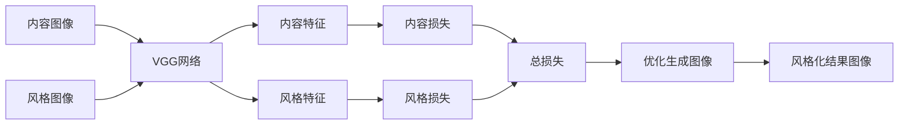

# 基于卷积神经网络的图像风格化处理

关键词：卷积神经网络、图像风格化、深度学习、计算机视觉、TensorFlow

## 1. 背景介绍
### 1.1  问题的由来
随着数字图像处理技术的发展,图像风格化已成为计算机视觉领域的一个热点研究方向。图像风格化旨在将一幅内容图像的视觉风格转换为另一幅风格参考图像的视觉风格,同时保留内容图像的语义内容。这一技术不仅在艺术创作、影视特效、游戏设计等领域有广泛应用前景,也为计算机视觉的发展提供了新的思路和方法。

### 1.2  研究现状
传统的图像风格化方法主要基于纹理合成和色彩映射等技术,但效果往往不够理想。近年来,随着深度学习的兴起,卷积神经网络(CNN)在计算机视觉任务中展现出了强大的特征提取和表示能力。研究人员开始尝试利用CNN来实现图像风格化,取得了令人瞩目的成果。其中最具代表性的工作是Gatys等人提出的Neural Style Transfer[1],他们利用VGG网络提取图像的内容特征和风格特征,并通过优化目标图像使其在两个特征空间上与内容图像和风格图像接近,从而实现风格迁移。此后,Neural Style Transfer引发了一系列后续研究,不断改进生成质量和速度。

### 1.3  研究意义 
图像风格化不仅是一个有趣的视觉效果,更蕴含着深层次的科学问题和应用价值:

(1)从计算机视觉的角度看,图像风格化是理解图像内容和风格表征的一个切入点,有助于探索视觉特征的语义层次和组合规律,推动视觉智能的发展。

(2)从人工智能的角度看,图像风格化体现了人类创造力的某些方面,如何让机器习得这种创造力是人工智能的一个重要课题。CNN在图像风格化中的成功应用,展现了深度学习在视觉创意任务上的潜力。

(3)从应用的角度看,图像风格化可以辅助设计师的创作灵感,扩展普通用户的创意表达,还可以支持影视后期、游戏美术等领域的内容生产。此外,风格化模型对抗鲁棒性的研究,对图像取证、版权保护等也有重要意义。

### 1.4  本文结构
本文将重点介绍一种基于卷积神经网络(CNN)的图像风格化处理方法。第2部分介绍CNN图像风格化的核心概念和关键技术。第3部分详细讲解Neural Style Transfer算法的原理和实现步骤。第4部分建立Neural Style Transfer的数学模型,推导并分析其目标函数和求解方法。第5部分通过TensorFlow实现Neural Style Transfer,并解读关键代码。第6部分讨论CNN图像风格化的应用场景和案例。第7部分推荐相关学习资源和工具。第8部分总结全文,展望图像风格化的发展趋势和挑战。

## 2. 核心概念与联系

卷积神经网络(Convolutional Neural Network, CNN)是一种深度学习模型,常用于图像识别、目标检测等视觉任务。CNN通过逐层卷积和池化操作,可以自动提取图像的层次化特征表示。

图像风格化(Image Style Transfer)是指将一幅内容图像的视觉风格转换为另一幅风格参考图像的视觉风格,同时保留内容图像的语义内容。风格通常指色彩、纹理、笔触等视觉元素的组合特征。

基于CNN的图像风格化,核心思想是利用预训练的CNN同时提取内容图像的内容特征和风格图像的风格特征,并通过优化生成图像,使其在内容特征上接近内容图像,在风格特征上接近风格图像,从而实现风格迁移。

CNN各卷积层的特征图反映了图像不同尺度、不同抽象层次的视觉特征。浅层卷积倾向于提取局部纹理等低层特征,深层卷积倾向于提取全局内容等高层语义。将风格特征定义为浅层特征的统计信息(如Gram矩阵),将内容特征定义为深层特征图,是Neural Style Transfer的关键创新。

下图展示了基于CNN的图像风格化处理的流程概览:

## 3. 核心算法原理 & 具体操作步骤
### 3.1  算法原理概述
Neural Style Transfer[1]的核心思想是:使用预训练的CNN(如VGG网络)提取内容图像的内容特征和风格图像的风格特征,并通过优化生成图像,使其在内容特征和风格特征上分别与内容图像和风格图像接近。其数学本质是最小化一个包含内容损失和风格损失的总损失函数。

### 3.2  算法步骤详解

(1) 选择并加载一个预训练的CNN模型,如VGG-19。一般使用在ImageNet数据集上预训练的权重。

(2) 准备内容图像、风格图像和初始生成图像。初始生成图像可以是随机噪声,也可以是内容图像的副本。

(3) 将三张图像输入CNN,在选定的卷积层提取特征。通常选择较浅层(如conv1_1)提取风格特征,选择较深层(如conv4_2)提取内容特征。

(4) 定义并计算内容损失。内容损失度量生成图像与内容图像在内容特征上的差异,通常用两个特征图的均方误差(MSE)表示:

$$L_{content}(p,x)=\frac{1}{2}\sum_{i,j}(F_{ij}^l(p) - F_{ij}^l(x))^2$$

其中$p$是内容图像,$x$是生成图像,$F^l$表示第$l$层卷积层的特征图。

(5) 定义并计算风格损失。风格损失度量生成图像与风格图像在风格特征上的差异。首先用Gram矩阵$G^l$表示第$l$层特征图的风格特征:

$$G_{ij}^l(x)=\sum_k F_{ik}^l(x) F_{jk}^l(x)$$

然后用Gram矩阵的均方误差(MSE)定义风格损失:

$$E_l=\frac{1}{4N_l^2M_l^2}\sum_{i,j}(G_{ij}^l(s)-G_{ij}^l(x))^2$$
$$L_{style}(s,x)=\sum_{l=0}^L w_l E_l$$

其中$s$是风格图像,$w_l$是第$l$层的权重,表示该层风格损失在总风格损失中的比重。

(6) 定义总损失函数,即内容损失和风格损失的加权和:

$$L_{total}(p,s,x)=\alpha L_{content}(p,x) + \beta L_{style}(s,x)$$

其中$\alpha$和$\beta$是超参数,控制内容损失和风格损失的相对权重。

(7) 以总损失函数为目标,用梯度下降法优化生成图像$x$,更新其像素值以最小化损失。每次迭代计算损失函数关于$x$的梯度,并沿梯度反方向更新$x$:

$$x \leftarrow x - \lambda \frac{\partial L_{total}}{\partial x}$$

其中$\lambda$是学习率。迭代直到损失函数收敛或达到预设的迭代次数。

(8) 输出优化后的生成图像$x$,即为最终的风格化结果图像。

### 3.3  算法优缺点

Neural Style Transfer的优点是:
- 可以在保留内容图像语义内容的同时,灵活地转换为任意风格图像的视觉风格,生成效果艺术感强。
- 端到端的生成方式,不需要手工设计特征或规则,而是让CNN自动学习提取最优特征表示。
- 具有一定的泛化能力,可以处理不同领域、不同风格的图像。

其局限性主要有:
- 计算开销大,每次生成需要重新优化,难以实时处理。
- 生成图像质量不稳定,容易出现局部扭曲、伪影等瑕疵。
- 风格特征提取简单,难以刻画高层语义的风格元素。
- 内容损失和风格损失的平衡需要手工调参,泛化性有限。

后续的一些工作针对这些不足进行了改进,如前馈网络加速生成[2],多尺度风格特征提取[3],自适应损失平衡[4]等,取得了更好的生成质量和速度。

### 3.4  算法应用领域

(1) 艺术创作:可以为普通照片赋予名画、漫画、水彩等多种艺术风格,辅助设计师的创意表达。

(2) 影视特效:可以批量生成具有某种风格的场景、道具贴图,降低后期制作成本。

(3) 游戏美术:可以快速将写实风格的游戏场景转换为卡通风格,或为不同角色、皮肤生成个性化的游戏画面。

(4) 用户交互:可以支持用户上传内容图和风格图,在线生成个性化的风格化图像。

(5) 数据增强:可以利用风格化生成多样化的训练样本,提高视觉识别模型的鲁棒性。

## 4. 数学模型和公式 & 详细讲解 & 举例说明
### 4.1  数学模型构建
Neural Style Transfer的数学模型可以表述为一个最优化问题:

给定内容图像$p$、风格图像$s$,找到一个生成图像$x$,使其在内容特征空间与$p$接近,在风格特征空间与$s$接近,即最小化目标函数:

$$\min_{x} \alpha L_{content}(p,x) + \beta L_{style}(s,x)$$

其中$L_{content}$和$L_{style}$分别是内容损失和风格损失,$\alpha$和$\beta$是它们的权重系数。

内容损失定义为:

$$L_{content}(p,x)=\frac{1}{2}\sum_{i,j}(F_{ij}^l(p) - F_{ij}^l(x))^2$$

其中$F^l$表示VGG网络第$l$层卷积层的特征图。它度量了$p$和$x$在第$l$层特征图上的均方误差(MSE)。通常选择VGG较高层(如conv4_2)作为内容特征。

风格损失定义为:

$$L_{style}(s,x)=\sum_{l=0}^L w_l E_l$$
$$E_l=\frac{1}{4N_l^2M_l^2}\sum_{i,j}(G_{ij}^l(s)-G_{ij}^l(x))^2$$
$$G_{ij}^l(x)=\sum_k F_{ik}^l(x) F_{jk}^l(x)$$

其中$G^l$是第$l$层特征图$F^l$的Gram矩阵,表示特征图各通道的自相关性,反映了该层的风格特征。$E_l$度量了$s$和$x$在第$l$层风格特征上的MSE。$w_l$是第$l$层风格损失的权重,表示该层在总风格损失中的重要性。通常在VGG较低层(如conv1_1)提取风格特征。

### 4.2  公式推导过程

(1) 内容损失的推导:

内容损失定义为第$l$层特征图的MSE:

$$L_{content}(p,x,l)=\frac{1}{2}\sum_{i,j}(F_{ij}^l(p) - F_{ij}^l(x))^2$$

设第$l$层特征图的尺寸为$N_l \times M_l$,则内容损失可以写成:

$$L_{content}(p,x,l)=\frac{1}{2N_lM_l}\sum_{i=1}^{N_l}\sum_{j=1}^{M_l}(F_{ij}^l(p) - F_{ij}^l(x))^2$$

这里$\frac{1}{N_lM_l}$是为了对不同尺寸的特征图归一化。

(2) 风格损失的推导:

首先定义Gram矩阵$G^l$。设第$l$