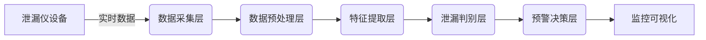

# 基于大数据的泄漏仪设备监控系统

关键词：大数据、泄漏仪、设备监控、实时分析、预警系统、可视化

## 1. 背景介绍
### 1.1 问题的由来
在现代工业生产和城市管理中,泄漏事故时有发生,不仅造成资源浪费,还可能引发严重的安全隐患和环境污染。传统的泄漏检测方法效率低下,难以实现全方位实时监控。因此,亟需一种基于先进技术的智能化泄漏仪设备监控系统。

### 1.2 研究现状
目前,国内外学者针对泄漏检测与监控开展了大量研究。传统方法主要有人工巡检、阈值报警等,但存在实时性差、误报率高等问题。近年来,大数据、物联网、人工智能等新兴技术的发展为泄漏监控带来新的契机。一些学者提出了基于无线传感网络 [1]、机器学习 [2]、深度学习 [3] 的泄漏检测方法,取得了良好效果。

### 1.3 研究意义
开发一套基于大数据的泄漏仪设备监控系统,可以显著提升泄漏检测的智能化水平。该系统能够实时采集和分析海量设备运行数据,及时发现泄漏隐患,触发预警,从而最大限度减少泄漏事故的发生。同时,大数据分析还可挖掘出设备运行规律,为预测性维护提供支撑。因此,该研究具有重要的理论意义和应用价值。

### 1.4 本文结构
本文后续章节安排如下:第2部分介绍泄漏监控涉及的核心概念;第3部分阐述系统采用的核心算法原理;第4部分建立数学模型并推导相关公式;第5部分给出项目的代码实现;第6部分分析实际应用场景;第7部分推荐相关工具和资源;第8部分总结全文并展望未来;第9部分列出常见问题解答。

## 2. 核心概念与联系
泄漏仪是一种用于检测管道或容器泄漏的专用仪器,通过压力、流量等参数的变化判断是否发生泄漏。大数据泛指规模巨大、类型多样的数据集合,具有Volume、Velocity、Variety、Value等4V特性 [4]。将二者结合,就是采用大数据技术对泄漏仪海量监测数据进行采集、存储、分析、可视化,从而实现泄漏的早期预警和智能诊断。

其核心是建立从泄漏仪数据到泄漏事件的映射关系。泄漏仪实时产生的海量数据蕴含着泄漏发生的征兆,需要用大数据分析技术进行刻画和提取。由于泄漏仪类型多样,数据格式复杂,对大数据平台的处理能力提出很高要求。同时,泄漏判断涉及复杂的物理过程,需要深入机理分析和数学建模。因此,泄漏仪大数据分析是一个多学科交叉的复杂系统工程。

下图展示了泄漏仪设备监控系统的基本架构和数据流:

## 3. 核心算法原理 & 具体操作步骤
### 3.1 算法原理概述
本系统采用了一种基于支持向量机(SVM)的泄漏检测算法。SVM是一种常用的机器学习分类算法,通过寻找最优分类超平面将不同类别的样本划分开来 [5]。在泄漏检测中,可将正常工况和泄漏工况的数据视为两类样本,训练SVM模型进行二分类,从而实现泄漏的实时判别。

### 3.2 算法步骤详解
SVM泄漏检测算法的主要步骤如下:
1. 数据采集:通过数据采集模块获取泄漏仪的实时测量数据,包括压力、流量、温度等多个参数。
2. 数据预处理:对原始数据进行清洗、归一化、去噪等预处理操作,提高数据质量。 
3. 特征提取:从预处理后的数据中提取反映泄漏特征的关键指标,如压力突变、流量异常等。
4. 样本构建:选取一定数量的正常样本和泄漏样本,构建训练集和测试集。
5. 模型训练:用训练集数据对SVM模型进行训练,优化模型参数,得到最优分类器。
6. 泄漏判别:将实时采集的数据输入训练好的SVM模型,判别是否发生泄漏。
7. 预警决策:根据SVM输出结果,结合预设阈值,触发相应级别的泄漏预警。

### 3.3 算法优缺点
SVM泄漏检测算法的优点包括:
- 理论基础严谨,分类性能好,可有效降低漏报、误报率。
- 算法复杂度低,易于工程实现,能够满足实时性要求。
- 对小样本、非线性问题的学习能力强,适合泄漏这类小概率事件检测。

但SVM算法也存在一些局限性:
- 对训练样本的依赖性强,样本质量直接影响模型性能。
- 算法的泛化能力有待进一步提高,模型移植性还需加强。
- 对多类问题的处理能力较弱,适用于单一工况泄漏检测。

### 3.4 算法应用领域
SVM泄漏检测算法在石油、化工、燃气等领域得到了广泛应用。国内外学者将其用于长输管道 [6]、储罐 [7]、城市燃气管网 [8] 等场景的泄漏监控,取得了良好的工程应用效果。未来,随着工业过程智能化的深入推进,SVM有望与其他机器学习算法相结合,进一步提升泄漏检测的精准度和实时性。

## 4. 数学模型和公式 & 详细讲解 & 举例说明
### 4.1 数学模型构建
设泄漏仪采集的实时数据为$\boldsymbol{x} = [x_1, x_2, \cdots, x_n]^T$,其中$n$为数据维度。定义泄漏状态标签$y \in \{-1, +1\}$,其中$y=+1$表示发生泄漏,$y=-1$表示正常工况。假设训练集样本数为$m$,则训练集可表示为$T=\{(\boldsymbol{x}_1,y_1),(\boldsymbol{x}_2,y_2),\cdots,(\boldsymbol{x}_m,y_m)\}$。

SVM的目标是找到一个最优超平面$\boldsymbol{w}^T\boldsymbol{x}+b=0$,使得两类样本能够被超平面正确划分,且样本到超平面的几何间隔最大化。其中,$\boldsymbol{w}=[w_1,w_2,\cdots,w_n]^T$为超平面法向量,$b$为偏置项。数学上,这可以表述为如下约束优化问题:

$$
\begin{aligned}
\min_{\boldsymbol{w},b} \quad & \frac{1}{2}\|\boldsymbol{w}\|^2 \\
\text{s.t.} \quad & y_i(\boldsymbol{w}^T\boldsymbol{x}_i+b) \geq 1, \quad i=1,2,\cdots,m
\end{aligned}
$$

其中,$\frac{1}{2}\|\boldsymbol{w}\|^2$项用于控制模型复杂度,避免过拟合;约束条件确保所有样本均能被超平面正确分类,且几何间隔不小于1。

### 4.2 公式推导过程
为了求解上述优化问题,引入拉格朗日乘子$\alpha_i \geq 0$,构建拉格朗日函数:

$$
L(\boldsymbol{w},b,\boldsymbol{\alpha}) = \frac{1}{2}\|\boldsymbol{w}\|^2 - \sum_{i=1}^m \alpha_i [y_i(\boldsymbol{w}^T\boldsymbol{x}_i+b)-1]
$$

根据拉格朗日对偶性,原问题可转化为等价的对偶问题:

$$
\begin{aligned}
\max_{\boldsymbol{\alpha}} \quad & \sum_{i=1}^m \alpha_i - \frac{1}{2} \sum_{i=1}^m \sum_{j=1}^m \alpha_i \alpha_j y_i y_j \boldsymbol{x}_i^T \boldsymbol{x}_j \\
\text{s.t.} \quad & \sum_{i=1}^m \alpha_i y_i = 0 \\
& \alpha_i \geq 0, \quad i=1,2,\cdots,m
\end{aligned}
$$

求解得最优解$\boldsymbol{\alpha}^*=[\alpha_1^*,\alpha_2^*,\cdots,\alpha_m^*]^T$后,可得到原问题的最优解:

$$
\begin{aligned}
\boldsymbol{w}^* &= \sum_{i=1}^m \alpha_i^* y_i \boldsymbol{x}_i \\
b^* &= y_j - \sum_{i=1}^m \alpha_i^* y_i \boldsymbol{x}_i^T \boldsymbol{x}_j
\end{aligned}
$$

其中,$j$为任意满足$0 < \alpha_j^* < C$的样本下标。最终,SVM模型可表示为:

$$
f(\boldsymbol{x}) = \text{sign}(\boldsymbol{w}^{*T} \boldsymbol{x} + b^*) = \text{sign}\left(\sum_{i=1}^m \alpha_i^* y_i \boldsymbol{x}_i^T \boldsymbol{x} + b^*\right)
$$

若$f(\boldsymbol{x})=+1$,则预测$\boldsymbol{x}$为泄漏状态;若$f(\boldsymbol{x})=-1$,则预测$\boldsymbol{x}$为正常状态。

### 4.3 案例分析与讲解
下面以一个简单的二维数据集为例,直观展示SVM泄漏检测模型的建立过程。如图1所示,红色点代表泄漏样本,蓝色点代表正常样本。

首先,选取一部分样本作为训练集,如图2中圈出的6个点。

然后,通过求解对偶问题,得到最优分类超平面,如图3虚线所示。图中还标出了支持向量(SV),即位于虚线两侧边界上的样本点。

最后,用训练好的SVM模型对新采集的测试样本进行泄漏判别,如图4所示。图中测试样本用三角形表示,可以看出SVM能够较好地对其进行分类。

### 4.4 常见问题解答
**Q:** SVM对核函数的选择有什么要求?

**A:** 常用的核函数有线性核、多项式核、高斯核(RBF)等。一般情况下,RBF核是较好的首选,因为它对非线性问题的映射能力强,且参数较少。但RBF核的计算复杂度较高,对于大数据量的问题,可考虑用线性核代替。此外,核函数的选择要与特定的应用场景和数据分布相适应。

**Q:** SVM的主要调参方法有哪些?

**A:** SVM的主要参数包括惩罚系数$C$、核函数类型及其参数(如RBF核的尺度参数$\gamma$)等。一般采用网格搜索和交叉验证的方法对参数进行优选。先在一个粗粒度的网格上找出较优的参数范围,再在一个细粒度的网格上搜索最优参数组合。$k$折交叉验证可用于评估模型的泛化性能,避免过拟合。

**Q:** SVM如何处理非平衡数据集的问题?

**A:** 在泄漏检测任务中,泄漏状态的样本