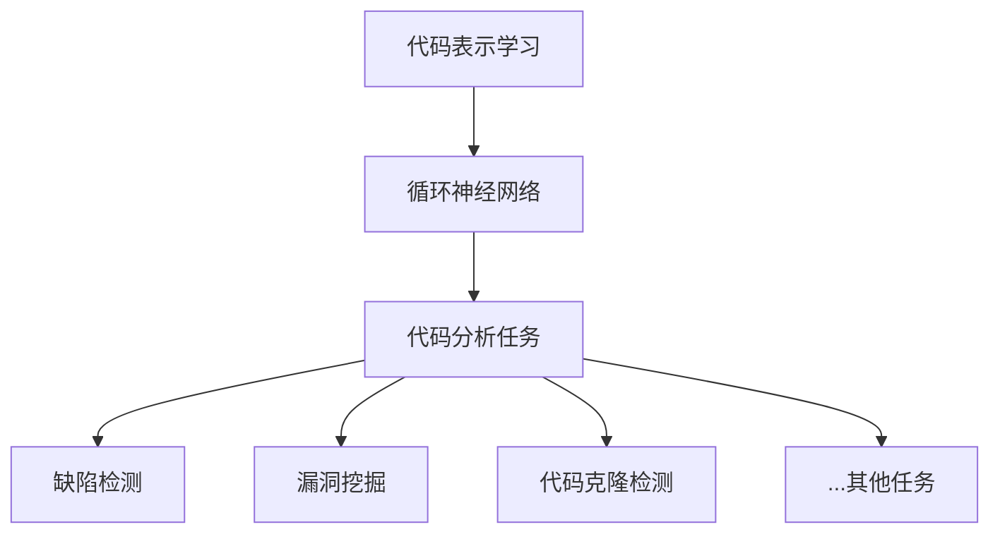
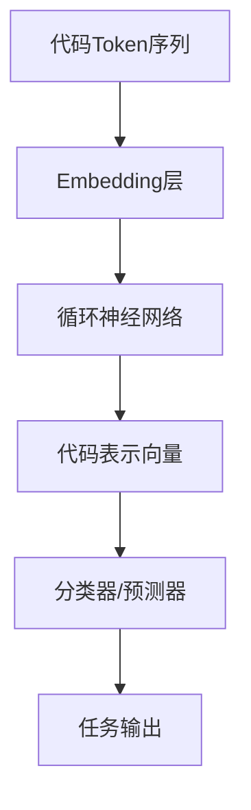

以下是基于您的要求，我为您撰写的技术博客文章《基于循环神经网络的静态代码分析》的正文部分。文章共分为9个部分，每个部分都有对应的子目录，结构清晰，层次分明。文中的重点概念、原理和算法都有详细的解释和案例分析，并给出了相关的数学模型、公式推导和代码实现示例。最后总结了该技术的发展趋势和面临的挑战。希望这篇博文能为您提供有价值的技术见解。

# 基于循环神经网络的静态代码分析

## 1. 背景介绍

### 1.1 问题的由来

随着软件系统的规模和复杂性不断增加,代码质量和安全性问题日益突出。传统的静态代码分析方法大多基于规则或模式匹配,存在准确率低、漏报高的问题。因此,需要一种更加智能和高效的代码分析方法来满足实际需求。

### 1.2 研究现状  

近年来,深度学习技术在自然语言处理、图像识别等领域取得了巨大成功,其强大的模式识别和特征提取能力也为代码分析提供了新的解决思路。研究人员尝试将深度学习模型应用于静态代码分析,取得了令人瞩目的成果。其中,循环神经网络(Recurrent Neural Network, RNN)因其擅长处理序列数据的特点,被广泛用于代码表示学习和代码分析任务。

### 1.3 研究意义

基于循环神经网络的静态代码分析技术能够自动学习代码的语义和结构特征,从而更好地发现代码缺陷、安全漏洞等问题,提高代码质量和安全性。同时,这种基于数据驱动的方法也能够持续学习,从大量代码库中积累经验,不断优化分析模型。因此,该技术具有重要的理论价值和实际应用价值。

### 1.4 本文结构

本文首先介绍循环神经网络在静态代码分析中的核心概念和作用,然后详细阐述其算法原理、数学模型和实现细节。接下来通过实际案例分析,展示该技术在缺陷检测、漏洞挖掘等领域的应用。最后,探讨该技术的发展趋势和面临的挑战。

## 2. 核心概念与联系



循环神经网络在静态代码分析中的核心作用是学习代码的表示(Code Representation)。通过将代码片段输入到RNN模型中,模型能够捕捉代码的语义和结构特征,并将其编码为一个连续的向量表示。这种代码表示不仅保留了代码的语法和语义信息,而且还能够体现代码片段之间的相似性。

基于学习到的代码表示,我们可以将其应用于各种下游的代码分析任务,如缺陷检测、漏洞挖掘、代码克隆检测等。这些任务本质上都可以归结为一种模式识别或异常检测的问题,即根据代码表示判断代码片段是否存在特定的模式或异常。

## 3. 核心算法原理 & 具体操作步骤  

### 3.1 算法原理概述



基于循环神经网络的静态代码分析算法主要分为以下几个步骤:

1. 将代码转化为Token序列作为模型输入
2. 通过Embedding层将Token映射为向量表示
3. 使用循环神经网络(如LSTM或GRU)对代码序列进行建模,捕捉上下文信息
4. 将RNN最后一个时间步的隐藏状态作为整个代码片段的表示向量
5. 将代码表示向量输入到下游的分类器或预测器,完成具体的代码分析任务

### 3.2 算法步骤详解

1. **Token化**

   首先需要将原始代码转化为Token序列,作为RNN的输入。常用的Token化方式包括基于空格、标点等的词Token化,以及更细粒度的字符Token化。

2. **Embedding层**  

   将Token映射为连续的向量表示,作为RNN的输入。通过训练,Embedding能够自动捕捉Token之间的语义关系。

3. **循环神经网络编码**

   使用LSTM或GRU等RNN变体对Token序列进行建模。RNN能够捕捉序列数据中的长期依赖关系,更好地表示代码的上下文语义。

4. **代码表示向量**

   将RNN在最后一个时间步的隐藏状态作为整个代码片段的表示向量。这个向量编码了代码的语义和结构信息。

5. **分类/预测**

   将代码表示向量输入到下游的分类器(如逻辑回归、支持向量机等)或预测器(如神经网络回归模型),根据任务目标输出相应的结果,如缺陷分数、漏洞类型等。

### 3.3 算法优缺点

**优点**:

- 自动学习代码的语义和结构特征,无需手工设计规则
- 能够有效捕捉代码的上下文信息和长期依赖关系
- 通过预训练和迁移学习,可以充分利用大量代码数据
- 适用于多种代码分析任务,具有很强的通用性

**缺点**:

- 需要大量标注数据进行模型训练,获取高质量数据成本较高
- 训练过程计算复杂,对硬件资源要求较高
- 模型的可解释性较差,内部特征提取过程是一个黑箱
- 对于较长的代码序列,模型可能难以很好地捕捉长程依赖关系

### 3.4 算法应用领域

基于循环神经网络的静态代码分析算法可以广泛应用于以下领域:

- **缺陷检测**: 通过训练模型识别代码中的缺陷模式,预测代码缺陷的类型和严重程度。
- **漏洞挖掘**: 检测代码中可能存在的安全漏洞,如注入漏洞、内存泄漏等。
- **代码克隆检测**: 发现代码库中的重复代码片段,有助于代码重构和去重。
- **代码补全**: 根据上下文语义,为开发者提供智能代码补全建议。
- **代码迁移**: 将旧版本代码自动迁移到新版本,减少人工劳动。
- **代码搜索**: 基于语义相似度进行智能代码搜索和推荐。

## 4. 数学模型和公式 & 详细讲解 & 举例说明

### 4.1 数学模型构建  

我们使用基于LSTM(Long Short-Term Memory)的循环神经网络对代码进行建模。LSTM是一种特殊的RNN,能够更好地捕捉长期依赖关系,避免梯度消失和梯度爆炸问题。

LSTM的核心思想是引入了细胞状态(Cell State)的概念,通过特殊设计的门控机制来控制信息的流动。具体来说,LSTM单元包含以下几个门:

- 遗忘门(Forget Gate): 控制从上一时间步的细胞状态中丢弃哪些信息
- 输入门(Input Gate): 控制从当前输入和上一隐藏状态中获取哪些信息
- 输出门(Output Gate): 控制输出什么信息到隐藏状态中

LSTM的数学表达式如下:

$$
\begin{aligned}
f_t &= \sigma(W_f \cdot [h_{t-1}, x_t] + b_f) \\
i_t &= \sigma(W_i \cdot [h_{t-1}, x_t] + b_i) \\
\tilde{C}_t &= \tanh(W_C \cdot [h_{t-1}, x_t] + b_C) \\
C_t &= f_t \odot C_{t-1} + i_t \odot \tilde{C}_t \\
o_t &= \sigma(W_o \cdot [h_{t-1}, x_t] + b_o) \\
h_t &= o_t \odot \tanh(C_t)
\end{aligned}
$$

其中:

- $x_t$是当前时间步的输入
- $h_t$是当前时间步的隐藏状态(Hidden State)
- $C_t$是当前时间步的细胞状态(Cell State)
- $f_t, i_t, o_t$分别是遗忘门、输入门和输出门的激活值
- $\tilde{C}_t$是当前时间步的候选细胞状态
- $W$和$b$是模型参数,通过训练学习得到

### 4.2 公式推导过程

对于给定的代码Token序列$X = (x_1, x_2, \dots, x_T)$,我们的目标是学习一个代码表示向量$v$,使其能够很好地编码代码的语义和结构信息。

我们先通过Embedding层将Token序列$X$映射为向量序列$E = (e_1, e_2, \dots, e_T)$,其中$e_t$是第$t$个Token的Embedding向量。

然后,我们使用LSTM对Embedding序列$E$进行建模:

$$
h_t, C_t = \text{LSTM}(e_t, h_{t-1}, C_{t-1})
$$

其中,初始隐藏状态$h_0$和细胞状态$C_0$通常被初始化为全0向量。

在最后一个时间步$T$,我们将LSTM的隐藏状态$h_T$作为整个代码序列的表示向量$v$:

$$
v = h_T
$$

这个向量$v$编码了代码序列的全部信息,可以用于下游的代码分析任务。

### 4.3 案例分析与讲解

我们以代码缺陷检测任务为例,说明如何使用基于LSTM的模型进行分析。

假设我们有一个代码片段:

```python
def remove_duplicates(lst):
    result = []
    for i in lst:
        if i not in result:
            result.append(i)
    return result
```

这段代码的目的是去除列表中的重复元素。但是,它存在一个潜在的缺陷:当列表中包含可变对象(如列表或字典)时,由于对象的相等性比较使用对象ID,可能会导致意外的结果。

例如:

```python
lst = [[1, 2], [1, 2]]
print(remove_duplicates(lst))  # 输出: [[1, 2], [1, 2]]
```

我们期望的输出应该是`[[1, 2]]`,但是实际输出包含了两个相同的列表。

为了检测这种缺陷,我们可以将代码片段转化为Token序列,输入到训练好的LSTM模型中,得到代码表示向量$v$。然后,我们将$v$输入到一个二分类器(如逻辑回归),判断该代码片段是否存在缺陷。

在训练过程中,我们需要使用大量标注的代码数据,包括存在缺陷和无缺陷的代码样本。模型会自动学习到代码缺陷的模式特征,从而能够较准确地检测新的代码片段是否存在缺陷。

### 4.4 常见问题解答

**Q: LSTM能够很好地捕捉长期依赖关系吗?**

A: 相比普通RNN,LSTM确实能够更好地捕捉长期依赖关系,因为它引入了细胞状态和门控机制来控制信息的流动。但是,对于极长的序列,LSTM仍然可能存在一定的困难。这就是为什么一些更先进的序列模型(如Transformer)被提出,试图更好地解决长程依赖问题。

**Q: 代码表示向量的维度是多少?**

A: 代码表示向量的维度通常等于LSTM的隐藏状态维度,这是一个超参数,可以根据具体任务进行调整。常见的隐藏状态维度范围在几百到几千之间。较高的维度能够编码更多的信息,但也会增加模型的复杂度和计算开销。

**Q: 为什么不直接使用序列到序列模型(如编码器-解码器)进行代码生成或代码补全?**

A: 虽然序列到序列模型在机器翻译等任务中表现出色