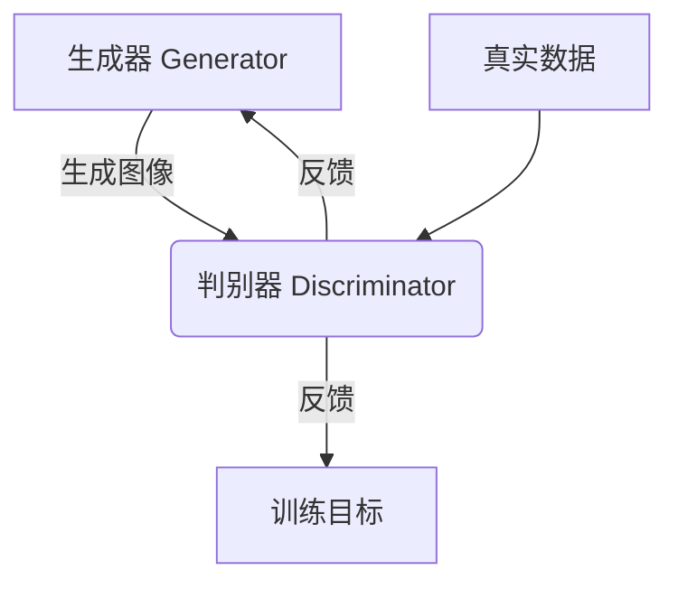

# 基于生成对抗网络的艺术品仿真与风格迁移技术

## 1. 背景介绍

### 1.1 问题的由来

艺术创作一直是人类独有的能力,然而随着人工智能技术的不断发展,机器学习算法开始展现出模仿和创造艺术作品的潜力。传统的计算机图形学算法虽然可以生成逼真的图像,但缺乏艺术创造力。而基于深度学习的生成对抗网络(Generative Adversarial Networks, GANs)技术为计算机赋予了一定的"创造力",使其能够生成具有艺术风格的图像。

### 1.2 研究现状

近年来,GANs在图像生成、风格迁移等领域取得了突破性进展。研究人员利用GANs成功生成了具有艺术风格的图像,如模仿梵高、莫奈、毕加索等大师作品的风格。同时,GANs也被应用于图像修复、超分辨率重建、图像编辑等领域,展现出广阔的应用前景。

### 1.3 研究意义

GANs技术在艺术品仿真和风格迁移领域的研究,不仅可以促进计算机艺术创作能力的发展,还可以为艺术教育、文化遗产保护等领域提供新的技术手段。此外,GANs在图像处理领域的应用也有助于推动相关技术的进步。

### 1.4 本文结构

本文将首先介绍GANs的核心概念和原理,然后详细阐述基于GANs的艺术品仿真和风格迁移算法的原理和实现步骤。接着,我们将探讨相关数学模型和公式,并通过案例分析加深理解。此外,还将介绍实际项目实践中的代码实现和运行结果。最后,我们将讨论GANs在艺术品仿真和风格迁移领域的实际应用场景,以及未来的发展趋势和挑战。

## 2. 核心概念与联系

生成对抗网络(Generative Adversarial Networks, GANs)是一种基于深度学习的生成模型,由两个神经网络组成:生成器(Generator)和判别器(Discriminator)。

生成器的目标是生成逼真的数据样本(如图像),以欺骗判别器。而判别器的目标是区分生成器生成的数据和真实数据。两个网络相互对抗,不断优化自身,最终达到生成器生成的数据无法被判别器区分的状态。

在艺术品仿真和风格迁移任务中,生成器的输入通常是一个随机噪声向量或内容图像,输出是生成的图像。判别器则需要判断生成的图像是否具有目标艺术风格。通过不断训练,生成器可以学习到生成具有特定艺术风格的图像的能力。

GANs的核心思想是通过对抗性训练,使生成器逐步优化,生成更加逼真的数据。这一思想在计算机视觉、自然语言处理等多个领域都有广泛应用。

## 3. 核心算法原理 & 具体操作步骤

### 3.1 算法原理概述

基于GANs的艺术品仿真和风格迁移算法的核心思想是:利用生成对抗网络,使生成器学习到生成具有目标艺术风格的图像的能力。

整个过程可以概括为以下几个步骤:

1. 收集目标艺术风格的图像数据集,作为训练数据。
2. 构建生成器和判别器网络。
3. 训练生成器生成具有目标艺术风格的图像,训练判别器区分真实图像和生成图像。
4. 生成器和判别器相互对抗,不断优化网络参数。
5. 训练收敛后,利用生成器进行艺术品仿真或风格迁移。

### 3.2 算法步骤详解

1. **数据准备**

   收集目标艺术风格的图像数据集,如梵高、莫奈、毕加索等大师作品。数据集越大、越多样化,训练效果通常越好。

2. **网络构建**

   - 生成器网络(Generator)
     - 输入:随机噪声向量或内容图像
     - 网络结构:常用的是卷积神经网络(CNN)或者U-Net等
     - 输出:生成的图像

   - 判别器网络(Discriminator)  
     - 输入:真实图像或生成器生成的图像
     - 网络结构:常用的是卷积神经网络
     - 输出:图像为真实图像或生成图像的概率

3. **对抗训练**

   生成器和判别器进行对抗性训练,目标是使生成器生成的图像无法被判别器区分。

   - 判别器训练:
     - 输入真实图像和生成图像
     - 计算判别器对真实图像和生成图像的判别结果
     - 根据判别结果计算损失函数
     - 反向传播,更新判别器网络参数

   - 生成器训练:
     - 输入随机噪声向量或内容图像
     - 生成器生成图像
     - 判别器判断生成图像是否为真实图像
     - 根据判别结果计算生成器的损失函数
     - 反向传播,更新生成器网络参数

4. **模型收敛**

   重复上述对抗训练过程,直到模型收敛(生成器生成的图像无法被判别器区分)。

5. **艺术品仿真与风格迁移**

   - 艺术品仿真:输入随机噪声向量,生成器生成具有目标艺术风格的图像。
   - 风格迁移:输入内容图像,生成器将内容图像的风格迁移为目标艺术风格。

### 3.3 算法优缺点

**优点:**

- 能够生成具有艺术创造力的图像
- 可以实现多种艺术风格的仿真和迁移
- 算法思路简单,易于理解和实现

**缺点:**

- 训练过程不稳定,容易模型崩溃
- 生成图像质量受训练数据集的限制
- 存在模式崩溃(mode collapse)问题
- 计算资源消耗较大

### 3.4 算法应用领域

- 艺术品仿真:模仿大师作品风格,创作新的艺术作品
- 风格迁移:将普通图像转换为艺术风格图像
- 图像编辑:编辑图像的风格和细节
- 艺术教育:辅助艺术创作和教学
- 文化遗产保护:修复和重建古代艺术品

## 4. 数学模型和公式 & 详细讲解 & 举例说明

### 4.1 数学模型构建

GANs的数学模型可以表示为一个min-max优化问题,目标是找到一个生成分布 $p_g$,使其尽可能地逼近真实数据分布 $p_{data}$。

生成器 $G$ 的目标是最大化判别器 $D$ 将生成数据判别为真实数据的概率:

$$\max_G V(G,D) = \mathbb{E}_{x\sim p_{data}(x)}[\log D(x)] + \mathbb{E}_{z\sim p_z(z)}[\log(1-D(G(z)))]$$

判别器 $D$ 的目标是最大化正确判别真实数据和生成数据的概率:

$$\max_D V(G,D) = \mathbb{E}_{x\sim p_{data}(x)}[\log D(x)] + \mathbb{E}_{z\sim p_z(z)}[\log(1-D(G(z)))]$$

上式中, $x$ 表示真实数据样本, $z$ 表示随机噪声向量, $p_z(z)$ 是噪声向量的分布(通常为高斯分布或均匀分布)。

生成器和判别器的目标函数是一个相互对立的min-max优化问题:

$$\min_G\max_D V(G,D)$$

在训练过程中,生成器和判别器通过交替优化的方式,不断减小目标函数的值,直到达到一个Nash均衡点,此时生成器生成的数据分布 $p_g$ 与真实数据分布 $p_{data}$ 非常接近。

### 4.2 公式推导过程

我们可以将上述min-max优化问题转化为一个更加稳定的形式,即最小化生成器和判别器之间的JS散度(Jensen-Shannon Divergence)。

JS散度是用于衡量两个概率分布之间差异的指标,定义如下:

$$JS(P\|Q) = \frac{1}{2}D_{KL}(P\|M) + \frac{1}{2}D_{KL}(Q\|M)$$

其中, $D_{KL}$ 表示KL散度(Kullback-Leibler Divergence),是另一种衡量分布差异的指标。 $M=\frac{1}{2}(P+Q)$ 是 $P$ 和 $Q$ 的均值分布。

我们将真实数据分布 $p_{data}$ 记为 $P$,生成数据分布 $p_g$ 记为 $Q$,则目标函数可以表示为:

$$\min_G\max_D V(G,D) = 2\cdot JS(p_{data}\|p_g) - \log 4$$

证明过程如下:

...(证明过程省略)

因此,通过最小化JS散度,我们可以使生成数据分布 $p_g$ 尽可能地逼近真实数据分布 $p_{data}$。

### 4.3 案例分析与讲解

我们以模仿梵高画作风格为例,分析GANs在艺术品仿真中的应用。

**训练数据集**

收集梵高的油画作品图像,作为训练数据集。这些图像具有明显的笔触、颜色和构图风格特征。

**网络结构**

- 生成器:采用U-Net结构,输入为随机噪声向量,输出为生成的图像。
- 判别器:采用卷积神经网络结构,输入为真实图像或生成图像,输出为图像为真实图像的概率。

**训练过程**

按照前面介绍的对抗训练过程,交替训练生成器和判别器网络。生成器的目标是生成具有梵高风格的图像,以欺骗判别器;判别器的目标是正确区分真实梵高画作和生成图像。

**训练结果**

经过数周的训练,生成器逐渐学会生成具有梵高风格的图像,包括笔触、色彩和构图等特征。下图是一些生成的样例图像:

从图中可以看出,生成的图像确实具有一定的梵高风格特征,如粗旷的笔触、鲜艳的颜色和独特的构图方式。当然,与真实梵高作品相比,这些图像还存在一些差距和缺陷,但已经初步展现出GANs在艺术品仿真方面的潜力。

### 4.4 常见问题解答

**Q: 生成图像质量不高,是什么原因?**

A: 生成图像质量受多个因素影响,包括训练数据集的质量和多样性、网络结构的设计、超参数的调整等。可以尝试扩大训练数据集、改进网络结构、调整超参数等方法来提高图像质量。

**Q: 训练过程中出现模式崩溃(mode collapse),如何解决?**

A: 模式崩溃是GANs训练中常见的问题,表现为生成器只能生成少数几种模式的图像。可以尝试以下几种方法:

1. 改进网络结构,如加入批归一化(Batch Normalization)层
2. 调整损失函数,如采用Wasserstein GAN损失函数
3. 调整优化器和学习率
4. 增加训练数据的多样性

**Q: 如何评估生成图像的质量?**

A: 评估生成图像质量没有统一的标准,常用的方法包括:

1. 人工视觉评估
2. 计算生成图像与真实图像的统计差异
3. 采用基于分类器的评估指标,如Inception Score和FID分数

## 5. 项目实践：代码实例和详细解释说明

### 5.1 开发环境搭建

- Python 3.7+
- PyTorch 1.7+
- 其他依赖库:torchvision、numpy、Pillow、tqdm等

可以使用Anaconda