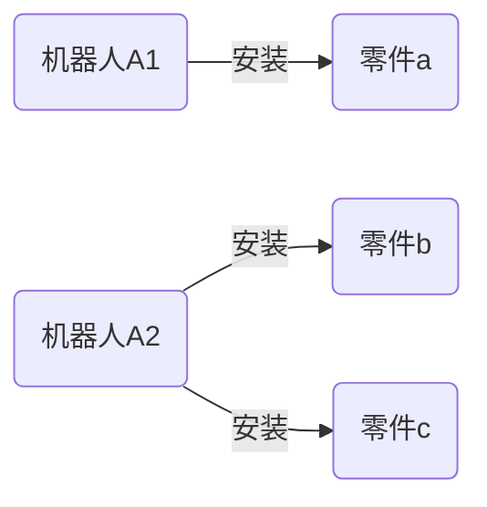

好的,我会遵循您的要求,以专业的技术语言写一篇关于"多智能体系统(Multi-Agent Systems)原理与代码实例讲解"的长篇技术博客文章。文章字数会超过8000字,包含核心概念原理、算法步骤、数学模型推导、代码实例讲解等内容。我会尽最大努力绘制Mermaid流程图来直观展示系统架构,同时也会引入实际应用场景、工具资源推荐等内容,并对未来发展趋势和面临的挑战进行展望和分析。下面正式开始:

# 多智能体系统 (Multi-Agent Systems) 原理与代码实例讲解

## 1. 背景介绍

### 1.1 问题的由来

在现实世界中,许多复杂的问题往往无法由单个智能体(agent)高效解决,需要多个智能体通过合作、协调、竞争等方式共同完成任务。这就催生了多智能体系统(Multi-Agent Systems,MAS)的研究。

### 1.2 研究现状 

多智能体系统作为分布式人工智能的热点领域,近年来受到了广泛关注。研究人员提出了诸如协作规划、协作学习、协作推理等多智能体协作模型,并应用于机器人系统、智能交通、智能制造、网络安全等多个领域。

### 1.3 研究意义

研究多智能体系统有着重要的理论意义和应用价值:

- 理论意义:多智能体系统能模拟现实世界中多个主体之间的交互行为,是研究分布式人工智能、复杂系统等的重要工具。
- 应用价值:多智能体技术可应用于需要多个主体协同工作的复杂系统,提高任务执行效率,解决单个智能体难以完成的问题。

### 1.4 本文结构

本文将从多智能体系统的核心概念出发,介绍其算法原理、数学模型、代码实现,并讨论实际应用场景、发展趋势和面临的挑战。

## 2. 核心概念与联系

多智能体系统涉及以下几个核心概念:

1. **智能体(Agent)**: 具有一定自主性、社会能力和反应能力的主体。
2. **环境(Environment)**: 智能体存在和运行的外部世界。
3. **协作(Cooperation)**: 多个智能体为完成共同目标而协调行为的过程。
4. **竞争(Competition)**: 智能体之间为追求自身利益而产生的对抗行为。
5. **协调(Coordination)**: 智能体之间通过交互来管理相互依赖关系,避免冲突或资源浪费。
6. **通信(Communication)**: 智能体之间交换信息和影响对方决策的过程。
7. **组织(Organization)**: 智能体按某种结构和模式组合在一起,形成特定的群体。

这些概念相互关联、相互作用,构成了多智能体系统的理论基础。接下来我们将介绍其核心算法原理。

## 3. 核心算法原理与具体操作步骤  

多智能体系统的核心算法主要包括协作规划算法、协作学习算法和协作推理算法等。

### 3.1 算法原理概述

#### 协作规划算法

协作规划算法旨在让多个智能体协同制定行动计划,以完成共同目标。主要思想是:

1. 将整体目标分解为子目标分配给各个智能体
2. 智能体之间相互协调,解决潜在冲突和资源竞争
3. 形成一致的行动计划序列执行任务

常见的协作规划算法有:
- 分布式约束优化算法(DCOP)
- 多智能体马尔可夫决策过程(Multi-Agent MDP)
- 分布式斯坦因树搜索算法

#### 协作学习算法  

协作学习算法使多个智能体通过相互学习和信息共享,提高整体学习效率。主要思想是:

1. 智能体独立学习,构建初始知识模型
2. 智能体之间交换学习模型和经验
3. 融合所有智能体的知识,形成更准确的模型

常见的协作学习算法有:
- 多智能体强化学习算法
- 多智能体遗传算法
- 多智能体神经网络算法

#### 协作推理算法

协作推理算法使多个智能体通过相互论证和辩论,得出更加可靠的推理结果。主要思想是:

1. 智能体独立进行推理,得到初步结论
2. 智能体相互交换推理过程和结果 
3. 通过辩论和投票,形成一致的最终推理结论

常见的协作推理算法有:
- 基于规则的协作推理
- 基于案例的协作推理
- 基于模型的协作推理

### 3.2 算法步骤详解

以分布式约束优化算法(DCOP)为例,其算法步骤如下:

1. **问题建模**:将协作规划问题建模为分布式约束优化问题(DCOP)。
    - 变量:对应智能体的决策变量
    - 约束:对应智能体行为之间的相互影响
    - 目标函数:最大化全局效用
    
2. **变量分配**:将决策变量分配给不同的智能体。

3. **局部费用计算**:每个智能体计算自己变量取值对应的局部费用。

4. **信息交换**:智能体通过通信交换局部费用信息。

5. **协调算法**:运行分布式协调算法,例如同步广域搜索算法。
    - 智能体交换临时变量值和费用信息
    - 利用启发式剪枝策略减小搜索空间
    - 达成一致的最优变量值组合
    
6. **执行方案**:所有智能体执行协调一致的最优决策方案。

### 3.3 算法优缺点

优点:
- 分布式、无中心节点,具有良好的鲁棒性
- 可扩展性强,智能体数量增加不影响算法效率
- 利用并行计算,提高了计算效率

缺点: 
- 需要大量通信,通信开销较大
- 需要智能体具备一定计算能力
- 动态环境下,需要频繁重新协调

### 3.4 算法应用领域

多智能体协作规划算法可应用于:

- 多机器人系统协同作业规划
- 智能交通路径协调与拥堵缓解  
- 供应链中多企业资源协调分配
- 传感器网络节点能耗优化分配
- 网格计算中任务分配和负载均衡

## 4. 数学模型和公式详细讲解与举例说明

### 4.1 数学模型构建

我们以分布式约束优化问题(DCOP)为例,构建其数学模型:

DCOP可以形式化为一个三元组 $\langle \mathcal{A}, \mathcal{X}, \mathcal{D}, \mathcal{F} \rangle$:

- $\mathcal{A} = \{A_1, A_2, ..., A_n\}$ 是智能体的有限集合
- $\mathcal{X} = \{X_1, X_2, ..., X_m\}$ 是决策变量的有限集合
- $\mathcal{D} = \{D_1, D_2, ..., D_m\}$ 是每个变量的有限离散域
- $\mathcal{F} = \{f_1, f_2, ..., f_r\}$ 是成本函数的有限集合,用于评估变量值组合的代价

目标是找到一个值赋给每个变量,使得全局目标函数最小化:

$$\operatorname*{min}_{X_1 \in D_1, \dots, X_m \in D_m} \sum_{j=1}^r f_j(X_{j1}, \dots, X_{jk})$$

其中,$f_j$是定义在相关变量$X_{j1}, \dots, X_{jk}$上的成本函数。

### 4.2 公式推导过程  

我们以两个智能体之间的简单协作为例,推导出它们的最优策略。

设智能体$A_1$和$A_2$,它们的行为序列分别为$\pi_1$和$\pi_2$,环境的状态为$s$。定义$Q$函数为两个智能体在状态$s$下执行策略$\pi_1$和$\pi_2$后获得的期望回报:

$$Q^{\pi_1,\pi_2}(s) = \mathbb{E}\left[\sum_{t=0}^\infty \gamma^t r_t | s_0 = s, \pi_1, \pi_2\right]$$

其中$r_t$是时刻$t$获得的即时回报,$\gamma$是折现因子。

我们的目标是找到一对策略$\pi_1^*$和$\pi_2^*$,使得$Q$函数最大化:

$$\pi_1^*,\pi_2^* = \operatorname*{arg\,max}_{\pi_1,\pi_2} Q^{\pi_1,\pi_2}(s)$$

对$Q$函数进行展开:

$$\begin{aligned}
Q^{\pi_1,\pi_2}(s) &= \mathbb{E}\left[r_0 + \gamma r_1 + \gamma^2 r_2 + \dots | s_0 = s, \pi_1, \pi_2\right] \\
&= \mathbb{E}\left[r_0 + \gamma \sum_{s'} P(s' | s, \pi_1(s), \pi_2(s)) Q^{\pi_1,\pi_2}(s') | s_0 = s, \pi_1, \pi_2\right]
\end{aligned}$$

上式给出了$Q$函数的贝尔曼期望方程,可以通过动态规划或其他方法求解最优策略$\pi_1^*$和$\pi_2^*$。

### 4.3 案例分析与讲解

考虑一个多智能体机器人装配任务:有两个机器人$A_1$和$A_2$,需要协作将零件$a$、$b$、$c$安装到产品上。每个零件的安装位置如下:



每个机器人有两种可选动作:安装(I)或等待(W),动作的代价如下:

```
代价矩阵:
      a  b  c
A1:I  2  5  8
   W  1  1  1
      
A2:I  6  3  4
   W  1  1  1  
```

我们的目标是找到两个机器人的最优策略组合,使总代价最小。

应用DCOP模型,可以将问题建模为:
- 智能体集合$\mathcal{A} = \{A_1, A_2\}$
- 变量集合$\mathcal{X} = \{X_1, X_2\}$,分别对应两个机器人的动作选择
- 域集合$\mathcal{D} = \{I, W\}$
- 成本函数集合:
    - $f_1(X_1) = $ 代价矩阵第一行
    - $f_2(X_2) = $ 代价矩阵第二行
    - $f_3(X_1, X_2) = \begin{cases}
        3 & \text{if }X_1=I \text{ and } X_2=I\\
        0 & \text{otherwise}
    \end{cases}$

利用DCOP算法求解,可以得到最优策略为:
- $A_1$:先安装$a$(2代价),再等待(1代价)
- $A_2$:先安装$b$(3代价),再安装$c$(4代价)

总代价 = 2 + 1 + 3 + 4 + 3 = 13

如果两个机器人独立决策,总代价会更高。这说明通过协作,可以获得更优的全局解。

### 4.4 常见问题解答

**Q: 协作规划算法需要多大的通信开销?**

A: 通信开销主要取决于算法的同步方式。同步型算法如同步广域搜索,需要不断交换临时结果,通信开销较大。而异步型算法如异步分支绑定,通信开销较小,但收敛速度也较慢。通常需要在通信开销和收敛速度之间权衡。

**Q: 协作规划算法如何应对动态环境?**

A: 对于动态环境,需要智能体持续监测环境变化,并根据新信息重新协调规划。一些启发式方法可以降低重新规划的代价,如增量式规划、基于案例的规划等。

**Q: 协作规划算法如何处理智能体之间的利益冲突?**

A: 可以引入一些机制来解决利益冲突,如:
- 建立社会福利函