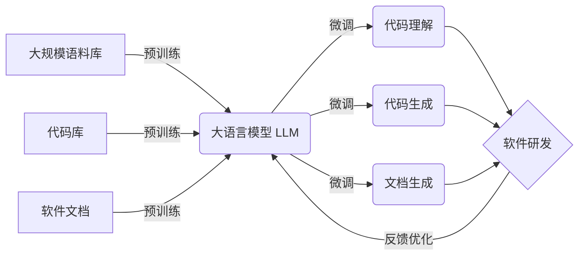

# 多模态大模型：技术原理与实战 LLM在软件研发过程中的单点提效

关键词：多模态、大模型、LLM、软件研发、提效

## 1. 背景介绍
### 1.1  问题的由来
随着人工智能技术的飞速发展，大模型尤其是大语言模型（Large Language Model，LLM）在各个领域得到了广泛应用。LLM 强大的自然语言理解和生成能力，使其在软件研发过程中展现出了巨大的潜力。传统的软件研发流程往往耗时耗力，如何利用 LLM 来提高研发效率，成为了业界关注的热点问题。

### 1.2  研究现状
目前，国内外已有不少团队开始探索将 LLM 应用于软件研发领域。微软研究院提出了 CodeBERT 模型，利用 BERT 来理解编程语言，辅助代码补全、文档生成等任务。OpenAI 发布的 Codex 模型可以根据自然语言描述直接生成代码。国内的华为诺亚方舟实验室也提出了 CodeGPT 等大模型，用于代码智能生成与分析。

### 1.3  研究意义
将 LLM 引入软件研发过程，有望大幅提升研发效率，改变传统的编程范式。LLM 可以自动化很多繁琐的编程任务，如代码补全、文档生成、bug 修复等，让开发人员从机械化的编码工作中解放出来，专注于更有创造性的工作。同时，LLM 强大的知识学习能力，可以快速积累编程经验，让开发者拥有更多的"参考答案"，加速问题的解决。

### 1.4  本文结构
本文将围绕多模态大模型在软件研发中的应用展开论述。第2部分介绍相关的核心概念；第3部分重点阐述 LLM 在软件研发中的技术原理和算法；第4部分建立数学模型，推导关键公式；第5部分给出代码实例，演示 LLM 的实际应用；第6部分分析 LLM 在软件研发中的典型应用场景；第7部分推荐相关的学习资源和开发工具；第8部分总结全文，展望未来的发展趋势和挑战；第9部分列举常见问题解答。

## 2. 核心概念与联系
在探讨 LLM 在软件研发中的应用之前，我们需要厘清几个核心概念：

- 大模型：指参数量极大（百亿、千亿级别）的深度学习模型，一般需要海量数据和强大算力来训练，如 GPT-3、PaLM、GLM 等。
- 大语言模型（LLM）：是大模型的一种，专门用于处理和生成自然语言。LLM 通过学习大规模语料库，掌握了语言的语法、语义、常识等知识。
- 多模态学习：指融合文本、图像、语音等不同模态的信息，来增强模型的理解和生成能力。将多模态技术与 LLM 结合，可以实现更加智能化的交互。
- 软件研发：指软件的设计、编码、测试、部署、维护等全生命周期的活动。传统的软件研发依赖开发者的编程技能和经验，而引入 LLM 后，可以实现智能化、自动化的研发范式。

这些概念之间紧密联系、相辅相成。LLM 作为一种大模型，专注于自然语言处理任务。将 LLM 与多模态学习结合，可以同时理解代码、注释、文档等不同形式的信息。运用这些 AI 技术赋能软件研发，则有望产生革命性的影响，大幅提升软件生产力。

下图展示了多模态大模型在软件研发中应用的总体架构：

从上图可见，LLM 在吸收了海量的代码、注释、文档语料后，经过预训练获得了编程领域知识。在此基础上，针对代码理解、生成、文档生成等任务进行微调，就可以应用到实际的软件研发场景中。同时，研发过程中产生的新数据也可以反馈到 LLM 的训练中，形成正向循环。

## 3. 核心算法原理 & 具体操作步骤
### 3.1  算法原理概述
LLM 的核心算法主要基于 Transformer 架构和自回归语言模型。Transformer 引入了自注意力机制，可以建模文本序列中的长距离依赖关系。自回归语言模型则以前面的词来预测下一个词，可以根据上下文生成连贯的语句。

将 Transformer 和自回归结合，就形成了强大的语言生成模型。具体来说，Transformer 包含编码器和解码器两部分。编码器负责理解输入的文本序列，提取其中的语义信息。解码器则根据编码器的输出，自回归地生成目标文本。

### 3.2  算法步骤详解
以代码生成任务为例，详细说明 LLM 的工作流程：

1. 语料预处理：对大规模的代码语料进行清洗、分词、统计，构建词表。将代码序列根据词表映射为数字化的 token 序列。

2. 输入表示：对输入的代码片段或自然语言描述进行 token 化，并加入位置编码，得到编码器的输入表示 $\boldsymbol{x}=\left(x_1,\cdots,x_n\right)$。

3. 编码器计算：Transformer 编码器包含若干个相同的层，每一层由两个子层组成：
$$
\begin{aligned}
\boldsymbol{z}_i^{(l)} &= \text{LN}(\text{MHAtt}(\boldsymbol{x}_i^{(l-1)}) + \boldsymbol{x}_i^{(l-1)}) \\
\boldsymbol{x}_i^{(l)} &= \text{LN}(\text{FFN}(\boldsymbol{z}_i^{(l)}) + \boldsymbol{z}_i^{(l)})
\end{aligned}
$$
其中，$\boldsymbol{x}_i^{(l)}$ 表示第 $l$ 层第 $i$ 个位置的隐状态，$\text{MHAtt}$ 为多头自注意力机制，$\text{FFN}$ 为前馈神经网络，$\text{LN}$ 为层归一化。编码器的输出记为 $\boldsymbol{h}=\left(h_1,\cdots,h_n\right)$。

4. 解码器计算：解码器也由若干个相同的层组成，每一层包含三个子层：
$$
\begin{aligned}
\boldsymbol{s}_j^{(l)} &= \text{LN}(\text{MHAtt}(\boldsymbol{y}_j^{(l-1)}, \boldsymbol{y}_{<j}^{(l-1)}) + \boldsymbol{y}_j^{(l-1)}) \\
\boldsymbol{c}_j^{(l)} &= \text{LN}(\text{MHAtt}(\boldsymbol{s}_j^{(l)}, \boldsymbol{h}) + \boldsymbol{s}_j^{(l)}) \\
\boldsymbol{y}_j^{(l)} &= \text{LN}(\text{FFN}(\boldsymbol{c}_j^{(l)}) + \boldsymbol{c}_j^{(l)})
\end{aligned}
$$
其中，$\boldsymbol{y}_j^{(l)}$ 表示目标序列的第 $l$ 层第 $j$ 个位置的隐状态。解码器会根据之前生成的 token $\boldsymbol{y}_{<j}$ 来预测下一个 token $y_j$。

5. 代码生成：解码器的输出 $\boldsymbol{y}=\left(y_1,\cdots,y_m\right)$ 即为生成的目标代码序列。训练时以真实的代码作为监督信号，优化模型参数。预测时则根据输入的信息自回归生成代码。

### 3.3  算法优缺点
LLM 在代码生成任务上的优点包括：
- 可以处理海量的代码语料，从中学习编程知识和模式。
- 生成的代码具有合理的语法和语义，可读性较好。
- 支持多种编程语言，具有一定的泛化能力。
- 可以根据注释、文档等信息生成对应的代码，提高开发效率。

但 LLM 也存在一些局限性：
- 生成的代码可能存在错误或安全漏洞，需要人工检查。
- 对于复杂的算法逻辑，生成的代码质量有待提高。
- 模型训练需要大量的算力和时间成本。
- 推理速度较慢，实时响应能力有限。

### 3.4  算法应用领域
LLM 在软件研发中的应用主要包括：

- 代码补全：根据上下文信息，自动补全剩余的代码。
- 代码生成：根据自然语言描述，直接生成对应的代码实现。
- 代码文档生成：根据代码内容，自动生成对应的注释、文档。
- 代码错误检测：通过学习正确的代码模式，发现并定位代码中的错误。
- 代码优化：对冗余或低效的代码片段提出优化建议。

除了软件研发，LLM 还可以应用于智能问答、知识图谱构建、机器翻译等多个自然语言处理场景。

## 4. 数学模型和公式 & 详细讲解 & 举例说明
### 4.1  数学模型构建
为了刻画 LLM 的代码生成过程，我们可以建立如下数学模型。

令 $\mathcal{X}$ 表示输入空间，$\mathcal{Y}$ 表示输出空间，$\mathcal{D}$ 为训练数据集。我们的目标是学习一个条件概率分布 $P(Y|X)$，使得对于任意一个输入 $X\in\mathcal{X}$，模型能够生成对应的目标代码 $Y\in\mathcal{Y}$。

具体来说，给定一个输入序列 $X=\left(x_1,\cdots,x_n\right)$，模型需要生成一个目标序列 $Y=\left(y_1,\cdots,y_m\right)$，其概率为：

$$
P(Y|X) = \prod_{j=1}^m P(y_j|y_{<j}, X)
$$

其中，$y_{<j}$ 表示 $y_j$ 之前的所有 token。这里假设目标序列的生成过程满足马尔可夫性，即下一个 token 只与之前的 token 和输入序列有关。

在 Transformer 中，$P(y_j|y_{<j}, X)$ 通过解码器的输出分布来计算：

$$
P(y_j|y_{<j}, X) = \text{softmax}(\boldsymbol{W}_o \boldsymbol{y}_j^{(L)} + \boldsymbol{b}_o)
$$

其中，$\boldsymbol{W}_o$ 和 $\boldsymbol{b}_o$ 为输出层的参数，$\boldsymbol{y}_j^{(L)}$ 为解码器第 $L$ 层第 $j$ 个位置的隐状态。

模型的训练目标是最大化训练数据集 $\mathcal{D}$ 上的对数似然函数：

$$
\mathcal{L}(\theta) = \sum_{(X,Y)\in\mathcal{D}} \log P(Y|X;\theta)
$$

其中，$\theta$ 为模型的所有参数。通过梯度下降法不断迭代更新 $\theta$，最终得到优化后的模型。

### 4.2  公式推导过程
下面我们详细推导 Transformer 中的关键公式。

首先是编码器的自注意力机制。对于第 $l$ 层第 $i$ 个位置，其查询向量 $\boldsymbol{q}_i^{(l)}$、键向量 $\boldsymbol{k}_i^{(l)}$ 和值向量 $\boldsymbol{v}_i^{(l)}$ 分别为：

$$
\begin{aligned}
\boldsymbol{q}_i^{(l)} &= \boldsymbol{W}_q^{(l)} \boldsymbol{x}_i^{(l-1)} \\
\boldsymbol{k}_i^{(l)} &= \boldsymbol