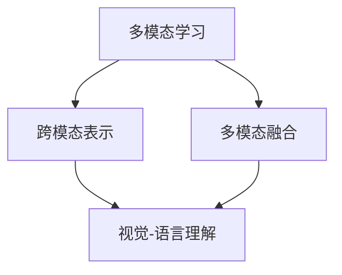

# 多模态大模型：技术原理与实战 图像多模态技术

关键词：多模态、大模型、图像理解、视觉-语言、跨模态、多模态融合

## 1. 背景介绍

### 1.1 问题的由来
随着人工智能技术的飞速发展，单一模态的信息处理已经无法满足日益复杂的应用需求。现实世界中的信息通常以多种模态形式存在，如文本、图像、音频和视频等。如何有效地利用和融合这些多模态信息，实现更全面、更准确的理解和交互，成为了人工智能领域的重要研究课题。其中，图像作为最直观、最丰富的信息载体之一，与其他模态信息的融合成为了多模态研究的热点方向。

### 1.2 研究现状
近年来，多模态机器学习和深度学习技术的快速发展，为图像多模态技术的研究提供了新的思路和方法。一方面，大规模预训练模型如BERT、GPT等在自然语言处理领域取得了巨大成功，启发了研究者探索将类似的思路应用于多模态领域。另一方面，深度学习模型在计算机视觉任务上的优异表现，为图像特征的提取和表示提供了强大的工具。在此基础上，图像多模态技术得到了蓬勃发展，涌现出了一系列创新性的模型和方法，如ViLBERT、LXMERT、UNITER等。

### 1.3 研究意义
图像多模态技术的研究具有重要的理论意义和应用价值。从理论角度来看，多模态信息的融合是人类感知和认知的重要特征，研究图像多模态技术有助于我们更深入地理解人类智能的本质和机理。从应用角度来看，图像多模态技术可以广泛应用于智能问答、视觉搜索、内容生成等领域，极大地提升系统的智能化水平和用户体验。同时，图像多模态技术也为残障人士提供了更便捷的信息获取和交互方式，具有重要的社会意义。

### 1.4 本文结构
本文将围绕图像多模态技术展开深入探讨。第二部分将介绍图像多模态技术的核心概念和关键技术。第三部分将重点阐述图像多模态技术的核心算法原理和具体操作步骤。第四部分将给出相关的数学模型和公式，并结合实例进行详细讲解。第五部分将展示图像多模态技术的代码实现和详细解释。第六部分将讨论图像多模态技术的实际应用场景和未来展望。第七部分将推荐相关的工具和学习资源。第八部分将总结全文，并对图像多模态技术的未来发展趋势和挑战进行展望。

## 2. 核心概念与联系

图像多模态技术涉及多个核心概念，包括：

- 多模态学习：研究如何利用和融合来自多个模态的信息，以完成特定的任务。常见的模态包括文本、图像、音频和视频等。
- 跨模态表示：将不同模态的信息映射到一个共享的语义空间，以实现模态间的对齐和融合。常见的方法包括联合嵌入、注意力机制等。
- 视觉-语言理解：研究如何将图像和文本信息结合起来，以完成图像描述、视觉问答、图文匹配等任务。代表性的模型有ViLBERT、LXMERT等。
- 多模态融合：研究如何将不同模态的信息进行有效融合，以获得更全面、更准确的表示。常见的融合策略包括早期融合、晚期融合和混合融合等。

这些核心概念之间存在着紧密的联系。多模态学习为图像多模态技术提供了理论基础和方法指导。跨模态表示是实现多模态信息融合的关键，为视觉-语言理解任务提供了统一的表示空间。多模态融合则是图像多模态技术的核心，直接决定了模型的性能和泛化能力。

下图展示了图像多模态技术的核心概念与联系：

## 3. 核心算法原理 & 具体操作步骤

### 3.1 算法原理概述
图像多模态技术的核心算法主要基于深度学习和注意力机制。通过构建多层次的神经网络，将图像和文本信息映射到一个共享的语义空间，并利用注意力机制实现模态间的对齐和融合。常见的算法包括：

- ViLBERT：通过两个独立的Transformer编码器分别处理图像和文本信息，并引入共同注意力层实现模态间的交互和融合。
- LXMERT：在ViLBERT的基础上引入了更细粒度的图像区域特征，并设计了独特的预训练任务，如掩码语言建模、掩码区域分类等。
- UNITER：采用统一的Transformer编码器处理图像和文本信息，并引入了新颖的预训练任务，如图文匹配、字词对齐等。

### 3.2 算法步骤详解
以ViLBERT算法为例，其具体步骤如下：

1. 图像特征提取：使用预训练的CNN模型（如ResNet）提取图像区域特征，得到一组向量表示。
2. 文本特征提取：使用预训练的BERT模型对文本进行编码，得到一组向量表示。
3. 模态独立编码：将图像特征和文本特征分别输入到独立的Transformer编码器中，得到初步的模态表示。
4. 共同注意力层：引入共同注意力层，实现图像和文本表示之间的交互和融合。具体地，计算图像-文本、文本-图像和图像-图像三种注意力权重，并加权融合得到更新后的表示。
5. 输出层：根据任务的不同，设计相应的输出层，如分类层、回归层等。
6. 训练和优化：使用大规模的图文对数据对模型进行预训练，然后在特定任务上进行微调。常用的优化算法包括Adam、SGD等。

### 3.3 算法优缺点
图像多模态算法的主要优点包括：

- 充分利用了图像和文本两种模态的信息，实现了更全面、更准确的理解和表示。
- 引入注意力机制，可以自适应地关注不同模态的重要区域，提高了模型的解释性和鲁棒性。
- 采用大规模预训练+微调的范式，可以有效地利用无监督数据，提高模型的泛化能力。

同时，图像多模态算法也存在一些局限性：

- 对大规模高质量的图文对数据有较高的要求，数据的获取和标注成本较高。
- 模型结构复杂，训练和推理的计算开销较大，对硬件资源有较高的要求。
- 对于一些细粒度的理解任务，如视觉推理、图文生成等，现有算法的性能还有待进一步提升。

### 3.4 算法应用领域
图像多模态算法可以广泛应用于以下领域：

- 智能问答：根据图像内容回答用户的自然语言问题，如"图中有几个人？"、"这是什么品牌的车？"等。
- 视觉搜索：根据用户提供的文本描述，在图像库中检索相关的图像，实现以文搜图的功能。
- 图像描述：自动生成图像的自然语言描述，帮助视障人士理解图像内容。
- 视觉推理：根据图像和文本信息，推理出图像中的隐含信息，如空间关系、因果关系等。
- 多模态内容生成：根据文本描述生成相应的图像，或根据图像生成相应的文本描述。

## 4. 数学模型和公式 & 详细讲解 & 举例说明

### 4.1 数学模型构建
图像多模态技术的数学模型主要基于深度神经网络和注意力机制。以ViLBERT模型为例，其数学模型可以表示为：

$$\begin{aligned}
\mathbf{v} &= \text{CNN}(\mathbf{I}) \\
\mathbf{w} &= \text{BERT}(\mathbf{T}) \\
\mathbf{v}^{\prime} &= \text{Transformer}_{v}(\mathbf{v}) \\
\mathbf{w}^{\prime} &= \text{Transformer}_{w}(\mathbf{w}) \\
\mathbf{v}^{\prime\prime}, \mathbf{w}^{\prime\prime} &= \text{CoAttention}(\mathbf{v}^{\prime}, \mathbf{w}^{\prime}) \\
\mathbf{y} &= \text{Output}(\mathbf{v}^{\prime\prime}, \mathbf{w}^{\prime\prime})
\end{aligned}$$

其中，$\mathbf{I}$表示输入图像，$\mathbf{T}$表示输入文本，$\mathbf{v}$和$\mathbf{w}$分别表示图像和文本的初始特征表示，$\mathbf{v}^{\prime}$和$\mathbf{w}^{\prime}$表示经过Transformer编码器处理后的特征表示，$\mathbf{v}^{\prime\prime}$和$\mathbf{w}^{\prime\prime}$表示经过共同注意力层融合后的特征表示，$\mathbf{y}$表示最终的输出结果。

### 4.2 公式推导过程
下面以共同注意力层的计算过程为例，推导其数学公式：

1. 计算图像-文本注意力权重：
$$\alpha_{i,j} = \frac{\exp(\mathbf{v}_i^{\prime} \cdot \mathbf{w}_j^{\prime})}{\sum_{k=1}^{n}\exp(\mathbf{v}_i^{\prime} \cdot \mathbf{w}_k^{\prime})}$$
其中，$\alpha_{i,j}$表示第$i$个图像区域对第$j$个文本词的注意力权重，$\mathbf{v}_i^{\prime}$和$\mathbf{w}_j^{\prime}$分别表示第$i$个图像区域和第$j$个文本词的特征表示，$n$为文本词的数量。

2. 计算文本-图像注意力权重：
$$\beta_{j,i} = \frac{\exp(\mathbf{w}_j^{\prime} \cdot \mathbf{v}_i^{\prime})}{\sum_{k=1}^{m}\exp(\mathbf{w}_j^{\prime} \cdot \mathbf{v}_k^{\prime})}$$
其中，$\beta_{j,i}$表示第$j$个文本词对第$i$个图像区域的注意力权重，$m$为图像区域的数量。

3. 计算图像-图像注意力权重：
$$\gamma_{i,k} = \frac{\exp(\mathbf{v}_i^{\prime} \cdot \mathbf{v}_k^{\prime})}{\sum_{l=1}^{m}\exp(\mathbf{v}_i^{\prime} \cdot \mathbf{v}_l^{\prime})}$$
其中，$\gamma_{i,k}$表示第$i$个图像区域对第$k$个图像区域的注意力权重。

4. 融合注意力权重，更新图像和文本表示：
$$\begin{aligned}
\mathbf{v}_i^{\prime\prime} &= \sum_{j=1}^{n}\alpha_{i,j}\mathbf{w}_j^{\prime} + \sum_{k=1}^{m}\gamma_{i,k}\mathbf{v}_k^{\prime} \\
\mathbf{w}_j^{\prime\prime} &= \sum_{i=1}^{m}\beta_{j,i}\mathbf{v}_i^{\prime}
\end{aligned}$$
其中，$\mathbf{v}_i^{\prime\prime}$和$\mathbf{w}_j^{\prime\prime}$分别表示融合注意力后的第$i$个图像区域和第$j$个文本词的更新表示。

### 4.3 案例分析与讲解
下面以一个简单的例子来说明ViLBERT模型的计算过程。假设输入图像包含3个区域，输入文本包含5个词，经过CNN和BERT提取特征后，得到初始的图像特征矩阵$\mathbf{V} \in \mathbb{R}^{3 \times d}$和文本特征矩阵$\mathbf{W} \in \mathbb{R}^{5 \times d}$，其中$d$为特征维度。

1. 经过Transformer编码器处理，得到更新后的图像特征矩阵$\mathbf{V}^{\prime} \in \mathbb{R}^{3 \