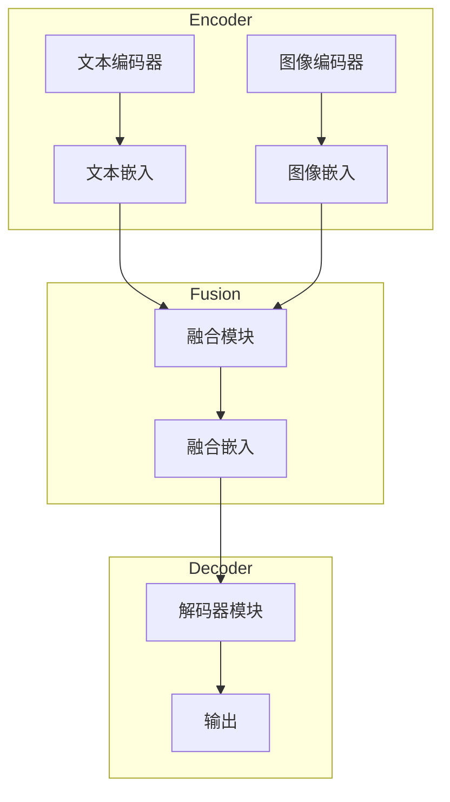
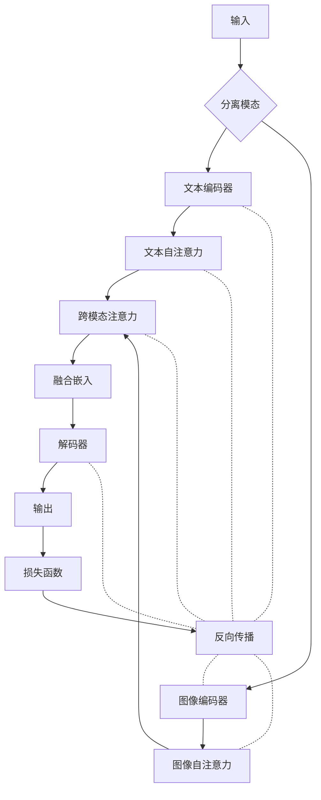

# 多模态大模型：技术原理与实战 多模态大模型在金融领域中的应用

## 1. 背景介绍

### 1.1 问题的由来

在当今数字时代,数据呈现多种形式,包括文本、图像、视频和语音等。传统的单一模态模型难以同时处理这些异构数据,导致信息利用率低下。为了更好地利用多源异构数据,提高数据处理效率,多模态学习应运而生。

金融领域涉及大量结构化和非结构化数据,如新闻报道、财报、社交媒体等。仅依赖单一模态难以全面把握复杂的金融信息。因此,多模态大模型在金融领域具有广阔的应用前景。

### 1.2 研究现状  

早期的多模态模型主要是对不同模态进行分开建模,然后将不同模态的特征进行拼接或融合。这种方法忽视了不同模态之间的内在联系,模型性能受到限制。

近年来,随着深度学习和注意力机制的发展,出现了一些能够端到端学习多模态表示的大模型,如Transformer、BERT、ViT等。这些模型能够捕捉不同模态之间的关联,提高了多模态表示的质量。

目前,多模态大模型在计算机视觉、自然语言处理、多媒体分析等领域取得了卓越的成果。但在金融领域的应用研究相对滞后,亟需开发满足金融场景需求的多模态模型。

### 1.3 研究意义

金融数据具有多源异构、高维度、噪声多等特点,给数据处理带来巨大挑战。多模态大模型能够融合多源异构数据,提取有效信息,为金融决策提供有力支持,具有重要的理论意义和应用价值。

从理论层面,研究多模态大模型在金融领域的应用,可以推动多模态表示学习、异构数据融合等技术的发展,为解决复杂的金融问题提供新思路。

从应用层面,多模态大模型可广泛应用于金融风险管理、投资决策辅助、反洗钱监测等场景,提高金融服务的智能化水平,为金融机构创造巨大的经济价值。

### 1.4 本文结构

本文首先介绍多模态大模型的核心概念,阐述其与传统单模态模型的区别。然后详细解析多模态大模型的核心算法原理和数学模型,并结合实例进行讲解。接下来介绍多模态大模型在金融领域的实际应用场景,并给出相关的工具和资源推荐。最后总结多模态大模型的发展趋势和面临的挑战。

## 2. 核心概念与联系

多模态大模型是一种能够同时处理多种模态数据的深度学习模型。它的核心思想是通过共享参数的方式,在不同模态之间建立联系,实现模态之间的相互增强。

与传统的单模态模型相比,多模态大模型具有以下优势:

1. **信息融合**:能够融合多源异构数据,提高信息利用率。
2. **关联建模**:捕捉不同模态之间的内在联系,提高模型表达能力。
3. **端到端学习**:无需人工设计特征,可以端到端地从原始数据中学习表示。
4. **迁移能力**:预训练的多模态模型具有强大的迁移能力,可应用于多个下游任务。

多模态大模型通常由以下几个关键组件组成:

1. **编码器(Encoder)**:将不同模态的输入数据编码为对应的特征表示。
2. **融合模块(Fusion Module)**:融合不同模态的特征表示,捕捉模态间的相关性。
3. **解码器(Decoder)**:根据融合后的多模态表示,生成所需的输出。

下面是一个简化的多模态大模型架构示意图:

在金融领域,多模态大模型可以融合文本数据(如新闻报道、社交媒体等)和数值数据(如股票行情、财务指标等),捕捉不同模态之间的关联,从而提高金融预测和决策的准确性。

## 3. 核心算法原理 & 具体操作步骤  

### 3.1 算法原理概述

多模态大模型的核心算法原理是基于自注意力机制(Self-Attention)和跨模态注意力机制(Cross-Modal Attention)。

**自注意力机制**用于捕捉单一模态内部的长范围依赖关系,例如捕捉文本序列中不同位置单词之间的关联。

**跨模态注意力机制**则用于捕捉不同模态之间的关联,例如捕捉图像和文本之间的语义对应关系。

通过自注意力和跨模态注意力的交替计算,模型可以逐步融合不同模态的信息,最终得到一个融合了多模态知识的表示。

### 3.2 算法步骤详解

以下是多模态大模型的具体算法步骤:

1. **输入编码**:将不同模态的输入数据(如文本、图像等)通过对应的编码器编码为特征表示。
2. **自注意力计算**:对每一个模态的特征表示进行自注意力计算,捕捉模态内部的长范围依赖关系。
3. **跨模态注意力计算**:将不同模态的特征表示输入到跨模态注意力模块,计算模态之间的注意力权重,并根据权重对特征进行加权融合。
4. **融合表示**:将融合后的多模态特征表示输入到解码器模块,生成所需的输出(如分类结果、生成的文本等)。
5. **模型训练**:根据输出和ground truth之间的损失,使用反向传播算法对模型参数进行更新。

以文本-图像的多模态模型为例,算法步骤如下所示:

### 3.3 算法优缺点

**优点**:

1. 端到端学习,无需人工设计特征。
2. 融合多源异构数据,提高信息利用率。
3. 捕捉不同模态之间的内在联系,提高模型表达能力。
4. 预训练模型具有强大的迁移能力,可应用于多个下游任务。

**缺点**:

1. 模型参数巨大,训练和推理成本高。
2. 需要大量标注数据进行预训练,数据标注成本高。
3. 解释性较差,模型内部机理不透明。
4. 可能存在偏见和不公平性问题。

### 3.4 算法应用领域

多模态大模型可广泛应用于以下领域:

- **计算机视觉**:图像描述、图像检索、视觉问答等。
- **自然语言处理**:机器翻译、文本生成、情感分析等。
- **多媒体分析**:视频描述、视频检索、人机交互等。
- **医疗健康**:医学图像分析、电子病历处理、辅助诊断等。
- **金融**:金融风险管理、投资决策辅助、反洗钱监测等(本文重点)。

## 4. 数学模型和公式 & 详细讲解 & 举例说明

### 4.1 数学模型构建

多模态大模型的数学模型基于自注意力机制和跨模态注意力机制。我们以文本-图像的多模态模型为例,介绍其数学模型的构建过程。

假设输入包括一个文本序列 $X = (x_1, x_2, \dots, x_n)$ 和一个图像 $I$。我们首先使用文本编码器(如BERT)和图像编码器(如ViT)对输入进行编码,得到文本特征序列 $\mathbf{H}^{text} = (\mathbf{h}_1^{text}, \mathbf{h}_2^{text}, \dots, \mathbf{h}_n^{text})$ 和图像特征 $\mathbf{H}^{img}$。

#### 自注意力机制

对于文本模态,我们使用多头自注意力机制捕捉单词之间的长范围依赖关系:

$$\mathbf{H}^{text'} = \text{MultiHeadAttn}(\mathbf{H}^{text}, \mathbf{H}^{text}, \mathbf{H}^{text})$$

其中 $\text{MultiHeadAttn}$ 表示多头自注意力计算。对于图像模态,我们也可以使用类似的自注意力机制捕捉像素之间的关系:

$$\mathbf{H}^{img'} = \text{MultiHeadAttn}(\mathbf{H}^{img}, \mathbf{H}^{img}, \mathbf{H}^{img})$$

#### 跨模态注意力机制

为了捕捉文本和图像之间的关联,我们使用跨模态注意力机制,将一个模态的特征作为查询(Query),另一个模态的特征作为键值对(Key-Value):

$$\mathbf{H}^{text\rightarrow img} = \text{MultiHeadAttn}(\mathbf{H}^{text'}, \mathbf{H}^{img'}, \mathbf{H}^{img'})$$
$$\mathbf{H}^{img\rightarrow text} = \text{MultiHeadAttn}(\mathbf{H}^{img'}, \mathbf{H}^{text'}, \mathbf{H}^{text'})$$

其中 $\mathbf{H}^{text\rightarrow img}$ 表示根据文本特征对图像特征进行注意力加权的结果, $\mathbf{H}^{img\rightarrow text}$ 表示根据图像特征对文本特征进行注意力加权的结果。

#### 特征融合

最后,我们将自注意力特征和跨模态注意力特征进行融合,得到融合的多模态表示:

$$\mathbf{H}^{fused\_text} = \mathbf{H}^{text'} + \mathbf{H}^{img\rightarrow text}$$
$$\mathbf{H}^{fused\_img} = \mathbf{H}^{img'} + \mathbf{H}^{text\rightarrow img}$$

融合的多模态表示 $\mathbf{H}^{fused\_text}$ 和 $\mathbf{H}^{fused\_img}$ 可以输入到下游任务的解码器中,用于生成所需的输出。

### 4.2 公式推导过程

以上数学模型中的关键步骤是自注意力机制和跨模态注意力机制的计算。下面我们详细推导这两种注意力机制的计算公式。

#### 自注意力机制

给定一个序列 $\mathbf{X} = (\mathbf{x}_1, \mathbf{x}_2, \dots, \mathbf{x}_n)$,我们首先计算查询(Query)、键(Key)和值(Value)向量:

$$\mathbf{Q} = \mathbf{X}\mathbf{W}^Q$$
$$\mathbf{K} = \mathbf{X}\mathbf{W}^K$$
$$\mathbf{V} = \mathbf{X}\mathbf{W}^V$$

其中 $\mathbf{W}^Q$、$\mathbf{W}^K$ 和 $\mathbf{W}^V$ 是可学习的权重矩阵。

然后,我们计算查询和键之间的点积,得到注意力分数矩阵:

$$\text{Attention}(\mathbf{Q}, \mathbf{K}, \mathbf{V}) = \text{softmax