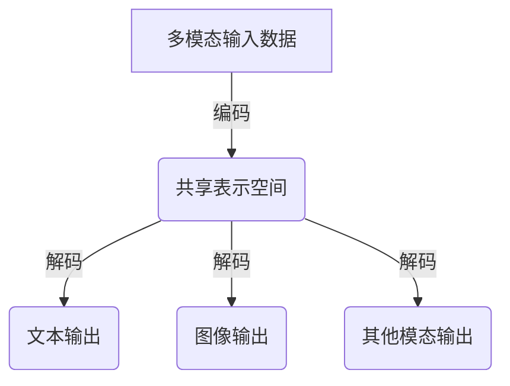

# 多模态大模型：技术原理与实战 多模态大模型高效的训练方法

## 1. 背景介绍

### 1.1 问题的由来

在过去几年中，自然语言处理(NLP)和计算机视觉(CV)等人工智能领域取得了长足的进步。然而,大多数现有模型仅专注于单一模态数据,如文本或图像,而忽视了不同模态之间的相互关系和联系。随着多模态数据(如图像和文本、视频和音频等)在现实世界中的广泛存在,开发能够有效处理和理解多模态数据的人工智能模型变得越来越重要。

多模态大模型旨在通过统一的架构同时处理不同模态的数据,从而更好地捕捉数据之间的关联性,提高模型的泛化能力和鲁棒性。然而,训练这种大规模的多模态模型面临着诸多挑战,包括海量数据的获取和标注、高效的模型架构设计、合理的训练策略等。

### 1.2 研究现状

近年来,多模态大模型的研究受到了广泛关注。一些知名的模型,如BERT、GPT、DALL-E等,已经展现出了在多模态任务上的优异表现。然而,这些模型往往需要大量的计算资源和训练时间,并且存在一些局限性,如对长序列的处理能力有限、对视觉和语义理解的偏差等。

为了解决这些问题,研究人员提出了多种新颖的模型架构和训练策略。例如,Transformer架构被广泛应用于多模态模型中,以捕捉不同模态之间的长程依赖关系。另外,一些工作探索了更高效的训练方法,如对抗训练、元学习等,以提高模型的泛化能力和鲁棒性。

### 1.3 研究意义

多模态大模型的研究对于推进人工智能领域的发展具有重要意义。首先,它有助于构建更加通用和智能的人工智能系统,能够更好地理解和处理复杂的多模态数据,从而在诸多领域发挥作用,如自动驾驶、医疗影像分析、多媒体内容理解等。

其次,多模态大模型的研究也将促进不同人工智能子领域之间的交叉融合,推动模型架构、训练算法、数据处理等方面的创新。

此外,高效训练多模态大模型也是一个值得关注的重要课题。通过优化训练策略和利用先进的硬件资源,我们可以降低训练成本,提高模型的可访问性和可扩展性。

### 1.4 本文结构

本文将全面介绍多模态大模型的技术原理和实战经验。首先,我们将阐述多模态大模型的核心概念和基本架构。接下来,详细讨论模型训练的关键算法和数学原理,并通过实例进行说明。然后,我们将分享一个实际项目的开发经验,包括环境搭建、代码实现和运行结果等。最后,我们将探讨多模态大模型在不同领域的应用场景,介绍相关的工具和学习资源,并对未来的发展趋势和挑战进行总结和展望。

## 2. 核心概念与联系

多模态大模型旨在统一处理不同模态的数据,如文本、图像、视频、音频等。它的核心思想是通过共享的表示空间来捕捉不同模态之间的关联性,从而提高模型的泛化能力和鲁棒性。

如上图所示,多模态大模型通常包括以下几个关键组件:

1. **模态特定编码器(Modal-Specific Encoders)**: 用于将不同模态的原始数据(如文本、图像等)编码为对应的特征表示。常见的编码器包括用于文本的Transformer编码器、用于图像的卷积神经网络(CNN)等。

2. **跨模态融合模块(Cross-Modal Fusion Module)**: 将来自不同模态的特征表示融合到共享的表示空间中。这个模块通常采用注意力机制或其他融合策略来捕捉不同模态之间的相关性。

3. **模态特定解码器(Modal-Specific Decoders)**: 根据共享的表示空间,生成对应模态的输出,如文本、图像等。解码器的具体形式取决于任务需求。

4. **联合训练目标(Joint Training Objectives)**: 多模态大模型通常在多个相关任务上进行联合训练,以提高模型的泛化能力。常见的训练目标包括掩码语言模型(Masked Language Modeling)、图像文本匹配(Image-Text Matching)、视觉问答(Visual Question Answering)等。

通过上述核心组件的紧密结合,多模态大模型能够有效地融合不同模态的信息,捕捉它们之间的关联性,从而在各种多模态任务上取得出色的表现。

## 3. 核心算法原理 & 具体操作步骤

### 3.1 算法原理概述

多模态大模型的核心算法原理主要基于自注意力(Self-Attention)机制和Transformer架构。自注意力机制能够有效地捕捉序列数据中的长程依赖关系,而Transformer架构则提供了一种高效的并行计算方式,适合处理大规模序列数据。

在多模态大模型中,不同模态的数据首先被各自的编码器(如文本编码器、图像编码器等)转换为对应的特征表示。然后,这些特征表示被送入跨模态融合模块,通过自注意力机制捕捉不同模态之间的关联性,并融合到共享的表示空间中。最后,根据任务需求,共享表示被送入相应的解码器,生成所需的输出(如文本、图像等)。

在训练过程中,多模态大模型通常采用多任务学习(Multi-Task Learning)的策略,同时优化多个相关的训练目标,如掩码语言模型、图像文本匹配、视觉问答等。这种联合训练方式有助于提高模型的泛化能力,使其能够更好地捕捉不同模态之间的关联性。

### 3.2 算法步骤详解

以下是多模态大模型训练的具体算法步骤:

1. **数据预处理**:
   - 对不同模态的原始数据进行预处理,如文本分词、图像resize等。
   - 将预处理后的数据转换为模型可以接受的格式,如文本转换为token序列、图像转换为像素值矩阵等。

2. **模态特定编码**:
   - 将不同模态的数据输入到对应的编码器中,如文本输入到Transformer编码器、图像输入到CNN编码器等。
   - 编码器输出对应模态的特征表示。

3. **跨模态融合**:
   - 将来自不同模态的特征表示输入到跨模态融合模块中。
   - 通过自注意力机制捕捉不同模态之间的关联性。
   - 融合后的特征表示被映射到共享的表示空间中。

4. **模态特定解码**:
   - 根据任务需求,将共享表示空间中的特征输入到对应的解码器中,如文本解码器、图像解码器等。
   - 解码器生成相应模态的输出,如文本序列、图像等。

5. **损失计算与优化**:
   - 计算模型输出与Ground Truth之间的损失,如交叉熵损失、三重损失等。
   - 对于多任务学习,计算所有任务的加权损失和。
   - 使用优化器(如Adam)基于损失值更新模型参数。

6. **迭代训练**:
   - 重复步骤1-5,直到模型收敛或达到预设的训练轮数。

需要注意的是,上述算法步骤是一种通用的描述,具体实现可能会有所不同,取决于模型架构、训练任务和优化策略等因素。

### 3.3 算法优缺点

**优点**:

1. **强大的表示能力**:通过共享表示空间和自注意力机制,多模态大模型能够有效地捕捉不同模态之间的关联性,提高了模型的表示能力。

2. **泛化性强**:由于在多个相关任务上进行联合训练,多模态大模型具有更好的泛化能力,可以应对不同领域的多模态数据。

3. **并行计算高效**:基于Transformer架构,多模态大模型可以高效地进行并行计算,加速了训练和推理过程。

4. **灵活的模块化设计**:多模态大模型采用了模块化的设计,不同模态的编码器和解码器可以根据需求进行灵活组合和替换。

**缺点**:

1. **训练数据需求大**:为了获得良好的表现,多模态大模型通常需要大量的高质量训练数据,这对数据采集和标注带来了挑战。

2. **计算资源消耗高**:由于模型规模庞大,训练和推理过程对计算资源(如GPU)的需求较高,成本也相对较高。

3. **长序列处理能力有限**:虽然Transformer架构能够捕捉长程依赖关系,但在处理极长序列(如超长文本或高分辨率图像)时,性能可能会受到影响。

4. **解释性较差**:由于模型内部的复杂性,多模态大模型的决策过程往往缺乏透明度和解释性,这可能会影响其在一些关键领域(如医疗)的应用。

### 3.4 算法应用领域

多模态大模型由于其强大的表示能力和泛化性,在多个领域都有广泛的应用前景:

1. **自然语言处理(NLP)**:
   - 视觉问答(Visual Question Answering)
   - 图像描述生成(Image Captioning)
   - 多模态机器翻译(Multimodal Machine Translation)

2. **计算机视觉(CV)**:
   - 图像文本检索(Image-Text Retrieval)
   - 视觉推理(Visual Reasoning)
   - 视觉对话(Visual Dialogue)

3. **多媒体分析**:
   - 视频描述(Video Captioning)
   - 多媒体事件检测(Multimedia Event Detection)
   - 多模态情感分析(Multimodal Sentiment Analysis)

4. **人机交互**:
   - 多模态对话系统(Multimodal Dialogue Systems)
   - 智能助手(Intelligent Assistants)
   - 增强现实(Augmented Reality)

5. **医疗健康**:
   - 医学影像分析(Medical Image Analysis)
   - 辅助诊断(Computer-Aided Diagnosis)
   - 智能健康监测(Intelligent Health Monitoring)

6. **自动驾驶**:
   - 场景理解(Scene Understanding)
   - 行为预测(Behavior Prediction)
   - 决策规划(Decision Planning)

总的来说,多模态大模型为各个领域提供了一种统一的框架,有助于更好地理解和处理复杂的多模态数据,推动人工智能技术的广泛应用。

## 4. 数学模型和公式 & 详细讲解 & 举例说明

### 4.1 数学模型构建

在多模态大模型中,我们需要构建一个统一的数学模型来表示不同模态的数据及其之间的关联性。这个模型通常基于自注意力(Self-Attention)机制和Transformer架构。

假设我们有 $N$ 种不同的模态,每种模态 $i$ 的输入数据表示为 $X_i = \{x_i^1, x_i^2, \dots, x_i^{T_i}\}$,其中 $T_i$ 是该模态的序列长度。我们的目标是学习一个映射函数 $f$,将不同模态的输入数据映射到一个共享的表示空间 $Z$:

$$Z = f(X_1, X_2, \dots, X_N)$$

在这个共享表示空间中,不同模态的信息被融合在一起,捕捉了它们之间的关联性。然后,我们可以根据不同的任务,从共享表示空间中解码出相应模态的输出,如文本输出 $Y_1$、图像输出 $Y_2$ 等:

$$Y_1 = g_1(Z), Y_2 = g_2(Z), \dots$$

其中 $g_i$ 表示第 $i$ 种模态的解码函数。

### 4.2 公式推导过程

现在,我们来具体推导一下