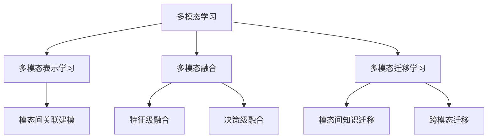

# 多模态学习原理与代码实战案例讲解

## 1. 背景介绍

### 1.1 问题的由来

在当今信息时代,数据呈现形式已不再局限于传统的文本或图像,而是涵盖了视频、音频、传感器数据等多种模态。这些异构数据的融合利用,对于提高人工智能系统的认知能力至关重要。然而,如何高效地从多模态数据中学习并整合不同模态之间的关联知识,是一个具有挑战性的问题。

传统的机器学习算法往往专注于单一模态数据,难以捕捉多模态数据之间的内在联系。例如,在视频理解任务中,仅依赖视觉信息往往无法完全理解视频内容,需要结合音频和文本信息进行综合分析。因此,发展能够同时利用多种模态数据的学习范式,成为了人工智能领域的一个重要研究方向。

### 1.2 研究现状

多模态学习(Multimodal Learning)旨在从异构的多源数据中学习知识表示,并探索不同模态之间的相互作用。近年来,受深度学习技术的推动,多模态学习取得了长足进展,在计算机视觉、自然语言处理、多媒体分析等领域展现出巨大潜力。

目前,多模态学习主要集中在以下几个研究方向:

1. **多模态融合**:设计有效的融合策略,将不同模态的特征进行整合,捕捉模态间的相关性。
2. **多模态表示学习**:学习能够同时编码多种模态信息的统一表示,提高数据的表达能力。
3. **多模态迁移学习**:利用一个或多个模态的知识,促进其他模态的学习任务。
4. **多模态生成模型**:基于多模态数据,生成新的模态数据或跨模态数据。

尽管取得了一定进展,但多模态学习仍面临诸多挑战,如异构数据的有效融合、模态间关系的建模、数据不平衡问题等,需要进一步的理论探索和算法创新。

### 1.3 研究意义

多模态学习的研究对于提升人工智能系统的认知能力、理解能力和决策能力具有重要意义。它能够帮助机器更好地模拟人类的多感官认知过程,从而实现更加智能化的数据处理和决策。多模态学习在以下领域具有广泛的应用前景:

1. **多媒体内容分析**:通过融合视频、音频和文本信息,实现更精准的视频理解、内容检索和推荐。
2. **人机交互**:利用语音、视觉和文本等多模态信息,实现更自然、更智能的人机交互系统。
3. **医疗辅助诊断**:融合医学影像、电子病历和生理信号等多源数据,提高疾病诊断的准确性。
4. **自动驾驶**:整合视觉、雷达和GPS等多模态传感器数据,实现更安全、更智能的自动驾驶系统。

总的来说,多模态学习有助于构建更加智能化、人性化的人工智能系统,为解决复杂的现实世界问题提供新的思路和方法。

### 1.4 本文结构

本文将全面介绍多模态学习的原理和实践。首先阐述多模态学习的核心概念和基本原理,包括多模态表示学习、多模态融合和多模态迁移学习等。接下来详细讲解多模态学习的核心算法,包括算法原理、具体操作步骤、数学模型和公式推导。然后通过代码实例,展示如何在实际项目中应用多模态学习算法。最后,探讨多模态学习在各个领域的应用场景,介绍相关工具和资源,并总结未来的发展趋势和挑战。

## 2. 核心概念与联系

多模态学习的核心概念包括多模态表示学习、多模态融合和多模态迁移学习,它们相互关联,共同构建了多模态学习的理论基础。

### 2.1 多模态表示学习

多模态表示学习旨在学习能够同时编码多种模态信息的统一表示,捕捉不同模态之间的内在联系。这种统一的多模态表示不仅能够保留每种模态的独特特征,还能捕捉模态间的相关性,从而提高数据的表达能力。

多模态表示学习的关键在于建模不同模态之间的关联。常见的方法包括:

1. **子空间对齐**:将不同模态的特征映射到同一个潜在子空间,使得不同模态的数据在该子空间中具有相似的表示。
2. **表示融合**:将不同模态的特征通过融合函数(如外积、拼接等)整合到一个统一的表示向量中。
3. **注意力机制**:自适应地分配不同模态的注意力权重,捕捉模态间的相关性。

通过学习统一的多模态表示,可以充分利用异构数据之间的互补信息,提高下游任务的性能。

### 2.2 多模态融合

多模态融合旨在设计有效的策略,将不同模态的特征进行整合,捕捉模态间的相关性。根据融合的granularity,可以分为特征级融合和决策级融合两种主要范式。

**特征级融合**是在特征提取阶段对不同模态的特征进行融合,得到一个统一的特征表示,然后将其输入到后续的学习模型中。常见的特征级融合方法包括特征拼接、特征pooling、子空间学习等。

**决策级融合**则是在决策层面对不同模态的预测结果进行融合。每个模态单独进行预测,然后将不同模态的预测结果通过规则或学习的方式进行融合,得到最终的决策输出。常见的决策级融合方法包括majority voting、stacking等。

两种融合范式各有优缺点。特征级融合能够充分利用模态间的相关性,但需要设计合适的融合函数;决策级融合相对简单,但可能无法充分挖掘模态间的内在联系。在实践中,需要根据具体任务选择合适的融合策略。

### 2.3 多模态迁移学习

多模态迁移学习旨在利用一个或多个模态的知识,促进其他模态的学习任务。它可以分为两种情况:模态间知识迁移和跨模态迁移。

**模态间知识迁移**是指在同一个领域内,利用一种模态的知识来辅助另一种模态的学习。例如,在图像分类任务中,可以利用文本模态的知识来辅助图像模态的分类器学习。

**跨模态迁移**则是指在不同领域之间进行知识迁移。例如,将自然语言处理领域学习到的知识迁移到计算机视觉领域,辅助视觉任务的学习。

多模态迁移学习的关键在于设计有效的知识迁移机制,捕捉不同模态或领域之间的共享知识。常见的方法包括共享编码器、对抗训练、元学习等。通过迁移学习,可以充分利用已有的模态知识,提高目标任务的学习效率和性能。

## 3. 核心算法原理 & 具体操作步骤

### 3.1 算法原理概述

多模态学习的核心算法主要包括多模态表示学习算法、多模态融合算法和多模态迁移学习算法。这些算法旨在从异构的多源数据中学习知识表示,并探索不同模态之间的相互作用。

**多模态表示学习算法**的目标是学习能够同时编码多种模态信息的统一表示,捕捉不同模态之间的内在联系。常见的算法包括子空间对齐、表示融合和注意力机制等。

**多模态融合算法**则是设计有效的策略,将不同模态的特征进行整合,捕捉模态间的相关性。根据融合的granularity,可以分为特征级融合算法和决策级融合算法。

**多模态迁移学习算法**旨在利用一个或多个模态的知识,促进其他模态的学习任务。它可以分为模态间知识迁移算法和跨模态迁移算法。

这些算法通常基于深度学习框架,利用神经网络的强大表示能力和端到端学习的优势,实现多模态数据的有效融合和知识迁移。下面将详细介绍其中的一些核心算法。

### 3.2 算法步骤详解

#### 3.2.1 多模态表示学习算法: 子空间对齐

子空间对齐是一种常见的多模态表示学习算法,它将不同模态的特征映射到同一个潜在子空间,使得不同模态的数据在该子空间中具有相似的表示。算法步骤如下:

1. **特征提取**:对每种模态的原始数据进行特征提取,得到对应的特征向量。
2. **子空间映射**:将不同模态的特征向量映射到同一个潜在子空间,常用的方法包括线性映射、核技巧等。
3. **子空间对齐**:在潜在子空间中,通过最小化不同模态之间的距离或最大化相关性,实现子空间对齐。
4. **优化目标**:优化子空间映射和对齐的参数,使得不同模态在子空间中的表示相似。
5. **统一表示**:将对齐后的子空间表示作为统一的多模态表示,用于下游任务。

子空间对齐算法的优点是理论简单、易于优化;缺点是需要设计合适的映射函数和对齐目标。

#### 3.2.2 多模态融合算法: 特征级融合

特征级融合是将不同模态的特征在特征提取阶段进行融合,得到一个统一的特征表示,然后将其输入到后续的学习模型中。常见的特征级融合算法包括特征拼接、特征pooling等。以特征拼接为例,算法步骤如下:

1. **特征提取**:对每种模态的原始数据进行特征提取,得到对应的特征向量。
2. **特征拼接**:将不同模态的特征向量按照某种顺序拼接成一个长向量,作为统一的多模态特征表示。
3. **模型训练**:将拼接后的多模态特征输入到神经网络或其他机器学习模型中进行训练,实现相应的任务目标。
4. **模型优化**:根据任务目标函数,优化模型参数和特征提取器参数。

特征级融合算法的优点是能够充分利用模态间的相关性,缺点是需要设计合适的融合函数,并且融合后的特征维度可能过高。

#### 3.2.3 多模态迁移学习算法: 对抗迁移

对抗迁移是一种常见的多模态迁移学习算法,它利用对抗训练的思想,实现模态间或跨模态的知识迁移。算法步骤如下:

1. **源域数据**:准备源域的多模态数据及标签。
2. **目标域数据**:准备目标域的多模态数据,可能没有标签。
3. **特征提取**:对源域和目标域的数据进行特征提取,得到对应的特征表示。
4. **对抗训练**:设计一个判别器,用于判断特征表示来自源域还是目标域。同时,设计一个特征提取器,旨在学习域不变的特征表示,使得判别器无法区分源域和目标域的特征。
5. **知识迁移**:通过对抗训练,特征提取器学习到了源域和目标域的共享知识表示,实现了知识迁移。
6. **模型优化**:根据任务目标函数和对抗损失函数,优化特征提取器和判别器的参数。

对抗迁移算法的优点是能够有效地实现模态间或跨模态的知识迁移,缺点是需要设计合适的对抗训练策略,并且训练过程可能不稳定。

### 3.3 算法优缺点

多模态学习算法具有以下优点: