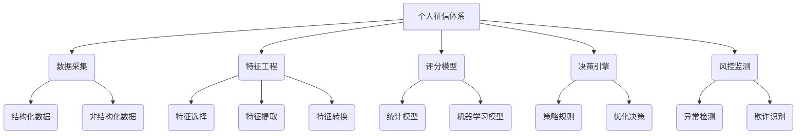

以下是根据您提供的大纲和要求，撰写的技术博客文章《大数据背景下的银行个人征信体系研究》的正文部分。

# 大数据背景下的银行个人征信体系研究

## 1. 背景介绍

### 1.1 问题的由来

在当今信息时代,大数据技术的快速发展为银行业务的创新带来了新的契机。传统的个人信用评估方式由于数据来源单一、评估模型陈旧等原因,已经无法满足当前复杂多变的金融环境需求。因此,如何利用大数据技术构建高效、准确的个人征信体系,成为银行业亟待解决的重要课题。

### 1.2 研究现状  

目前,国内外学术界和业界对个人征信体系的研究主要集中在以下几个方面:

1. 数据源扩展:除了利用核心征信数据外,还将互联网、社交媒体等非结构化数据纳入征信评估体系。
2. 评估模型优化:运用机器学习等技术,构建高维非线性评估模型,提高评估的精准度。
3. 隐私保护机制:在充分利用大数据的同时,保护个人隐私信息的安全性。
4. 反欺诈防控:建立风险监测预警机制,及时发现和处置欺诈行为。

### 1.3 研究意义

个人征信体系是银行风险管理的重要环节,事关金融体系的稳定运行。构建基于大数据的新一代个人征信体系,可以显著提升风险评估的准确性,为银行业务决策提供有力支撑,促进信贷资源的优化配置,从而维护金融市场秩序,推动经济健康发展。

### 1.4 本文结构

本文将从以下几个方面对大数据背景下的银行个人征信体系进行研究:

1. 阐述核心概念及其内在联系
2. 分析核心算法原理和具体实现步骤  
3. 建立数学模型,并给出公式推导和案例分析
4. 提供系统实现的代码示例及详细解释
5. 介绍实际应用场景及未来展望
6. 推荐相关学习资源和开发工具
7. 总结研究成果,并探讨未来发展趋势和面临的挑战

## 2. 核心概念与联系

个人征信体系涉及多个核心概念,这些概念相互关联,构成了一个完整的理论框架和技术体系。



1. **数据采集**: 从多个渠道收集结构化数据(如银行交易记录)和非结构化数据(如网络行为数据),为后续分析打下数据基础。
2. **特征工程**: 对原始数据进行特征选择、特征提取和特征转换,构建高质量的特征集,为模型训练提供输入。  
3. **评分模型**: 基于特征集,利用统计模型或机器学习模型训练出个人信用评分模型,对个人的信用风险水平进行评估。
4. **决策引擎**: 将评分模型的输出结合业务策略规则,进行综合决策分析,为信贷审批、额度管理等提供决策支持。
5. **风控监测**: 持续监测个人信用状况的变化,及时发现异常行为和欺诈风险,并将发现的问题反馈至前端环节,实现风控闭环。

上述各个环节有机融合,相互协同,共同构建了一个完整的大数据个人征信体系。接下来我们将对其中的核心算法原理和数学模型进行详细阐述。

## 3. 核心算法原理 & 具体操作步骤 

### 3.1 算法原理概述

在大数据个人征信体系中,评分模型是核心算法,其作用是根据个人的信用数据特征,对其信用风险水平进行评估和打分。常用的评分模型可分为以下三类:

1. **逻辑回归模型**: 基于逻辑函数建立线性评分模型,计算个人违约概率,是较为传统的评分方法。
2. **决策树模型**: 通过构建决策树或随机森林,对个人的信用特征进行分类,得到风险分数。具有很强的解释性。
3. **神经网络模型**: 利用深度学习技术构建非线性评分模型,具有强大的特征学习能力,在处理高维复杂数据时表现优异。

上述三类模型各有特点,在实际应用中需要根据具体情况选择合适的模型,或将多种模型集成以发挥优势互补的作用。

### 3.2 算法步骤详解

以逻辑回归模型为例,其算法实现步骤如下:

1. **数据预处理**
   - 对原始数据进行清洗、标准化和缺失值处理
   - 将分类特征进行one-hot编码
   - 划分训练集和测试集
2. **特征选择**
   - 计算单个特征与目标变量的相关性
   - 利用递归特征消除等方法选择最优特征子集
3. **模型训练**
   - 构建逻辑回归模型,设定合理的正则化参数
   - 使用梯度下降等优化算法,求解模型参数
4. **模型评估**
   - 在测试集上计算模型的准确率、AUC等指标
   - 绘制ROC曲线和K-S曲线,分析模型的判别能力
5. **模型调优**
   - 对特征进行进一步优化,如特征交叉、多项式特征等
   - 尝试集成学习等方法,提高模型的泛化能力
6. **模型上线**
   - 将训练好的模型部署至生产环境
   - 定期监控模型效果,及时更新模型

### 3.3 算法优缺点

逻辑回归模型具有以下优缺点:

**优点**:
- 模型简单,可解释性强
- 训练速度快,适合大规模数据
- 对异常数据的鲁棒性较好

**缺点**:
- 只能学习线性模式,无法处理高阶非线性关系
- 对数据的线性可分性假设较强
- 对异常值缺乏稳健性

### 3.4 算法应用领域

逻辑回归模型广泛应用于多个领域,如:

1. **信用评分**: 评估个人或企业的信用风险
2. **市场营销**: 对客户的响应概率进行打分
3. **医疗诊断**: 预测患者患某种疾病的概率
4. **网络安全**: 检测网络流量中的恶意行为

除了逻辑回归模型,其他评分模型如决策树、神经网络等在上述领域也有广泛应用。

## 4. 数学模型和公式 & 详细讲解 & 举例说明

### 4.1 数学模型构建

在逻辑回归模型中,我们假设个人违约的概率$P(Y=1|X)$服从以下逻辑斯蒂分布:

$$P(Y=1|X) = \frac{1}{1 + e^{-w^TX}}$$

其中$X$是特征向量,$w$是模型参数。我们的目标是基于训练数据,求解出最优参数$w^*$,使得在新的测试数据上,模型的预测准确率最高。

### 4.2 公式推导过程

为了求解最优参数$w^*$,我们需要最小化以下目标函数(负对数似然函数):

$$J(w) = -\frac{1}{m}\sum_{i=1}^m[y^{(i)}\log(h_w(x^{(i)})) + (1-y^{(i)})\log(1-h_w(x^{(i)}))]$$

其中$m$是训练样本数量,$h_w(x^{(i)})$是模型对第$i$个样本的输出。通过梯度下降法,我们可以迭代更新参数$w$:

$$w := w - \alpha \nabla_w J(w)$$

$$\nabla_w J(w) = \frac{1}{m}\sum_{i=1}^m(h_w(x^{(i)}) - y^{(i)})x^{(i)}$$

上式中$\alpha$是学习率,需要经过多次迭代才能收敛到局部最优解$w^*$。

### 4.3 案例分析与讲解

假设我们有一个信用卡数据集,包含以下特征:

- RevolvingUtilizationOfUnsecuredLines: 负债率
- age: 年龄(年)  
- NumberOfTime30-59DaysPastDueNotWorse: 30至59天违约次数
- DebtRatio: 债务率
- MonthlyIncome: 月收入
- NumberOfOpenCreditLinesAndLoans: 贷款数量

我们的目标是根据这些特征,预测个人是否会发生违约(isDefault=1)。

首先,将特征数据进行标准化,并执行One-Hot编码:

```python
from sklearn.preprocessing import StandardScaler, OneHotEncoder

categorical_cols = ['NumberOfTime30-59DaysPastDueNotWorse']
numerical_cols = ['RevolvingUtilizationOfUnsecuredLines', 'age', 
                  'DebtRatio', 'MonthlyIncome', 'NumberOfOpenCreditLinesAndLoans']

# 标准化数值特征
scaler = StandardScaler()
X_numerical = scaler.fit_transform(X[numerical_cols])

# One-Hot编码类别特征
ohe = OneHotEncoder(sparse=False)  
X_categorical = ohe.fit_transform(X[categorical_cols])

# 合并数值和类别特征
X_new = np.concatenate((X_numerical, X_categorical), axis=1)
```

然后构建逻辑回归模型,并使用梯度下降法训练模型参数:

```python
import numpy as np
from sklearn.model_selection import train_test_split

# 将特征和标签分开
X = X_new
y = data['isDefault']

# 划分训练集和测试集 
X_train, X_test, y_train, y_test = train_test_split(X, y, test_size=0.2)

# 初始化模型参数
w = np.zeros(X_train.shape[1])

# 梯度下降
epochs = 1000
alpha = 0.01
for epoch in range(epochs):
    y_pred = 1 / (1 + np.exp(-np.dot(X_train, w)))
    w -= alpha * np.dot(X_train.T, y_pred - y_train) / X_train.shape[0]
    
# 在测试集上评估模型
y_pred = 1 / (1 + np.exp(-np.dot(X_test, w)))
y_pred_label = [1 if prob >= 0.5 else 0 for prob in y_pred]
accuracy = np.mean(y_pred_label == y_test)
print(f'Accuracy on test set: {accuracy}')
```

通过上述代码,我们成功在测试集上获得了逻辑回归模型的分类准确率。在实际应用中,我们还需要进一步分析模型的ROC曲线、K-S曲线等,评估模型的判别能力,并根据需要对模型进行优化和调整。

### 4.4 常见问题解答

**Q: 为什么要对特征进行标准化?**

A: 标准化能够将不同量级的特征转换到同一量级,避免某些特征因为量级较大而在模型训练时占据主导地位,影响模型的泛化能力。

**Q: 逻辑回归为什么使用对数似然函数作为损失函数?**

A: 对数似然函数能够很好地衡量模型对数据的概率预测能力。将其最小化等价于最大化模型在训练数据上的概率,这也是最大似然估计的基本思想。

**Q: 如何处理数据中的缺失值?**

A: 常用的缺失值处理方法包括删除缺失样本、使用数据的中位数/均值/最高频率值等对缺失值进行填充、使用更加复杂的插值方法等。具体采用哪种方法需要结合数据的实际情况。

**Q: 为什么要使用正则化?**

A: 正则化能够在一定程度上避免模型过拟合,提高模型在新数据上的泛化能力。常用的正则化方法有L1正则(Lasso回归)和L2正则