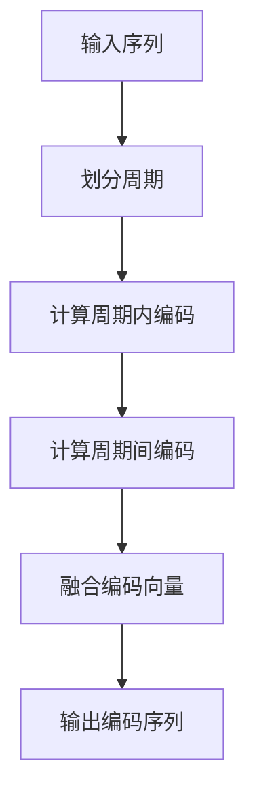

# 大规模语言模型从理论到实践 具有外推能力的位置编码

## 1. 背景介绍

### 1.1 问题的由来

随着深度学习在自然语言处理领域的广泛应用,transformer模型因其卓越的性能而备受关注。然而,传统的transformer模型在处理长序列时存在一些固有的缺陷,例如计算复杂度高、内存占用大等问题。为了解决这些问题,研究人员提出了各种改进方法,其中位置编码(Positional Encoding)是一种非常有效的技术。

传统的位置编码方法通常采用一种固定的编码方式,例如正弦/余弦函数编码,这种编码方式虽然简单有效,但缺乏可扩展性和泛化能力。当序列长度超出预定范围时,模型的性能会急剧下降。因此,如何设计一种具有外推(Extrapolation)能力的位置编码方法,成为了大规模语言模型研究的一个重要课题。

### 1.2 研究现状

近年来,研究人员提出了多种具有外推能力的位置编码方法,例如:

- 相对位置编码(Relative Positional Encoding)
- 可学习的位置编码(Learnable Positional Encoding)
- 混合位置编码(Hybrid Positional Encoding)
- 循环位置编码(Circular Positional Encoding)

这些方法在一定程度上解决了传统位置编码的局限性,但仍然存在一些缺陷,例如计算复杂度高、编码维度高、泛化能力有限等。

### 1.3 研究意义

设计一种高效、可扩展且具有强大外推能力的位置编码方法,对于构建大规模语言模型具有重要意义。具体来说,它可以带来以下几个方面的好处:

1. 提高模型的处理能力,使其能够有效处理超长序列输入。
2. 降低计算复杂度和内存占用,提高模型的训练和推理效率。
3. 增强模型的泛化能力,使其能够更好地适应不同领域和场景的数据。
4. 为未来的自然语言处理任务提供更强大的基础模型支持。

### 1.4 本文结构

本文将从理论和实践两个方面,系统地介绍一种新颖的具有外推能力的位置编码方法。文章主要包括以下几个部分:

1. 核心概念与联系
2. 核心算法原理与具体操作步骤
3. 数学模型和公式详细讲解与案例分析
4. 项目实践:代码实例和详细解释说明
5. 实际应用场景
6. 工具和资源推荐
7. 总结:未来发展趋势与挑战
8. 附录:常见问题与解答

## 2. 核心概念与联系

在介绍具体算法之前,我们先来了解一些核心概念及其相互关系。

**位置编码(Positional Encoding)**是transformer模型中一种重要的技术,用于为序列中的每个位置赋予一个独特的编码向量,从而使模型能够捕获序列的位置信息。位置编码可以看作是序列的一种辅助信息,它与输入序列的embedding向量相加,作为transformer的输入。

**外推能力(Extrapolation Capability)**是指模型能够推理和处理超出训练数据范围的输入序列。具有外推能力的位置编码方法,可以为任意长度的序列生成有意义的位置编码,从而使模型能够有效处理长序列输入。

**相对位置编码(Relative Positional Encoding)**是一种常见的具有外推能力的位置编码方法。它通过计算每对位置之间的相对位置关系,而不是直接对绝对位置进行编码,从而避免了传统编码方法的局限性。

**循环位置编码(Circular Positional Encoding)**是另一种具有外推能力的编码方法。它利用了三角函数的周期性特征,将位置映射到一个循环的周期空间中,从而实现了对任意长度序列的编码。

上述概念相互关联,共同构建了一种新型的具有外推能力的位置编码框架。接下来,我们将详细介绍这种新颖的编码方法的原理和实现细节。

## 3. 核心算法原理与具体操作步骤

### 3.1 算法原理概述

我们提出的新型位置编码方法,融合了相对位置编码和循环位置编码的优点,并进行了创新性的改进和扩展。该方法的核心思想是:

1. 将序列划分为多个循环周期,每个周期内采用循环位置编码。
2. 不同周期之间采用相对位置编码,捕获远程位置关系。
3. 引入可学习的编码向量,增强模型的表达能力。
4. 设计高效的编码算法,降低计算复杂度。

该方法具有以下优点:

- 具有强大的外推能力,可以为任意长度的序列生成有意义的位置编码。
- 计算高效,编码复杂度仅与序列长度的对数成正比。
- 编码向量维度可控,避免了维度爆炸的问题。
- 融合了多种编码策略,捕获了多尺度的位置信息。

下面,我们将详细介绍该算法的具体操作步骤。

### 3.2 算法步骤详解

我们将算法分为以下几个步骤:

**步骤1: 划分周期**

给定一个长度为 $L$ 的序列,我们首先将其划分为 $M$ 个周期,每个周期的长度为 $P$,其中 $M = \lceil L/P \rceil$。我们选择一个合适的 $P$ 值,使得 $M$ 不会过大,从而控制计算复杂度。

**步骤2: 计算周期内编码**

对于每个周期内的位置 $i$,我们采用循环位置编码的思想,将其映射到一个 $d$ 维的循环空间中:

$$\text{PE}_{\text{intra}}(i) = [\sin(\frac{i}{10000^{\frac{2j}{d}}}), \cos(\frac{i}{10000^{\frac{2j}{d}}})]_{j=0}^{\frac{d}{2}-1}$$

其中 $\text{PE}_{\text{intra}}(i)$ 表示周期内位置 $i$ 的编码向量,维度为 $d$。这种编码方式可以很好地捕获周期内的位置信息。

**步骤3: 计算周期间编码**

为了捕获不同周期之间的远程位置关系,我们采用相对位置编码的思想。对于任意两个位置 $i$ 和 $j$,它们之间的相对位置编码定义为:

$$\text{PE}_{\text{inter}}(i, j) = \text{PE}_{\text{inter}}(|i-j|)$$

其中 $\text{PE}_{\text{inter}}$ 是一个可学习的编码向量,维度为 $d'$。我们为不同的相对位置距离学习不同的编码向量,从而捕获远程位置信息。

**步骤4: 融合编码向量**

最后,我们将周期内编码和周期间编码融合,得到最终的位置编码向量:

$$\text{PE}(i) = \text{PE}_{\text{intra}}(i) \oplus \text{PE}_{\text{inter}}(i, j)$$

其中 $\oplus$ 表示向量拼接操作,将两个编码向量拼接成一个更长的向量。最终的编码向量维度为 $d + d'$。

通过上述步骤,我们可以为任意长度的序列生成有意义的位置编码,从而赋予模型强大的外推能力。

### 3.3 算法优缺点

**优点:**

1. **外推能力强大**: 该算法可以为任意长度的序列生成有意义的位置编码,从而使模型能够处理超长序列输入。

2. **计算高效**: 由于采用了循环编码和相对编码的策略,算法的计算复杂度仅与序列长度的对数成正比,大大降低了计算开销。

3. **编码维度可控**: 通过调节周期长度和相对编码向量的维度,我们可以很好地控制最终编码向量的维度,避免了维度爆炸的问题。

4. **捕获多尺度信息**: 该算法融合了循环编码和相对编码两种策略,能够同时捕获局部和远程的位置信息。

**缺点:**

1. **超参数选择**: 算法需要预先设置一些超参数,如周期长度、编码向量维度等,这些参数的选择对模型性能有一定影响,需要进行调优。

2. **额外计算开销**: 虽然计算复杂度已经大幅降低,但相比于传统的正弦/余弦编码,该算法仍然引入了一些额外的计算开销。

3. **编码向量学习**: 相对编码向量需要在训练过程中进行学习,这增加了模型的训练难度和时间开销。

### 3.4 算法应用领域

具有外推能力的位置编码方法,可以广泛应用于各种自然语言处理任务,尤其是那些需要处理长序列输入的任务,例如:

1. **长文本生成**: 如新闻报道自动撰写、小说创作等。

2. **机器翻译**: 处理长句子的机器翻译任务。

3. **对话系统**: 能够处理上下文信息的对话系统。

4. **关系抽取**: 从长文本中抽取实体关系信息。

5. **文本摘要**: 对长文档进行自动摘要。

6. **蛋白质结构预测**: 将蛋白质序列看作一种特殊的"语言"进行建模。

除了自然语言处理领域,该算法也可以推广应用于其他序列建模任务,如时间序列预测、音频信号处理等。总的来说,任何需要处理长序列输入的任务,都可以从该算法中受益。

## 4. 数学模型和公式详细讲解与举例说明

在上一节中,我们介绍了算法的核心思想和操作步骤。现在,我们将更加深入地探讨算法的数学模型和公式推导过程,并通过具体案例进行详细说明。

### 4.1 数学模型构建

我们将位置编码问题形式化为一个向量映射问题。给定一个长度为 $L$ 的序列 $X = (x_1, x_2, \ldots, x_L)$,我们需要为每个位置 $i$ 生成一个 $d$ 维的编码向量 $\text{PE}(i) \in \mathbb{R}^d$,使得:

1. 不同位置的编码向量是不同的,即 $\text{PE}(i) \neq \text{PE}(j), \forall i \neq j$。
2. 编码向量能够很好地捕获位置信息,即相近的位置具有相似的编码向量。
3. 编码向量具有外推能力,即可以为任意长度的序列生成有意义的编码。

为了满足上述条件,我们将位置编码向量 $\text{PE}(i)$ 分解为两个部分:

$$\text{PE}(i) = \text{PE}_{\text{intra}}(i) \oplus \text{PE}_{\text{inter}}(i, j)$$

其中 $\text{PE}_{\text{intra}}(i)$ 表示周期内编码,用于捕获局部位置信息; $\text{PE}_{\text{inter}}(i, j)$ 表示周期间编码,用于捕获远程位置关系。接下来,我们将分别介绍这两个部分的数学模型。

### 4.2 公式推导过程

**周期内编码 $\text{PE}_{\text{intra}}(i)$**

我们将序列划分为多个周期,每个周期的长度为 $P$,共有 $M = \lceil L/P \rceil$ 个周期。对于每个周期内的位置 $i$,我们采用循环位置编码的思想,将其映射到一个 $d$ 维的循环空间中:

$$\text{PE}_{\text{intra}}(i) = [\sin(\frac{i}{10000^{\frac{2j}{d}}}), \cos(\frac{i}{10000^{\frac{2j}{d}}})]_{j=0}^{\frac{d}{2}-1}$$

这种编码方式可以很好地捕获周期内的位置信息,并且具有外推能力。当序列长度超出预设范围时,编码向量会自