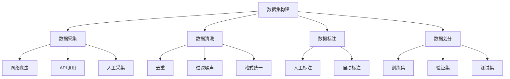

# 大规模语言模型从理论到实践 开源数据集

## 1. 背景介绍

### 1.1 问题的由来

近年来,自然语言处理(NLP)领域取得了长足的进步,很大程度上归功于大规模语言模型的兴起。传统的NLP任务,如机器翻译、文本摘要、问答系统等,都受益于这些强大的语言模型。然而,训练这些大规模模型需要大量高质量的文本数据,而获取足够的训练数据一直是个挑战。

### 1.2 研究现状  

目前,主流的做法是从网络上爬取大量文本数据,并进行清洗和预处理。但这种方式存在一些问题:

1. **版权问题**: 从网络上爬取的数据可能存在版权争议。
2. **质量问题**: 网络上的数据质量参差不齐,噪声较多。
3. **领域偏差**: 网络数据可能存在领域偏差,不能很好地覆盖所有领域。

为了解决这些问题,研究人员开始探索构建高质量的开源数据集,用于训练大规模语言模型。

### 1.3 研究意义

构建高质量的开源数据集对于推动NLP领域的发展至关重要,主要有以下几个方面的意义:

1. **促进模型性能提升**: 高质量的数据集可以有效提高语言模型的性能,为下游任务的改进奠定基础。
2. **推动算法创新**: 公开的数据集为研究人员提供了公平的实验环境,有利于算法的创新与改进。
3. **降低数据获取成本**: 开源数据集可以降低数据获取的成本,使更多的研究团队和个人能够参与到NLP研究中来。
4. **保护隐私和版权**: 通过合法的途径构建数据集,可以避免隐私和版权纠纷。

### 1.4 本文结构

本文将从理论和实践两个角度,全面介绍大规模语言模型的开源数据集。理论部分将阐述数据集构建的核心概念、算法原理和数学模型;实践部分将介绍数据集的实际应用场景、开发工具和学习资源。最后,我们将总结该领域的发展趋势和面临的挑战。

## 2. 核心概念与联系

在深入探讨数据集构建的细节之前,我们先来了解一些核心概念及其之间的联系。

上图展示了数据集构建的核心流程,包括数据采集、数据清洗、数据标注和数据划分四个主要步骤。每个步骤又可以细分为多个子任务。我们将在后续章节中详细介绍每个步骤的算法原理和实现细节。

## 3. 核心算法原理 & 具体操作步骤

### 3.1 算法原理概述

数据集构建的核心算法主要包括以下几个方面:

1. **数据采集算法**: 用于从各种来源高效采集原始数据,包括网络爬虫、API调用等。
2. **数据清洗算法**: 用于去重、过滤噪声、格式统一等,提高数据质量。
3. **数据标注算法**: 用于对数据进行标注,包括人工标注和自动标注两种方式。
4. **数据划分算法**: 用于将数据划分为训练集、验证集和测试集,以满足模型训练和评估的需求。

在下面的小节中,我们将详细介绍每个算法的具体操作步骤。

### 3.2 算法步骤详解

#### 3.2.1 数据采集算法

数据采集是数据集构建的第一步,主要有以下三种方式:

1. **网络爬虫**

网络爬虫是最常见的数据采集方式,它可以自动遍历互联网上的网页,并下载感兴趣的数据。常用的网络爬虫框架包括Scrapy、PySpider等。

网络爬虫的核心算法包括:

- **种子发现算法**: 用于发现初始的URL种子。
- **链接提取算法**: 从网页中提取新的链接,用于进一步爬取。
- **数据提取算法**: 从网页中提取感兴趣的数据,如文本、图像等。
- **去重算法**: 避免重复下载相同的网页。
- **调度算法**: 合理安排爬取队列,提高爬取效率。

2. **API调用**

许多网站和服务提供了API接口,允许直接访问其数据。通过编程方式调用API,我们可以高效地获取结构化数据。

API调用的关键步骤包括:

- **认证授权**: 获取访问API所需的密钥或令牌。
- **构造请求**: 根据API文档构造合法的HTTP请求。
- **解析响应**: 解析API返回的响应数据,提取所需信息。
- **异常处理**: 处理请求失败、速率限制等异常情况。

3. **人工采集**

对于某些特殊场景,我们可以通过人工方式采集数据,如扫描书籍、录制音频等。人工采集的优点是可以获取高质量的数据,但成本较高,难以大规模实施。

#### 3.2.2 数据清洗算法

数据清洗是提高数据质量的关键步骤,主要包括以下几个方面:

1. **去重**

由于数据来源的重叠,采集到的原始数据中往往存在大量重复。我们需要使用去重算法来消除这种冗余。

常用的去重算法包括:

- **基于哈希的去重**: 计算每条数据的哈希值,相同哈希值的数据视为重复。
- **基于相似度的去重**: 计算数据之间的相似度,相似度超过阈值的数据视为重复。
- **规则过滤**: 根据特定规则过滤掉已知的重复数据。

2. **过滤噪声**

原始数据中可能包含大量噪声,如广告、垃圾信息等。我们需要使用过滤算法去除这些噪声。

常用的过滤算法包括:

- **基于关键词的过滤**: 使用预定义的关键词列表,过滤掉包含这些关键词的数据。
- **基于机器学习的过滤**: 训练分类模型,自动识别并过滤噪声数据。
- **基于规则的过滤**: 根据特定规则过滤掉已知的噪声数据。

3. **格式统一**

由于数据来源的多样性,原始数据的格式往往不统一。我们需要将数据转换为统一的格式,以便后续处理。

常用的格式统一方法包括:

- **字符编码统一**: 将所有数据转换为统一的字符编码,如UTF-8。
- **结构化转换**: 将非结构化数据(如文本)转换为结构化格式(如JSON或CSV)。
- **规范化处理**: 对数据进行规范化处理,如大小写统一、标点符号规范化等。

#### 3.2.3 数据标注算法

对于许多NLP任务,我们需要对数据进行标注,为模型提供监督信号。数据标注可以采用人工或自动的方式。

1. **人工标注**

人工标注是最可靠的方式,但成本较高。常见的人工标注流程包括:

- **任务设计**: 设计标注任务,制定标注指南。
- **众包发布**: 通过众包平台发布标注任务,招募标注员。
- **质量控制**: 使用黄金样本、多次标注等方式控制标注质量。
- **审核付费**: 审核标注结果,并支付报酬。

2. **自动标注**

自动标注可以大幅降低成本,但质量往往不如人工标注。常用的自动标注算法包括:

- **规则标注**: 根据预定义的规则自动标注数据。
- **模型标注**: 使用现有的NLP模型(如命名实体识别模型)进行自动标注。
- **远程监督**: 利用已有的知识库(如Wikipedia)自动标注数据。
- **自训练**: 使用少量人工标注数据训练初始模型,再使用该模型标注更多数据。

#### 3.2.4 数据划分算法

为了评估模型的性能,我们需要将数据集划分为训练集、验证集和测试集。常用的数据划分策略包括:

1. **随机划分**: 随机将数据划分为训练集和测试集(或训练集、验证集和测试集)。
2. **分层抽样**: 根据数据的某些属性(如类别分布),对数据进行分层抽样,以确保每个子集具有相似的数据分布。
3. **时间划分**: 对于时序数据,可以按照时间顺序将数据划分为训练集和测试集,以模拟实际场景。
4. **留出法**: 将部分数据留作测试集,其余作为训练集(可能还需要从训练集中划分出验证集)。

### 3.3 算法优缺点

上述算法在数据集构建中发挥着重要作用,但也存在一些优缺点:

**优点**:

- 自动化程度高,可以大规模高效地构建数据集。
- 算法可复用性强,适用于不同领域的数据集构建。
- 通过算法组合,可以满足不同场景的需求。

**缺点**:

- 某些算法(如人工标注)成本较高,难以大规模应用。
- 纯自动化方法的质量往往不如人工,需要人工干预。
- 算法的性能受数据分布、任务复杂度等因素影响,需要不断优化。

### 3.4 算法应用领域

上述算法并非只适用于NLP领域的数据集构建,在其他领域也有广泛应用,例如:

- **计算机视觉**: 用于构建图像、视频等数据集。
- **推荐系统**: 用于采集和清洗用户行为数据。
- **金融风控**: 用于构建金融交易数据集,检测欺诈行为。
- **医疗健康**: 用于构建电子病历、医学影像等数据集。

总的来说,数据集构建是人工智能领域的基础工作,上述算法为高质量数据集的构建提供了有力支撑。

## 4. 数学模型和公式 & 详细讲解 & 举例说明

在数据集构建过程中,我们还需要一些数学模型和公式来量化和优化相关指标。本节将介绍一些常用的数学模型和公式,并结合具体案例进行讲解。

### 4.1 数学模型构建

#### 4.1.1 相似度计算模型

在数据去重和聚类过程中,我们需要计算数据之间的相似度。常用的相似度计算模型包括:

1. **Jaccard相似系数**

Jaccard相似系数用于计算两个集合的相似度,定义为两个集合的交集除以两个集合的并集:

$$\text{Jaccard}(A, B) = \frac{|A \cap B|}{|A \cup B|}$$

其中$A$和$B$表示两个集合,$|A|$表示集合$A$的基数。

2. **余弦相似度**

余弦相似度常用于计算两个向量之间的相似度,定义为两个向量的点积除以它们的模的乘积:

$$\text{CosineSimilarity}(\vec{a}, \vec{b}) = \frac{\vec{a} \cdot \vec{b}}{||\vec{a}|| \cdot ||\vec{b}||}$$

其中$\vec{a}$和$\vec{b}$表示两个向量,$\vec{a} \cdot \vec{b}$表示它们的点积,$||\vec{a}||$和$||\vec{b}||$分别表示它们的模。

3. **编辑距离**

编辑距离用于计算两个字符串之间的相似度,定义为将一个字符串转换为另一个字符串所需的最小编辑操作数(插入、删除或替换)。

常用的编辑距离算法包括Levenshtein距离、Damerau-Levenshtein距离等。

#### 4.1.2 数据质量评估模型

为了评