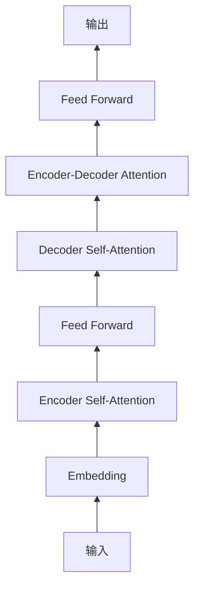

# 大规模语言模型从理论到实践 本书的内容安排

关键词：大规模语言模型、自然语言处理、深度学习、Transformer、BERT、GPT、预训练、微调、推理

## 1. 背景介绍

### 1.1 问题的由来
近年来,随着深度学习技术的快速发展,自然语言处理(NLP)领域取得了巨大的进步。特别是以 Transformer 为代表的大规模语言模型(Large Language Models,LLMs)的出现,极大地推动了 NLP 的发展。这些模型能够从海量文本数据中学习语言的规律和知识,并在多种 NLP 任务上取得了超越人类的性能。

### 1.2 研究现状
目前,业界主流的大规模语言模型包括 Google 的 BERT、OpenAI 的 GPT 系列、Facebook 的 RoBERTa 等。它们在机器翻译、问答系统、文本分类、命名实体识别等任务上都取得了 state-of-the-art 的结果。同时,这些模型也催生了许多新的应用,如对话系统、内容生成、知识图谱构建等。

### 1.3 研究意义
尽管大规模语言模型取得了巨大成功,但对于许多研究者和从业者来说,如何从理论到实践地构建和应用这些模型仍然是一个挑战。因此,系统地介绍大规模语言模型的原理、架构、训练方法以及实践经验,对于推动 NLP 技术的普及和应用具有重要意义。

### 1.4 本文结构
本文将从以下几个方面系统介绍大规模语言模型:

- 第2部分介绍大规模语言模型涉及的核心概念及其联系。 
- 第3部分重点讲解 Transformer 等主流模型的核心算法原理和具体操作步骤。
- 第4部分从数学角度对语言模型的原理进行建模分析,并举例说明。
- 第5部分通过代码实例,教会读者如何实现一个基于 PyTorch 的 BERT 模型。
- 第6部分总结大规模语言模型的主要应用场景。
- 第7部分推荐学习大规模语言模型的工具和资源。
- 第8部分讨论大规模语言模型未来的发展趋势和面临的挑战。
- 第9部分的附录解答了一些常见问题。

## 2. 核心概念与联系

在讨论大规模语言模型之前,我们先明确几个核心概念:

- 语言模型:语言模型是一种对语言进行建模的方法,旨在学习语言的统计规律和模式。给定一个句子,语言模型可以预测下一个最可能出现的词。常见的语言模型有 N-gram、RNN、Transformer 等。

- 预训练:预训练是指在大规模无标注语料上训练通用的语言表示。这种无监督学习可以捕捉词语的语义信息,学到语言的一般规律。主流的预训练方法包括 BERT 的 Masked Language Model、GPT 的 Causal Language Model 等。

- 微调:微调是指在预训练的基础上,用少量标注数据对模型进行针对性的训练,使其适应特定任务。微调可以显著提升模型在下游任务上的性能,是迁移学习的重要方式。

- 推理:推理是指用训练好的模型对新样本进行预测。对于大规模语言模型,推理往往需要较大的计算开销,需要采用一些加速推理的技术,如量化、剪枝、知识蒸馏等。

下图展示了大规模语言模型中这些概念之间的关系:


## 3. 核心算法原理 & 具体操作步骤

### 3.1 算法原理概述
目前主流的大规模语言模型基本都采用了 Transformer 架构。相比 RNN 等序列模型,Transformer 通过 self-attention 机制,可以更好地捕捉长距离依赖,且具有更好的并行性。Transformer 主要由编码器和解码器组成,如下图所示:



### 3.2 算法步骤详解
以 BERT 为例,其预训练过程主要分为以下步骤:

1. 输入表示:将输入序列 token 化,并加入位置编码和 segment 编码,得到输入表示。
2. Masked LM:随机 mask 掉部分 token,让模型去预测被 mask 的 token。这可以帮助模型学习上下文信息。 
3. Next Sentence Prediction:随机选择两个句子,让模型判断它们是否前后相邻。这可以帮助模型学习句间关系。
4. 前向传播:将输入表示经过多层 Transformer 编码器,得到每个 token 的表示。
5. 损失计算:基于 MLM 和 NSP 的预测结果,计算交叉熵损失。
6. 反向传播:根据损失函数计算梯度,并用优化器更新模型参数。
7. 重复以上步骤,直到模型收敛。

### 3.3 算法优缺点
Transformer 语言模型的主要优点包括:

- 并行性好,训练速度快
- 可以捕捉长距离依赖
- 通过预训练可以学习通用语言表示
- 适用于各种下游 NLP 任务

其主要缺点包括:

- 模型参数量大,训练和推理成本高 
- 解释性差,是一个黑盒模型
- 对数据质量和规模要求较高
- 容易过拟合少样本任务

### 3.4 算法应用领域
大规模语言模型已经被广泛应用于各种 NLP 任务,包括但不限于:

- 机器翻译:将一种语言翻译成另一种语言
- 问答系统:根据给定问题和上下文,给出答案
- 文本分类:将文本分到预定义的类别中
- 命名实体识别:识别文本中的人名、地名、机构名等
- 关系抽取:从文本中抽取实体间的关系
- 文本摘要:将长文本压缩成简短摘要
- 对话系统:实现人机对话交互

## 4. 数学模型和公式 & 详细讲解 & 举例说明

### 4.1 数学模型构建
大规模语言模型的核心是建立单词之间的条件概率关系。以 bigram 语言模型为例,我们的目标是估计给定前一个词 $w_{i-1}$ 的情况下,当前词 $w_i$ 的条件概率 $P(w_i|w_{i-1})$。根据大数定律,这个概率可以用词频来估计:

$$
P(w_i|w_{i-1}) = \frac{count(w_{i-1},w_i)}{count(w_{i-1})}
$$

其中 $count(w_{i-1},w_i)$ 表示 $w_{i-1}$ 和 $w_i$ 在语料中连续出现的次数,$count(w_{i-1})$ 表示 $w_{i-1}$ 出现的次数。

对于神经语言模型,我们用神经网络来建模这种条件概率关系。以 RNN 语言模型为例,在时刻 $t$,模型的隐状态 $h_t$ 编码了之前所有词的信息,我们可以用它来预测下一个词的概率分布:

$$
h_t=f(h_{t-1},x_t)
$$
$$
P(w_t|w_{<t})=softmax(Wh_t)
$$

其中 $f$ 是 RNN 的状态转移函数,$x_t$ 是 $t$ 时刻词的嵌入表示,$W$ 是输出层的权重矩阵。

### 4.2 公式推导过程
以 Transformer 的 self-attention 为例,我们详细推导其前向计算过程。

首先,我们将输入序列 $X$ 通过三个线性变换得到 query、key、value 矩阵:

$$
Q=XW_Q, K=XW_K, V=XW_V
$$

然后,我们计算 query 和 key 的相似度,并用 softmax 归一化得到注意力权重:

$$
A=softmax(\frac{QK^T}{\sqrt{d}})
$$

其中 $d$ 是 query 和 key 的维度,用于缩放点积结果。

最后,我们用注意力权重加权 value 矩阵,得到 self-attention 的输出:

$$
O=AV
$$

通过这种注意力机制,模型可以在编码每个位置时,都参考序列中的所有位置,捕捉长距离依赖。

### 4.3 案例分析与讲解
我们以一个简单的例子来说明 Transformer 的 self-attention 是如何工作的。

假设我们有一个输入序列:"The animal didn't cross the street because it was too tired",我们想知道代词 "it" 指代的是什么。

首先,模型会对每个词进行编码。当编码到 "it" 时,通过 self-attention,模型会计算 "it" 与序列中其他词的相似度。由于 "it" 与 "animal" 的语义相关度最高,所以 "animal" 对应的注意力权重会很大。

然后,模型会根据注意力权重对 value 进行加权求和。由于 "animal" 的权重最大,所以 "it" 的表示会更多地融入 "animal" 的语义信息。

最后,模型根据 "it" 的表示进行预测,正确地将 "it" 解析为 "animal"。

这个例子说明了 self-attention 如何帮助模型捕捉词间的长距离依赖,理解语言的深层语义。

### 4.4 常见问题解答
问:Transformer 中为什么要对点积结果进行缩放?

答:点积结果的方差会随着维度 $d$ 的增加而增大,导致 softmax 函数饱和,梯度消失。除以 $\sqrt{d}$ 可以缓解这个问题,使得梯度更稳定。

问:为什么要用多头注意力?

答:多头注意力允许模型在不同的子空间里计算注意力,捕捉不同方面的语义信息。然后将这些信息拼接起来,可以得到更丰富的表示。实验表明,多头注意力可以显著提升模型性能。

## 5. 项目实践：代码实例和详细解释说明

### 5.1 开发环境搭建
我们将使用 PyTorch 框架来实现一个基于 BERT 的文本分类模型。首先,我们需要安装以下依赖:

- Python 3.6+
- PyTorch 1.10+
- Transformers 4.10+
- Numpy
- Sklearn

可以使用 pip 进行安装:

```bash
pip install torch transformers numpy scikit-learn
```

### 5.2 源代码详细实现
首先,我们定义一个 BertForSequenceClassification 类,它继承自 transformers 库中的 BertPreTrainedModel 类:

```python
from transformers import BertPreTrainedModel, BertModel
from torch import nn

class BertForSequenceClassification(BertPreTrainedModel):
    def __init__(self, config):
        super().__init__(config)
        self.num_labels = config.num_labels
        self.bert = BertModel(config)
        self.dropout = nn.Dropout(config.hidden_dropout_prob)
        self.classifier = nn.Linear(config.hidden_size, config.num_labels)
        
    def forward(self, input_ids, attention_mask=None, token_type_ids=None, labels=None):
        outputs = self.bert(input_ids, attention_mask=attention_mask, token_type_ids=token_type_ids)
        pooled_output = outputs[1]
        pooled_output = self.dropout(pooled_output)
        logits = self.classifier(pooled_output)
        return logits
```

这个类的主要组成部分包括:

- 一个 BERT 模型,用于对输入序列进行编码。
- 一个 dropout 层,用于正则化。
- 一个线性分类器,用于将 BERT 的输出映射到类别标签上。

forward 函数定义了前向传播的流程:

1. 将输入传给 BERT 模型,得到最后一层的池化表示。 
2. 对池化表示进行 dropout。
3. 将池化表示传给线性分类器,得到 logits。

接下来,我们加载预训练的 BERT 模型,并实例化 BertForSequenceClassification:

```python