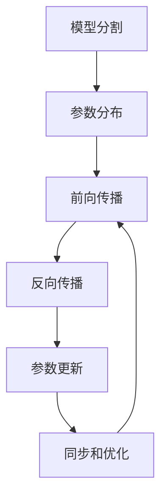

# 大规模语言模型从理论到实践：模型并行

## 1. 背景介绍

### 1.1 问题的由来

随着数据量的激增和计算能力的提高，大规模语言模型在自然语言处理领域取得了令人瞩目的成就。然而，训练这些庞大的模型需要巨大的计算资源,这对单台机器来说是一个巨大的挑战。为了解决这个问题,模型并行技术应运而生。

### 1.2 研究现状

目前,模型并行技术主要分为两种方式:数据并行和模型并行。数据并行是将训练数据分割到多个设备上进行并行计算,而模型并行则是将模型的参数分割到多个设备上进行并行计算。相比数据并行,模型并行可以支持更大的模型,但同时也带来了更多的通信开销和同步问题。

### 1.3 研究意义

随着语言模型规模的不断增长,模型并行技术将变得越来越重要。通过有效利用多个设备的计算资源,我们可以训练出更大、更强大的语言模型,从而推动自然语言处理领域的发展。同时,模型并行技术也可以应用于其他领域,如计算机视觉和科学计算等。

### 1.4 本文结构

本文将从理论和实践两个角度探讨模型并行技术。首先,我们将介绍模型并行的核心概念和算法原理。然后,我们将详细讲解数学模型和公式,并结合实际案例进行分析。接下来,我们将提供一个完整的项目实践,包括代码实现和运行结果展示。最后,我们将探讨模型并行在实际应用中的场景,并对未来的发展趋势和挑战进行展望。

## 2. 核心概念与联系

模型并行技术的核心概念是将一个庞大的模型分割成多个子模型,并将这些子模型分配到不同的设备上进行并行计算。这种方式可以有效利用多个设备的计算资源,从而支持更大规模的模型训练。

模型并行技术与数据并行技术有着密切的联系。在数据并行中,我们将训练数据分割到多个设备上进行并行计算,而在模型并行中,我们将模型的参数分割到多个设备上进行并行计算。两种技术可以结合使用,以实现更高效的模型训练。

此外,模型并行技术还与分布式系统和并行计算理论密切相关。在实现模型并行时,我们需要解决诸如通信开销、同步问题等一系列挑战,这些挑战也是分布式系统和并行计算领域的核心问题。

## 3. 核心算法原理与具体操作步骤

### 3.1 算法原理概述

模型并行算法的核心思想是将一个庞大的模型分割成多个子模型,并将这些子模型分配到不同的设备上进行并行计算。在训练过程中,每个设备只需要计算和更新自己负责的那部分参数,从而减轻了单个设备的计算压力。

为了实现模型并行,我们需要解决以下几个关键问题:

1. 模型分割策略:如何将模型合理地分割成多个子模型?
2. 参数分布方式:如何将子模型的参数分布到不同的设备上?
3. 通信策略:在训练过程中,不同设备之间如何进行参数同步和梯度交换?
4. 优化策略:如何优化通信开销和计算效率,提高模型并行的整体性能?

不同的模型并行算法对上述问题有不同的解决方案,我们将在接下来的章节中详细讲解。

### 3.2 算法步骤详解

以下是一种常见的模型并行算法的具体步骤:

1. **模型分割**:根据预定义的策略,将模型分割成多个子模型。常见的分割策略包括层分割(Layer Partition)、列分割(Column Partition)和行分割(Row Partition)等。

2. **参数分布**:将每个子模型的参数分配到不同的设备上。通常采用一种均匀分布的方式,即每个设备负责大约相同数量的参数。

3. **前向传播**:在前向传播过程中,每个设备计算自己负责的那部分参数对应的输出。对于需要其他设备参数的计算,设备之间需要进行通信和参数同步。

4. **反向传播**:在反向传播过程中,每个设备计算自己负责的那部分参数对应的梯度。同时,设备之间需要进行梯度交换,以便计算出完整的梯度。

5. **参数更新**:根据计算出的梯度,每个设备更新自己负责的那部分参数。

6. **同步和优化**:在每个训练迭代结束时,设备之间需要进行参数同步,以保持模型的一致性。同时,可以采用一些优化策略,如梯度压缩、重参数化等,以减少通信开销和提高计算效率。

上述步骤在每个训练迭代中不断重复,直到模型收敛或达到预定的训练轮数。

### 3.3 算法优缺点

模型并行算法的主要优点是可以支持更大规模的模型训练,突破单机计算能力的限制。通过将模型分割到多个设备上进行并行计算,我们可以充分利用集群或云环境中的计算资源,从而训练出更强大的语言模型。

然而,模型并行算法也存在一些缺点和挑战:

1. **通信开销**:在模型并行过程中,不同设备之间需要频繁进行参数同步和梯度交换,这会带来较大的通信开销,影响整体训练效率。

2. **同步问题**:由于多个设备需要协同工作,因此需要解决参数同步和梯度同步等问题,以保证模型的一致性和收敛性。

3. **负载不均衡**:不同子模型的计算复杂度可能不同,导致不同设备的计算负载不均衡,影响并行效率。

4. **内存限制**:虽然模型并行可以支持更大的模型,但每个设备的内存仍然有限,因此需要合理分配内存资源。

5. **实现复杂度**:实现高效的模型并行算法需要解决诸多技术挑战,如模型分割策略、通信优化、负载均衡等,增加了系统的复杂度。

### 3.4 算法应用领域

模型并行技术最初是为训练大规模语言模型而设计的,但它的应用范围远不止于此。事实上,任何需要训练或推理大型深度学习模型的领域都可以应用模型并行技术,包括但不限于:

1. **计算机视觉**:训练大型图像分类、目标检测和语义分割模型等。
2. **推荐系统**:训练大型推荐模型,提供个性化推荐服务。
3. **科学计算**:训练用于物理模拟、天体运动预测等领域的大型模型。
4. **金融分析**:训练用于风险评估、市场预测等领域的大型模型。
5. **生物信息学**:训练用于基因组学、蛋白质结构预测等领域的大型模型。

总的来说,只要存在训练或推理大型模型的需求,模型并行技术就可以发挥作用,帮助我们突破单机计算能力的限制,实现更强大的模型性能。

## 4. 数学模型和公式详细讲解与举例说明

### 4.1 数学模型构建

在介绍具体的数学模型和公式之前,我们先来构建一个基本的模型并行框架。假设我们有一个深度神经网络模型 $f(x; \theta)$,其中 $x$ 是输入,而 $\theta$ 是模型参数。我们将模型参数 $\theta$ 分割成 $K$ 个部分,即 $\theta = \{\theta_1, \theta_2, \ldots, \theta_K\}$,并将每个部分分配到不同的设备上进行并行计算。

在前向传播过程中,每个设备计算自己负责的那部分参数对应的输出:

$$f(x; \theta) = f_K(f_{K-1}(\ldots f_1(x; \theta_1); \theta_2); \ldots; \theta_K)$$

其中,$f_i(\cdot; \theta_i)$ 表示由参数 $\theta_i$ 定义的模型部分。

在反向传播过程中,我们需要计算每个参数部分对应的梯度:

$$\frac{\partial L}{\partial \theta_i} = \frac{\partial L}{\partial f} \cdot \frac{\partial f}{\partial f_i} \cdot \frac{\partial f_i}{\partial \theta_i}$$

其中,$L$ 是损失函数,而 $\frac{\partial L}{\partial f}$、$\frac{\partial f}{\partial f_i}$ 和 $\frac{\partial f_i}{\partial \theta_i}$ 分别表示损失对模型输出、模型输出对子模型输出和子模型输出对参数的梯度。

为了计算完整的梯度,不同设备之间需要进行梯度交换,例如通过All-Reduce操作。在参数更新阶段,每个设备根据自己计算的梯度更新对应的参数部分。

### 4.2 公式推导过程

接下来,我们将详细推导模型并行中的一些关键公式。

**1. 前向传播**

假设我们将模型分割成两个部分,即 $f(x; \theta) = f_2(f_1(x; \theta_1); \theta_2)$,其中 $\theta_1$ 和 $\theta_2$ 分别分配到两个不同的设备上。在前向传播过程中,第一个设备计算 $f_1(x; \theta_1)$,然后将结果传递给第二个设备,第二个设备继续计算 $f_2(f_1(x; \theta_1); \theta_2)$,得到最终的模型输出。

**2. 反向传播**

在反向传播过程中,我们需要计算每个参数部分对应的梯度。根据链式法则,我们有:

$$\frac{\partial L}{\partial \theta_1} = \frac{\partial L}{\partial f} \cdot \frac{\partial f}{\partial f_1} \cdot \frac{\partial f_1}{\partial \theta_1}$$
$$\frac{\partial L}{\partial \theta_2} = \frac{\partial L}{\partial f} \cdot \frac{\partial f}{\partial f_2} \cdot \frac{\partial f_2}{\partial \theta_2}$$

其中,$\frac{\partial L}{\partial f}$ 可以通过反向传播得到,而 $\frac{\partial f}{\partial f_1}$ 和 $\frac{\partial f}{\partial f_2}$ 则需要在设备之间进行通信和梯度交换。

具体来说,第二个设备首先计算 $\frac{\partial f}{\partial f_2}$,然后将其传递给第一个设备。第一个设备接收到 $\frac{\partial f}{\partial f_2}$ 后,可以计算 $\frac{\partial f}{\partial f_1} = \frac{\partial f}{\partial f_2} \cdot \frac{\partial f_2}{\partial f_1}$,进而计算出 $\frac{\partial L}{\partial \theta_1}$。同时,第二个设备也可以利用 $\frac{\partial f}{\partial f_2}$ 计算出 $\frac{\partial L}{\partial \theta_2}$。

通过上述过程,我们可以在不同设备之间协同计算出每个参数部分对应的梯度,从而实现模型并行的反向传播。

### 4.3 案例分析与讲解

为了更好地理解模型并行的数学模型和公式,我们来分析一个具体的案例。假设我们有一个简单的两层全连接神经网络,用于二分类任务。该模型的输入是一个 $d$ 维向量 $x$,输出是一个二元标量 $y$。

模型的前向传播过程如下:

$$z_1 = W_1x + b_1$$
$$a_1 = \sigma(z_1)$$
$$z_2 = W_2a_1 + b_2$$
$$y = \sigma(z_2)$$

其中,$W_1 \in \mathbb{R}^{m \times d}$、$b_1 \in \mathbb{R}^m$、$W_2 \in \mathbb{R}^{1 \times m}$ 和 $b_2 \in \mathbb{R}$ 是