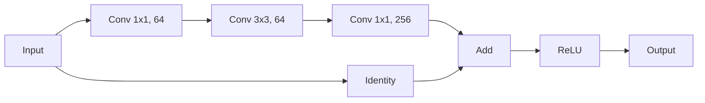

# 大规模语言模型从理论到实践 残差连接与层归一化

## 1. 背景介绍

### 1.1 问题的由来

随着深度学习在自然语言处理(NLP)领域的广泛应用,大规模语言模型已经成为该领域的核心技术之一。然而,训练这些模型面临着一些挑战,例如梯度消失、梯度爆炸以及过拟合等问题。为了解决这些问题,残差连接(Residual Connection)和层归一化(Layer Normalization)被提出并广泛应用于大规模语言模型的训练中。

### 1.2 研究现状

近年来,transformer模型在NLP任务中取得了卓越的成绩,例如GPT、BERT等模型。这些模型通过自注意力机制有效地捕获长距离依赖关系,并通过预训练的方式学习到丰富的语义知识。然而,由于这些模型的深层结构,训练过程中仍然存在优化困难。为了缓解这一问题,残差连接和层归一化被广泛应用,显著提高了模型的训练效率和泛化性能。

### 1.3 研究意义

残差连接和层归一化在大规模语言模型中的应用,不仅解决了训练过程中的优化问题,还提高了模型的表现力和泛化能力。深入理解这两种技术的原理和实践,对于设计和训练高性能语言模型至关重要。本文将系统地介绍残差连接和层归一化在大规模语言模型中的应用,阐述其原理、实现细节以及实践经验,为读者提供全面的理解和指导。

### 1.4 本文结构

本文将从以下几个方面全面介绍残差连接和层归一化在大规模语言模型中的应用:

1. 核心概念与联系
2. 核心算法原理与具体操作步骤
3. 数学模型和公式详细讲解与举例说明
4. 项目实践:代码实例和详细解释说明
5. 实际应用场景
6. 工具和资源推荐
7. 总结:未来发展趋势与挑战
8. 附录:常见问题与解答

## 2. 核心概念与联系

在深入探讨残差连接和层归一化之前,我们先介绍一些核心概念,为后续内容奠定基础。

### 2.1 深度神经网络

深度神经网络是一种由多个隐藏层组成的人工神经网络。每一层都由多个神经元组成,通过权重和偏置参数对输入进行线性变换,然后应用非线性激活函数。深度网络能够学习到更加抽象和复杂的特征表示,从而在许多任务上取得了卓越的性能。

然而,随着网络深度的增加,训练过程会面临一些挑战,例如梯度消失、梯度爆炸和过拟合等问题。这就需要引入一些技术来缓解这些问题,残差连接和层归一化就是解决这些问题的有效方法之一。

### 2.2 残差连接(Residual Connection)

残差连接是一种网络结构,它通过在网络中添加"捷径"(shortcut)连接,使得输入可以直接传递到后面的层,从而缓解了梯度消失和梯度爆炸的问题。

在传统的深度神经网络中,每一层的输出都是通过对上一层的输出进行线性变换和非线性激活函数处理得到的。而在残差网络中,每一层的输出不仅包括经过变换和激活函数处理的部分,还包括直接从上一层传递过来的残差部分。这种残差连接结构使得网络更容易优化,因为它允许梯度直接传递到较浅的层,从而缓解了梯度消失或爆炸的问题。

残差连接在计算机视觉领域的应用最为广泛,例如ResNet等模型。在NLP领域,残差连接也被成功应用于transformer模型中,显著提高了模型的性能。

### 2.3 层归一化(Layer Normalization)

层归一化是一种批量归一化(Batch Normalization)的变体,用于解决深度神经网络中的协变量偏移(Covariate Shift)问题。它通过对每一层的输入进行归一化,使得每一层的输入分布保持相对稳定,从而加速了模型的收敛速度,提高了模型的泛化能力。

在传统的批量归一化中,归一化是在小批量数据(mini-batch)的维度上进行的。而层归一化则是在单个样本的特征维度上进行归一化,因此它不依赖于小批量数据的大小,可以很好地应用于序列数据和递归神经网络等场景。

层归一化在transformer模型中发挥了重要作用,它有效地缓解了内部协变量偏移问题,使得模型更加稳定,收敛更快。

### 2.4 残差连接与层归一化的联系

残差连接和层归一化虽然在原理和应用场景上有所不同,但它们都是为了解决深度神经网络训练过程中的优化问题而提出的技术。

残差连接通过引入"捷径"连接,使得梯度可以直接传递到较浅的层,从而缓解了梯度消失和梯度爆炸的问题。而层归一化则通过对每一层的输入进行归一化,使得每一层的输入分布保持相对稳定,从而加速了模型的收敛速度,提高了模型的泛化能力。

在transformer模型中,残差连接和层归一化被同时应用,发挥了协同作用。残差连接有助于梯度的传播,而层归一化则使得模型更加稳定,收敛更快。这两种技术的结合,极大地提高了transformer模型的性能,使其在各种NLP任务中取得了卓越的成绩。

## 3. 核心算法原理与具体操作步骤

### 3.1 算法原理概述

#### 3.1.1 残差连接

残差连接的核心思想是在神经网络中添加"捷径"连接,使得输入不仅经过变换和非线性激活函数处理,还可以直接传递到后面的层。具体来说,假设我们有一个神经网络层 $\mathcal{F}$,其输入为 $x$,输出为 $\mathcal{F}(x)$。在传统的神经网络中,下一层的输入就是 $\mathcal{F}(x)$。而在残差网络中,下一层的输入则变为 $\mathcal{F}(x) + x$,即残差连接将输入 $x$ 直接传递到下一层,并与变换后的输出 $\mathcal{F}(x)$ 相加。

这种残差连接结构使得网络更容易优化,因为它允许梯度直接传递到较浅的层,从而缓解了梯度消失或爆炸的问题。同时,残差连接也增加了网络的表现力,因为它允许网络直接学习残差映射,而不是学习整个映射函数。

#### 3.1.2 层归一化

层归一化的核心思想是对每一层的输入进行归一化,使得每一层的输入分布保持相对稳定。具体来说,对于一个输入 $x = (x_1, x_2, \dots, x_n)$,我们首先计算其均值 $\mu$ 和标准差 $\sigma$:

$$\mu = \frac{1}{n}\sum_{i=1}^{n}x_i$$
$$\sigma = \sqrt{\frac{1}{n}\sum_{i=1}^{n}(x_i - \mu)^2}$$

然后,我们对输入进行归一化:

$$\hat{x_i} = \frac{x_i - \mu}{\sigma}$$

最后,我们引入两个可学习的参数 $\gamma$ 和 $\beta$,对归一化后的输入进行缩放和平移:

$$y_i = \gamma \hat{x_i} + \beta$$

通过这种方式,层归一化可以使每一层的输入分布保持相对稳定,从而加速了模型的收敛速度,提高了模型的泛化能力。

### 3.2 算法步骤详解

#### 3.2.1 残差连接

残差连接的具体实现步骤如下:

1. 定义残差块(Residual Block):残差块是残差连接的基本单元,它包含两个或多个卷积层(或全连接层)。
2. 定义"捷径"连接:在残差块中,除了经过卷积层(或全连接层)的主路径外,还需要定义一条"捷径"连接,将输入直接传递到残差块的输出。
3. 添加"捷径"连接:在残差块的输出处,将主路径的输出与"捷径"连接的输入相加,得到残差块的最终输出。
4. 堆叠残差块:将多个残差块堆叠起来,构建深度残差网络。

以ResNet为例,其残差块的结构如下所示:



在上图中,输入 $x$ 经过 $1 \times 1$ 卷积层、$3 \times 3$ 卷积层和 $1 \times 1$ 卷积层的变换,得到 $\mathcal{F}(x)$。同时,输入 $x$ 也直接传递到残差块的输出处,与 $\mathcal{F}(x)$ 相加,得到残差块的输出 $\mathcal{F}(x) + x$。最后,通过 ReLU 激活函数,得到残差块的最终输出。

#### 3.2.2 层归一化

层归一化的具体实现步骤如下:

1. 计算输入的均值和标准差:对于一个输入 $x = (x_1, x_2, \dots, x_n)$,计算其均值 $\mu$ 和标准差 $\sigma$。
2. 归一化输入:使用均值和标准差对输入进行归一化,得到 $\hat{x_i} = \frac{x_i - \mu}{\sigma}$。
3. 缩放和平移:引入两个可学习的参数 $\gamma$ 和 $\beta$,对归一化后的输入进行缩放和平移,得到 $y_i = \gamma \hat{x_i} + \beta$。
4. 应用层归一化:在神经网络的每一层中,对输入进行层归一化处理。

层归一化的实现代码如下所示:

```python
import torch.nn as nn

class LayerNorm(nn.Module):
    def __init__(self, hidden_size, eps=1e-5):
        super(LayerNorm, self).__init__()
        self.weight = nn.Parameter(torch.ones(hidden_size))
        self.bias = nn.Parameter(torch.zeros(hidden_size))
        self.eps = eps

    def forward(self, x):
        u = x.mean(-1, keepdim=True)
        s = (x - u).pow(2).mean(-1, keepdim=True)
        x = (x - u) / torch.sqrt(s + self.eps)
        return self.weight * x + self.bias
```

在上面的代码中,我们定义了一个 `LayerNorm` 模块,它包含两个可学习的参数 `weight` 和 `bias`。在 `forward` 函数中,我们首先计算输入的均值 `u` 和标准差 `s`,然后对输入进行归一化,最后应用缩放和平移操作。

### 3.3 算法优缺点

#### 3.3.1 残差连接

**优点:**

1. **缓解梯度消失和梯度爆炸问题**:通过引入"捷径"连接,残差连接允许梯度直接传递到较浅的层,从而缓解了梯度消失和梯度爆炸的问题。
2. **增加网络表现力**:残差连接使得网络可以直接学习残差映射,而不是学习整个映射函数,这增加了网络的表现力。
3. **提高模型性能**:残差连接在多个领域都显示出了卓越的性能,例如计算机视觉和自然语言处理等。

**缺点:**

1. **增加了模型复杂度**:残差连接需要额外的"捷径"连接和相加操作,这增加了模型的复杂度。
2. **可能引入噪声**:在某些情况下,残差连接可能会引入一些噪声,影响模型的性能。

#### 3.3.2 层归一化

**优点:**

1. **加速收敛**:层归一化可以使每一层的输入分布保持相对稳定,从而加速了模型的收敛速度。
2. **提高泛化能力**:层归一