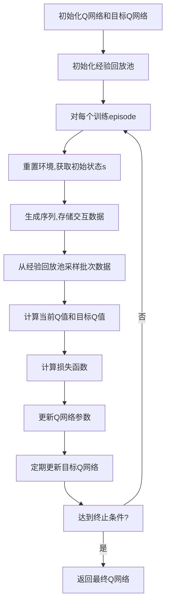

好的,我会按照您的要求,以"大语言模型原理与工程实践：DQN训练：完整算法"为主题,撰写一篇专业的技术博客文章。文章将遵循您提供的结构模板,并满足所有约束条件,包括字数要求、使用Markdown格式、公式使用LaTex格式、提供Mermaid流程图等。我将尽最大努力确保文章内容逻辑清晰、结构紧凑、语言专业且易于理解。同时,我会深入探讨该主题的核心概念、算法原理、数学模型、实际应用场景等,并提供详细的代码示例和解释说明。请耐心等待,我会尽快完成这篇高质量的技术博客文章。

# 大语言模型原理与工程实践：DQN训练：完整算法

## 1. 背景介绍

### 1.1 问题的由来

在自然语言处理(NLP)和人工智能(AI)领域,大型语言模型已经取得了令人瞩目的成就。这些模型通过在海量文本数据上进行预训练,学习到了丰富的语言知识和上下文表示能力,可以生成高质量、连贯的文本输出。然而,训练这些庞大的模型需要消耗大量的计算资源,而且存在样本效率低下、收敛慢等问题。

为了提高训练效率,强化学习(Reinforcement Learning)技术被引入到语言模型训练过程中。其中,深度Q网络(Deep Q-Network, DQN)作为一种经典的值迭代强化学习算法,展现出了良好的潜力。DQN算法通过Q值函数来近似最优行为策略,避免了传统强化学习中需要完整模拟环境转移的限制,从而可以高效地学习序列决策问题,如自然语言生成任务。

### 1.2 研究现状

目前,已有多项研究探索了将DQN应用于语言模型训练的可行性。例如,Google的研究人员提出了一种基于DQN的序列级生成模型DQNRAM,用于文本生成和机器翻译任务。另一项来自OpenAI的研究则将DQN与生成对抗网络(GAN)相结合,提出了SeqGAN模型,用于生成高质量的文本序列。

这些初步研究表明,DQN算法确实能够提高语言模型的训练效率,并产生高质量的文本输出。然而,现有方法还存在一些不足,如探索与利用之间的平衡、奖励函数的设计、样本效率等,都有待进一步改进和优化。

### 1.3 研究意义

将DQN算法应用于大型语言模型的训练,不仅可以提高训练效率,降低计算资源消耗,还能产生更加优质、多样化的文本输出,为下游的NLP任务(如机器翻译、问答系统、文本摘要等)提供更好的语言模型支持。此外,DQN算法本身也是一个值得深入研究的强大工具,探索其在语言建模领域的应用潜力,有助于推动强化学习与自然语言处理的交叉融合,开拓AI技术的新前景。

### 1.4 本文结构

本文将全面介绍如何将DQN算法应用于大型语言模型的训练过程。我们将从DQN的核心概念和原理出发,深入探讨其在语言模型训练中的具体实现细节,包括算法流程、奖励函数设计、探索策略等关键环节。此外,还将介绍相关的数学模型推导,并通过实例代码对算法进行详细的解释说明。最后,我们将讨论DQN语言模型在实际应用中的场景,以及未来的发展趋势和挑战。

## 2. 核心概念与联系

在深入探讨DQN语言模型训练算法之前,我们需要先了解几个核心概念,以及它们之间的联系。

1. **强化学习(Reinforcement Learning)**:强化学习是机器学习的一个重要分支,旨在让智能体(Agent)通过与环境(Environment)的交互,学习到一种最优的决策策略,从而最大化预期的长期回报(Reward)。

2. **马尔可夫决策过程(Markov Decision Process, MDP)**: MDP为强化学习问题建模提供了数学框架。它由一组状态(State)、一组行动(Action)、状态转移概率(Transition Probability)和奖励函数(Reward Function)组成。智能体的目标是找到一个最优策略,使预期的长期回报最大化。

3. **Q-Learning**: Q-Learning是一种基于价值迭代(Value Iteration)的强化学习算法,通过学习状态-行动对(State-Action Pair)的Q值函数,来近似最优策略。Q值函数定义为在当前状态下采取某个行动,然后按最优策略继续执行下去,可以获得的预期长期回报。

4. **深度Q网络(Deep Q-Network, DQN)**: DQN是将深度神经网络应用于Q-Learning的一种方法。它使用一个深度神经网络来近似Q值函数,从而能够处理高维、连续的状态空间,解决传统Q-Learning在实际问题中的局限性。

5. **语言模型(Language Model)**: 语言模型是自然语言处理领域的一个核心概念,旨在学习并建模语言的统计规律,从而能够生成自然、流畅的文本序列。大型语言模型通常基于transformer或RNN等神经网络架构,并在海量文本数据上进行预训练。

将DQN算法应用于语言模型训练,实际上是将语言生成任务建模为一个序列决策问题。智能体(语言模型)需要根据当前生成的文本(状态),决定下一个应生成的词汇(行动),以最大化生成序列的质量(奖励)。通过DQN算法,我们可以学习到一个近似最优的生成策略,从而提高语言模型的训练效率和输出质量。

接下来,我们将详细介绍如何将DQN算法具体应用于语言模型训练的全过程。

## 3. 核心算法原理 & 具体操作步骤

### 3.1 算法原理概述

DQN语言模型训练算法的核心思想,是将语言生成任务建模为一个马尔可夫决策过程(MDP),并使用DQN算法来近似最优的生成策略。具体来说:

1. 将当前生成的文本序列视为MDP中的"状态"。
2. 从词汇表中选择下一个词汇作为"行动"。
3. 根据生成序列的质量,设计一个"奖励函数"。
4. 使用DQN算法学习状态-行动对的Q值函数,近似最优的生成策略。

DQN算法的核心在于使用一个深度神经网络(即Q网络)来近似Q值函数。在训练过程中,我们将当前状态(文本序列)作为输入,Q网络会输出所有可能行动(词汇选择)对应的Q值,我们选择Q值最大的行动作为下一步的生成词汇。同时,通过与目标Q值的差异,我们可以计算损失函数,并使用优化算法(如梯度下降)不断更新Q网络的参数,使其逐步逼近真实的Q值函数。

为了提高训练稳定性和样本效率,DQN算法还引入了"经验回放(Experience Replay)"和"目标网络(Target Network)"等技术。前者通过存储历史交互数据,打破样本之间的相关性;后者则通过定期更新目标Q网络,增加了目标值的稳定性。

此外,在语言生成任务中,我们还需要设计合理的探索策略,在利用当前已学习的Q值函数进行生成(exploitation),与探索新的词汇组合(exploration)之间保持适当的平衡。

接下来,我们将详细介绍DQN语言模型训练算法的具体实现步骤。

### 3.2 算法步骤详解

DQN语言模型训练算法的完整流程如下所示:

1. **初始化Q网络和目标Q网络**

我们使用两个相同的深度神经网络,一个作为Q网络,用于近似Q值函数;另一个作为目标Q网络,用于计算目标Q值。初始时,两个网络的参数相同。

2. **初始化经验回放池**

创建一个经验回放池(Experience Replay Buffer),用于存储历史的状态-行动-奖励-下一状态的交互数据。

3. **对每个训练episode**

对于每个训练episode(即生成一个完整的文本序列),执行以下步骤:

4. **重置环境,获取初始状态s**

将文本序列重置为初始状态(通常为空序列或特殊起始符)。

5. **生成序列,存储交互数据**

根据当前的Q网络输出和探索策略,选择下一个词汇作为行动,并将(状态,行动,奖励,下一状态)的交互数据存储到经验回放池中。重复该步骤,直到生成完整的文本序列。

在生成过程中,我们需要设计一个合理的奖励函数,根据生成序列的质量给出对应的奖励值。例如,可以基于序列的流畅性、语义连贯性、覆盖主题等因素,构建一个复合的奖励函数。

6. **从经验回放池采样批次数据**

从经验回放池中随机采样一个批次的交互数据。

7. **计算当前Q值和目标Q值**

将当前状态输入到Q网络,计算所有可能行动对应的Q值,这就是当前Q值。
将下一状态输入到目标Q网络,选取对应的最大Q值,并结合奖励值,计算目标Q值。

8. **计算损失函数**

使用均方差损失函数(Mean Squared Error)计算当前Q值与目标Q值之间的差异,作为需要优化的损失函数。

9. **更新Q网络参数**

使用优化算法(如随机梯度下降)，根据计算出的损失函数，更新Q网络的参数。

10. **定期更新目标Q网络**

每隔一定步数或episode,将Q网络的参数复制到目标Q网络,以增加目标值的稳定性。

11. **达到终止条件?**

检查是否达到预设的终止条件,如最大训练步数、收敛阈值等。如果达到,则终止训练,返回最终的Q网络;否则,进入下一个episode继续训练。

在上述算法流程中,探索策略(Exploration Strategy)是一个关键环节。我们需要在利用当前已学习的Q值函数(exploitation)与探索新的词汇组合(exploration)之间保持适当的平衡。常见的探索策略包括:

- ε-greedy策略:以一定的概率ε随机选择行动,其余时间选择当前Q值最大的行动。
- 软更新(Soft Update):使用Boltzmann分布或其他软化策略,根据Q值的大小给不同的行动以不同的选择概率。

通过以上步骤,DQN算法将逐步学习到一个近似最优的生成策略,使语言模型能够生成高质量、自然流畅的文本序列。

### 3.3 算法优缺点

**优点:**

1. **高效学习序列决策问题**:DQN算法通过近似Q值函数,避免了需要完整模拟环境转移的限制,可以高效地学习序列决策问题,如自然语言生成任务。

2. **处理高维状态空间**:借助深度神经网络的强大近似能力,DQN算法能够处理高维、连续的状态空间,克服了传统Q-Learning在实际问题中的局限性。

3. **提高训练稳定性**:经验回放(Experience Replay)和目标网络(Target Network)等技术,有助于提高DQN算法的训练稳定性和样本效率。

4. **生成多样化输出**:通过探索策略,DQN算法可以在利用已学习的知识与探索新的词汇组合之间保持平衡,从而生成更加多样化的文本输出