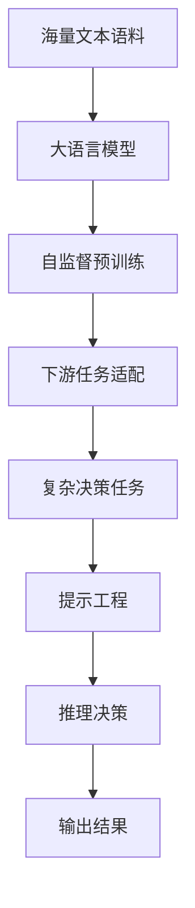

# 大语言模型原理与工程实践：人类和大语言模型进行复杂决策的对比

关键词：大语言模型、复杂决策、人工智能、认知科学、深度学习

## 1. 背景介绍

### 1.1 问题的由来

随着人工智能技术的快速发展,特别是自然语言处理领域的突破性进展,大语言模型(Large Language Models, LLMs)开始在各个领域展现出惊人的能力。它们不仅可以流畅地生成文本、对话、写作,甚至能够解决复杂的推理和决策问题。这引发了人们对人类智能和人工智能的广泛思考和讨论。

### 1.2 研究现状

目前,大语言模型已经在许多领域取得了瞩目的成就,如GPT-3、PaLM、Chinchilla等模型展现出了接近甚至超越人类的语言理解和生成能力。研究者开始探索大语言模型在复杂推理和决策任务上的表现,并将其与人类进行对比。一些研究表明,经过精心设计的提示,大语言模型在某些特定领域的决策问题上已经可以达到甚至超过人类专家的水平。

### 1.3 研究意义 

深入研究大语言模型的内在机制以及它们在复杂决策中的能力,对于推动人工智能的发展、揭示人类智能的奥秘都具有重要意义。一方面,我们可以借鉴大语言模型的工作原理,探索如何设计出更加智能、鲁棒的AI系统。另一方面,通过对比人类和大语言模型的决策过程,我们可以更好地理解人类思维的独特之处,并从认知科学的角度揭示人工智能和自然智能的异同。

### 1.4 本文结构

本文将从以下几个方面展开讨论：首先介绍大语言模型的核心概念和原理;然后重点分析大语言模型在复杂决策任务中的表现,并与人类进行对比;接着,我们将介绍相关的数学模型和算法实现细节;同时给出一些代码实例和实践案例;最后,展望大语言模型在复杂决策领域的应用前景和面临的挑战。

## 2. 核心概念与联系

大语言模型是以自然语言为对象,利用海量文本数据训练得到的AI模型。它以深度学习为主要方法,通过Transformer等神经网络结构,学习文本数据中蕴含的语言知识和世界知识。与传统的自然语言处理模型相比,大语言模型具有参数量大、语言理解能力强、通用性好等特点。

大语言模型的训练通常采用自监督学习范式,即让模型在海量无标注语料上进行自回归任务,从而掌握语言的统计规律和生成能力。一些先进的大语言模型还引入了Prompt Engineering技术,通过精心设计输入提示,引导模型执行特定的任务。

复杂决策是人工智能的一个重要研究课题。与一般的分类、预测等任务不同,复杂决策往往涉及推理、规划、博弈等高阶认知能力,需要在不完整信息和多目标约束下权衡利弊,给出最优决策。传统的复杂决策方法主要包括运筹优化、启发式搜索、强化学习等。

将大语言模型应用于复杂决策,是近年来的一个新的研究方向。研究者发现,经过适当的提示和微调,大语言模型可以在某些复杂决策任务上表现出色,甚至在特定领域超越人类专家。这主要得益于大语言模型学习到的海量知识和语言推理能力。同时,大语言模型的few-shot学习能力,使其能够快速适应新的任务。

下图展示了大语言模型应用于复杂决策的总体架构:



## 3. 核心算法原理 & 具体操作步骤

### 3.1 算法原理概述

大语言模型的核心是基于Transformer的深度神经网络。Transformer采用了自注意力机制,可以有效捕捉文本中的长距离依赖关系。模型通过自监督学习从海量语料中习得语言知识,然后在下游任务中进行微调。

将大语言模型用于复杂决策,需要进行提示工程。给定一个复杂决策任务,我们首先将其转化为一个自然语言描述,然后将其作为提示输入到大语言模型中。模型会根据提示中的约束条件,结合其自身掌握的知识,通过推理给出决策结果。

### 3.2 算法步骤详解

1. 大语言模型预训练:
   - 收集海量高质量文本语料
   - 采用自监督学习如MLM、CLM等方式训练模型
   - 模型通过反复训练掌握语言知识

2. 复杂决策任务构建:
   - 明确复杂决策任务的目标、约束、变量等
   - 将决策任务形式化为优化问题
   - 设计评价指标衡量决策的好坏
  
3. 提示工程:
   - 将复杂决策任务描述为自然语言形式
   - 设计提示模板,包含任务目标、约束条件、输入输出格式等
   - 对提示进行优化,控制模型输出行为

4. 模型推理决策:
   - 将构建好的提示输入给大语言模型
   - 模型根据提示进行推理、搜索、优化
   - 输出符合约束的最优决策结果

5. 评估与反馈:
   - 根据设计的评价指标评估决策结果的质量
   - 分析错误案例,优化提示和算法
   - 不断迭代优化,提升决策效果

### 3.3 算法优缺点

优点:
- 利用大语言模型强大的语言理解和生成能力,可以处理复杂的非结构化决策问题
- 通过提示引导模型执行任务,工程成本低,适应性强
- 在特定领域经过精调后,可以达到甚至超越人类专家的决策水平

缺点:
- 大语言模型是基于统计学习的黑盒模型,推理过程不透明,可解释性差
- 对于逻辑严谨的领域,大语言模型可能生成不一致、错误的结果
- 大语言模型易受训练数据偏差的影响,可能放大偏见和错误

### 3.4 算法应用领域

大语言模型在复杂决策领域已经有了广泛应用,例如:

- 金融投资决策:根据市场环境、公司财报等信息,给出投资组合建议
- 医疗诊断决策:根据患者症状、医学知识库,给出诊断和治疗方案
- 法律案例分析:根据案情描述、法律条文,预测判决结果
- 企业战略规划:根据行业趋势、竞争对手等,制定公司发展战略

## 4. 数学模型和公式 & 详细讲解 & 举例说明

### 4.1 数学模型构建

我们以一个简化的复杂决策问题为例,说明如何建立数学模型。假设一家工厂要制定未来一个月的生产计划,目标是最大化利润,同时满足市场需求和产能限制等约束条件。

决策变量:
- $x_i$:第$i$种产品的生产量

参数:
- $p_i$:第$i$种产品的单位利润
- $d_i$:第$i$种产品的市场需求量
- $t_i$:生产第$i$种产品需要的机器时间
- $T$:机器总工作时间

目标函数:
$$
\max \sum_{i=1}^n p_i x_i
$$

约束条件:
$$
\begin{aligned}
\sum_{i=1}^n t_i x_i & \leq T \\
x_i & \leq d_i, \forall i \\
x_i & \geq 0, \forall i
\end{aligned}
$$

这是一个典型的线性规划问题,可以用单纯形法、内点法等优化算法求解。

### 4.2 公式推导过程

以上问题可以用单纯形法求解,其基本步骤如下:

1. 引入松弛变量,将不等式约束转化为等式约束
2. 构造初始可行解,写出初始单纯形表
3. 检查是否达到最优,若不是,选取换入变量和换出变量
4. 更新单纯形表,回到步骤3,直至达到最优

限于篇幅,这里不再详细展开推导过程,感兴趣的读者可以参考运筹学相关教材。

### 4.3 案例分析与讲解

我们以一个具体例子来说明如何用大语言模型求解上述问题。假设工厂生产两种产品A和B,相关参数如下:

- A的单位利润$p_A=2$,需求量$d_A=100$,单位机器时间$t_A=1$
- B的单位利润$p_B=3$,需求量$d_B=200$,单位机器时间$t_B=2$
- 机器总工作时间$T=250$

我们首先将问题描述为自然语言形式,构造提示:

```
一家工厂生产A和B两种产品,A的单位利润为2元,B的单位利润为3元。
市场对A的需求量为100,对B的需求量为200。
生产每个A需要1小时机器时间,生产每个B需要2小时机器时间。
工厂的机器总工作时间为250小时。
问应该生产多少A和B,才能让利润最大化?请给出详细的分析过程。
```

然后将提示输入给大语言模型,让其进行决策推理。一个可能的输出结果是:

```
这是一个线性规划问题,我们可以用数学建模的方法求解:

令A的生产量为x,B的生产量为y
目标函数:max 2x+3y
约束条件:
x+2y<=250 (机器时间约束)
x<=100 (A的需求约束)  
y<=200 (B的需求约束)
x>=0, y>=0 (非负约束)

用单纯形法求解,得到最优解为:
x=100, y=75
此时总利润为2*100+3*75=425(元)

因此,工厂应该生产100个A,75个B,总利润最大为425元。
```

可以看到,大语言模型通过提示引导,一步步推理出了问题的数学模型、求解方法和最终结果,展现了其在复杂决策任务上的能力。

### 4.4 常见问题解答

Q:大语言模型的决策结果是否可信?
A:大语言模型是基于统计学习的,其输出结果并不能保证逻辑严谨性和一致性。在关键决策任务中,还需要人工进行复核和判断。同时可以通过设计更加精准的提示,引导模型给出更可靠的结果。

Q:如何提高大语言模型在复杂决策任务中的表现?  
A:可以从以下几个方面着手:
1)优化提示,用更清晰、全面的任务描述引导模型
2)针对特定领域,在高质量语料上微调模型  
3)将大语言模型与传统的优化算法相结合,形成混合智能系统
4)引入人类反馈,通过交互指导模型不断学习和优化

Q:大语言模型能否彻底取代人类专家进行复杂决策?
A:目前还不能。尽管大语言模型在某些领域已经展现出了惊人的智能,但其本质上仍是基于模式匹配的统计模型。人类专家凭借多年积累的经验和洞察力,能够在复杂多变的现实场景中做出创造性的决策。未来,人机协同可能是复杂决策的主流模式。

## 5. 项目实践：代码实例和详细解释说明

### 5.1 开发环境搭建

本项目使用Python语言,主要依赖以下库:

- transformers:大语言模型的实现
- openai:调用GPT系列API
- pulp:求解线性规划问题

可以用pip安装这些依赖:

```bash
pip install transformers openai pulp
```

### 5.2 源代码详细实现

以下代码展示了如何用GPT-3.5模型求解前面提到的生产计