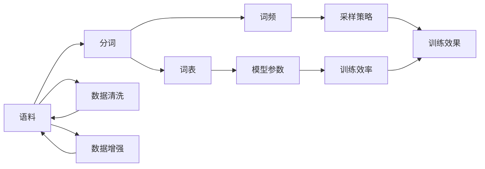

# 大语言模型原理与工程实践：数据配比

## 1. 背景介绍

### 1.1 问题的由来
近年来,随着深度学习技术的飞速发展,大规模语言模型(Large Language Model,LLM)在自然语言处理(NLP)领域取得了突破性进展。LLM通过在海量文本数据上进行无监督预训练,能够学习到丰富的语言知识和通用语义表示,在机器翻译、对话系统、文本摘要等任务上取得了优异的表现。然而,训练高质量的LLM需要巨大的计算资源和数据支持,如何在有限的算力和存储下优化数据配比,最大化模型性能,是一个亟待解决的问题。

### 1.2 研究现状
目前业界主流的LLM如GPT-3、PaLM、Megatron-Turing NLG等,都采用了数百GB甚至上TB的训练语料。但对于数据质量和配比的研究还比较匮乏。一些工作探索了数据清洗、数据增强等技术提升训练效果,但缺乏系统性的理论分析和实证。还有研究尝试通过主动学习、课程学习等方式优化数据采样过程,但在LLM中的有效性有待进一步验证。如何从信息论、统计学等角度对语料数据进行定量建模分析,并应用于工程实践中,是一个值得深入的课题。

### 1.3 研究意义 
数据作为机器学习的核心驱动力,其质量和规模直接影响模型的泛化能力。对LLM训练数据的配比问题进行系统研究,一方面可以加深我们对语言数据的内在规律和特征的理解,另一方面可以指导工程实践中的数据收集、筛选和构建策略,用最经济高效的方式提升LLM的性能表现,降低训练成本。同时,相关的理论分析方法和工程实践经验,也可以推广到其他领域的大规模机器学习问题中去。

### 1.4 本文结构
本文将围绕大语言模型中的数据配比问题展开系统探讨。第2部分介绍相关的核心概念;第3部分阐述数据配比优化的核心算法原理和操作步骤;第4部分建立数学模型并推导相关公式,并结合案例进行分析讲解;第5部分通过代码实例演示具体的工程实现;第6部分讨论数据配比技术在实际应用场景中的价值;第7部分推荐一些学习资源和开发工具;第8部分总结全文,展望未来研究方向和挑战;第9部分列举一些常见问题解答。

## 2. 核心概念与联系

在探讨大语言模型数据配比之前,我们先明确几个核心概念:  

- 语料(Corpus):大规模文本数据集合,是LLM的主要训练资源。常见语料有维基百科、新闻文章、书籍、网页等。
- 词表(Vocabulary):从语料中提取的独立词汇的集合。词表大小是影响模型参数规模和训练效率的关键因素。
- 分词(Tokenization):将语料切分成基本词汇单元(token)的过程。常用的分词方法有字符级、单词级、子词级(subword)等。  
- 词频(Word Frequency):语料中每个词汇出现的频率。服从长尾分布(Zipf's law),少部分高频词占据大多数用例。
- 数据清洗(Data Cleaning):去除语料中的噪声、重复、错误内容的过程。数据质量是影响模型效果的关键因素。  
- 数据增强(Data Augmentation):通过变换、扰动等方式从已有语料中生成新样本,扩充训练集的技术。

这些概念环环相扣,共同影响LLM的训练过程和效果。其内在联系可以用下图表示:

优化数据配比的核心在于,通过调节语料规模、质量、领域、词表大小、数据增强等因素,在有限算力下最大化LLM的性能表现。下面我们将从算法、数学建模、工程实现等角度展开讨论。

## 3. 核心算法原理 & 具体操作步骤

### 3.1 算法原理概述
数据配比优化可以形式化为一个约束优化问题:在给定算力和存储预算下,寻找语料的最优子集,最大化LLM在下游任务上的性能指标。该问题可以用贪心算法、启发式搜索、强化学习等方法求解。核心思路是设计一个性能评估函数,度量某个语料子集对模型效果的边际贡献,然后迭代地选择对提升最大的样本,直到达到预算约束。同时引入早停、正则化等技巧,防止过拟合。

### 3.2 算法步骤详解
具体算法流程如下:
1. 定义优化目标函数 $J(\mathcal{D})$,表示语料子集$\mathcal{D}$的性能得分,可以基于验证集准确率、BLEU分数等指标构建; 
2. 初始化语料子集$\mathcal{D}_0=\emptyset$,迭代轮数$t=0$;
3. 对每个候选样本$x_i\in\mathcal{X}\backslash\mathcal{D}_t$:
   - 计算将其加入已选子集的边际性能提升:$\Delta J(x_i)=J(\mathcal{D}_t\cup\{x_i\})-J(\mathcal{D}_t)$
   - 估算将其加入已选子集的边际资源开销:$\Delta C(x_i)=C(\mathcal{D}_t\cup\{x_i\})-C(\mathcal{D}_t)$
4. 选择边际效益最大的样本:$x^*=\arg\max\limits_{x_i} \frac{\Delta J(x_i)}{\Delta C(x_i)}$
5. 更新已选子集:$\mathcal{D}_{t+1}=\mathcal{D}_t\cup\{x^*\}$  
6. $t\leftarrow t+1$,若$C(\mathcal{D}_t)$超出预算或$\Delta J(x^*)$低于阈值则停止,否则回到步骤3

其中$C(\cdot)$表示语料子集的资源开销,可以用样本数、词表大小、文件大小等指标度量。上述流程可以看作一种增量式的贪心搜索,每次选择局部最优的样本加入,直到达到全局约束。

### 3.3 算法优缺点
该算法的优点是:
- 计算高效,每轮迭代只需评估每个候选样本的边际贡献,总复杂度正比于语料规模
- 具有一定的理论保证,可以用子模性等性质证明其是$(1-1/e)$近似比的解
- 允许灵活调整目标函数和约束条件,适应不同的任务需求和资源限制

但它也有一些局限性:
- 贪心策略容易陷入局部最优,对初始状态敏感,难以捕捉样本间的全局关联
- 边际贡献的评估成本较高,需要频繁在子集上训练评估模型,实际应用时可能需要权衡
- 没有考虑样本多样性和互补性,选出的子集可能冗余严重,覆盖面不足

针对这些问题,可以考虑引入模块化、多轮迭代、多样性正则化等改进措施。

### 3.4 算法应用领域
数据配比优化技术不仅适用于LLM,也可以推广到其他需要在海量异构数据中提取知识的大规模机器学习场景,例如:
- 计算机视觉中的图像分类、目标检测等任务,优化训练集的类别平衡、难例覆盖等
- 推荐系统中的用户行为序列挖掘,选择最有价值的交互日志子集进行建模
- 语音识别中的声学模型训练,在方言、噪声、说话人等维度优化数据分布
- 强化学习中的策略迁移,从大规模历史经验中提取最相关的轨迹用于微调

## 4. 数学模型和公式 & 详细讲解 & 举例说明

### 4.1 数学模型构建
为了更系统地研究数据配比问题,我们引入以下数学符号和定义:
- 语料空间$\mathcal{X}=\{x_1,\cdots,x_N\}$,每个样本$x_i$为一个token序列
- 语料分布$\mathcal{P}$,刻画样本的生成过程,一般未知但可以用经验分布$\hat{\mathcal{P}}$估计
- LLM参数$\theta\in\Theta$,其中$\Theta$为参数空间
- 模型关于语料分布$\mathcal{P}$的期望损失:$\mathcal{L}(\theta,\mathcal{P})=\mathbb{E}_{x\sim\mathcal{P}}[\ell(\theta,x)]$
- 模型在任务$\mathcal{T}$上的期望性能:$\mathcal{J}(\theta,\mathcal{P})=\mathbb{E}_{x\sim\mathcal{P}}[J(\theta,x)]$

其中$\ell(\theta,x)$为样本$x$上的损失函数,$J(\theta,x)$为样本$x$上的性能评估函数,与具体任务相关。

LLM的训练目标是找到最优参数$\theta^*$以最小化总体损失:

$$
\theta^*=\arg\min_{\theta\in\Theta}\mathcal{L}(\theta,\mathcal{P})
$$

但在实践中,我们只能访问有限的训练语料$\mathcal{D}=\{x_1,\cdots,x_M\}$,服从经验分布$\hat{\mathcal{P}}$。因此实际优化目标退化为最小化经验损失:

$$
\hat{\theta}=\arg\min_{\theta\in\Theta}\mathcal{L}(\theta,\hat{\mathcal{P}})=\arg\min_{\theta\in\Theta}\frac{1}{M}\sum_{i=1}^M \ell(\theta,x_i)
$$

通过优化语料的数据配比,我们希望用尽量小的样本数$M$,使得$\hat{\mathcal{P}}$尽可能接近$\mathcal{P}$,从而缩小$\hat{\theta}$和$\theta^*$的泛化误差:

$$
\mathcal{J}(\hat{\theta},\mathcal{P})-\mathcal{J}(\theta^*,\mathcal{P})
$$

直观地,我们希望选择对提升模型性能贡献最大的样本。形式化地,相当于求解以下优化问题:

$$
\mathcal{D}^*=\arg\max_{\mathcal{D}\subset\mathcal{X}:\vert\mathcal{D}\vert\leq K}\mathcal{J}(\hat{\theta}_{\mathcal{D}},\mathcal{P})
$$

其中$\hat{\theta}_{\mathcal{D}}$表示在语料子集$\mathcal{D}$上训练得到的模型参数,$K$为样本数预算。这是一个NP难的组合优化问题,需要借助前面讨论的贪心算法来近似求解。

### 4.2 公式推导过程
为了推导出数据配比优化的贪心算法,我们首先定义样本$x_i$的边际效用为:

$$
\Delta(x_i\vert\mathcal{D})=\mathcal{J}(\hat{\theta}_{\mathcal{D}\cup\{x_i\}},\mathcal{P})-\mathcal{J}(\hat{\theta}_{\mathcal{D}},\mathcal{P})
$$

即将$x_i$加入已选集合$\mathcal{D}$后模型性能的提升量。直觉上,我们希望每次选择边际效用最大的样本,从而最大化总效用:

$$
\mathcal{D}^*=\arg\max_{\mathcal{D}\subset\mathcal{X}:\vert\mathcal{D}\vert\leq K}\sum_{x_i\in\mathcal{D}}\Delta(x_i\vert\mathcal{D}\backslash\{x_i\})
$$

然而,由于样本间可能存在复杂的相关性,每个样本的边际效用会随着集合$\mathcal{D}$的变化而变化,难以设计高效算法直接优化上述目标。因此我们考虑用样本关于整个语料的平均边际效用来