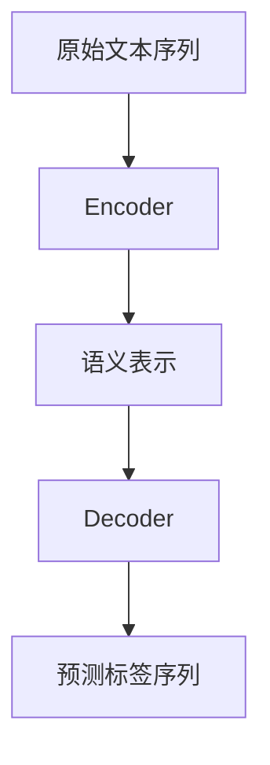

以下是《大语言模型原理与工程实践：正文提取》的正文内容：

# 大语言模型原理与工程实践：正文提取

## 1. 背景介绍

### 1.1 问题的由来

在当今信息时代，海量的非结构化文本数据无处不在，如网页、电子邮件、社交媒体等。从这些文本数据中提取有价值的信息成为了一项重要且具有挑战性的任务。正文提取(Text Extraction)旨在从原始文本中识别和提取出主要内容,剔除无关的噪声数据,为后续的文本处理任务(如文本挖掘、信息检索等)提供高质量的输入。

### 1.2 研究现状  

早期的正文提取方法主要基于规则和模板匹配,需要大量的人工标注和领域知识。随着机器学习技术的发展,一些基于统计模型的无监督和半监督方法应运而生,如隐马尔可夫模型(HMM)、条件随机场(CRF)等。近年来,随着深度学习的兴起,基于神经网络的正文提取方法取得了长足的进步,显著提高了准确性和泛化能力。

### 1.3 研究意义

高质量的正文提取对于提高后续文本处理任务的性能至关重要。它能够有效地过滤掉无关的噪声数据,提高信号与噪声的比率,从而提升文本挖掘、信息检索等应用的准确性和效率。此外,正文提取也广泛应用于网页内容抽取、电子邮件分类、社交媒体数据分析等领域。

### 1.4 本文结构

本文将全面介绍大语言模型在正文提取任务中的原理与工程实践。我们将首先阐述核心概念和算法原理,然后详细讲解数学模型和公式推导过程,并通过实际案例进行分析和讲解。接下来,我们将提供完整的代码实现和运行结果展示。最后,我们将探讨实际应用场景、未来发展趋势和面临的挑战。

## 2. 核心概念与联系

正文提取任务的核心概念包括:

1. **语义表示(Semantic Representation)**: 将原始文本转换为机器可理解的语义表示形式,通常采用词向量或contextualized embeddings等方式。

2. **上下文建模(Context Modeling)**: 捕获文本中词与词之间的上下文关系,以更好地理解语义。

3. **序列标注(Sequence Labeling)**: 将正文提取任务建模为序列标注问题,为每个词/字符预测其是否属于正文的标签。

4. **注意力机制(Attention Mechanism)**: 允许模型在编码和解码过程中选择性地关注输入序列的不同部分,提高了模型的性能。

这些核心概念相互关联、相辅相成,共同推动了大语言模型在正文提取任务中的应用。

## 3. 核心算法原理 & 具体操作步骤  

### 3.1 算法原理概述

大语言模型在正文提取任务中的核心算法原理是基于Transformer的序列到序列(Seq2Seq)模型。该模型由编码器(Encoder)和解码器(Decoder)两部分组成:

1. **编码器(Encoder)**: 将原始文本序列编码为高维的语义表示,捕获词与词之间的上下文关系。

2. **解码器(Decoder)**: 基于编码器的输出,生成对应的标签序列,预测每个词/字符是否属于正文。

在训练过程中,模型会最小化预测标签序列与真实标签序列之间的损失函数,不断调整参数,从而学习到正文提取的模式。



### 3.2 算法步骤详解

1. **数据预处理**: 将原始文本进行分词、标注等预处理,构建训练集和测试集。

2. **词嵌入(Word Embeddings)**: 将词映射到高维的连续向量空间,作为模型的输入。

3. **编码器(Encoder)**: 使用多层Transformer编码器,对输入序列进行编码,生成上下文化的语义表示。

4. **解码器(Decoder)**: 使用多层Transformer解码器,基于编码器的输出,生成对应的标签序列。

5. **损失函数(Loss Function)**: 计算预测标签序列与真实标签序列之间的损失,如交叉熵损失。

6. **模型优化(Model Optimization)**: 使用优化算法(如Adam)最小化损失函数,不断调整模型参数。

7. **模型评估(Model Evaluation)**: 在测试集上评估模型的性能,如准确率、F1分数等指标。

8. **模型部署(Model Deployment)**: 将训练好的模型部署到生产环境中,用于正文提取任务。

### 3.3 算法优缺点

**优点**:

- 利用Transformer的自注意力机制,能够有效捕获长距离依赖关系。
- 端到端的训练方式,无需手工设计复杂的特征工程。
- 可以利用大规模的预训练语言模型(如BERT、GPT等)进行迁移学习,提高性能。

**缺点**:

- 需要大量的标注数据进行训练,标注成本较高。
- 对于长文本,计算复杂度较高,可能会受到GPU内存的限制。
- 对于某些特殊格式的文本(如表格、列表等),效果可能不佳。

### 3.4 算法应用领域

基于大语言模型的正文提取算法可广泛应用于以下领域:

- 网页内容抽取: 从网页中提取有价值的正文内容。
- 电子邮件分类: 从电子邮件中提取主要正文,用于分类和垃圾邮件过滤。
- 社交媒体数据分析: 从社交媒体平台(如Twitter、Facebook等)提取有价值的正文信息。
- 生物医学文献挖掘: 从科研论文中提取关键信息,如方法、结果等。
- 法律文件处理: 从法律文书中提取核心内容,用于信息检索和知识库构建。

## 4. 数学模型和公式 & 详细讲解 & 举例说明

### 4.1 数学模型构建

在正文提取任务中,我们将其建模为一个序列标注问题。给定一个长度为 $n$ 的输入文本序列 $X = (x_1, x_2, ..., x_n)$,目标是预测一个长度相同的标签序列 $Y = (y_1, y_2, ..., y_n)$,其中 $y_i \in \{0, 1\}$ 表示第 $i$ 个词/字符是否属于正文。

我们使用基于Transformer的序列到序列(Seq2Seq)模型来解决这个问题。该模型由编码器(Encoder)和解码器(Decoder)两部分组成。

**编码器(Encoder)**:

编码器的目标是将输入序列 $X$ 映射到一个上下文化的语义表示 $C$,捕获词与词之间的依赖关系。我们使用多层Transformer编码器,每一层的计算过程如下:

$$C^l = \text{TransformerEncoder}(C^{l-1}, \text{Mask}_\text{enc})$$

其中 $C^l$ 表示第 $l$ 层的输出, $C^0 = X$ 是初始输入, $\text{Mask}_\text{enc}$ 是用于编码器自注意力机制的掩码。

**解码器(Decoder)**:

解码器的目标是基于编码器的输出 $C$ 生成对应的标签序列 $Y$。我们使用多层Transformer解码器,每一层的计算过程如下:

$$Y^l, \text{Attn}^l = \text{TransformerDecoder}(Y^{l-1}, C, \text{Mask}_\text{dec}, \text{Mask}_\text{enc-dec})$$

其中 $Y^l$ 表示第 $l$ 层的输出, $Y^0$ 是初始输入(通常为起始标记), $\text{Attn}^l$ 是注意力权重, $\text{Mask}_\text{dec}$ 和 $\text{Mask}_\text{enc-dec}$ 分别用于解码器自注意力和编码器-解码器注意力机制。

最终,我们将解码器的输出 $Y^L$ (其中 $L$ 是解码器层数)通过一个线性层和 Softmax 层,得到每个位置的标签概率分布:

$$P(y_i | X) = \text{Softmax}(W_o y_i^L + b_o)$$

其中 $W_o$ 和 $b_o$ 是可训练参数。

在训练过程中,我们最小化预测标签序列与真实标签序列之间的交叉熵损失函数:

$$\mathcal{L}(\theta) = -\frac{1}{n} \sum_{i=1}^n \log P(y_i^* | X; \theta)$$

其中 $\theta$ 表示模型参数, $y_i^*$ 是第 $i$ 个位置的真实标签。

### 4.2 公式推导过程

我们将详细推导Transformer编码器和解码器层的计算过程。

**Transformer编码器层**:

输入为上一层的输出 $C^{l-1}$ 和编码器掩码 $\text{Mask}_\text{enc}$。

1. 首先进行多头自注意力计算:

$$\text{MultiHead}(Q, K, V) = \text{Concat}(\text{head}_1, ..., \text{head}_h) W^O$$
$$\text{where } \text{head}_i = \text{Attention}(QW_i^Q, KW_i^K, VW_i^V)$$

其中 $Q=K=V=C^{l-1}$, $W_i^Q, W_i^K, W_i^V$ 是可训练的投影矩阵, $W^O$ 是输出线性层。

2. 对多头自注意力的输出进行残差连接和层归一化:

$$C_1 = \text{LayerNorm}(C^{l-1} + \text{MultiHead}(C^{l-1}, C^{l-1}, C^{l-1}))$$

3. 通过前馈全连接网络:

$$C_2 = \text{LayerNorm}(C_1 + \text{FFN}(C_1))$$

其中 FFN 是两层全连接网络,中间使用 ReLU 激活函数。

4. 将 $C_2$ 作为当前层的输出 $C^l$。

**Transformer解码器层**:

输入为上一层的输出 $Y^{l-1}$、编码器输出 $C$ 以及解码器掩码 $\text{Mask}_\text{dec}$ 和编码器-解码器掩码 $\text{Mask}_\text{enc-dec}$。

1. 首先进行掩码多头自注意力计算:

$$Y_1 = \text{LayerNorm}(Y^{l-1} + \text{MultiHead}(Y^{l-1}, Y^{l-1}, Y^{l-1}, \text{Mask}_\text{dec}))$$

2. 进行编码器-解码器注意力计算:

$$Y_2 = \text{LayerNorm}(Y_1 + \text{MultiHead}(Y_1, C, C, \text{Mask}_\text{enc-dec}))$$

3. 通过前馈全连接网络:

$$Y^l = \text{LayerNorm}(Y_2 + \text{FFN}(Y_2))$$

通过上述计算,我们可以得到解码器的输出 $Y^L$,并进一步预测标签概率分布。

### 4.3 案例分析与讲解

让我们通过一个实际案例来深入理解正文提取算法的工作原理。

**输入文本**:

```html
<html>
<head>
    <title>示例网页</title>
</head>
<body>
    <div>
        <h1>欢迎来到我的博客</h1>
        <p>这是一个示例网页,用于演示正文提取算法的应用。</p>
        <p>正文提取旨在从原始文本中识别和提取出主要内容,剔除无关的噪声数据。</p>
    </div>
    <div>
        <h2>相关链接</h2>
        <ul>
            <li><a href="https://example.com/link1">链接1</a></li>
            <li><a href="https://example.com/link2">链接2</a></li>
        </ul>
    </div>
</body>
</html>
```

**预期输出**:

```
欢迎来到我的博客 这是一个示例网页,用于演示正文提取算法的应用。 正文提取旨在从原始文本中识别和提取出主要内容,剔除