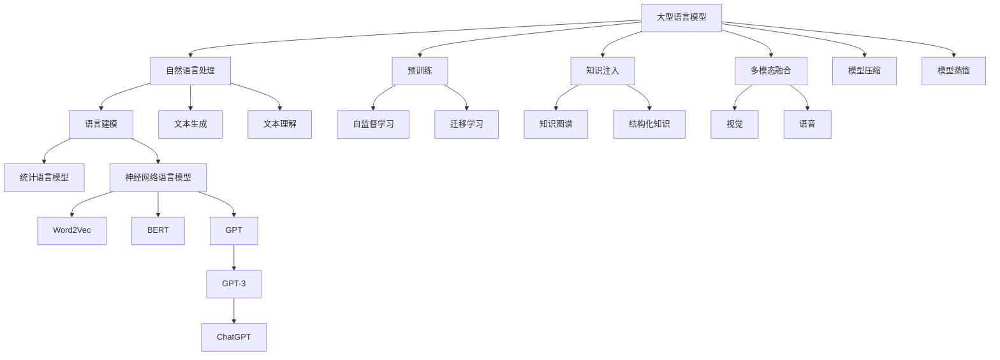

# 大语言模型原理与工程实践：预训练还有什么没有解决

## 1. 背景介绍

### 1.1 问题的由来

近年来,大型语言模型(Large Language Model, LLM)在自然语言处理(Natural Language Processing, NLP)领域取得了令人瞩目的成就。从GPT-3到ChatGPT,这些基于预训练的大型语言模型展现出了惊人的语言理解和生成能力,在各种NLP任务上取得了超越人类的性能表现。

然而,尽管预训练语言模型取得了巨大的成功,但它们仍然存在一些重大的局限性和挑战。这些挑战不仅影响着模型的性能,也限制了它们在实际应用中的可靠性和可解释性。因此,探索和解决这些挑战是推动大型语言模型进一步发展的关键。

### 1.2 研究现状

目前,大型语言模型的研究主要集中在以下几个方面:

1. **模型规模扩大**: 通过增加模型参数数量和训练数据量,提高模型的表现能力。但是,规模扩大也带来了更高的计算成本和碳排放问题。

2. **预训练策略优化**: 探索更有效的预训练目标和策略,如自监督对比学习、生成式预训练等,以提高模型的泛化能力。

3. **知识注入**: 将结构化知识(如知识图谱)注入语言模型,以增强模型的知识理解和推理能力。

4. **可解释性和可控性**: 提高模型的可解释性和可控性,减少模型输出的不确定性和偏差。

5. **多模态融合**: 将视觉、语音等多模态信息融合到语言模型中,实现多模态理解和生成。

6. **高效推理**: 探索模型压缩、蒸馏等技术,降低大型模型的推理成本,实现高效部署。

尽管取得了一些进展,但上述挑战仍然是当前研究的重点和难点。

### 1.3 研究意义

解决大型语言模型面临的挑战,对于推动NLP技术的发展和实际应用具有重要意义:

1. **提高模型性能**: 通过优化预训练策略、注入知识等方式,可以进一步提高模型的语言理解和生成能力,扩展其应用场景。

2. **增强可解释性和可控性**: 提高模型的可解释性和可控性,有助于建立人们对模型的信任,促进其在关键领域的应用。

3. **降低计算成本**: 高效推理技术可以降低模型的计算和存储成本,使其更易于部署和应用。

4. **推动理论创新**: 探索大型语言模型的本质和局限性,有助于推动NLP理论的创新和发展。

5. **促进跨学科融合**: 大型语言模型的研究需要计算机科学、语言学、认知科学等多个学科的知识融合,有助于推动跨学科交流和协作。

总之,解决大型语言模型面临的挑战,不仅可以提升模型的性能和可靠性,还将推动NLP技术的理论创新和实际应用,对于推进人工智能的发展具有重要意义。

### 1.4 本文结构

本文将全面探讨大型语言模型的原理、挑战和工程实践,内容安排如下:

1. 背景介绍
2. 核心概念与联系
3. 核心算法原理与具体操作步骤
4. 数学模型和公式详细讲解与案例分析
5. 项目实践:代码实例和详细解释说明
6. 实际应用场景
7. 工具和资源推荐
8. 总结:未来发展趋势与挑战
9. 附录:常见问题与解答

通过全面而深入的探讨,本文旨在为读者提供对大型语言模型的深入理解,并分享相关的工程实践经验。

## 2. 核心概念与联系

在深入探讨大型语言模型的算法原理和工程实践之前,我们需要先了解一些核心概念及其相互关系。这些概念构成了大型语言模型的理论基础,对于理解后续内容至关重要。

1. **自然语言处理(NLP)**: 自然语言处理是一个旨在使计算机能够理解和生成人类语言的研究领域。它包括语言建模、文本生成、文本理解等多个子领域。

2. **语言建模**: 语言建模是NLP的核心任务之一,旨在捕捉语言的统计规律和语义关系。传统的统计语言模型和基于神经网络的语言模型是两大主流方法。

3. **Word2Vec、BERT、GPT**: Word2Vec是一种将词嵌入到低维向量空间的词嵌入技术。BERT是一种基于Transformer的双向编码器语言模型。GPT则是一种基于Transformer的单向解码器语言模型,GPT-3和ChatGPT都是基于GPT架构的大型语言模型。

4. **预训练**: 预训练是大型语言模型的核心技术之一。通过在大规模无监督数据上进行自监督学习,模型可以获得良好的语言理解和生成能力,并可以通过迁移学习应用于下游任务。

5. **知识注入**: 将结构化知识(如知识图谱)注入语言模型,有助于增强模型的知识理解和推理能力。

6. **多模态融合**: 将视觉、语音等多模态信息融合到语言模型中,实现多模态理解和生成。

7. **模型压缩和蒸馏**: 通过模型压缩和知识蒸馏等技术,可以降低大型模型的计算和存储成本,实现高效推理和部署。

上述概念相互关联、相辅相成,共同构成了大型语言模型的理论基础和技术体系。只有深入理解这些核心概念及其联系,才能更好地掌握大型语言模型的原理和工程实践。

## 3. 核心算法原理与具体操作步骤

### 3.1 算法原理概述

大型语言模型的核心算法原理是基于自注意力机制(Self-Attention)的Transformer架构。Transformer架构由编码器(Encoder)和解码器(Decoder)两部分组成,可以并行计算序列中每个位置的表示,从而克服了传统循环神经网络(RNN)的局限性。

自注意力机制是Transformer的核心,它允许模型在计算每个位置的表示时,同时关注整个输入序列的信息。这种全局关注机制使得Transformer能够更好地捕捉长距离依赖关系,提高了模型的表现能力。

此外,Transformer还采用了位置编码(Positional Encoding)机制,用于注入序列位置信息,从而使模型能够学习序列的顺序关系。

大型语言模型通常采用自回归(Auto-Regressive)的方式进行预训练,即根据前面的词预测下一个词。在预训练过程中,模型需要在大规模无监督数据上进行自监督学习,通过掩码语言建模(Masked Language Modeling)和下一句预测(Next Sentence Prediction)等任务,学习语言的统计规律和语义关系。

经过预训练后,大型语言模型可以获得良好的语言理解和生成能力,并可以通过迁移学习应用于下游任务,如文本分类、机器翻译、问答系统等。

### 3.2 算法步骤详解

大型语言模型的训练和推理过程可以分为以下几个主要步骤:

1. **数据预处理**:
   - 文本数据清洗和标准化
   - 构建词表(Vocabulary)
   - 将文本转换为token序列

2. **输入表示**:
   - 将token序列转换为embeddings
   - 添加位置编码(Positional Encoding)
   - 添加注意力掩码(Attention Mask)

3. **编码器(Encoder)处理**:
   - 输入embeddings经过多层编码器块(Encoder Block)
   - 每个编码器块包含多头自注意力(Multi-Head Attention)和前馈神经网络(Feed-Forward Neural Network)
   - 残差连接(Residual Connection)和层归一化(Layer Normalization)

4. **解码器(Decoder)处理(用于生成任务)**:
   - 目标序列embeddings经过掩码多头自注意力(Masked Multi-Head Attention)
   - 与编码器输出进行交叉注意力(Cross-Attention)
   - 经过前馈神经网络和残差连接

5. **输出层**:
   - 将解码器输出映射到词表上
   - 使用softmax获取下一个token的概率分布

6. **损失计算与优化**:
   - 计算预测与真实标签之间的损失(如交叉熵损失)
   - 使用优化器(如Adam)反向传播更新模型参数

7. **推理(Inference)**:
   - 给定起始token,自回归地生成下一个token
   - 可采用贪婪搜索、束搜索等解码策略
   - 可引入各种技巧(如Top-K/Top-P采样、penalty等)

上述步骤描述了大型语言模型的基本训练和推理流程。在实际应用中,还需要根据具体任务和需求进行调整和优化,如知识注入、多模态融合、模型压缩等。

### 3.3 算法优缺点

大型语言模型基于Transformer架构和自注意力机制,相比传统的RNN模型具有以下优势:

- **并行计算能力强**: Transformer可以并行计算序列中每个位置的表示,克服了RNN的序列计算瓶颈。
- **长距离依赖建模能力强**: 自注意力机制使得Transformer能够更好地捕捉长距离依赖关系。
- **位置无关性**: Transformer不依赖于序列的严格顺序,可以处理任意长度的序列。
- **多头注意力机制**: 多头注意力可以从不同的子空间捕捉不同的特征,提高了模型的表现能力。

然而,大型语言模型也存在一些缺点和局限性:

- **计算和存储成本高**: 大型模型通常包含数十亿甚至上万亿参数,导致计算和存储成本极高。
- **缺乏可解释性**: 大型模型的内部工作机理往往是一个黑箱,缺乏可解释性和可控性。
- **存在偏差和不确定性**: 模型输出可能存在偏差、不一致性和不确定性,影响其在关键领域的应用。
- **知识局限性**: 模型的知识主要来自于训练数据,对于一些专业领域的知识可能存在局限性。
- **缺乏因果推理能力**: 大型语言模型主要捕捉统计规律,缺乏对因果关系的理解和推理能力。

总的来说,大型语言模型展现出了强大的语言理解和生成能力,但也存在一些重大的局限性和挑战,需要通过持续的研究和创新来加以解决。

### 3.4 算法应用领域

由于其强大的语言处理能力,大型语言模型在多个领域都有广泛的应用前景:

1. **自然语言生成(NLG)**:
   - 文本生成(如新闻、故事、诗歌等)
   - 对话系统(如聊天机器人)
   - 机器翻译
   - 自动文案创作

2. **自然语言理解(NLU)**:
   - 文本分类
   - 情感分析
   - 命名实体识别
   - 关系抽取
   - 问答系统

3. **多模态任务**:
   - 视觉问答
   - 图像描述生成
   - 视频字幕生成

4. **知识推理**:
   - 事实推理
   - 常识推理
   - 因果推理

5. **其他领域**:
   - 代