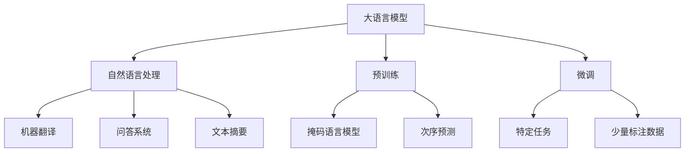
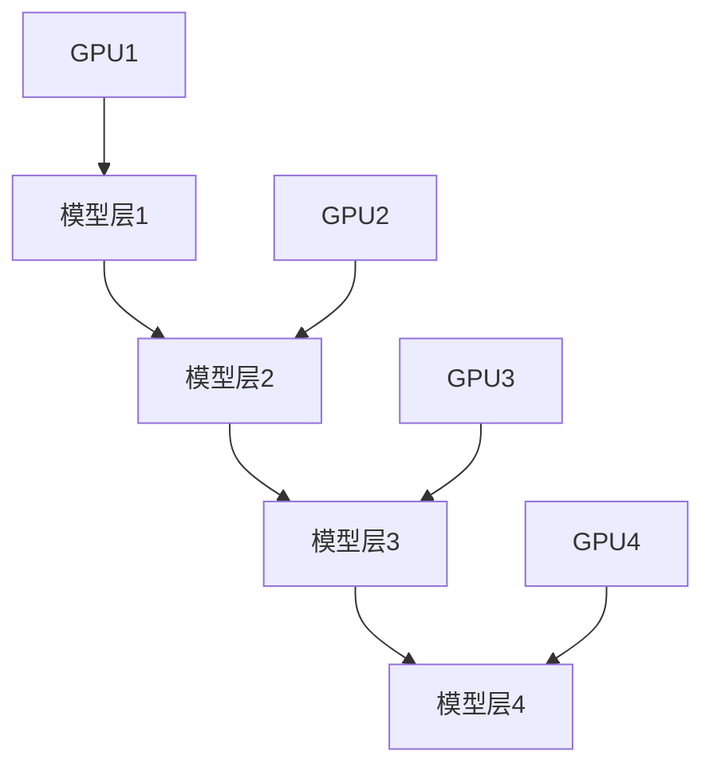
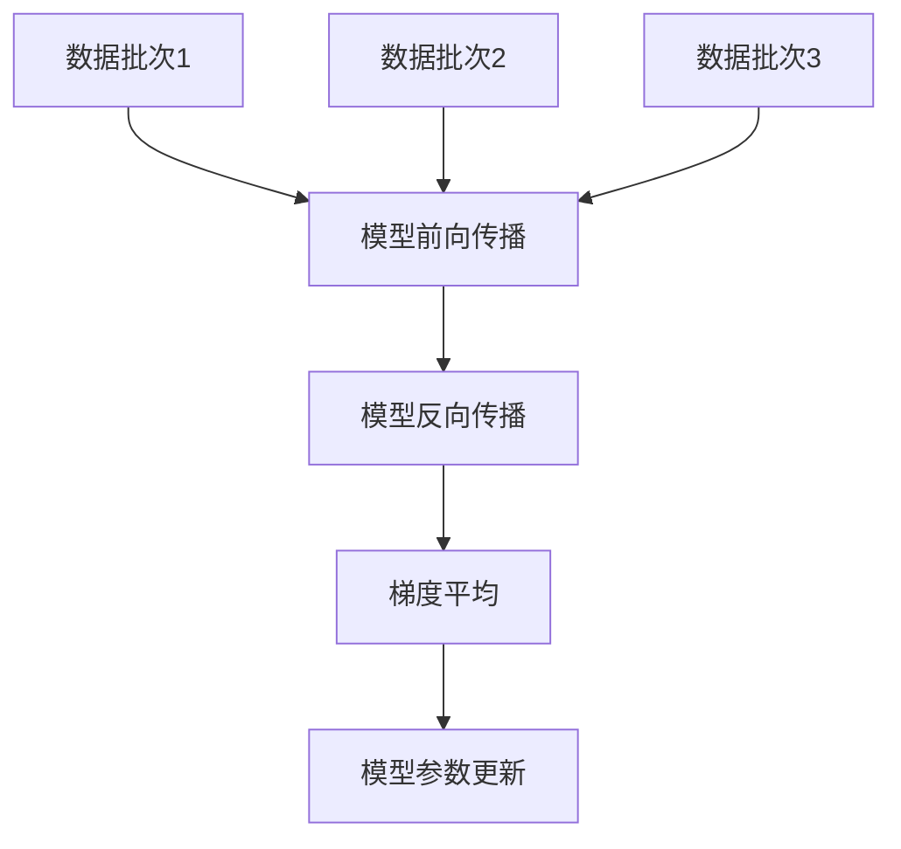
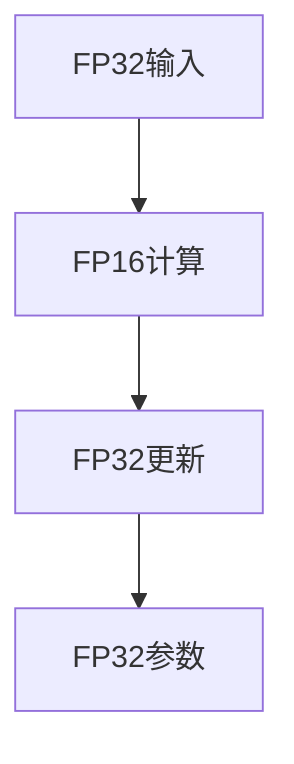
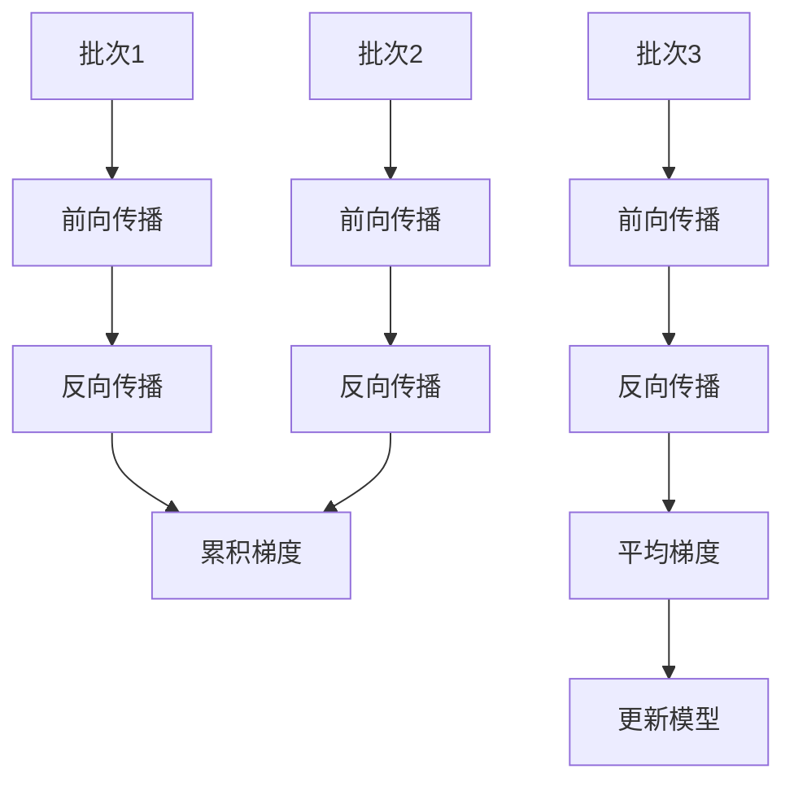
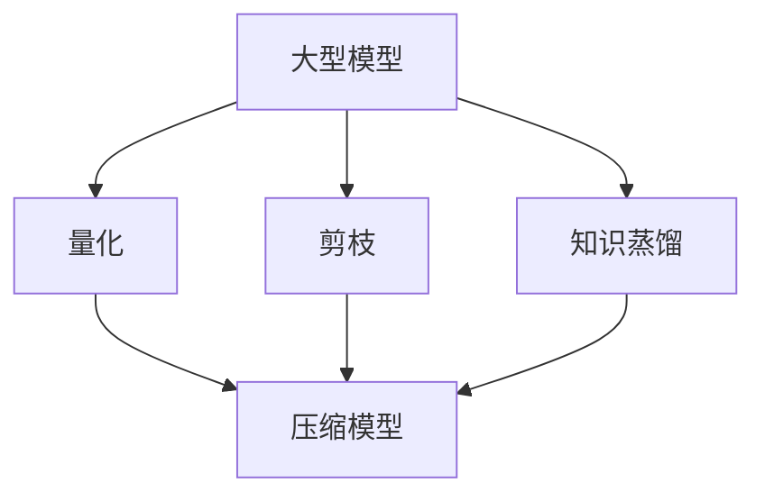

# 大语言模型原理基础与前沿 加快训练速度

## 1. 背景介绍

### 1.1 问题的由来

在过去几年中,大型语言模型(Large Language Models, LLMs)已经成为自然语言处理(NLP)领域的核心驱动力。这些模型通过在大规模文本语料库上进行预训练,学习了丰富的语言知识和上下文信息,从而在广泛的下游NLP任务中表现出色,如机器翻译、问答系统、文本摘要等。

然而,训练这些庞大的语言模型需要消耗大量的计算资源和时间。以GPT-3为例,它拥有1750亿个参数,在耗费数百万美元的成本和数周的时间后才完成了训练。这种昂贵的训练成本严重阻碍了大语言模型在工业界的广泛应用,也使得许多研究人员和小型机构难以参与到这一领域的研究中来。因此,如何加快大语言模型的训练速度,降低训练成本,成为了当前亟待解决的关键问题。

### 1.2 研究现状

为了加快大语言模型的训练速度,研究人员提出了多种技术路线和方法,主要包括:

1. **模型并行化训练**:将模型分割到多个GPU/TPU设备上并行训练,提高计算效率。
2. **数据并行化训练**:在多个设备上同时加载不同的数据批次,实现数据级别的并行化。
3. **混合精度训练**:利用较低精度(如FP16)进行计算,降低内存占用和计算量。
4. **梯度累积**:累积多个批次的梯度后再进行模型更新,提高GPU利用率。
5. **模型压缩**:通过量化、剪枝、知识蒸馏等技术压缩模型大小,降低内存需求。
6. **高效优化器**:设计更高效的优化算法,如LAMB、8-bit Adam等,加快收敛速度。
7. **流水线并行**:将前向和反向传播切分到不同设备,实现管道并行化训练。

虽然上述方法取得了一定的进展,但加快大语言模型训练速度的挑战依然存在,需要进一步的创新和突破。

### 1.3 研究意义

加快大语言模型的训练速度不仅可以降低训练成本,缩短上线时间,更重要的是能够推动NLP技术在更多领域的应用,造福更广泛的人群。具体来说,其意义主要体现在以下几个方面:

1. **促进科研创新**:降低训练成本后,更多研究人员和小型机构能够参与到大语言模型的研究中来,有利于产生更多创新性的想法和突破。

2. **推动产业发展**:工业界可以以更低的成本训练和部署大语言模型,将NLP技术应用到更多的产品和服务中,推动相关产业的发展。

3. **惠及普罗大众**:大语言模型的应用可以改善人机交互体验,提高工作效率,为普通用户带来实际利益。

4. **加速模型迭代**:训练速度的提升将大大缩短模型的迭代周期,有利于持续优化和改进模型性能。

综上所述,加快大语言模型训练速度的研究具有重要的理论意义和应用价值,是推动NLP技术发展的关键一环。

### 1.4 本文结构

本文将全面介绍加快大语言模型训练速度的基础理论和前沿方法。具体来说,第2章将阐述大语言模型的核心概念和基本原理;第3章重点讲解加速训练的核心算法思路;第4章将建立相关的数学模型并推导公式;第5章将通过实际的代码示例,演示加速训练的具体实现;第6章将探讨加速训练技术在实际应用中的场景;第7章将推荐相关的工具和学习资源;最后第8章将总结研究成果,展望未来发展趋势和面临的挑战。

## 2. 核心概念与联系

大语言模型(LLMs)是一种基于深度学习的自然语言处理模型,旨在从大规模文本语料库中学习通用的语言知识和表示。它们通常采用Transformer等注意力机制架构,包含数十亿甚至上千亿个参数。

训练大语言模型的关键是预训练(Pre-training)阶段,主要采用自监督学习的方式,通过掩码语言模型(Masked Language Modeling)和次序预测(Next Sentence Prediction)等任务,在海量文本数据上进行预训练,获得通用的语言表示能力。

预训练完成后,大语言模型可以通过微调(Fine-tuning)的方式,在特定的下游NLP任务上使用少量标注数据进行进一步训练,快速适配到新的任务。这种预训练-微调的范式大大提高了模型的泛化性能,使其能够广泛应用于机器翻译、问答系统、文本摘要等多种自然语言处理任务中。

大语言模型的核心优势在于通过自监督预训练,有效地学习了大规模文本数据中蕴含的语义和上下文知识,从而减少了对大量人工标注数据的依赖。然而,训练如此庞大的模型需要消耗大量的计算资源和时间,这成为了当前亟待解决的主要瓶颈问题。

## 3. 核心算法原理与具体操作步骤

### 3.1 算法原理概述

为了加快大语言模型的训练速度,研究人员提出了多种算法和优化策略,主要包括:

1. **模型并行化**
2. **数据并行化**
3. **混合精度训练**
4. **梯度累积**
5. **模型压缩**
6. **高效优化器**
7. **流水线并行**

这些算法原理都是基于充分利用现有的硬件资源(如GPU/TPU集群),并通过合理的计算和内存优化,最大化提高训练效率。

### 3.2 算法步骤详解

#### 3.2.1 模型并行化

模型并行化是将大型语言模型按层(Layer)分割到多个GPU/TPU设备上并行执行。每个设备只需要保存和计算模型的一部分,从而降低了单个设备的内存和计算压力。

具体步骤如下:

1. 将模型按层划分为多个子模块
2. 将每个子模块分配到不同的GPU/TPU设备上
3. 在前向传播时,输入从第一个设备开始,经过所有设备的子模块计算
4. 在反向传播时,梯度从最后一个设备开始,逐层回传至第一个设备
5. 在参数更新时,每个设备只更新自身的那部分参数

通过模型并行化,大型模型可以被分割到多个设备上训练,突破了单个设备内存和计算能力的限制。

#### 3.2.2 数据并行化

数据并行化是在多个GPU/TPU设备上同时加载不同的数据批次,并行执行前向和反向传播计算,最后汇总梯度并更新模型参数。

具体步骤如下:

1. 将训练数据划分为多个批次
2. 每个GPU/TPU设备加载一个不同的数据批次
3. 所有设备并行执行前向传播计算
4. 所有设备并行执行反向传播计算梯度
5. 跨设备汇总并平均所有梯度
6. 使用平均梯度更新模型参数

数据并行化可以充分利用多个设备的计算能力,加速每个训练迭代的执行速度。当设备数量增加时,训练速度也将线性提升。

#### 3.2.3 混合精度训练

混合精度训练是在模型的前向和反向传播计算时使用较低精度(如FP16)来降低内存占用和计算量,而在参数更新时仍使用FP32精度以保证数值稳定性。

具体步骤如下:

1. 将模型参数和优化器状态从FP32转换为FP16
2. 对输入数据进行FP16类型转换
3. 使用FP16精度执行模型的前向和反向传播计算
4. 将梯度从FP16转换回FP32
5. 使用FP32精度更新模型参数和优化器状态

混合精度训练可以大幅降低内存占用,从而支持训练更大的模型。同时,由于FP16计算效率更高,也能提升训练速度。

#### 3.2.4 梯度累积

梯度累积是将多个连续批次的梯度累积起来,在累积了足够的梯度后再进行一次模型参数更新,从而提高GPU利用率。

具体步骤如下:

1. 设置梯度累积的批次数N
2. 对于第1到第N个批次:
    a. 执行前向和反向传播计算梯度
    b. 将梯度累加到总梯度中
3. 对总梯度除以N,得到平均梯度
4. 使用平均梯度更新模型参数
5. 清空总梯度,重复步骤2

梯度累积可以有效地提高批次大小,从而更充分利用GPU的并行计算能力,加速训练过程。

#### 3.2.5 模型压缩

模型压缩是通过量化、剪枝、知识蒸馏等技术,将大型语言模型压缩为更小的模型,从而降低内存需求和计算量,提高训练和推理速度。

具体步骤如下:

1. **量化**:将模型参数从FP32压缩到较低精度(如INT8),减小模型大小
2. **剪枝**:移除模型中冗余的连接和神经元,压缩模型结构
3. **知识蒸馏**:使用大模型(Teacher)指导训练小模型(Student),迁移知识
4. **模型细化**:对压缩后的小模型进行进一步的微调,提高性能

模型压缩技术可以大幅降低模型的内存和计算开销,使其能够在资源受限的环境(如移动设备)中高效运行。同时,由于计算量的减少,也能间接提高训练速度。

#### 3.2.6 高效优化器

传统的优化器如SGD、Adam等在处理大规模模型时往往收敛缓慢,因此研究人员提出了一些更高效的优化算法,如:

- **LAMB优化器**:将层归一化(Layer Normalization)融入到Adam优化器中,显著提高了大模型的训练速度。
- **8-bit Adam优化器**:将Adam优化器中的梯度和动量向量压缩为8-bit,节省内存并提高计算效率。
- **ZeRO优化器**:通过梯度和参数分片等技术,实现大规模模型在有限内存下的高效训练。

使用这些高效优化器可以加快