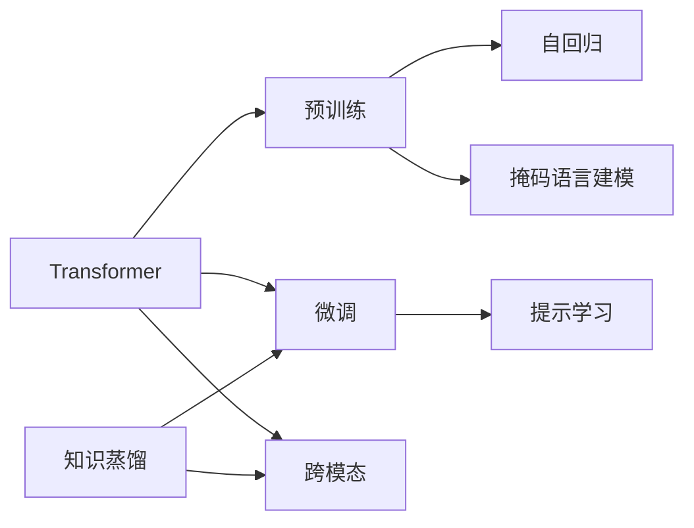

# 大语言模型原理基础与前沿 基于数据的策略

关键词：大语言模型、Transformer、预训练、微调、提示学习、自回归、掩码语言建模、跨模态、知识蒸馏

## 1. 背景介绍 

### 1.1 问题的由来
随着互联网的快速发展,海量的文本、图像、音频等非结构化数据不断产生和累积。如何从海量的非结构化数据中获取有价值的信息,并将其应用于自然语言处理、计算机视觉等人工智能领域,已成为当前学术界和工业界的研究热点。传统的机器学习方法难以有效处理如此规模的数据,亟需一种新的学习范式。近年来,以 Transformer 为代表的大语言模型(Large Language Model,LLM)在 NLP 领域取得了突破性进展,为解决上述问题提供了新的思路。

### 1.2 研究现状
自从 2017 年 Google 提出 Transformer 结构以来,大语言模型得到了飞速的发展。GPT 系列模型、BERT、XLNet、RoBERTa 等预训练语言模型相继问世,并在多个 NLP 任务上取得了 SOTA 的表现。最新的 GPT-3、PaLM、Chinchilla 等模型参数量更是达到了千亿级别,展现出了惊人的零样本和少样本学习能力。同时,CLIP、DALL·E、Stable Diffusion 等多模态大模型也受到了广泛关注。大语言模型的研究已经成为了 NLP 乃至整个 AI 领域的重要前沿方向。

### 1.3 研究意义
大语言模型的研究具有重要的理论和实践意义:

1. 大语言模型为 NLP 领域带来了新的技术范式,对传统的词袋模型、词向量等方法形成了补充和超越,极大地推动了 NLP 技术的发展。
2. 大语言模型具有强大的语言理解和生成能力,在机器翻译、智能问答、文本摘要、对话系统等任务中取得了显著的效果提升,为相关应用的产业化提供了坚实的技术支撑。
3. 大语言模型蕴含了海量的语言知识,对语言的本质有着更加深刻的刻画。研究大语言模型有助于我们理解人类语言的奥秘,探索人工智能的边界。
4. 大语言模型的研究推动了算力、数据和算法的协同发展。从技术演进的角度来看,大语言模型是通用人工智能的重要里程碑。

### 1.4 本文结构
本文将重点介绍大语言模型的基本原理、主流模型、关键技术以及研究前沿,内容组织如下:

- 第 2 节介绍大语言模型的核心概念与内在联系
- 第 3 节重点讲解 Transformer 结构和预训练方法 
- 第 4 节从数学角度对 Transformer 的自注意力机制进行推导
- 第 5 节通过代码实例演示 BERT 的预训练和微调过程
- 第 6 节总结大语言模型的典型应用场景
- 第 7 节梳理相关的学习资源、开发工具和研究文献
- 第 8 节对全文进行总结,并对未来研究方向进行展望

## 2. 核心概念与联系

大语言模型涉及的核心概念主要包括:

- **Transformer**: 一种基于自注意力机制的序列建模结构,摒弃了传统的 RNN/CNN 结构,能够实现高效的并行计算。Transformer 结构是大语言模型的核心基石。
- **预训练 (Pre-training)**: 在大规模无标注语料上进行自监督学习,让模型学习通用的语言表示。预训练是大语言模型的关键步骤,使其能够有效地迁移到下游任务。
- **微调 (Fine-tuning)**: 在特定任务的标注数据上对预训练模型进行监督学习,使其适应任务的特点。微调一般只需少量数据和训练步数,体现了预训练模型的迁移能力。
- **提示学习 (Prompt Learning)**: 将下游任务转化为预训练模型已经学习过的格式,通过设计提示模板来引导模型进行预测。提示学习可以实现零样本和少样本学习。
- **自回归 (Auto-regressive)**: 一种生成式建模方法,通过迭代地预测下一个 token 来生成完整的序列。GPT 系列模型采用了自回归的预训练方式。
- **掩码语言建模 (Masked Language Modeling)**: 一种自监督预训练任务,通过随机掩盖部分 token,让模型根据上下文预测被掩盖的 token。BERT 采用了这种预训练方式。
- **跨模态 (Multi-modal)**: 融合文本、图像、音频等不同模态的信息进行联合建模。CLIP、DALL·E 等多模态大模型能够实现图文匹配、图像生成等功能。
- **知识蒸馏 (Knowledge Distillation)**: 将大模型的知识迁移到小模型中,在保持性能的同时减小模型体积,加速推理速度。知识蒸馏是模型压缩的重要手段。

这些概念之间有着紧密的内在联系。Transformer 结构是大语言模型的基本组件,预训练和微调是大语言模型的两个关键阶段,提示学习是连接预训练模型和下游任务的桥梁,自回归和掩码语言建模是两种主流的预训练方式,跨模态学习拓展了大语言模型的应用边界,知识蒸馏则为大语言模型的落地部署提供了有力支持。这些概念的协同发展,构建起了大语言模型的技术体系。

## 3. 核心算法原理 & 具体操作步骤

### 3.1 算法原理概述
Transformer 是大语言模型的核心结构,其本质是一个 Seq2Seq 模型,由编码器(Encoder)和解码器(Decoder)组成。编码器用于对输入序列进行特征提取,解码器根据编码器的输出和之前的预测结果,生成下一个 token。Transformer 的核心创新是自注意力机制(Self-Attention),它能够建模任意两个位置之间的长程依赖关系,克服了 RNN 难以并行、梯度消失的缺陷。

大语言模型采用了两阶段的训练范式:预训练和微调。在预训练阶段,模型在大规模无标注语料上以自监督的方式学习通用语言知识;在微调阶段,模型在特定任务的标注数据上进行监督学习,快速适应下游任务。这种范式有效缓解了标注数据稀缺的问题,体现了预训练模型强大的迁移能力。

### 3.2 算法步骤详解

Transformer 的编码器和解码器都由若干个相同的层堆叠而成,每一层包含两个子层:多头自注意力(Multi-Head Attention)和前馈神经网络(Feed-Forward Network)。

**多头自注意力**的计算过程如下:
1. 将输入序列 $X \in \mathbb{R}^{n \times d}$ 通过三个线性变换得到 query 矩阵 $Q$、key 矩阵 $K$ 和 value 矩阵 $V$:
$$
\begin{aligned}
Q &= XW^Q \\
K &= XW^K \\
V &= XW^V
\end{aligned}
$$
其中 $W^Q, W^K, W^V \in \mathbb{R}^{d \times d}$ 是可学习的参数矩阵。

2. 计算 query 和 key 的相似度得到注意力分数:
$$
\text{score} = \frac{QK^T}{\sqrt{d}}
$$

3. 对注意力分数进行 softmax 归一化,得到注意力权重:
$$
\text{weight} = \text{softmax}(\text{score})
$$

4. 将注意力权重与 value 矩阵相乘,得到自注意力的输出:
$$
\text{Attention}(Q, K, V) = \text{weight} \cdot V
$$

5. 将上述过程重复 $h$ 次,得到 $h$ 个自注意力的输出,再通过拼接和线性变换得到多头自注意力的最终输出:
$$
\begin{aligned}
\text{head}_i &= \text{Attention}(QW_i^Q, KW_i^K, VW_i^V) \\
\text{MultiHead}(Q, K, V) &= \text{Concat}(\text{head}_1, \dots, \text{head}_h)W^O
\end{aligned}
$$
其中 $W_i^Q, W_i^K, W_i^V \in \mathbb{R}^{d \times d/h}$, $W^O \in \mathbb{R}^{d \times d}$ 是可学习的参数矩阵。

**前馈神经网络**由两个线性变换和一个非线性激活函数组成:
$$
\text{FFN}(x) = \text{ReLU}(xW_1 + b_1)W_2 + b_2
$$
其中 $W_1 \in \mathbb{R}^{d \times d_{ff}}$, $W_2 \in \mathbb{R}^{d_{ff} \times d}$, $b_1 \in \mathbb{R}^{d_{ff}}$, $b_2 \in \mathbb{R}^d$ 是可学习的参数。$d_{ff}$ 通常取 $4d$。

此外,Transformer 还使用了残差连接(Residual Connection)和层归一化(Layer Normalization)来加速训练和提高泛化性能。

预训练和微调的具体步骤如下:

**预训练**:
1. 构建大规模无标注语料库,进行必要的清洗和预处理
2. 根据预训练任务的类型(如自回归、掩码语言建模),对语料进行相应的转换(如 token 掩码、噪声注入)
3. 初始化 Transformer 模型参数,设置优化器和学习率调度器  
4. 将语料分 batch 输入模型,计算损失函数(如交叉熵),进行梯度反向传播和参数更新
5. 定期在验证集上评估模型性能,保存最优的检查点

**微调**:
1. 根据下游任务的类型,设计输入输出格式,构建标注数据集
2. 加载预训练模型的参数,根据任务需要调整模型结构(如增删层、改变输入输出尺寸)
3. 将下游数据分 batch 输入模型,计算任务相关的损失函数,进行梯度反向传播和参数更新
4. 在验证集上评估模型性能,调整超参数,进行必要的 early stopping
5. 在测试集上评估模型的最终性能

### 3.3 算法优缺点

Transformer 相比传统的 RNN/CNN 结构,主要有以下优点:
- 并行计算能力强,训练速度快
- 能够建模长程依赖关系
- 解决了梯度消失的问题
- 模型结构简单,适合模块化设计

同时,Transformer 也存在一些局限性:
- 计算和内存复杂度随着序列长度呈平方级增长,难以处理超长文本
- 缺乏先验的局部性和平移不变性,需要引入位置编码
- 解码需要依赖上一时刻的输出,难以实现完全并行

预训练-微调范式的主要优点包括:
- 通过预训练学习通用语言知识,减少了对标注数据的依赖
- 预训练模型可以灵活迁移到各种下游任务,具有广泛的适用性
- 统一了 NLP 任务的建模范式,提高了研究和开发效率

这一范式的局限性在于:
- 预训练需要巨大的计算资源,对中小型团队和个人研究者不友好
- 预训练和下游任务之间存在一定的分布差异,需要谨慎地选择和优化目标函数
- 不同任务之间的相关性和差异性有待进一步挖掘,目前缺乏理论指导

### 3.4 算法应用领域

大语言模型已经在 NLP 的各个领域得到了广泛应用,主要包括:

- **机器翻译